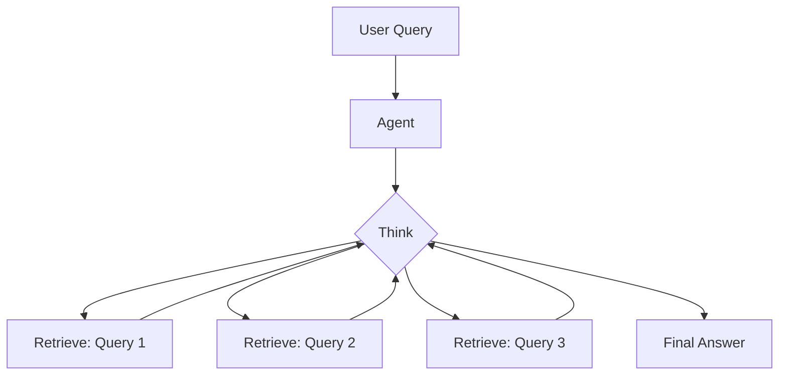
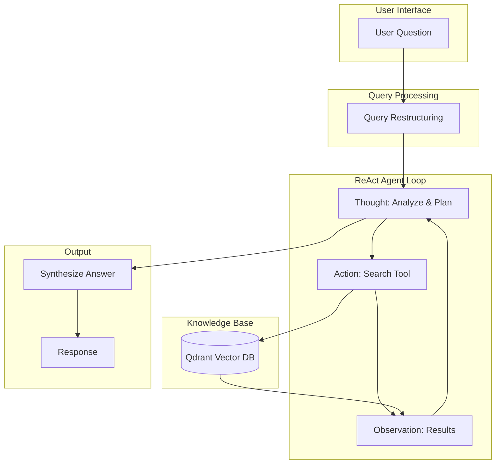

In our <EmbedBlog slug="rag-complete-guide" placeholder="previous guide on RAG systems" />, we covered the fundamentals of building production-ready retrieval-augmented generation pipelines with Qdrant and FastEmbed. Now, let's take it to the next level with **agentic RAG**, where the LLM becomes an intelligent agent capable of multi-hop reasoning, query restructuring, and strategic retrieval.

## Why Agentic RAG?

Traditional RAG follows a simple pattern: retrieve once, generate once. But real-world questions often require:

- **Multiple retrieval steps** to gather all necessary context
- **Query reformulation** to find information phrased differently
- **Reasoning chains** to connect disparate pieces of information
- **Self-correction** when initial retrievals are insufficient

> The difference between basic RAG and agentic RAG is like the difference between looking up a single fact and conducting research.



## Setting Up the Environment

Building on our previous setup, add LangChain to your project:

```shell
uv add langchain langchain-openai langgraph
```

<Callout variant="info" title="Prerequisites" icon="info">
  This guide assumes you have the Qdrant hybrid search setup from our [RAG Complete Guide](/blog/rag-complete-guide). We'll use that as our retrieval backend.
</Callout>

## The Agent Prompt

The key to effective agentic RAG is a well-designed system prompt. We use **chain-of-thought** reasoning combined with **multi-shot examples** to teach the agent how to think:

<GithubLink
  owner="astraq-hq"
  repo="rag-agent-prompts"
/>

```python filename=prompts/agent_prompt.py
"""Multi-hop RAG Agent Prompt with Chain-of-Thought and Multi-shot Examples."""

AGENT_SYSTEM_PROMPT = """You are an advanced research assistant with access to a knowledge base.
Your goal is to answer questions accurately by retrieving and synthesizing information.

## Your Capabilities
You have access to a retrieval tool that searches a knowledge base. Use it strategically.

## Reasoning Process
For each question, follow this chain-of-thought process:

1. **Analyze**: Break down the question into sub-questions
2. **Plan**: Decide what information you need to retrieve
3. **Retrieve**: Use the search tool with well-crafted queries
4. **Evaluate**: Assess if retrieved information is sufficient
5. **Iterate**: If needed, reformulate queries and retrieve more
6. **Synthesize**: Combine information into a coherent answer

## Query Restructuring Guidelines
When formulating search queries:
- Use specific keywords, not full sentences
- Try synonyms if initial queries don't return good results
- Break complex questions into simpler retrieval queries
- Include relevant context terms to improve precision

## Multi-Shot Examples

### Example 1: Single-Hop Question
**Question**: "What is the embedding dimension of all-MiniLM-L6-v2?"

**Thought**: This is a straightforward factual question. I need to find documentation about the MiniLM model.

**Action**: search("all-MiniLM-L6-v2 embedding dimension size")

**Observation**: The model produces embeddings with 384 dimensions.

**Answer**: The all-MiniLM-L6-v2 model produces embeddings with 384 dimensions.

---

### Example 2: Multi-Hop Question
**Question**: "How does hybrid search improve over pure semantic search for technical documentation?"

**Thought**: This requires understanding both hybrid search AND its application to technical docs. I'll need multiple retrievals.

**Action**: search("hybrid search dense sparse embeddings")

**Observation**: Hybrid search combines dense (semantic) and sparse (keyword) embeddings...

**Thought**: Good, I understand hybrid search. Now I need to understand why this matters for technical docs specifically.

**Action**: search("technical documentation keyword matching code search")

**Observation**: Technical documentation contains specific terms, function names, and code that benefit from exact matching...

**Thought**: Now I can synthesize these findings.

**Answer**: Hybrid search improves over pure semantic search for technical documentation because... [synthesized answer]

---

### Example 3: Query Reformulation
**Question**: "Why isn't my vector search returning good results?"

**Thought**: This is vague. Let me search for common issues first, then I might need to refine.

**Action**: search("vector search poor results troubleshooting")

**Observation**: [Limited results about general issues]

**Thought**: Let me try more specific queries about different aspects.

**Action**: search("embedding quality chunk size retrieval")

**Observation**: Chunk size significantly affects retrieval quality...

**Action**: search("vector similarity threshold filtering")

**Observation**: Setting appropriate similarity thresholds helps filter irrelevant results...

**Thought**: I now have multiple angles to address this question.

**Answer**: Poor vector search results can stem from several issues... [comprehensive answer]

---

## Important Rules
1. ALWAYS show your reasoning before taking actions
2. Use 2-5 retrieval calls for complex questions
3. If a query returns no results, reformulate and try again
4. Cite the sources of your information
5. If you cannot find sufficient information, say so honestly

## Output Format
Structure your response as:

**Thought**: [Your reasoning about what to do next]
**Action**: [The tool call, if needed]
**Observation**: [What you learned from the tool]
... (repeat as needed)
**Answer**: [Your final, synthesized answer]
"""

QUERY_RESTRUCTURE_PROMPT = """Given the user's question, generate 2-3 search queries that would help find relevant information.

User Question: {question}

Consider:
- Different phrasings of the same concept
- Related technical terms
- Both high-level concepts and specific details

Output as a JSON array of strings:
["query1", "query2", "query3"]
"""
```

## Building the Retrieval Tool

First, let's wrap our Qdrant hybrid search as a LangChain tool:

```python filename=tools/retrieval.py
from langchain_core.tools import tool
from pydantic import BaseModel, Field

# Import from our previous RAG setup
from search import hybrid_search


class SearchInput(BaseModel):
    """Input schema for the search tool."""
    query: str = Field(description="The search query to find relevant documents")
    limit: int = Field(default=5, description="Maximum number of results to return")


@tool(args_schema=SearchInput)  # [!code highlight]
def search_knowledge_base(query: str, limit: int = 5) -> str:
    """
    Search the knowledge base for relevant documents.

    Use this tool to find information about RAG, embeddings, vector search,
    and related topics. Formulate specific queries for best results.
    """
    results = hybrid_search(query, limit=limit)

    if not results:
        return "No relevant documents found. Try reformulating your query."

    # Format results for the agent
    formatted = []
    for i, result in enumerate(results, 1):
        formatted.append(
            f"[{i}] (Score: {result['score']:.3f})\n{result['document']}"
        )

    return "\n\n---\n\n".join(formatted)
```

## Query Restructuring

For complex questions, we first decompose them into better search queries:

```python filename=agents/query_restructure.py
import json
from langchain_openai import ChatOpenAI
from langchain_core.prompts import ChatPromptTemplate

from prompts.agent_prompt import QUERY_RESTRUCTURE_PROMPT

llm = ChatOpenAI(model="gpt-4o", temperature=0)

restructure_prompt = ChatPromptTemplate.from_messages([
    ("system", "You are a search query optimization expert."),
    ("human", QUERY_RESTRUCTURE_PROMPT),
])


def restructure_query(question: str) -> list[str]:  # [!code focus:15]
    """Break down a complex question into multiple search queries."""
    chain = restructure_prompt | llm

    response = chain.invoke({"question": question})

    try:
        queries = json.loads(response.content)
        return queries if isinstance(queries, list) else [question]
    except json.JSONDecodeError:
        # Fallback to original question
        return [question]


# Example usage
if __name__ == "__main__":
    question = "How does ColBERT reranking improve hybrid search accuracy?"
    queries = restructure_query(question)
    print("Generated queries:", queries)
    # Output: ["ColBERT reranking mechanism", "hybrid search accuracy improvement", "late interaction embeddings benefits"]
```

## The ReAct Agent

Now let's build the main agent using LangGraph's ReAct pattern:

```python filename=agents/rag_agent.py
from langchain_openai import ChatOpenAI
from langgraph.prebuilt import create_react_agent
from langchain_core.messages import HumanMessage, SystemMessage

from prompts.agent_prompt import AGENT_SYSTEM_PROMPT
from tools.retrieval import search_knowledge_base
from agents.query_restructure import restructure_query

# Initialize the LLM
llm = ChatOpenAI(
    model="gpt-4o",
    temperature=0.1,  # Low temperature for reasoning
)

# Create the agent with our retrieval tool
agent = create_react_agent(  # [!code highlight:4]
    model=llm,
    tools=[search_knowledge_base],
)

def run_agent(question: str, use_query_restructuring: bool = True) -> str:
    """Run the RAG agent on a question."""

    # Optionally restructure the query first
    if use_query_restructuring:
        sub_queries = restructure_query(question)
        context_hint = f"\n\nSuggested search queries: {sub_queries}"
    else:
        context_hint = ""

    # Prepare messages
    messages = [
        SystemMessage(content=AGENT_SYSTEM_PROMPT),
        HumanMessage(content=question + context_hint),
    ]

    # Run the agent
    result = agent.invoke({"messages": messages})

    # Extract the final answer
    final_message = result["messages"][-1]
    return final_message.content
```

## Multi-Hop Reasoning in Action

Here's how the agent handles a complex, multi-hop question:

```python filename=example.py
from agents.rag_agent import run_agent

question = """
Compare the trade-offs between using BM25 sparse embeddings versus
dense embeddings for code search, and explain when you would use
hybrid search with ColBERT reranking.
"""

answer = run_agent(question)
print(answer)
```

<Accordion type="single" collapsible>
  <AccordionItem value="example-trace">
    <AccordionTrigger>Example Agent Trace</AccordionTrigger>
    <AccordionContent>
      **Thought**: This is a complex comparison question requiring understanding of three different embedding types and their use cases. I'll need to gather information on each.

      **Action**: search("BM25 sparse embeddings code search advantages")

      **Observation**: BM25 excels at matching exact code identifiers, function names, and syntax patterns. It uses term frequency and document length normalization...

      **Thought**: Good. Now I need to understand dense embeddings for comparison.

      **Action**: search("dense semantic embeddings code search limitations")

      **Observation**: Dense embeddings capture semantic similarity but may miss exact code patterns. They work well for natural language descriptions of code...

      **Thought**: Now I need to understand when hybrid + ColBERT is beneficial.

      **Action**: search("ColBERT reranking hybrid search when to use")

      **Observation**: ColBERT late interaction provides token-level matching after initial retrieval. Best for precision-critical applications...

      **Answer**: [Synthesized comprehensive comparison]
    </AccordionContent>
  </AccordionItem>
</Accordion>

## Advanced: Streaming with Chain-of-Thought

For a better user experience, stream the agent's reasoning:

```python filename=agents/streaming.py
from langchain_core.callbacks import BaseCallbackHandler


class ThoughtStreamHandler(BaseCallbackHandler):
    """Stream agent thoughts to the user."""

    def on_llm_start(self, *args, **kwargs):
        print("🤔 Thinking...", flush=True)

    def on_tool_start(self, tool, input_str, **kwargs):
        print(f"🔍 Searching: {input_str}", flush=True)

    def on_tool_end(self, output, **kwargs):
        preview = output[:100] + "..." if len(output) > 100 else output
        print(f"📄 Found: {preview}", flush=True)


def run_agent_streaming(question: str) -> str:
    """Run agent with streaming thoughts."""
    result = agent.invoke(
        {"messages": [
            SystemMessage(content=AGENT_SYSTEM_PROMPT),
            HumanMessage(content=question),
        ]},
        config={"callbacks": [ThoughtStreamHandler()]},  # [!code highlight]
    )
    return result["messages"][-1].content
```

## Architecture Overview



## Best Practices

### 1. Prompt Engineering

<Callout variant="success" title="Chain-of-Thought Tips" icon="lightbulb">
  - Always include multi-shot examples showing the reasoning process
  - Explicitly instruct the model to show its thinking
  - Use structured output formats (Thought/Action/Observation)
</Callout>

### 2. Retrieval Strategy

| Scenario | Strategy |
|----------|----------|
| Simple factual question | Single retrieval |
| Comparison question | Multiple targeted retrievals |
| Vague question | Query restructuring + iteration |
| No results found | Reformulate with synonyms |

### 3. Error Recovery

```python filename=agents/error_recovery.py
def run_agent_with_retry(question: str, max_retries: int = 3) -> str:
    """Run agent with automatic retry on failure."""
    for attempt in range(max_retries):
        try:
            return run_agent(question)
        except Exception as e:
            if attempt == max_retries - 1:
                return f"I encountered an error while researching: {e}"

            # Add hint to try different approach
            question = f"{question}\n\n(Previous attempt failed, try a different search strategy)"

    return "Unable to complete the research after multiple attempts."
```

## Keyboard Shortcuts

Essential shortcuts when developing RAG agents:

- <Kbd>Cmd + Shift + D</Kbd> - Debug agent execution
- <Kbd>Cmd + L</Kbd> - View LangSmith traces
- <Kbd>Ctrl + C</Kbd> - Interrupt long-running agent

## Production Considerations

<Callout variant="warning" title="Token Usage" icon="alert-triangle">
  Multi-hop agents use significantly more tokens than single-shot RAG. Monitor usage carefully and set appropriate limits on the number of retrieval steps.
</Callout>

### Observability with LangSmith

```python filename=config.py
import os

# Enable LangSmith tracing
os.environ["LANGCHAIN_TRACING_V2"] = "true"
os.environ["LANGCHAIN_PROJECT"] = "rag-agent"
os.environ["LANGCHAIN_API_KEY"] = "ls__..."  # [!code highlight]
```

## Conclusion

Agentic RAG with multi-hop reasoning represents a significant upgrade over traditional retrieve-once-generate-once patterns. By combining:

- **Chain-of-thought prompting** for transparent reasoning
- **Multi-shot examples** to teach retrieval strategies
- **Query restructuring** for better search coverage
- **Iterative retrieval** for complex questions

You can build AI assistants that truly *research* rather than just *search*.

---

**Related Articles:**
- <EmbedBlog slug="rag-complete-guide" /> - Start here for the fundamentals
- <EmbedBlog slug="evaluating-rag-ragas" /> - Measure what matters with the RAGAS framework

*Need help implementing agentic RAG? [Contact us](/contact) to learn how AstraQ can accelerate your AI development.*
