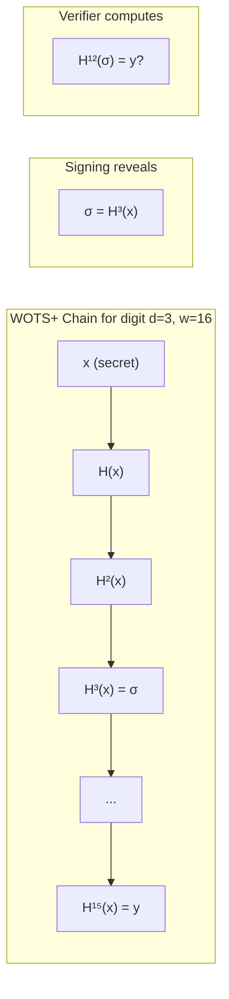
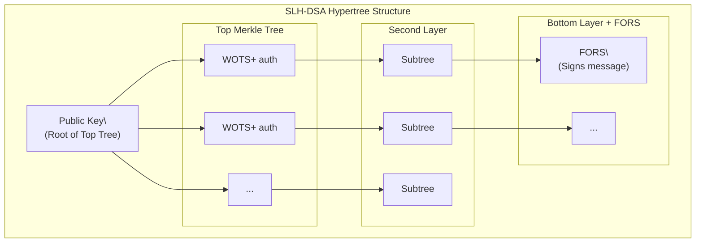
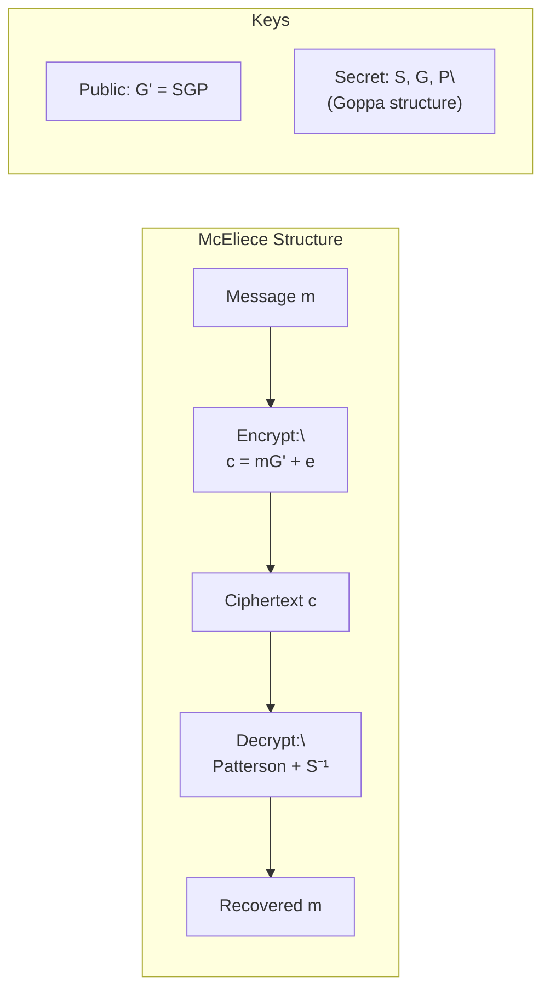
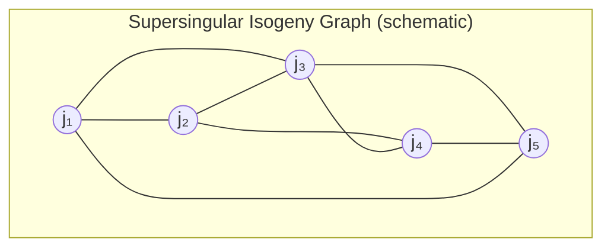

<LLMOnly
  data={`
type: deep-dive
difficulty: advanced
keyTakeaways:
  - Understand hash-based signatures from Lamport/WOTS through Merkle trees to SPHINCS+/SLH-DSA
  - Master the coding theory foundations of McEliece and the syndrome decoding problem
  - Learn the mathematics of isogeny-based cryptography and why SIKE was broken
  - Analyze multivariate cryptography, the MQ problem, and the Rainbow attack
  - Compare security foundations across PQC families for informed algorithm selection
prerequisites: Abstract algebra, coding theory basics, elliptic curve fundamentals, Parts 1-2 of this series
targetAudience: Cryptography engineers, security researchers, and mathematically-inclined developers
`}
/>

<Callout variant="warning" title="Diversity in Defense" icon="shield">
  Cryptographic diversity is a hedge against catastrophic breakthroughs. While
  lattice-based schemes (ML-KEM, ML-DSA) are NIST's primary standards,
  alternative approaches provide backup options if new attacks emerge. This
  article explores these alternatives and the sobering lessons from schemes that
  were broken.
</Callout>

In Parts 1 and 2 of this series, we established the quantum threat and explored lattice-based cryptography in depth. ML-KEM and ML-DSA, built on Module-LWE, represent NIST's primary recommendations for post-quantum key encapsulation and digital signatures.

But cryptographic history teaches caution. Algorithms that appear secure for decades can fall to unexpected attacks. The 2022 breaks of SIKE (isogeny-based) and Rainbow (multivariate) during NIST's own evaluation process underscore this reality.

This final article explores the alternative mathematical frameworks for post-quantum cryptography:

1. **Hash-based signatures** (SLH-DSA/SPHINCS+): Security from hash functions alone
2. **Code-based cryptography** (Classic McEliece): 45+ years of cryptanalytic scrutiny
3. **Isogeny-based cryptography**: Beautiful mathematics, catastrophic breaks
4. **Multivariate cryptography**: NP-hard foundations, practical vulnerabilities

Each framework offers different trade-offs in security assumptions, performance, and key/signature sizes, and each carries distinct lessons for cryptographic engineering.

---

## Hash-Based Signatures: Security from Minimal Assumptions

Hash-based signatures derive their security from the most minimal cryptographic assumptions: the collision resistance and preimage resistance of hash functions. Unlike lattice or code-based schemes, which rely on the hardness of specific algebraic problems, hash-based schemes succeed or fail with the underlying hash function.

### One-Time Signatures: The Foundation

#### Lamport Signatures

Leslie Lamport's 1979 one-time signature (OTS) scheme is conceptually simple:

**Key Generation**:

1. For each bit position $i \in \{1, \ldots, n\}$ of the message digest, generate two random values $x_i^0, x_i^1$
2. Compute $y_i^0 = H(x_i^0)$ and $y_i^1 = H(x_i^1)$
3. **Secret key**: SK = $\{(x_i^0, x_i^1)\}_{i=1}^n$
4. **Public key**: PK = $\{(y_i^0, y_i^1)\}_{i=1}^n$

**Signing** message $m$ with hash $h = H(m) = h_1 h_2 \ldots h_n$:

- Reveal $\sigma_i = x_i^{h_i}$ for each bit $h_i$

**Verification**:

- Check that $H(\sigma_i) = y_i^{h_i}$ for all $i$

**Security**: To forge a signature on a new message $m'$, an attacker would need to find preimages of hash values for bit positions where $h_i' \neq h_i$. This requires breaking the preimage resistance of $H$.

**Problem**: Each key can sign exactly one message. Key sizes are $2 \times 256 \times 256 = 128$ KB for 256-bit security.

#### Winternitz OTS (WOTS+)

Winternitz signatures compress Lamport by trading computation for space using hash chains.

**Parameter**: Winternitz parameter $w$ (typically 16)

**Key Generation** for $\ell = \lceil n/\log_2 w \rceil + \lceil \log_2(\ell \cdot (w-1))/\log_2 w \rceil$ chains:

1. Generate random $x_1, \ldots, x_\ell$
2. Compute $y_i = H^{w-1}(x_i)$ (apply $H$ iteratively $w-1$ times)
3. **Public key**: PK = $H(y_1 \| y_2 \| \ldots \| y_\ell)$ (compressed)

**Signing**: Interpret message as base-$w$ digits $d_1, \ldots, d_k$, compute checksum, sign:

$$
\sigma_i = H^{d_i}(x_i)
$$

**Verification**: Verify $H^{w-1-d_i}(\sigma_i) = y_i$ for all $i$.

For $w = 16$, WOTS+ achieves ~67× compression over Lamport while maintaining OTS security.

### Merkle Trees: Many-Time Signatures

Ralph Merkle's 1979 construction extends OTS to sign multiple messages using a binary tree of hash values.

**Construction**:

1. Generate $2^h$ WOTS key pairs for tree height $h$
2. WOTS public keys form the leaves
3. Each internal node is $H(\text{left child} \| \text{right child})$
4. The root is the Merkle tree public key

**Signing** with leaf $i$:

1. Sign message using WOTS key $i$
2. Include **authentication path**: the $h$ sibling nodes from leaf to root

**Verification**:

1. Verify WOTS signature
2. Recompute root using authentication path
3. Compare to public key

| Tree Height $h$ | Signatures Possible | Auth Path Size | Leaf Count |
| :-------------- | :------------------ | :------------- | :--------- |
| 10              | 1,024               | 10 hashes      | $2^{10}$   |
| 20              | ~1 million          | 20 hashes      | $2^{20}$   |
| 30              | ~1 billion          | 30 hashes      | $2^{30}$   |

**State requirement**: The signer must track which leaves have been used. **Reusing a leaf compromises security**, because the WOTS signature reveals half the secret key bits.

### Stateful vs. Stateless: XMSS and LMS

**XMSS** (eXtended Merkle Signature Scheme, RFC 8391) and **LMS** (Leighton-Micali Signatures, RFC 8554) are stateful hash-based signature standards.

**Key properties**:

- **Forward security**: Compromise of the current state doesn't compromise past signatures
- **State management**: After each signature, the state index must be durably updated before returning the signature
- **Limited signatures**: A $2^{20}$ tree supports exactly 1,048,576 signatures

<Callout
  variant="error"
  title="The State Management Problem"
  icon="alert-triangle"
>
  Stateful signatures require **atomic state updates**. If a system crashes
  after signing but before state update, it may reuse a leaf on restart. In
  distributed systems with key replication, ensuring consistent state across
  replicas is challenging. These operational risks limit stateful scheme
  deployment.
</Callout>

**Forward security in XMSS**: After signing with leaf $i$, the signer can securely delete all secret key material for leaves $< i$. An attacker who compromises the current state cannot forge signatures for messages signed in the past.

### SLH-DSA (SPHINCS+): Stateless Hash-Based Signatures

SPHINCS+, standardized as **SLH-DSA** (FIPS 205), eliminates state management by using a "hypertree" of Merkle trees with randomized leaf selection.

#### The Hypertree Structure

SLH-DSA uses multiple layers of Merkle trees:

1. **Top-level tree**: A single Merkle tree whose leaves are roots of sublevel trees
2. **Intermediate trees**: Each leaf of an upper tree is authenticated by a lower tree
3. **Bottom-level FORS**: A few-time signature (FTS) scheme for message signing

#### FORS: Forest of Random Subsets

For message signing, SLH-DSA uses **FORS** (Forest of Random Subsets), a few-time signature scheme:

1. **Parameters**: $k$ trees of height $a$ (total $k \cdot 2^a$ leaves)
2. **Message hashing**: Hash message to $k$ indices, each selecting one leaf from each tree
3. **Signature**: Reveal selected leaves and authentication paths
4. **Security**: Forging requires finding a message that maps to previously revealed leaves, hard for proper parameter choices

#### Randomized Leaf Selection

The key to statelessness: instead of sequentially using leaves, SLH-DSA:

1. Generates a randomizer $R$ for each message
2. Hashes $(R, \text{PK}, M)$ to deterministically select a leaf
3. The vast address space ($2^{64}$ or larger) makes collisions negligible

**Trade-off**: Signature sizes are large (7-50 KB) because each signature includes a full authentication path from FORS through the hypertree.

#### SLH-DSA Parameter Sets

| Parameter Set | Security Level | PK (bytes) | Signature (bytes) | Sign Speed |
| :------------ | :------------- | :--------- | :---------------- | :--------- |
| SLH-DSA-128s  | 1              | 32         | 7,856             | Slower     |
| SLH-DSA-128f  | 1              | 32         | 17,088            | Faster     |
| SLH-DSA-192s  | 3              | 48         | 16,224            | Slower     |
| SLH-DSA-192f  | 3              | 48         | 35,664            | Faster     |
| SLH-DSA-256s  | 5              | 64         | 29,792            | Slower     |
| SLH-DSA-256f  | 5              | 64         | 49,856            | Faster     |

The "s" (small) variants optimize signature size; "f" (fast) variants optimize signing speed.

<Callout variant="success" title="Conservative Security" icon="shield-check">
  SLH-DSA's security relies **only on hash function properties**. If SHA-256 or
  SHAKE-256 remain secure against quantum computers (they're expected to, with
  doubled output), SLH-DSA remains secure. No algebraic structure to potentially
  exploit.
</Callout>

---

## Code-Based Cryptography: The Oldest Post-Quantum Approach

Code-based cryptography, pioneered by Robert McEliece in 1978, predates even RSA. Its security relies on the difficulty of decoding a general linear code, a problem with no known quantum speedup beyond Grover.

### Error-Correcting Codes: Mathematical Background

An **$[n, k, d]$ linear code** over a finite field $\mathbb{F}_q$ is a $k$-dimensional subspace of $\mathbb{F}_q^n$:

$$
\mathcal{C} = \{\mathbf{c} \in \mathbb{F}_q^n : \mathbf{H}\mathbf{c}^T = \mathbf{0}\}
$$

where $\mathbf{H}$ is an $(n-k) \times n$ **parity-check matrix**.

**Parameters**:

- $n$: code length (codeword size)
- $k$: dimension (information bits)
- $d$: minimum distance (smallest weight of non-zero codeword)

A code with minimum distance $d$ can correct up to $t = \lfloor (d-1)/2 \rfloor$ errors.

#### Generator and Parity-Check Matrices

**Generator matrix** $\mathbf{G}$: A $k \times n$ matrix whose rows form a basis for $\mathcal{C}$.

Encoding: $\mathbf{c} = \mathbf{m}\mathbf{G}$ for message $\mathbf{m} \in \mathbb{F}_q^k$.

**Parity-check matrix** $\mathbf{H}$: An $(n-k) \times n$ matrix where $\mathbf{c} \in \mathcal{C}$ iff $\mathbf{H}\mathbf{c}^T = \mathbf{0}$.

**Syndrome**: For received word $\mathbf{r} = \mathbf{c} + \mathbf{e}$, the syndrome is $\mathbf{s} = \mathbf{H}\mathbf{r}^T = \mathbf{H}\mathbf{e}^T$.

### Goppa Codes

**Goppa codes** are a family of algebraic codes with efficient decoding algorithms. They're defined using polynomials over finite fields.

**Definition**: Given a finite field $\mathbb{F}_{q^m}$, a set $L = \{\alpha_1, \ldots, \alpha_n\} \subset \mathbb{F}_{q^m}$, and a polynomial $g(x) \in \mathbb{F}_{q^m}[x]$ of degree $t$ with $g(\alpha_i) \neq 0$ for all $\alpha_i$:

$$
\Gamma(L, g) = \left\{\mathbf{c} \in \mathbb{F}_q^n : \sum_{i=1}^n \frac{c_i}{x - \alpha_i} \equiv 0 \pmod{g(x)}\right\}
$$

**Properties**:

- Minimum distance $d \geq 2t + 1$ (can correct $t$ errors)
- Efficient decoding via Patterson's algorithm when $(L, g)$ is known
- Without knowledge of $(L, g)$, decoding is hard

### The McEliece Cryptosystem

**Key Generation**:

1. Choose a binary Goppa code $\mathcal{C}$ with parameters $[n, k, 2t+1]$
2. Let $\mathbf{G}$ be its $k \times n$ generator matrix
3. Generate random $k \times k$ non-singular matrix $\mathbf{S}$
4. Generate random $n \times n$ permutation matrix $\mathbf{P}$
5. Compute public generator $\mathbf{G}' = \mathbf{S}\mathbf{G}\mathbf{P}$

**Public key**: $\mathbf{G}'$, parameters $n, k, t$

**Secret key**: $\mathbf{S}$, $\mathbf{G}$, $\mathbf{P}$ (equivalently, the Goppa polynomial and support)

**Encryption** of message $\mathbf{m} \in \{0,1\}^k$:

1. Choose random error vector $\mathbf{e}$ with weight $t$
2. Compute $\mathbf{c} = \mathbf{m}\mathbf{G}' + \mathbf{e}$

**Decryption**:

1. Compute $\mathbf{c}' = \mathbf{c}\mathbf{P}^{-1} = \mathbf{m}\mathbf{S}\mathbf{G} + \mathbf{e}\mathbf{P}^{-1}$
2. Use Patterson's algorithm to decode, recovering $\mathbf{m}\mathbf{S}$
3. Multiply by $\mathbf{S}^{-1}$ to obtain $\mathbf{m}$

### The Syndrome Decoding Problem

**General Syndrome Decoding (SD)**: Given an $(n-k) \times n$ random matrix $\mathbf{H}$, a syndrome $\mathbf{s}$, and weight $t$, find $\mathbf{e}$ with $\|\mathbf{e}\| = t$ such that $\mathbf{H}\mathbf{e}^T = \mathbf{s}$.

**Theorem**: Syndrome Decoding is NP-complete.

**Cryptographic assumption**: For random codes (without trapdoor structure), SD requires $2^{\Omega(n)}$ time.

**Quantum status**: Grover provides quadratic speedup. Best quantum attacks are $O(2^{n/2})$, still exponential.

### Classic McEliece: The NIST Candidate

**Classic McEliece** is a conservative instantiation using binary Goppa codes with parameters chosen for 40+ years of cryptanalytic resistance.

**Parameter Sets** (all NIST Round 4):

| Parameter Set   | Security Level | Public Key (bytes) | Ciphertext (bytes) |
| :-------------- | :------------- | :----------------- | :----------------- |
| mceliece348864  | 1              | 261,120            | 96                 |
| mceliece460896  | 3              | 524,160            | 156                |
| mceliece6688128 | 5              | 1,044,992          | 208                |
| mceliece6960119 | 5              | 1,047,319          | 194                |
| mceliece8192128 | 5              | 1,357,824          | 208                |

<Callout variant="warning" title="The Key Size Problem" icon="database">
  Classic McEliece's public keys are **megabytes**, not kilobytes. While this is
  acceptable for some use cases (e.g., firmware signing where keys are
  embedded), it's impractical for TLS certificates or mobile applications. This
  is the primary reason NIST chose lattice-based ML-KEM as the main standard.
</Callout>

**Security advantages**:

- 45+ years of cryptanalysis (since 1978)
- Security based on well-studied coding theory problems
- No novel algebraic structure that might harbor hidden weaknesses
- NIST Round 4 candidate for standardization as alternative KEM

---

## Isogeny-Based Cryptography: A Cautionary Tale

Isogeny-based cryptography represented one of the most mathematically elegant approaches to post-quantum security. It offered the smallest key sizes among all PQC candidates. Then, in July 2022, it was broken by a devastating attack.

### Elliptic Curves and Isogenies

An **elliptic curve** $E$ over a field $K$ is a smooth projective curve of genus 1 with a specified point (the identity). Over a finite field $\mathbb{F}_p$, curves are typically given in Weierstrass form:

$$
E: y^2 = x^3 + ax + b
$$

The points on $E$ form an abelian group under a geometrically-defined addition law.

An **isogeny** $\phi: E_1 \to E_2$ is a morphism of elliptic curves that preserves the group structure:

$$
\phi(P + Q) = \phi(P) + \phi(Q)
$$

Key properties:

- Isogenies have a **degree**: the size of the kernel $\ker(\phi)$
- For every isogeny $\phi: E_1 \to E_2$, there's a **dual isogeny** $\hat{\phi}: E_2 \to E_1$
- Composition: $\hat{\phi} \circ \phi = [\deg(\phi)]$ (multiplication by degree)

### Supersingular Curves

Elliptic curves over $\mathbb{F}_p$ are classified as **ordinary** or **supersingular**.

**Supersingular curves**:

- Have **no $p$-torsion**: $E[p] = \{O\}$ over $\mathbb{F}_p$
- Endomorphism ring is a **maximal order in a quaternion algebra** (rank 4)
- Only finitely many ($\approx p/12$) supersingular $j$-invariants exist

**Ordinary curves**:

- Have $p$-torsion: $E[p] \cong \mathbb{Z}/p\mathbb{Z}$
- Endomorphism ring is an **order in an imaginary quadratic field** (rank 2)

**The supersingular isogeny graph**: Vertices are supersingular $j$-invariants (up to $\mathbb{F}_{p^2}$-isomorphism), edges are $\ell$-isogenies. This graph is **Ramanujan** (optimal expansion properties), making random walks mix rapidly.

### SIDH/SIKE: The Broken Protocol

**Supersingular Isogeny Diffie-Hellman (SIDH)** was proposed by De Feo, Jao, and Plût in 2011.

**Setup**:

- Public supersingular curve $E_0$ over $\mathbb{F}_{p^2}$ where $p = 2^a \cdot 3^b - 1$
- Basis points $(P_A, Q_A)$ for $E_0[2^a]$ and $(P_B, Q_B)$ for $E_0[3^b]$

**Protocol**:

1. **Alice** chooses secret $k_A$, computes isogeny $\phi_A: E_0 \to E_A$ with kernel $\langle P_A + k_A Q_A \rangle$

   Sends: $E_A$ and $(\phi_A(P_B), \phi_A(Q_B))$

2. **Bob** chooses secret $k_B$, computes isogeny $\phi_B: E_0 \to E_B$ with kernel $\langle P_B + k_B Q_B \rangle$

   Sends: $E_B$ and $(\phi_B(P_A), \phi_B(Q_A))$

3. **Alice** computes $\phi_A': E_B \to E_{AB}$ using $\phi_B(P_A), \phi_B(Q_A)$

4. **Bob** computes $\phi_B': E_A \to E_{BA}$ using $\phi_A(P_B), \phi_A(Q_B)$

5. **Shared secret**: $j(E_{AB}) = j(E_{BA})$ (by commutativity of isogeny composition)

**SIKE** (Supersingular Isogeny Key Encapsulation) was the IND-CCA2 secure KEM built on SIDH, a NIST Round 4 candidate.

**Key sizes** were remarkably small:

| Parameter | Public Key | Ciphertext | NIST Level |
| :-------- | :--------- | :--------- | :--------- |
| SIKEp434  | 330 bytes  | 346 bytes  | 1          |
| SIKEp610  | 462 bytes  | 486 bytes  | 3          |
| SIKEp751  | 564 bytes  | 596 bytes  | 5          |

### The Castryck-Decru Attack (2022)

In July 2022, Wouter Castryck and Thomas Decru published "An Efficient Key Recovery Attack on SIDH."

**The attack**: Given Alice's public key $(E_A, \phi_A(P_B), \phi_A(Q_B))$, recover her secret isogeny $\phi_A$ in **polynomial time**.

**Key insight**: The auxiliary torsion points $\phi_A(P_B), \phi_A(Q_B)$ reveal too much information about the secret isogeny.

#### Technical Overview

The attack uses **Kani's "glue-and-split" theorem** from the theory of abelian varieties.

**Setup**: Let $E$ be an elliptic curve with endomorphism $\theta$. The graph of $\theta$:

$$
\Gamma_\theta = \{(P, \theta(P)) : P \in E\}
$$

is an isogeny from $E$ to $E \times E$ (as a Jacobian).

**Key observation**: For SIDH, the auxiliary points allow reconstruction of certain endomorphisms on product surfaces $E_0 \times E_A$. These endomorphisms, when decomposed, reveal the secret isogeny.

**Algorithmic steps**:

1. Construct the surface $E_0 \times E_A$
2. Use auxiliary points to build a degree-$N$ endomorphism
3. Factor the endomorphism into a product involving $\phi_A$
4. Extract $\phi_A$

**Complexity**: $O(\text{polynomial})$ in the security parameter. Running times:

| Parameter | Attack Time |
| :-------- | :---------- |
| SIKEp434  | ~1 hour     |
| SIKEp503  | ~2 hours    |
| SIKEp610  | ~8 hours    |
| SIKEp751  | ~21 hours   |

<Callout variant="error" title="The Fatal Flaw" icon="x-circle">
  SIDH's design **required** publishing auxiliary torsion point images to enable
  the protocol. This information, essential for functionality, was precisely
  what enabled the attack. The vulnerability was structural, not parametric: no
  parameter choice could fix it.
</Callout>

### Lessons from the SIKE Break

1. **Auxiliary data is dangerous**: Information required for protocol functionality can enable attacks

2. **Novel mathematics is double-edged**: Isogeny cryptography was elegant but not deeply understood

3. **Cryptanalytic maturity matters**: SIKE had ~10 years of analysis; McEliece has 45+

4. **NIST's process worked**: The attack was discovered during standardization, before deployment

5. **Algorithm diversity is essential**: Having lattice and hash-based alternatives was crucial

### Post-SIKE Isogeny Cryptography

Not all isogeny schemes were broken:

**CSIDH** (Commutative SIDH):

- Different construction using **class group actions** on ordinary curves
- No auxiliary points published
- Resistant to Castryck-Decru style attacks
- Vulnerable to subexponential quantum attacks (Kuperberg's algorithm)
- Remains a research topic, not standardized

**SQISign**:

- Isogeny-based signature scheme
- Uses quaternion algebra techniques
- Not based on SIDH
- Extremely compact signatures (~200 bytes)
- Still under analysis

---

## Multivariate Cryptography: A Similar Fate

Multivariate cryptography bases security on the difficulty of solving systems of multivariate polynomial equations. Like SIKE, a prominent candidate was broken during NIST evaluation.

### The MQ Problem

**Multivariate Quadratic (MQ) Problem**: Given $m$ quadratic polynomials in $n$ variables over a finite field $\mathbb{F}_q$:

$$
p_1(x_1, \ldots, x_n) = 0
$$

$$
p_2(x_1, \ldots, x_n) = 0
$$

$$
\vdots
$$

$$
p_m(x_1, \ldots, x_n) = 0
$$

find a solution $(x_1, \ldots, x_n) \in \mathbb{F}_q^n$.

**Complexity**: MQ is **NP-complete** for random systems. No quantum algorithm provides super-polynomial speedup.

**Trapdoor approach**: Design a system with special structure that admits efficient solving, disguise it as random.

### The Oil and Vinegar Scheme

**Unbalanced Oil and Vinegar (UOV)** is a signature scheme:

**Variables**: $n = o + v$ total with $o$ "oil" and $v$ "vinegar" variables

**Central map**: Quadratic polynomials where:

- Oil variables appear only linearly or in cross-terms with vinegar
- Vinegar-only terms are quadratic

**Key property**: Given specific vinegar values, the system becomes **linear** in oil variables and is easily solvable.

**Public key**: Apply secret linear transformations to disguise the oil/vinegar structure.

**Signing** message $m$:

1. Hash $m$ to get target value
2. Choose random vinegar values
3. Solve for oil variables (linear algebra)
4. Apply inverse transformation

**Verification**: Evaluate public polynomials, check against hash.

### Rainbow: Rise and Fall

**Rainbow** extended UOV with multiple "layers" of oil and vinegar variables:

- Layer 1: $v_1$ vinegar, $o_1$ oil
- Layer 2: Use layer 1 variables as vinegar for new oil variables
- Continue for $L$ layers

This provided smaller signatures than UOV while maintaining efficiency.

**Rainbow at NIST**:

- Selected as Round 3 finalist (alongside Dilithium, Falcon)
- Compact signatures (64-68 bytes at Level I)
- Moderate public keys (58-252 KB)
- Efficient signing and verification

**February 2022**: Ward Beullens published "Breaking Rainbow Takes a Weekend on a Laptop."

#### The Beullens Attack

The attack combined several techniques:

1. **Rectangular MinRank attack**: Reduces to finding a matrix of small rank in a linear space
2. **Intersection attack**: Exploits the layer structure
3. **Simple attack on Rainbow Band Separation**: Targeted the specific construction

**Result**: Key recovery for Rainbow Level I in ~53 hours on a laptop.

| Parameter   | Target Security | Attack Time |
| :---------- | :-------------- | :---------- |
| Rainbow I   | 128 bits        | ~53 hours   |
| Rainbow III | 192 bits        | Days        |
| Rainbow V   | 256 bits        | Weeks       |

**Consequence**: Rainbow was removed from NIST Round 4 consideration.

<Callout variant="warning" title="The Structure Trap" icon="alert-triangle">
  Both Rainbow and SIKE were broken because their necessary algebraic structure,
  required for efficient operation, was ultimately exploitable. Lattice-based
  and hash-based schemes hide their trapdoors more effectively (or, in the case
  of hash-based, have no algebraic structure at all).
</Callout>

### Other Multivariate Schemes

**GeMSS**: Based on Hidden Field Equations

- Very small signatures (tens of bytes)
- Large public keys (megabytes)
- Slow verification
- Advanced to NIST Round 3 as alternate
- Not broken, but not selected

**MAYO**: Post-Rainbow multivariate signature

- Addresses some Rainbow vulnerabilities
- Currently under research evaluation

---

## Comparative Analysis: Choosing PQC Algorithms

With the landscape clarified, we can compare the surviving PQC approaches across multiple dimensions.

### Security Foundation Comparison

| Scheme Family                | Hard Problem       | Quantum Impact                     | Cryptanalytic History |
| :--------------------------- | :----------------- | :--------------------------------- | :-------------------- |
| **Lattice (ML-KEM, ML-DSA)** | Module-LWE, SIVP   | Polynomial speedup (insignificant) | ~20 years             |
| **Hash-based (SLH-DSA)**     | Hash preimage      | Quadratic speedup (Grover)         | ~45 years             |
| **Code-based (McEliece)**    | Syndrome decoding  | Quadratic speedup                  | ~45 years             |
| **Isogeny (CSIDH)**          | Class group action | Subexponential (Kuperberg)         | ~8 years              |
| **Multivariate (surviving)** | MQ                 | Quadratic speedup                  | ~25 years             |

### Key and Signature Size Comparison

| Algorithm       | Public Key | Private Key | Ciphertext/Signature | Category    |
| :-------------- | :--------- | :---------- | :------------------- | :---------- |
| ML-KEM-768      | 1,184 B    | 2,400 B     | 1,088 B              | Lattice KEM |
| ML-DSA-65       | 1,952 B    | 4,032 B     | 3,293 B              | Lattice Sig |
| SLH-DSA-256f    | 64 B       | 128 B       | 49,856 B             | Hash Sig    |
| SLH-DSA-128s    | 32 B       | 64 B        | 7,856 B              | Hash Sig    |
| McEliece-348864 | 261 KB     | 6 KB        | 96 B                 | Code KEM    |
| Falcon-512      | 897 B      | 1,281 B     | 666 B                | Lattice Sig |

### When to Use Each

**ML-KEM/ML-DSA**: Default choice for most applications

- Good balance of size and performance
- Strong security proofs
- NIST's primary recommendation

**SLH-DSA**: When conservative security is paramount

- Long-lived keys requiring decades of security
- Firmware/software signing where signature size is acceptable
- Hedge against lattice problem breakthroughs

**Classic McEliece**: When key size is acceptable

- Embedded systems with pre-deployed keys
- Air-gapped systems
- Maximum cryptanalytic maturity desired

**Stateful hash-based (XMSS/LMS)**: Specialized environments

- Firmware signing with controlled state management
- Limited signature count requirements
- Forward security critical

### The Hybrid Approach

During the transition period (and perhaps permanently), **hybrid schemes** combine classical and post-quantum algorithms:

**Example**: TLS with `X25519 + ML-KEM-768`

1. Classical X25519 key exchange (security against current adversaries)
2. ML-KEM key encapsulation (security against future quantum adversaries)
3. Combine shared secrets: $K = \text{KDF}(K_{\text{X25519}} \| K_{\text{ML-KEM}})$

**Benefits**:

- Security if _either_ algorithm is secure
- Fallback if PQC algorithm has unknown vulnerability
- Gradual migration path

---

## Conclusion: The Post-Quantum Landscape

This three-part series has traversed the complete post-quantum cryptography landscape:

**Part 1** established the quantum threat: Shor's algorithm breaks RSA/ECC in polynomial time, Grover halves symmetric key security, and the "harvest now, decrypt later" threat makes migration urgent.

**Part 2** explored lattice-based cryptography: The LWE problem, its ring and module variants, worst-case security reductions, and the internal workings of NIST's primary standards ML-KEM and ML-DSA.

**Part 3** examined alternative approaches:

- **Hash-based signatures**: Minimal assumptions, large signatures, conservative choice
- **Code-based cryptography**: Oldest approach, largest keys, maximum maturity
- **Isogeny-based cryptography**: Elegant mathematics, catastrophic breaks, cautionary tale
- **Multivariate cryptography**: NP-hard foundations, practical vulnerabilities

### Key Takeaways

1. **Lattice-based cryptography is the practical choice**: ML-KEM and ML-DSA offer the best balance of security, size, and performance

2. **Hash-based signatures are the conservative choice**: SLH-DSA relies only on hash functions, the most minimal assumption

3. **Algorithm diversity matters**: The SIKE and Rainbow breaks could have been disasters if lattice-based alternatives weren't ready

4. **Cryptanalytic maturity is precious**: McEliece's 45-year survival against cryptanalysis is valuable, even at the cost of large keys

5. **Hybrid deployment is prudent**: Combining classical and post-quantum algorithms hedges against unknown weaknesses

6. **Migration should begin now**: Post-quantum algorithms are standardized; the threat is approaching; there's no reason to wait

<Callout variant="success" title="The Path Forward" icon="compass">
  The cryptographic community has delivered on the post-quantum challenge. We
  have standardized algorithms (FIPS 203-205), well-understood alternatives
  (McEliece, XMSS/LMS), and clear guidance on hybrid deployment. The remaining
  challenge is migration: updating billions of devices, protocols, and systems
  before quantum computers make the threat real.
</Callout>

---

## References and Further Reading

### NIST Standards and Reports

- FIPS 203 (2024). "Module-Lattice-Based Key-Encapsulation Mechanism Standard" (ML-KEM)
- FIPS 204 (2024). "Module-Lattice-Based Digital Signature Standard" (ML-DSA)
- FIPS 205 (2024). "Stateless Hash-Based Digital Signature Standard" (SLH-DSA)
- NIST SP 800-208 (2020). "Recommendation for Stateful Hash-Based Signature Schemes"
- RFC 8391 (2018). "XMSS: eXtended Merkle Signature Scheme"
- RFC 8554 (2019). "Leighton-Micali Hash-Based Signatures"

### Hash-Based Signatures

- Merkle, R. (1979). "Secrecy, Authentication, and Public Key Systems" — Original Merkle tree construction
- Bernstein, D.J. et al. (2015). "SPHINCS: Practical Stateless Hash-Based Signatures"
- Hülsing, A. et al. (2016). "XMSS — A Practical Forward Secure Signature Scheme"

### Code-Based Cryptography

- McEliece, R.J. (1978). "A Public-Key Cryptosystem Based on Algebraic Coding Theory"
- Patterson, N.J. (1975). "The Algebraic Decoding of Goppa Codes"
- Bernstein, D.J. et al. (2017). "Classic McEliece" — NIST submission

### Isogeny Cryptography and the SIKE Break

- De Feo, L., Jao, D., Plût, J. (2014). "Towards Quantum-Resistant Cryptosystems from Supersingular Elliptic Curve Isogenies"
- Costello, C. (2019). "Supersingular Isogeny Key Exchange for Beginners"
- Castryck, W. & Decru, T. (2022). "An Efficient Key Recovery Attack on SIDH"

### Multivariate Cryptography

- Ding, J. & Schmidt, D. (2005). "Rainbow, a New Multivariable Polynomial Signature Scheme"
- Beullens, W. (2022). "Breaking Rainbow Takes a Weekend on a Laptop"

---

## Appendix: Security Parameter Summary

### Recommended Algorithms by Use Case

| Use Case                  | Primary Algorithm | Alternative | Notes                          |
| :------------------------ | :---------------- | :---------- | :----------------------------- |
| General-purpose KEM       | ML-KEM-768        | ML-KEM-1024 | Default for TLS, Signal, etc.  |
| High-security KEM         | ML-KEM-1024       | McEliece    | When Level 5 required          |
| General-purpose signature | ML-DSA-65         | Falcon-512  | Default for code signing, auth |
| Conservative signature    | SLH-DSA-256s      | ML-DSA-87   | When hash-only security needed |
| Compact signature         | Falcon-512        | —           | Complex implementation         |
| Firmware signing          | XMSS/LMS          | SLH-DSA     | When state management feasible |

### NIST Security Levels

| Level | Classical Security | Quantum Security | Equivalent AES |
| :---- | :----------------- | :--------------- | :------------- |
| 1     | 128 bits           | ~107 bits        | AES-128        |
| 2     | 192 bits           | ~143 bits        | SHA-384        |
| 3     | 192 bits           | ~165 bits        | AES-192        |
| 4     | 256 bits           | ~189 bits        | SHA-512        |
| 5     | 256 bits           | ~232 bits        | AES-256        |

### Migration Priority Guide

| Data Classification                  | Migration Priority | Recommended Action            |
| :----------------------------------- | :----------------- | :---------------------------- |
| State secrets (25+ year lifespan)    | **Immediate**      | Deploy PQC now                |
| Financial/health data (10+ years)    | **High**           | Begin pilot deployments       |
| Business communications (5-10 years) | **Medium**         | Include PQC in refresh cycles |
| General web traffic (&lt;5 years)    | **Standard**       | Follow ecosystem timeline     |

The post-quantum era has arrived. The algorithms are ready. The question is no longer _if_ but _when_ you'll migrate.
