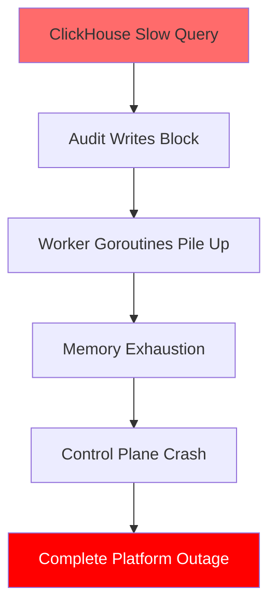
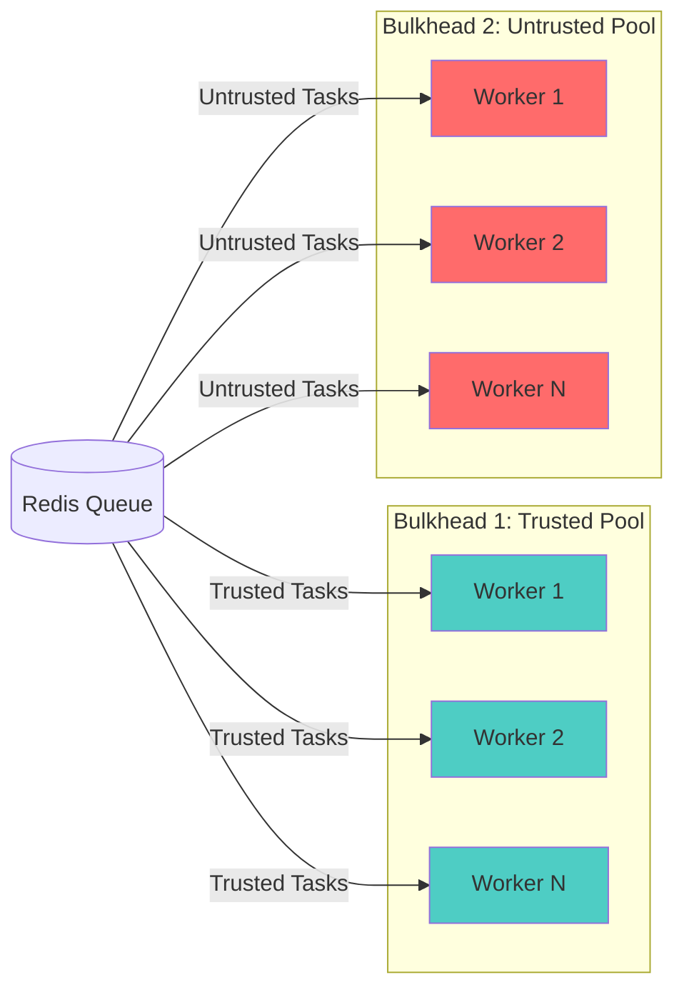

<LLMOnly
  data={`
type: deep-dive
difficulty: advanced
keyTakeaways:
  - Implement circuit breakers to prevent cascading failures
  - Design bulkhead patterns for resource isolation
  - Build graceful degradation for non-critical system failures
prerequisites: Go programming, distributed systems, Kubernetes fundamentals
targetAudience: Platform engineers building resilient control plane systems
`}
/>

In the previous parts of this series, we built a production-grade workload orchestration platform with <EmbedBlog slug="polymorphic-workload-orchestrator" placeholder="polymorphic runtimes" />, <EmbedBlog slug="secure-microvm-runtime" placeholder="hardware isolation" />, <EmbedBlog slug="secure-agent-networking" placeholder="zero-trust networking" />, and <EmbedBlog slug="enterprise-audit-logging" placeholder="comprehensive audit logging" />.

But there's a critical gap: **What happens when things fail?**

In distributed systems, failures are not exceptional—they're inevitable. A single slow database query can cascade into a complete platform outage. A Kubernetes API server hiccup can block thousands of workload provisions. A Redis connection timeout can deadlock your entire control plane.

In this final part, we'll implement **Resilience Patterns** to ensure our control plane degrades gracefully under failure conditions rather than collapsing catastrophically.

## The Problem: Cascading Failures

Consider this scenario:

1. ClickHouse (our audit sink) becomes slow due to a large query.
2. Our audit middleware blocks waiting for writes to complete.
3. The worker goroutines pile up, exhausting memory.
4. The Go process OOMs and crashes.
5. **All workload provisioning stops**, even though Kubernetes is healthy.

A single component failure took down the entire platform. This is a **cascading failure**.



## The Solution: Defense in Depth

We'll implement three complementary patterns:

1. **Circuit Breakers**: Stop calling failing dependencies.
2. **Bulkheads**: Isolate failures to prevent contagion.
3. **Graceful Degradation**: Continue core operations when non-critical systems fail.

## Pattern 1: Circuit Breakers

A circuit breaker wraps external calls and "opens" (stops calling) when a dependency fails repeatedly. This prevents wasting resources on doomed requests.

### The Circuit Breaker Interface

```go
package resilience

import (
    "context"
    "errors"
    "sync"
    "time"
)

var ErrCircuitOpen = errors.New("circuit breaker is open")

type State int

const (
    StateClosed State = iota // Normal operation
    StateOpen                 // Failing, reject requests
    StateHalfOpen            // Testing if service recovered
)

type CircuitBreaker struct {
    maxFailures  uint32
    resetTimeout time.Duration

    mu           sync.RWMutex
    state        State
    failures     uint32
    lastFailTime time.Time
}

func NewCircuitBreaker(maxFailures uint32, resetTimeout time.Duration) *CircuitBreaker {
    return &CircuitBreaker{
        maxFailures:  maxFailures,
        resetTimeout: resetTimeout,
        state:        StateClosed,
    }
}

func (cb *CircuitBreaker) Execute(ctx context.Context, fn func() error) error {
    // Check if we should attempt the call
    if !cb.canAttempt() {
        return ErrCircuitOpen
    }

    // Execute the function
    err := fn()

    // Record the result
    cb.recordResult(err)

    return err
}

func (cb *CircuitBreaker) canAttempt() bool {
    cb.mu.RLock()
    defer cb.mu.RUnlock()

    switch cb.state {
    case StateClosed:
        return true
    case StateOpen:
        // Check if enough time has passed to try again
        if time.Since(cb.lastFailTime) > cb.resetTimeout {
            cb.mu.RUnlock()
            cb.mu.Lock()
            cb.state = StateHalfOpen
            cb.mu.Unlock()
            cb.mu.RLock()
            return true
        }
        return false
    case StateHalfOpen:
        return true
    default:
        return false
    }
}

func (cb *CircuitBreaker) recordResult(err error) {
    cb.mu.Lock()
    defer cb.mu.Unlock()

    if err == nil {
        // Success! Reset the circuit
        if cb.state == StateHalfOpen {
            cb.state = StateClosed
        }
        cb.failures = 0
        return
    }

    // Failure
    cb.failures++
    cb.lastFailTime = time.Now()

    if cb.failures >= cb.maxFailures {
        cb.state = StateOpen
    }
}

func (cb *CircuitBreaker) GetState() State {
    cb.mu.RLock()
    defer cb.mu.RUnlock()
    return cb.state
}
```

### Protecting the Audit Sink

We wrap our ClickHouse/Kafka writes with a circuit breaker:

```go
package middleware

import (
    "context"
    "log"
    "time"
)

type ResilientAuditSink struct {
    underlying AuditSink
    breaker    *resilience.CircuitBreaker
    fallback   AuditSink // Local file or memory buffer
}

func NewResilientAuditSink(sink AuditSink, fallback AuditSink) *ResilientAuditSink {
    return &ResilientAuditSink{
        underlying: sink,
        fallback:   fallback,
        breaker:    resilience.NewCircuitBreaker(5, 30*time.Second),
    }
}

func (r *ResilientAuditSink) Write(entry AuditEntry) {
    // Try the primary sink with circuit breaker protection
    err := r.breaker.Execute(context.Background(), func() error {
        return r.underlying.Write(entry)
    })

    if err == resilience.ErrCircuitOpen {
        log.Printf("⚠️  Audit circuit open, using fallback for %s", entry.WorkloadID)
        // Write to local buffer instead
        r.fallback.Write(entry)
        return
    }

    if err != nil {
        log.Printf("❌ Audit write failed: %v", err)
        // Also use fallback on regular errors
        r.fallback.Write(entry)
    }
}
```

Now, if ClickHouse becomes slow or unavailable, we:

1. Detect the failure after 5 consecutive errors.
2. Stop sending traffic for 30 seconds (preventing pile-up).
3. Write to a local fallback (file or in-memory buffer).
4. Automatically retry after the timeout.

<Callout variant="info" title="Fallback Strategy" icon="info">
  The fallback sink can be a local file that gets replayed later, or an
  in-memory ring buffer. For critical audit logs, consider a durable local queue
  like BoltDB or SQLite that syncs back when the primary recovers.
</Callout>

## Pattern 2: Bulkheads

In ship design, bulkheads are compartments that prevent a single hull breach from sinking the entire vessel. In software, we use **resource isolation** to prevent one failing component from exhausting shared resources.

### The Problem: Shared Worker Pool

Our current design uses a single Redis queue and unlimited goroutines:

```go
func (w *Worker) Start(ctx context.Context) {
    for {
        task := w.redis.BRPop(ctx, 0, "workload_queue")
        go w.handleTask(ctx, runtime, task) // UNBOUNDED!
    }
}
```

If `handleTask` blocks (e.g., waiting for a slow Kubernetes API), we spawn infinite goroutines and exhaust memory.

### The Solution: Bounded Worker Pools

We create separate, bounded pools for different workload types:

```go
package worker

import (
    "context"
    "log"
)

type BulkheadWorker struct {
    trustedPool   *WorkerPool
    untrustedPool *WorkerPool
    redis         *redis.Client
}

type WorkerPool struct {
    name     string
    size     int
    taskChan chan Task
    runtime  runtime.WorkloadRuntime
}

func NewWorkerPool(name string, size int, runtime runtime.WorkloadRuntime) *WorkerPool {
    pool := &WorkerPool{
        name:     name,
        size:     size,
        taskChan: make(chan Task, size*2), // Buffered channel
        runtime:  runtime,
    }

    // Start fixed number of workers
    for i := 0; i < size; i++ {
        go pool.worker(i)
    }

    return pool
}

func (p *WorkerPool) worker(id int) {
    log.Printf("🔧 Worker %s-%d started", p.name, id)

    for task := range p.taskChan {
        log.Printf("⚙️  Worker %s-%d processing %s", p.name, id, task.ID)

        // Execute with timeout to prevent infinite blocking
        ctx, cancel := context.WithTimeout(context.Background(), 5*time.Minute)

        err := p.runtime.Provision(ctx, task.ID, task.Spec)
        if err != nil {
            log.Printf("❌ Worker %s-%d failed task %s: %v", p.name, id, task.ID, err)
        }

        cancel()
    }
}

func (p *WorkerPool) Submit(task Task) bool {
    select {
    case p.taskChan <- task:
        return true
    default:
        // Pool is full, reject the task
        log.Printf("⚠️  Pool %s is full, rejecting task %s", p.name, task.ID)
        return false
    }
}

func (w *BulkheadWorker) Start(ctx context.Context) {
    // Create isolated pools
    w.trustedPool = NewWorkerPool("trusted", 10, w.trustedRuntime)
    w.untrustedPool = NewWorkerPool("untrusted", 5, w.untrustedRuntime)

    for {
        result, err := w.redis.BRPop(ctx, 0, "workload_queue").Result()
        if err != nil {
            continue
        }

        var task Task
        json.Unmarshal([]byte(result[1]), &task)

        // Route to appropriate pool
        var accepted bool
        if task.Type == "untrusted" {
            accepted = w.untrustedPool.Submit(task)
        } else {
            accepted = w.trustedPool.Submit(task)
        }

        if !accepted {
            // Pool is saturated, push back to Redis with delay
            w.redis.LPush(ctx, "workload_queue_retry", result[1])
        }
    }
}
```

### Benefits of Bulkheads

1. **Resource Isolation**: Untrusted workloads can't exhaust resources for trusted ones.
2. **Bounded Memory**: Fixed goroutine count prevents OOM.
3. **Backpressure**: When pools are full, we reject or delay new work instead of crashing.



## Pattern 3: Graceful Degradation

Not all failures are equal. If audit logging fails, we should continue provisioning workloads. If Kubernetes fails, we must stop everything.

### Criticality Levels

We categorize dependencies:

```go
type Criticality int

const (
    CriticalityOptional Criticality = iota // Logging, metrics
    CriticalityDegraded                    // Partial functionality
    CriticalityCritical                    // Must work or fail
)

type Dependency struct {
    Name        string
    Criticality Criticality
    HealthCheck func(context.Context) error
    Breaker     *resilience.CircuitBreaker
}
```

### Health-Aware Middleware

We extend our audit middleware to degrade gracefully:

```go
type GracefulAuditMiddleware struct {
    Next        runtime.WorkloadRuntime
    Sink        *ResilientAuditSink
    degraded    atomic.Bool
}

func (g *GracefulAuditMiddleware) Provision(ctx context.Context, id string, spec runtime.Spec) error {
    // ALWAYS provision the workload (critical path)
    err := g.Next.Provision(ctx, id, spec)

    // BEST EFFORT audit logging (non-critical)
    if !g.degraded.Load() {
        entry := g.buildAuditEntry(id, spec, err)

        // Fire and forget - don't block on logging
        go func() {
            auditErr := g.Sink.Write(entry)
            if auditErr != nil {
                // Enter degraded mode
                g.degraded.Store(true)
                log.Printf("⚠️  Entering degraded mode: audit logging disabled")
            }
        }()
    }

    return err // Return the ACTUAL provision error, not audit error
}
```

### System Health Endpoint

Expose overall system health for load balancers and monitoring:

```go
type HealthStatus struct {
    Status       string                 `json:"status"` // "healthy", "degraded", "critical"
    Dependencies map[string]DepHealth   `json:"dependencies"`
    Timestamp    time.Time              `json:"timestamp"`
}

type DepHealth struct {
    Status      string `json:"status"`
    Criticality string `json:"criticality"`
    Message     string `json:"message,omitempty"`
}

func (w *Worker) HealthCheck(ctx context.Context) HealthStatus {
    status := HealthStatus{
        Status:       "healthy",
        Dependencies: make(map[string]DepHealth),
        Timestamp:    time.Now(),
    }

    // Check Kubernetes
    k8sErr := w.k8sRuntime.HealthCheck(ctx)
    if k8sErr != nil {
        status.Status = "critical"
        status.Dependencies["kubernetes"] = DepHealth{
            Status:      "unhealthy",
            Criticality: "critical",
            Message:     k8sErr.Error(),
        }
    } else {
        status.Dependencies["kubernetes"] = DepHealth{
            Status:      "healthy",
            Criticality: "critical",
        }
    }

    // Check ClickHouse (non-critical)
    if w.auditSink.breaker.GetState() == resilience.StateOpen {
        status.Status = "degraded"
        status.Dependencies["clickhouse"] = DepHealth{
            Status:      "unhealthy",
            Criticality: "optional",
            Message:     "circuit breaker open",
        }
    } else {
        status.Dependencies["clickhouse"] = DepHealth{
            Status:      "healthy",
            Criticality: "optional",
        }
    }

    return status
}
```

## Timeout Propagation

Every external call needs a timeout. We use context deadlines throughout:

```go
func (w *Worker) handleTask(ctx context.Context, runtime runtime.WorkloadRuntime, task Task) {
    // Set overall task timeout
    ctx, cancel := context.WithTimeout(ctx, 5*time.Minute)
    defer cancel()

    // Provision with timeout
    err := runtime.Provision(ctx, task.ID, task.Spec)
    if err != nil {
        if errors.Is(err, context.DeadlineExceeded) {
            log.Printf("⏱️  Task %s timed out after 5 minutes", task.ID)
            // Cleanup partial resources
            runtime.Teardown(context.Background(), task.ID)
        }
        return
    }

    // Wait for completion with timeout
    ticker := time.NewTicker(10 * time.Second)
    defer ticker.Stop()

    for {
        select {
        case <-ctx.Done():
            log.Printf("⏱️  Task %s monitoring timed out", task.ID)
            return
        case <-ticker.C:
            status, err := runtime.Status(ctx, task.ID)
            if err != nil || status.Phase == "Completed" {
                return
            }
        }
    }
}
```

## Monitoring Resilience Metrics

Expose circuit breaker states and pool saturation as Prometheus metrics:

```go
var (
    circuitBreakerState = prometheus.NewGaugeVec(
        prometheus.GaugeOpts{
            Name: "control_plane_circuit_breaker_state",
            Help: "Circuit breaker state (0=closed, 1=open, 2=half-open)",
        },
        []string{"dependency"},
    )

    workerPoolUtilization = prometheus.NewGaugeVec(
        prometheus.GaugeOpts{
            Name: "control_plane_worker_pool_utilization",
            Help: "Worker pool utilization (0-1)",
        },
        []string{"pool_name"},
    )

    degradedMode = prometheus.NewGauge(
        prometheus.GaugeOpts{
            Name: "control_plane_degraded_mode",
            Help: "Whether the control plane is in degraded mode (0=healthy, 1=degraded)",
        },
    )
)

func (w *Worker) recordMetrics() {
    // Update circuit breaker metrics
    circuitBreakerState.WithLabelValues("clickhouse").Set(
        float64(w.auditSink.breaker.GetState()),
    )

    // Update pool utilization
    trustedUtil := float64(len(w.trustedPool.taskChan)) / float64(cap(w.trustedPool.taskChan))
    workerPoolUtilization.WithLabelValues("trusted").Set(trustedUtil)

    untrustedUtil := float64(len(w.untrustedPool.taskChan)) / float64(cap(w.untrustedPool.taskChan))
    workerPoolUtilization.WithLabelValues("untrusted").Set(untrustedUtil)

    // Update degraded mode
    if w.auditMiddleware.degraded.Load() {
        degradedMode.Set(1)
    } else {
        degradedMode.Set(0)
    }
}
```

## Testing Resilience

Chaos engineering is critical. Test your resilience patterns:

```shell
# 1. Simulate ClickHouse failure
kubectl scale deployment clickhouse --replicas=0

# 2. Verify control plane continues provisioning
kubectl logs -f -l app=orchestrator | grep "Entering degraded mode"

# 3. Verify fallback logging
kubectl exec -it orchestrator-pod -- ls /var/log/audit-fallback/

# 4. Simulate Kubernetes API slowness
# Use a network policy to add 5s latency to kube-apiserver
tc qdisc add dev eth0 root netem delay 5000ms

# 5. Verify worker pool backpressure
# Should see "Pool full, rejecting task" messages

# 6. Restore services
kubectl scale deployment clickhouse --replicas=1
tc qdisc del dev eth0 root
```

## Deployment Configuration

Update the orchestrator deployment with resource limits and health checks:

```yaml filename=manifests/deployment.yaml
apiVersion: apps/v1
kind: Deployment
metadata:
  name: orchestrator
spec:
  replicas: 3 # Multiple replicas for HA
  template:
    spec:
      containers:
        - name: manager
          image: astraq/orchestrator:v2
          resources:
            requests:
              cpu: "500m"
              memory: "512Mi"
            limits:
              cpu: "2000m"
              memory: "2Gi"
          livenessProbe:
            httpGet:
              path: /health
              port: 8080
            initialDelaySeconds: 30
            periodSeconds: 10
            timeoutSeconds: 5
            failureThreshold: 3
          readinessProbe:
            httpGet:
              path: /ready
              port: 8080
            initialDelaySeconds: 10
            periodSeconds: 5
            timeoutSeconds: 3
          env:
            - name: WORKER_POOL_TRUSTED_SIZE
              value: "10"
            - name: WORKER_POOL_UNTRUSTED_SIZE
              value: "5"
            - name: CIRCUIT_BREAKER_THRESHOLD
              value: "5"
            - name: CIRCUIT_BREAKER_TIMEOUT
              value: "30s"
```

## Conclusion

We've transformed our control plane from a brittle prototype into a resilient production system:

1. **Circuit Breakers**: Prevent cascading failures by stopping calls to failing dependencies.
2. **Bulkheads**: Isolate resource pools to prevent contagion between workload types.
3. **Graceful Degradation**: Continue core operations even when non-critical systems fail.
4. **Timeout Propagation**: Prevent infinite blocking with context deadlines.
5. **Health Monitoring**: Expose system health for observability and load balancing.

This is the difference between a system that "works in testing" and one that **survives production**.

Our platform can now handle:

- ClickHouse outages (falls back to local logging)
- Kubernetes API slowness (bounded worker pools prevent pile-up)
- Redis connection failures (circuit breakers prevent retry storms)
- Partial network failures (timeouts prevent deadlocks)

Combined with the security, isolation, and observability from previous parts, we've built a **production-grade workload orchestration platform** that can safely run untrusted AI agents at scale.
