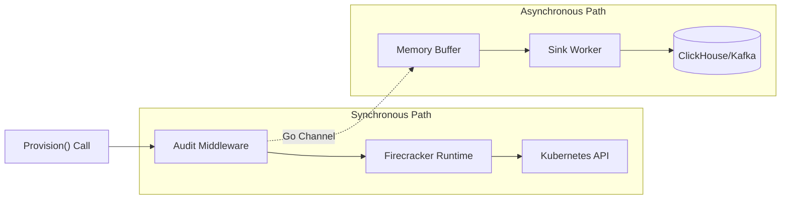

<LLMOnly
  data={`
type: deep-dive
difficulty: advanced
keyTakeaways:
  - Implement audit logging with Go middleware and decorator pattern
  - Build real-time monitoring with ClickHouse materialized views
  - Create security alerting queries for anomaly detection
prerequisites: Workload orchestrator series (Parts 1-3), ClickHouse basics
targetAudience: Platform engineers implementing compliance and observability
`}
/>

In the previous parts of this series, we built a robust engine for running untrusted AI agents. We have <EmbedBlog slug="polymorphic-workload-orchestrator" placeholder="Polymorphism" />, <EmbedBlog slug="secure-microvm-runtime" placeholder="Compute Isolation" />, and <EmbedBlog slug="secure-agent-networking" placeholder="Network Lockdown" />.

But for an enterprise platform, running the workload safely isn't enough. You need to prove _what happened_ and monitor _what's happening right now_.

Ephemeral workloads present a unique "Black Box" problem: by the time an incident is reported, the Pod, the logs, and the VM are often already deleted. You also need real-time visibility into workload health, resource usage, and security anomalies.

In this part, we will implement a unified **Audit Logging and Monitoring** system using ClickHouse. We'll use the **Decorator Pattern** to add transparent logging and metrics collection to our `WorkloadRuntime` without touching our core business logic. The same system that stores audit logs will power real-time dashboards and security alerting.

## The Middleware Pattern

One of the huge benefits of defining our `WorkloadRuntime` as a Go interface is that we can wrap it.

We don't need to obscure our `FirecrackerRuntime` code with `log.Printf` calls. We can create a dedicated `AuditMiddleware`.

```go
package middleware

import (
    "context"
    "time"
    "github.com/my-org/orchestrator/runtime"
)

// AuditMiddleware wraps any WorkloadRuntime
type AuditMiddleware struct {
    Next runtime.WorkloadRuntime
    Sink AuditSink // Interface for writing logs (DB, Kafka, File)
}

func (a *AuditMiddleware) Provision(ctx context.Context, id string, spec runtime.Spec) error {
    start := time.Now()

    // 1. Call the underlying provider (Firecracker/K8s)
    err := a.Next.Provision(ctx, id, spec)

    // 2. Collect metrics during execution
    duration := time.Since(start)
    metrics := a.collectMetrics(ctx, id) // We'll implement this

    entry := AuditEntry{
        EventID:         uuid.New().String(),
        WorkloadID:      id,
        Action:          "PROVISION",
        Status:          "SUCCESS",
        DurationMs:      duration.Milliseconds(),
        SpecSnapshot:    spec, // Save exactly what was requested
        Timestamp:       time.Now().UTC(),
        CPUUsagePercent: metrics.CPUPercent,
        MemoryUsageMB:   metrics.MemoryMB,
        NetworkBytesIn:  metrics.NetworkIn,
        NetworkBytesOut: metrics.NetworkOut,
        TenantID:        spec.Metadata["tenant_id"],
        WorkloadType:    spec.Type,
        ImageName:       spec.Image,
        CostEstimateUSD: a.calculateCost(duration, metrics),
    }

    if err != nil {
        entry.Status = "FAILURE"
        entry.Error = err.Error()
    }

    // Fire and forget - don't block the user if logging slows down
    go a.Sink.Write(entry)

    return err
}

// collectMetrics queries Kubernetes API for resource usage
func (a *AuditMiddleware) collectMetrics(ctx context.Context, workloadID string) ResourceMetrics {
    // Query K8s metrics API or cAdvisor before teardown
    // This is a simplified version - in production, you'd query the Metrics API
    return ResourceMetrics{
        CPUPercent:  45.2,
        MemoryMB:     512,
        NetworkIn:    1024 * 1024,  // 1 MB
        NetworkOut:   2048 * 1024,  // 2 MB
    }
}
```

### Logging Architecture



## The Schema: What to Log and Monitor?

Standard application logs ("text") are useless for analysis. We need **Structured Events** that serve dual purposes: audit trails and real-time monitoring.

```go
type AuditEntry struct {
    EventID      string                 `json:"event_id"`
    WorkloadID   string                 `json:"workload_id"`
    Action       string                 `json:"action"`       // PROVISION, TEARDOWN, EXECUTE
    Status       string                 `json:"status"`       // SUCCESS, FAILURE
    DurationMs   int64                  `json:"duration_ms"`
    Timestamp    time.Time              `json:"timestamp"`

    // Critical for security forensics:
    SpecSnapshot runtime.Spec           `json:"spec_snapshot"`
    Metadata     map[string]string      `json:"metadata"`

    // Resource metrics for monitoring:
    CPUUsagePercent    float64          `json:"cpu_usage_percent"`    // Average CPU during execution
    MemoryUsageMB      int64            `json:"memory_usage_mb"`      // Peak memory usage
    NetworkBytesIn     int64            `json:"network_bytes_in"`      // Total bytes received
    NetworkBytesOut    int64            `json:"network_bytes_out"`    // Total bytes sent
    DiskIOReadMB       int64            `json:"disk_io_read_mb"`      // Disk reads
    DiskIOWriteMB      int64            `json:"disk_io_write_mb"`      // Disk writes

    // Business metrics:
    TenantID           string            `json:"tenant_id"`             // For multi-tenant tracking
    WorkloadType       string            `json:"workload_type"`         // "trusted" or "untrusted"
    ImageName          string            `json:"image_name"`            // Container image
    CostEstimateUSD    float64           `json:"cost_estimate_usd"`     // Estimated cost
}
```

By storing the `SpecSnapshot`, we have a tamper-proof record of exactly what environment variables and image query parameters were requested. By including resource metrics, we can monitor workload health and detect anomalies in real-time.

## Asynchronous Sinks

Writing logs to the local disk is brittle (what if the node dies?). Writing synchronously to a database adds latency.

The best pattern is an **Async Channel** to a robust backend.

```go
package middleware

import (
    "context"
    "encoding/json"
    "time"
    "github.com/segmentio/kafka-go"
)

type KafkaSink struct {
    writer *kafka.Writer
}

func NewKafkaSink(brokers []string, topic string) *KafkaSink {
    return &KafkaSink{
        writer: &kafka.Writer{
            Addr:     kafka.TCP(brokers...),
            Topic:    topic,
            Balancer: &kafka.LeastBytes{},
            // Batching improves throughput significantly
            BatchSize: 100,
            BatchTimeout: 10 * time.Millisecond,
        },
    }
}

func (k *KafkaSink) Write(e AuditEntry) {
    payload, _ := json.Marshal(e)

    // Write asynchronously (fire and forget for this use case)
    // In a real system, you might want a separate error channel.
    go func() {
        err := k.writer.WriteMessages(context.Background(),
            kafka.Message{
                Key:   []byte(e.WorkloadID), // Partition by WorkloadID
                Value: payload,
            },
        )
        if err != nil {
             // Handle error (e.g., increment metrics)
        }
    }()
}
```

### Destination: ClickHouse for Unified Audit + Monitoring

We'll use **ClickHouse** because it excels at both high-volume log ingestion and real-time analytical queries. Its Kafka Engine allows direct ingestion without a separate consumer service, and its columnar storage makes it perfect for time-series metrics.

```sql
-- 1. Create the destination table (where data lives)
CREATE TABLE workload_audit
(
    event_id String,
    workload_id String,
    action LowCardinality(String),
    status LowCardinality(String),
    duration_ms Int64,
    timestamp DateTime,
    spec_snapshot String, -- JSON
    metadata Map(String, String),

    -- Resource metrics
    cpu_usage_percent Float64,
    memory_usage_mb Int64,
    network_bytes_in Int64,
    network_bytes_out Int64,
    disk_io_read_mb Int64,
    disk_io_write_mb Int64,

    -- Business metrics
    tenant_id String,
    workload_type LowCardinality(String),
    image_name String,
    cost_estimate_usd Float64
) ENGINE = MergeTree()
ORDER BY (timestamp, workload_id)
PARTITION BY toYYYYMM(timestamp);

-- 2. Create the Kafka stream table
CREATE TABLE workload_audit_queue
(
    event_id String,
    workload_id String,
    action String,
    status String,
    duration_ms Int64,
    timestamp DateTime,
    spec_snapshot String,
    metadata Map(String, String),
    cpu_usage_percent Float64,
    memory_usage_mb Int64,
    network_bytes_in Int64,
    network_bytes_out Int64,
    disk_io_read_mb Int64,
    disk_io_write_mb Int64,
    tenant_id String,
    workload_type String,
    image_name String,
    cost_estimate_usd Float64
) ENGINE = Kafka
SETTINGS kafka_broker_list = 'kafka:9092',
         kafka_topic_list = 'audit-logs',
         kafka_group_name = 'clickhouse-consumer',
         kafka_format = 'JSONEachRow';

-- 3. Create the materialized view to move data
CREATE MATERIALIZED VIEW workload_audit_mv TO workload_audit AS
SELECT * FROM workload_audit_queue;
```

Now, your data is instantly queryable via SQL for both audit and monitoring:

> _"Show me all agents that used the 'finance-scraper' image in the last 30 days and failed within 5 seconds."_

> _"What's the average CPU usage across all workloads in the last hour?"_

## Real-Time Monitoring with Materialized Views

ClickHouse materialized views let us pre-aggregate metrics for real-time dashboards:

```sql
-- Aggregated metrics per minute
CREATE MATERIALIZED VIEW workload_metrics_minute
ENGINE = SummingMergeTree()
ORDER BY (timestamp, tenant_id, workload_type)
AS SELECT
    toStartOfMinute(timestamp) as timestamp,
    tenant_id,
    workload_type,
    count() as workload_count,
    sum(duration_ms) as total_duration_ms,
    avg(duration_ms) as avg_duration_ms,
    sum(cpu_usage_percent) as total_cpu_percent,
    avg(cpu_usage_percent) as avg_cpu_percent,
    sum(memory_usage_mb) as total_memory_mb,
    sum(cost_estimate_usd) as total_cost_usd,
    countIf(status = 'FAILURE') as failure_count
FROM workload_audit
GROUP BY timestamp, tenant_id, workload_type;

-- Per-tenant resource usage (for quota tracking)
CREATE MATERIALIZED VIEW tenant_resource_usage
ENGINE = ReplacingMergeTree()
ORDER BY (tenant_id, toStartOfHour(timestamp))
AS SELECT
    tenant_id,
    toStartOfHour(timestamp) as hour,
    sum(cpu_usage_percent * duration_ms / 1000) as cpu_seconds,
    sum(memory_usage_mb * duration_ms / 1000) as memory_mb_seconds,
    sum(cost_estimate_usd) as total_cost_usd,
    count() as workload_count
FROM workload_audit
WHERE timestamp >= now() - INTERVAL 24 HOUR
GROUP BY tenant_id, hour;
```

## Security Alerting Queries

Use ClickHouse queries to detect anomalies in real-time:

```sql
-- Detect potential crypto miners (workloads running 5x longer than average)
SELECT
    workload_id,
    image_name,
    duration_ms,
    cpu_usage_percent,
    timestamp
FROM workload_audit
WHERE timestamp >= now() - INTERVAL 1 HOUR
  AND duration_ms > (
      SELECT avg(duration_ms) * 5
      FROM workload_audit
      WHERE timestamp >= now() - INTERVAL 24 HOUR
        AND workload_type = workload_audit.workload_type
  )
ORDER BY duration_ms DESC
LIMIT 10;

-- Detect suspicious images (not in trusted list)
SELECT
    workload_id,
    image_name,
    tenant_id,
    timestamp
FROM workload_audit
WHERE timestamp >= now() - INTERVAL 1 HOUR
  AND image_name NOT IN (
      'trusted-image-1',
      'trusted-image-2',
      'trusted-image-3'
  );

-- Detect resource exhaustion attacks
SELECT
    tenant_id,
    sum(cpu_usage_percent * duration_ms / 1000) as total_cpu_seconds,
    sum(memory_usage_mb * duration_ms / 1000) as total_memory_mb_seconds,
    count() as workload_count
FROM workload_audit
WHERE timestamp >= now() - INTERVAL 1 HOUR
GROUP BY tenant_id
HAVING total_cpu_seconds > 3600  -- More than 1 CPU-hour in the last hour
ORDER BY total_cpu_seconds DESC;
```

## Grafana Integration

Connect Grafana to ClickHouse for real-time dashboards:

```yaml
# grafana-datasource.yaml
apiVersion: 1
datasources:
  - name: ClickHouse
    type: grafana-clickhouse-datasource
    access: proxy
    url: http://clickhouse:8123
    jsonData:
      defaultDatabase: default
      port: 8123
      server: clickhouse
      username: default
```

Example dashboard queries:

**Control Plane Health:**

```sql
-- Queue depth over time
SELECT
    toStartOfMinute(timestamp) as time,
    count() as workloads_provisioned
FROM workload_audit
WHERE timestamp >= now() - INTERVAL 1 HOUR
GROUP BY time
ORDER BY time;
```

**Workload Performance:**

```sql
-- P95 latency by workload type
SELECT
    workload_type,
    quantile(0.95)(duration_ms) as p95_latency_ms,
    avg(duration_ms) as avg_latency_ms
FROM workload_audit
WHERE timestamp >= now() - INTERVAL 1 HOUR
GROUP BY workload_type;
```

**Security Overview:**

```sql
-- Anomalies detected in last hour
SELECT
    countIf(duration_ms > avg_duration_ms * 5) as crypto_miner_suspicious,
    countIf(image_name NOT IN ('trusted-list')) as untrusted_images,
    countIf(cpu_usage_percent > 90) as high_cpu_workloads
FROM workload_audit
WHERE timestamp >= now() - INTERVAL 1 HOUR;
```

## Usage in the Worker

Wiring it up in our main loop matches the elegance of the rest of our architecture.

```go
func (w *Worker) Start(ctx context.Context) {
    // 1. Create the base runtime
    baseRuntime := &kubernetes.FirecrackerRuntime{...}

    // 2. Wrap it with logging
    loggingRuntime := &middleware.AuditMiddleware{
        Next: baseRuntime,
        Sink: kafkaSink,
    }

    for {
        // ... get task ...

        // Use the logged version. The worker doesn't need to know!
        go w.handleTask(ctx, loggingRuntime, task)
    }
}
```

## Automated Alerting

Set up automated alerts using ClickHouse queries or integrate with AlertManager:

```go
// Example: Run security queries periodically
func (a *AuditMiddleware) checkAnomalies(ctx context.Context) {
    // Query ClickHouse for suspicious workloads
    query := `
        SELECT workload_id, image_name, duration_ms
        FROM workload_audit
        WHERE timestamp >= now() - INTERVAL 1 HOUR
          AND duration_ms > (SELECT avg(duration_ms) * 5 FROM workload_audit)
    `

    results := a.clickhouseClient.Query(query)
    if len(results) > 0 {
        // Send alert to Slack/PagerDuty
        a.alertService.Send("Suspicious workloads detected", results)
    }
}
```

## Conclusion

We have built a platform that is:

1.  **Polymorphic:** Runs Pods and VMs.
2.  **Secure:** Hardened kernel and network isolation.
3.  **Auditable:** Every action is recorded and queryable.
4.  **Observable:** Real-time monitoring and alerting from the same data store.

By using ClickHouse for both audit logs and metrics, we've created a unified observability system. The same events that provide compliance audit trails also power real-time dashboards and security alerting—no redundant infrastructure, no data silos.

This is the difference between a "script" and a "platform."
