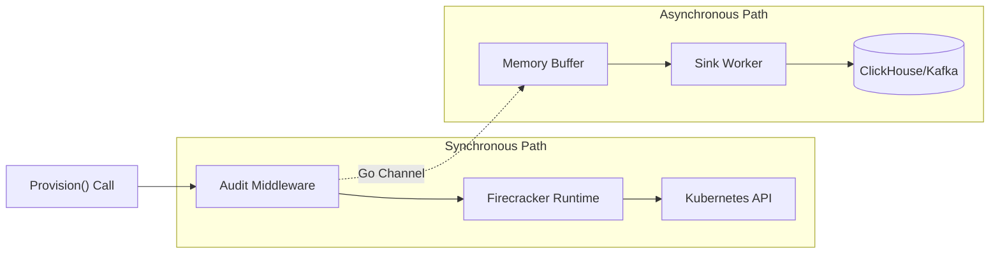

In the previous parts of this series, we built a robust engine for running untrusted AI agents. We have <EmbedBlog slug="polymorphic-workload-orchestrator" placeholder="Polymorphism" />, <EmbedBlog slug="secure-microvm-runtime" placeholder="Compute Isolation" />, and <EmbedBlog slug="secure-agent-networking" placeholder="Network Lockdown" />.

But for an enterprise platform, running the workload safely isn't enough. You need to prove _what happened_.

Ephemeral workloads present a unique "Black Box" problem: by the time an incident is reported, the Pod, the logs, and the VM are often already deleted.

In this part, we will implement an **Enterprise Audit Logging** system. We'll use the **Decorator Pattern** to add transparent logging to our `WorkloadRuntime` without touching our core business logic.

## The Middleware Pattern

One of the huge benefits of defining our `WorkloadRuntime` as a Go interface (in Part 1) is that we can wrap it.

We don't need to obscure our `FirecrackerRuntime` code with `log.Printf` calls. We can create a dedicated `AuditMiddleware`.

```go
package middleware

import (
    "context"
    "time"
    "github.com/my-org/orchestrator/runtime"
)

// AuditMiddleware wraps any WorkloadRuntime
type AuditMiddleware struct {
    Next runtime.WorkloadRuntime
    Sink AuditSink // Interface for writing logs (DB, Kafka, File)
}

func (a *AuditMiddleware) Provision(ctx context.Context, id string, spec runtime.Spec) error {
    start := time.Now()

    // 1. Call the underlying provider (Firecracker/K8s)
    err := a.Next.Provision(ctx, id, spec)

    // 2. Record the event asynchronously
    duration := time.Since(start)

    entry := AuditEntry{
        EventID:      uuid.New().String(),
        WorkloadID:   id,
        Action:       "PROVISION",
        Status:       "SUCCESS",
        DurationMs:   duration.Milliseconds(),
        SpecSnapshot: spec, // Save exactly what was requested
        Timestamp:    time.Now().UTC(),
    }

    if err != nil {
        entry.Status = "FAILURE"
        entry.Error = err.Error()
    }

    // Fire and forget - don't block the user if logging slows down
    go a.Sink.Write(entry)

    return err
}
```

### Logging Architecture



## The Schema: What to Log?

Standard application logs ("text") are useless for analysis. We need **Structured Events**.

```go
type AuditEntry struct {
    EventID      string                 `json:"event_id"`
    WorkloadID   string                 `json:"workload_id"`
    Action       string                 `json:"action"`       // PROVISION, TEARDOWN, EXECUTE
    Status       string                 `json:"status"`       // SUCCESS, FAILURE
    DurationMs   int64                  `json:"duration_ms"`
    Timestamp    time.Time              `json:"timestamp"`

    // Critical for security forensics:
    SpecSnapshot runtime.Spec           `json:"spec_snapshot"`
    Metadata     map[string]string      `json:"metadata"`
}
```

By storing the `SpecSnapshot`, we have a tamper-proof record of exactly what environment variables and image query parameters were requested at that moment in time.

## Asynchronous Sinks

Writing logs to the local disk is brittle (what if the node dies?). Writing synchronously to a database adds latency.

The best pattern is an **Async Channel** to a robust backend.

```go
package middleware

import (
    "context"
    "encoding/json"
    "time"
    "github.com/segmentio/kafka-go"
)

type KafkaSink struct {
    writer *kafka.Writer
}

func NewKafkaSink(brokers []string, topic string) *KafkaSink {
    return &KafkaSink{
        writer: &kafka.Writer{
            Addr:     kafka.TCP(brokers...),
            Topic:    topic,
            Balancer: &kafka.LeastBytes{},
            // Batching improves throughput significantly
            BatchSize: 100,
            BatchTimeout: 10 * time.Millisecond,
        },
    }
}

func (k *KafkaSink) Write(e AuditEntry) {
    payload, _ := json.Marshal(e)

    // Write asynchronously (fire and forget for this use case)
    // In a real system, you might want a separate error channel.
    go func() {
        err := k.writer.WriteMessages(context.Background(),
            kafka.Message{
                Key:   []byte(e.WorkloadID), // Partition by WorkloadID
                Value: payload,
            },
        )
        if err != nil {
             // Handle error (e.g., increment metrics)
        }
    }()
}
```

### Destination Example: ClickHouse

You could pipe these logs effectively into **BigQuery**, **Snowflake**, or **Datadog**. For this example, we'll use **ClickHouse** because its Kafka Engine allows for direct ingestion without a separate consumer service.

```sql
-- 1. Create the destination table (where data lives)
CREATE TABLE workload_audit
(
    event_id String,
    workload_id String,
    action LowCardinality(String),
    status LowCardinality(String),
    duration_ms Int64,
    timestamp DateTime,
    spec_snapshot String, -- JSON
    metadata Map(String, String)
) ENGINE = MergeTree()
ORDER BY (workload_id, timestamp);

-- 2. Create the Kafka stream table
CREATE TABLE workload_audit_queue
(
    event_id String,
    workload_id String,
    action String,
    status String,
    duration_ms Int64,
    timestamp DateTime,
    spec_snapshot String,
    metadata Map(String, String)
) ENGINE = Kafka
SETTINGS kafka_broker_list = 'kafka:9092',
         kafka_topic_list = 'audit-logs',
         kafka_group_name = 'clickhouse-consumer',
         kafka_format = 'JSONEachRow';

-- 3. Create the materialized view to move data
CREATE MATERIALIZED VIEW workload_audit_mv TO workload_audit AS
SELECT * FROM workload_audit_queue;
```

Now, your data is instantly queryable via SQL:

> _"Show me all agents that used the 'finance-scraper' image in the last 30 days and failed within 5 seconds."_

## Usage in the Worker

Wiring it up in our main loop matches the elegance of the rest of our architecture.

```go
func (w *Worker) Start(ctx context.Context) {
    // 1. Create the base runtime
    baseRuntime := &kubernetes.FirecrackerRuntime{...}

    // 2. Wrap it with logging
    loggingRuntime := &middleware.AuditMiddleware{
        Next: baseRuntime,
        Sink: kafkaSink,
    }

    for {
        // ... get task ...

        // Use the logged version. The worker doesn't need to know!
        go w.handleTask(ctx, loggingRuntime, task)
    }
}
```

## Bonus: Anomaly Detection

Once your logs are structured and centralized, you can move from **passive viewing** to **active defense**.

By feeding these logs into a system that tracks "Baseline Duration" and "Baseline Resource Usage", you can auto-flag suspicious agents.

- **Rule:** If `Duration > 500% of Avg` -> Flag for review (Crypto miner?)
- **Rule:** If `Image != TrustedList` -> Alert Security Team

## Conclusion

We have built a platform that is:

1.  **Polymorphic:** Runs Pods and VMs.
2.  **Secure:** Hardened kernel and network isolation.
3.  **Auditable:** Every action is recorded and queryable.

This is the difference between a "script" and a "platform."

### Read the Series

- <EmbedBlog slug="polymorphic-workload-orchestrator" />
- <EmbedBlog slug="secure-microvm-runtime" />
- <EmbedBlog slug="secure-agent-networking" />
- **Enterprise Audit Logging**
