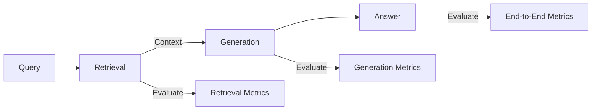
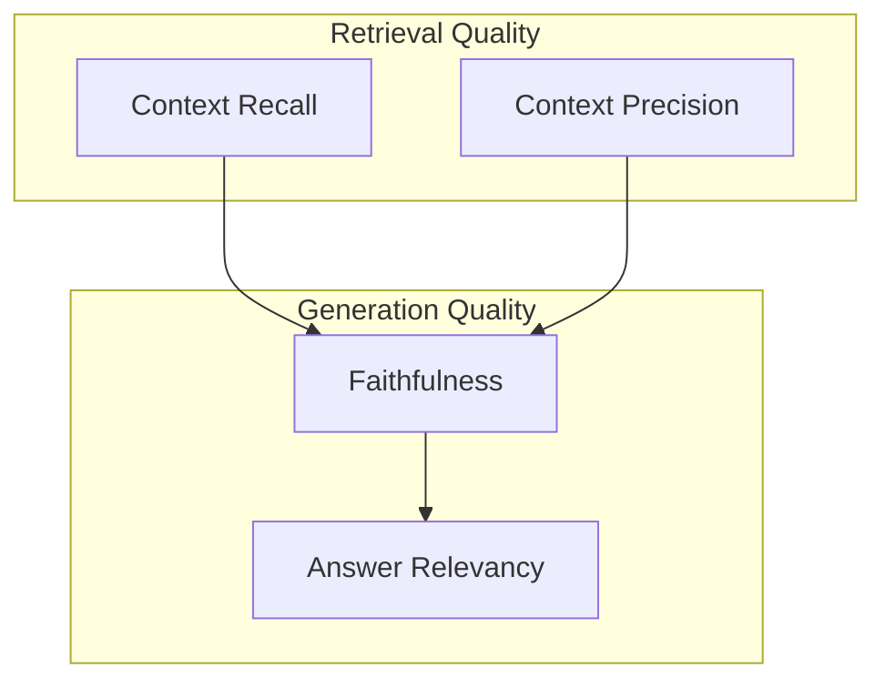
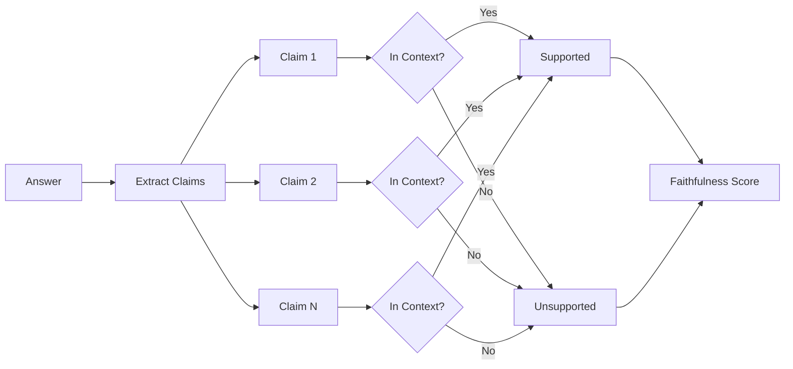

<LLMOnly
  data={`
type: guide
difficulty: intermediate
keyTakeaways:
  - Evaluate RAG systems using RAGAS framework metrics
  - Measure faithfulness, answer relevancy, context precision, and recall
  - Build automated evaluation pipelines for CI/CD integration
prerequisites: Python, basic RAG understanding, familiarity with evaluation concepts
targetAudience: ML engineers validating AI system quality
`}
/>

In our <EmbedBlog slug="production-ready-rag-guide" placeholder="RAG Complete Guide" /> and <EmbedBlog slug="multi-hop-rag-agents" placeholder="Advanced RAG Agents" /> articles, we built production-ready retrieval systems with hybrid search and multi-hop reasoning. But how do you know if your RAG system is actually _good_? Enter **RAGAS**, the gold standard for evaluating retrieval-augmented generation systems.

## Why Evaluate RAG Systems?

Building a RAG system is one thing; knowing whether it works reliably is another. Without proper evaluation, you're flying blind:

- **Hallucinations** may go undetected until users complain
- **Retrieval quality** degrades silently as your corpus grows
- **Prompt changes** might hurt performance without you knowing
- **Model upgrades** could introduce regressions

> "You can't improve what you can't measure." This principle is especially critical for RAG systems where both retrieval AND generation can fail independently.



## Understanding RAGAS Metrics

RAGAS provides four core metrics that evaluate different aspects of your RAG pipeline:

| Metric                | What It Measures                     | Range | Target |
| --------------------- | ------------------------------------ | ----- | ------ |
| **Faithfulness**      | Is the answer grounded in context?   | 0-1   | > 0.9  |
| **Answer Relevancy**  | Does it answer the question?         | 0-1   | > 0.8  |
| **Context Precision** | Are retrieved docs ranked correctly? | 0-1   | > 0.75 |
| **Context Recall**    | Was all necessary info retrieved?    | 0-1   | > 0.8  |

<Callout variant="info" title="Why Four Metrics?" icon="info">
  Each metric catches different failure modes. A system might retrieve perfect
  context but hallucinate (low faithfulness), or generate accurate answers from
  poorly ranked results (low precision). Measuring all four gives you complete
  visibility.
</Callout>

### The Metric Relationships



## Setting Up RAGAS

<Steps>

<Step>Install Dependencies</Step>

Add RAGAS to your existing RAG project:

```shell
uv add ragas datasets
```

<Step>Prepare Your Evaluation Dataset</Step>

RAGAS requires a specific format with questions, ground truth answers, and retrieved contexts:

```python filename=evaluation/dataset.py
from datasets import Dataset

eval_data = {
    "question": [
        "What is the embedding dimension of all-MiniLM-L6-v2?",
        "How does hybrid search improve retrieval quality?",
        "When should you use ColBERT reranking?",
    ],
    "ground_truth": [
        "The all-MiniLM-L6-v2 model produces embeddings with 384 dimensions.",
        "Hybrid search combines dense semantic embeddings with sparse keyword matching, capturing both meaning and exact terms.",
        "ColBERT reranking should be used when you need high precision and can afford the additional compute cost.",
    ],
    "answer": [],  # Will be filled by your RAG system
    "contexts": [],  # Will be filled by retrieval
}

dataset = Dataset.from_dict(eval_data)
```

<Step>Generate Answers and Contexts</Step>

Run your RAG system on the evaluation questions:

```python filename=evaluation/generate.py
from search import hybrid_search
from generate import generate_response

def evaluate_rag_system(questions: list[str]) -> tuple[list[str], list[list[str]]]:
    """Run RAG pipeline and collect answers with contexts."""
    answers = []
    all_contexts = []

    for question in questions:
        # Retrieve context
        results = hybrid_search(question, limit=5)
        contexts = [r["document"] for r in results]

        # Generate answer
        answer = generate_response(question, contexts)

        answers.append(answer)
        all_contexts.append(contexts)

    return answers, all_contexts
```

</Steps>

## Running RAGAS Evaluation

Here's the complete evaluation pipeline:

```python filename=evaluation/run_ragas.py
from ragas import evaluate
from ragas.metrics import (
    faithfulness,
    answer_relevancy,
    context_precision,
    context_recall,
)
from datasets import Dataset

from evaluation.generate import evaluate_rag_system

# Your evaluation questions and ground truths
questions = [
    "What is the embedding dimension of all-MiniLM-L6-v2?",
    "How does hybrid search improve retrieval quality?",
    "When should you use ColBERT reranking?",
]

ground_truths = [
    "The all-MiniLM-L6-v2 model produces embeddings with 384 dimensions.",
    "Hybrid search combines dense semantic embeddings with sparse keyword matching.",
    "ColBERT reranking is best for precision-critical applications.",
]

# Generate answers and retrieve contexts
answers, contexts = evaluate_rag_system(questions)

# Create RAGAS dataset
eval_dataset = Dataset.from_dict({  # [!code focus:6]
    "question": questions,
    "ground_truth": ground_truths,
    "answer": answers,
    "contexts": contexts,
})

# Run evaluation
results = evaluate(  # [!code highlight:7]
    dataset=eval_dataset,
    metrics=[
        faithfulness,
        answer_relevancy,
        context_precision,
        context_recall,
    ],
)

print(results)
```

<Callout variant="success" title="Sample Output" icon="terminal">
  ```
  {'faithfulness': 0.92, 'answer_relevancy': 0.87,
   'context_precision': 0.83, 'context_recall': 0.79}
  ```
</Callout>

## Deep Dive: Faithfulness

Faithfulness measures whether the generated answer is **grounded in the retrieved context**, essentially detecting hallucinations.

```python filename=metrics/faithfulness_example.py
from ragas.metrics import faithfulness

# Example of faithful response
faithful_example = {
    "question": "What is the dimension of MiniLM embeddings?",
    "contexts": [["MiniLM-L6-v2 produces 384-dimensional embeddings."]],
    "answer": "MiniLM embeddings have 384 dimensions.",
}

# Example of unfaithful (hallucinated) response
unfaithful_example = {
    "question": "What is the dimension of MiniLM embeddings?",
    "contexts": [["MiniLM-L6-v2 produces 384-dimensional embeddings."]],
    "answer": "MiniLM embeddings have 768 dimensions and support GPU acceleration.",  # [!code error]
}
```

### How Faithfulness is Calculated



The formula is straightforward:

```
Faithfulness = (Supported Claims) / (Total Claims)
```

<Callout variant="warning" title="Common Pitfalls" icon="alert-triangle">
  Faithfulness scores can be misleadingly high if your LLM generates very short,
  non-committal answers. Always pair faithfulness with answer relevancy to
  ensure completeness.
</Callout>

## Deep Dive: Answer Relevancy

Answer relevancy measures whether the response actually **addresses the user's question**:

```python filename=metrics/relevancy_example.py
# Highly relevant answer
relevant = {
    "question": "How do I configure Qdrant for hybrid search?",
    "answer": "To configure Qdrant for hybrid search, create a collection with both dense and sparse vector configs...",
}

# Irrelevant answer (factually correct but doesn't answer the question)
irrelevant = {
    "question": "How do I configure Qdrant for hybrid search?",
    "answer": "Qdrant is a vector database written in Rust that supports HNSW indexing.",  # [!code warning]
}
```

### The Relevancy Algorithm

RAGAS calculates relevancy by:

1. Generating hypothetical questions from the answer
2. Computing semantic similarity between generated and original questions
3. Averaging the similarity scores

```python filename=metrics/relevancy_internal.py
def answer_relevancy_score(question: str, answer: str, llm) -> float:
    """Simplified relevancy calculation."""
    # Generate 3 questions that the answer could be responding to
    generated_questions = llm.generate(
        f"Generate 3 questions that this answer responds to:\n{answer}"
    )

    # Compute embeddings
    q_embedding = embed(question)
    gen_embeddings = [embed(q) for q in generated_questions]

    # Average cosine similarity
    similarities = [cosine_sim(q_embedding, ge) for ge in gen_embeddings]
    return sum(similarities) / len(similarities)
```

## Deep Dive: Context Precision

Context precision evaluates whether the **most relevant documents are ranked highest**:

```python filename=metrics/precision_example.py
# Good precision: relevant docs at top
good_ranking = {
    "question": "What is BM25?",
    "contexts": [
        "BM25 is a ranking function for information retrieval.",  # Relevant ✓
        "BM25 uses term frequency and inverse document frequency.",  # Relevant ✓
        "Vector databases store embeddings.",  # Less relevant
    ],
}

# Poor precision: relevant docs buried
poor_ranking = {
    "question": "What is BM25?",
    "contexts": [
        "Qdrant is a vector database.",  # Not relevant
        "FastEmbed generates embeddings.",  # Not relevant
        "BM25 is a ranking function for information retrieval.",  # Relevant but ranked last!  # [!code error]
    ],
}
```

### Why Ranking Matters

Even if you retrieve all relevant documents, **poor ranking wastes context window tokens** on irrelevant information at the top. This leads to:

- Lower generation quality
- Higher token costs
- Potential hallucinations from irrelevant context

| Position | Precision@K Weight |
| -------- | ------------------ |
| 1st      | Highest impact     |
| 2nd      | High impact        |
| 3rd      | Medium impact      |
| 4th+     | Decreasing impact  |

## Deep Dive: Context Recall

Context recall measures whether your retrieval captured **all the information needed** to answer the question:

```python filename=metrics/recall_example.py
# Good recall: all needed info retrieved
good_recall = {
    "question": "Compare BM25 and dense embeddings.",
    "ground_truth": "BM25 uses keyword matching while dense embeddings capture semantic similarity.",
    "contexts": [
        "BM25 is a keyword-based ranking algorithm.",  # ✓ Covers BM25
        "Dense embeddings capture semantic meaning.",  # ✓ Covers dense
    ],
}

# Poor recall: missing information
poor_recall = {
    "question": "Compare BM25 and dense embeddings.",
    "ground_truth": "BM25 uses keyword matching while dense embeddings capture semantic similarity.",
    "contexts": [
        "BM25 is a keyword-based ranking algorithm.",  # ✓ Covers BM25
        # Missing any context about dense embeddings!  # [!code error]
    ],
}
```

<Callout variant="info" title="Recall Requires Ground Truth" icon="info">
  Unlike the other metrics, context recall needs ground truth answers to
  determine what information *should* be retrieved. This makes it harder to
  scale but essential for thorough evaluation.
</Callout>

## Building an Evaluation Pipeline

For production systems, automate evaluation with a complete pipeline:

```python filename=evaluation/pipeline.py
import json
from datetime import datetime
from pathlib import Path

from ragas import evaluate
from ragas.metrics import (
    faithfulness,
    answer_relevancy,
    context_precision,
    context_recall,
)
from datasets import Dataset


class RAGEvaluator:
    """Automated RAG evaluation pipeline."""

    def __init__(self, output_dir: str = "eval_results"):
        self.output_dir = Path(output_dir)
        self.output_dir.mkdir(exist_ok=True)
        self.metrics = [
            faithfulness,
            answer_relevancy,
            context_precision,
            context_recall,
        ]

    def run_evaluation(  # [!code focus:20]
        self,
        questions: list[str],
        ground_truths: list[str],
        answers: list[str],
        contexts: list[list[str]],
        run_name: str = None,
    ) -> dict:
        """Run full RAGAS evaluation and save results."""
        dataset = Dataset.from_dict({
            "question": questions,
            "ground_truth": ground_truths,
            "answer": answers,
            "contexts": contexts,
        })

        results = evaluate(dataset=dataset, metrics=self.metrics)

        # Save results
        run_name = run_name or datetime.now().strftime("%Y%m%d_%H%M%S")
        self._save_results(results, run_name)

        return results

    def _save_results(self, results: dict, run_name: str) -> None:
        """Persist evaluation results."""
        output_file = self.output_dir / f"{run_name}.json"
        with open(output_file, "w") as f:
            json.dump(
                {
                    "timestamp": datetime.now().isoformat(),
                    "metrics": dict(results),
                },
                f,
                indent=2,
            )

    def compare_runs(self, run1: str, run2: str) -> dict:
        """Compare two evaluation runs."""
        with open(self.output_dir / f"{run1}.json") as f:
            results1 = json.load(f)
        with open(self.output_dir / f"{run2}.json") as f:
            results2 = json.load(f)

        comparison = {}
        for metric in results1["metrics"]:
            diff = results2["metrics"][metric] - results1["metrics"][metric]
            comparison[metric] = {
                "before": results1["metrics"][metric],
                "after": results2["metrics"][metric],
                "change": diff,
                "improved": diff > 0,
            }

        return comparison
```

### Using the Pipeline

```python filename=evaluation/run_pipeline.py
from evaluation.pipeline import RAGEvaluator
from evaluation.generate import evaluate_rag_system

evaluator = RAGEvaluator()

# Load your test set
questions = load_test_questions()
ground_truths = load_ground_truths()

# Run your RAG system
answers, contexts = evaluate_rag_system(questions)

# Evaluate
results = evaluator.run_evaluation(
    questions=questions,
    ground_truths=ground_truths,
    answers=answers,
    contexts=contexts,
    run_name="baseline_v1",
)

print(f"Faithfulness: {results['faithfulness']:.3f}")
print(f"Relevancy: {results['answer_relevancy']:.3f}")
print(f"Precision: {results['context_precision']:.3f}")
print(f"Recall: {results['context_recall']:.3f}")
```

## Creating Test Datasets

<Accordion type="single" collapsible>
  <AccordionItem value="synthetic-data">
    <AccordionTrigger>Generating Synthetic Test Data</AccordionTrigger>
    <AccordionContent>
      RAGAS can help generate synthetic test data from your documents:

      ```python
      from ragas.testset.generator import TestsetGenerator
      from ragas.testset.evolutions import simple, reasoning, multi_context
      from langchain_openai import ChatOpenAI, OpenAIEmbeddings
      from ragas.llms import LangchainLLMWrapper  # NEW
      from ragas.embeddings import LangchainEmbeddingsWrapper  # NEW

      generator_llm = LangchainLLMWrapper(ChatOpenAI(model="gpt-4o"))
      critic_llm = LangchainLLMWrapper(ChatOpenAI(model="gpt-4o"))
      embeddings = LangchainEmbeddingsWrapper(OpenAIEmbeddings())

      generator = TestsetGenerator(
          generator_llm=generator_llm,
          critic_llm=critic_llm,
          embeddings=embeddings,
      )

      # Generate diverse test cases
      testset = generator.generate_with_langchain_docs(
          documents,  # Your LangChain documents
          test_size=50,
          distributions={
              simple: 0.4,
              reasoning: 0.3,
              multi_context: 0.3,
          },
      )
      ```
    </AccordionContent>

  </AccordionItem>
</Accordion>

### Test Data Best Practices

<FileTree
  tree={[
    {
      type: "folder",
      name: "evaluation",
      children: [
        {
          type: "folder",
          name: "datasets",
          children: [
            { type: "file", name: "simple_questions.json" },
            { type: "file", name: "reasoning_questions.json" },
            { type: "file", name: "multi_hop_questions.json" },
            { type: "file", name: "edge_cases.json" },
          ],
        },
        {
          type: "folder",
          name: "results",
          children: [
            { type: "file", name: "baseline_v1.json" },
            { type: "file", name: "with_reranking.json" },
            { type: "file", name: "larger_chunks.json" },
          ],
        },
        { type: "file", name: "pipeline.py" },
        { type: "file", name: "run_ragas.py" },
      ],
    },
  ]}
  defaultOpen
/>

## Interpreting Results

### When Metrics Disagree

| Scenario                         | Likely Cause                            | Action                                         |
| -------------------------------- | --------------------------------------- | ---------------------------------------------- |
| High Faithfulness, Low Relevancy | Overly cautious answers                 | Adjust prompt to be more comprehensive         |
| Low Faithfulness, High Relevancy | Hallucinating relevant-sounding content | Add grounding instructions, reduce temperature |
| High Precision, Low Recall       | Not retrieving enough docs              | Increase `k`, broaden search                   |
| Low Precision, High Recall       | Too many irrelevant docs                | Add reranking, tune similarity threshold       |

### Setting Thresholds

<Callout variant="error" title="Quality Gates" icon="shield-alert">
  For production systems, establish minimum thresholds and fail deployments that don't meet them:

```python
QUALITY_GATES = {
    "faithfulness": 0.85,
    "answer_relevancy": 0.75,
    "context_precision": 0.70,
    "context_recall": 0.70,
}

def check_quality_gates(results: dict) -> bool:
    for metric, threshold in QUALITY_GATES.items():
        if results[metric] < threshold:
            return False
    return True
```

</Callout>

## A/B Testing RAG Changes

Use RAGAS to validate improvements before deploying:

```python filename=evaluation/ab_test.py
from evaluation.pipeline import RAGEvaluator

evaluator = RAGEvaluator()

# Test current system
current_answers, current_contexts = evaluate_rag_system_v1(questions)
current_results = evaluator.run_evaluation(
    questions, ground_truths, current_answers, current_contexts,
    run_name="current",
)

# Test proposed changes
new_answers, new_contexts = evaluate_rag_system_v2(questions)  # [!code highlight]
new_results = evaluator.run_evaluation(
    questions, ground_truths, new_answers, new_contexts,
    run_name="proposed",
)

# Compare
comparison = evaluator.compare_runs("current", "proposed")
for metric, data in comparison.items():
    status = "📈" if data["improved"] else "📉"
    print(f"{status} {metric}: {data['before']:.3f} → {data['after']:.3f}")
```

## CI/CD Integration

Integrate RAGAS into your deployment pipeline:

```yaml filename=.github/workflows/rag-eval.yml
name: RAG Evaluation

on:
  pull_request:
    paths:
      - "src/rag/**"
      - "prompts/**"

jobs:
  evaluate:
    runs-on: ubuntu-latest
    steps:
      - uses: actions/checkout@v4

      - name: Setup Python
        uses: actions/setup-python@v5
        with:
          python-version: "3.12"

      - name: Install dependencies
        run: |
          pip install uv
          uv sync

      - name: Run RAGAS evaluation
        env:
          OPENAI_API_KEY: ${{ secrets.OPENAI_API_KEY }}
        run: |
          uv run python -m evaluation.run_ragas

      - name: Check quality gates
        run: |
          uv run python -m evaluation.check_gates  # [!code highlight]
```

## Advanced: Custom Metrics

Sometimes the built-in metrics aren't enough. RAGAS supports custom metrics:

```python filename=metrics/custom.py
from ragas.metrics.base import MetricWithLLM
from dataclasses import dataclass


@dataclass
class TechnicalAccuracy(MetricWithLLM):
    """Custom metric for technical documentation accuracy."""

    name: str = "technical_accuracy"

    def _score(self, row: dict) -> float:
        """Score technical accuracy using LLM-as-judge."""
        prompt = f"""
        Question: {row['question']}
        Answer: {row['answer']}
        Ground Truth: {row['ground_truth']}

        Rate the technical accuracy from 0.0 to 1.0.
        Consider: code correctness, API accuracy, version specificity.

        Return only a number.
        """

        response = self.llm.invoke(prompt)
        return float(response.content.strip())


# Use in evaluation
from ragas import evaluate

custom_metric = TechnicalAccuracy()
results = evaluate(
    dataset=eval_dataset,
    metrics=[faithfulness, answer_relevancy, custom_metric],  # [!code highlight]
)
```

## Conclusion

Evaluating your RAG system isn't optional, it's essential for building reliable AI applications. With RAGAS, you can:

- **Detect hallucinations** before users do (Faithfulness)
- **Ensure relevance** of generated answers (Answer Relevancy)
- **Optimize retrieval ranking** for better context (Context Precision)
- **Verify complete information retrieval** (Context Recall)

Integrate evaluation into your development workflow, set quality gates, and continuously monitor production systems. Your users, and your reputation, depend on it.

---

_Need help evaluating your RAG system? [Contact us](/contact) to learn how AstraQ can help you build reliable AI applications._
