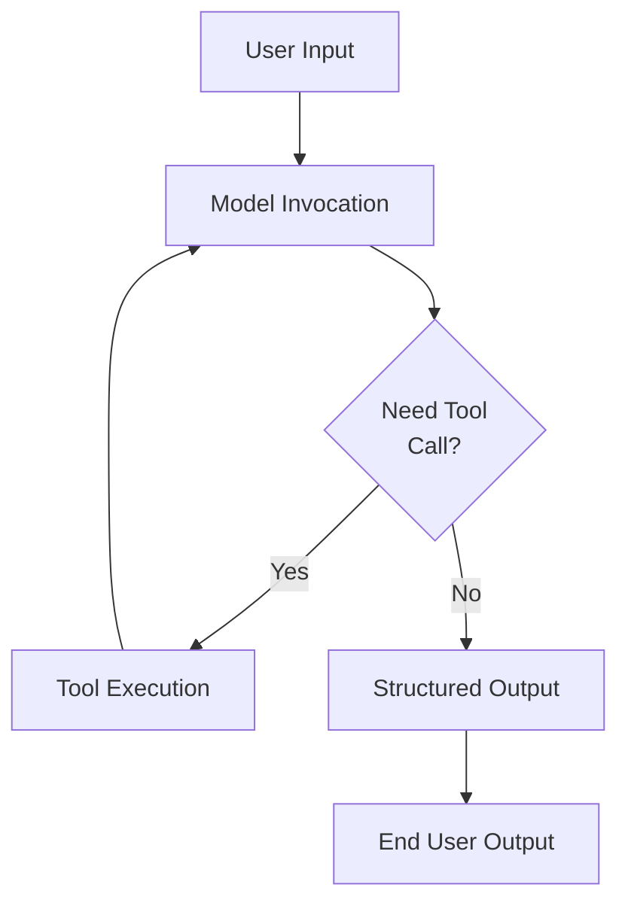
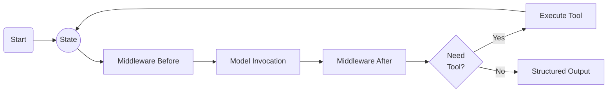
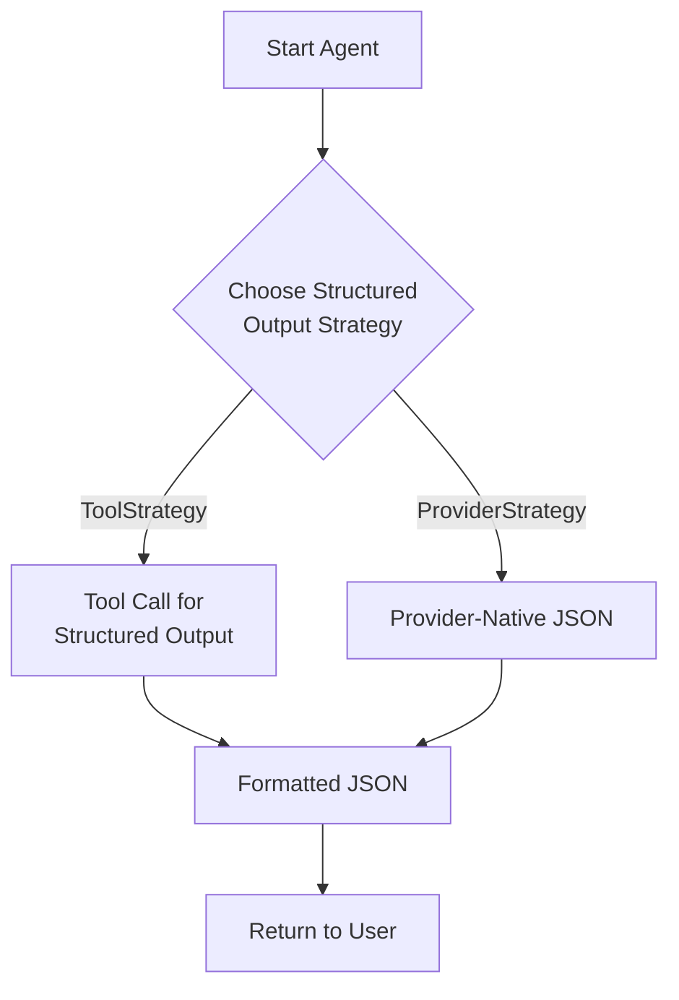

<LLMOnly
  data={`
type: tutorial
difficulty: intermediate
keyTakeaways:
  - Understand LangChain 1.0 architecture and key changes from 0.x
  - Build AI agents using the unified create_agent API
  - Implement structured output strategies with LangGraph
prerequisites: Python programming, basic LLM concepts, familiarity with API usage
targetAudience: AI engineers and developers building LLM-powered applications
`}
/>

The release of **LangChain 1.0** marks a significant milestone in the ecosystem of LLM frameworks. As the adoption of AI agents moves from experimental prototypes to production-grade systems, stability and maintainability have become paramount. LangChain 1.0 addresses these needs with a commitment to long-term stability, a refined architecture, and a streamlined API surface.

This guide provides a technical deep dive into:

- The core architectural concepts of **LangChain 1.0**
- A detailed diff of changes from the 0.x versions
- Flow charts illustrating the new execution lifecycle
- Production-ready implementation examples

## Architecture Overview

LangChain serves as the connectivity layer between Large Language Models (LLMs) and external compute or data resources. It abstracts the complexity of:

- **Agentic Workflows**: Autonomous decision-making loops
- **Tool Execution**: Deterministic interaction with external APIs
- **State Management**: Persistence of context across multi-turn interactions
- **Structured Extraction**: Parsing unstructured model outputs into typed schemas

By providing standardized interfaces for these components, LangChain enables developers to build scalable systems rather than ad-hoc scripts.

## Key Architectural Changes

Pre-1.0 versions of LangChain were characterized by rapid experimentation, resulting in a proliferation of agent constructors and overlapping abstractions. While flexible, this created technical debt for production systems.

LangChain 1.0 introduces strict standardization:

- **Stable Core API**: Adherence to semantic versioning ensures that minor updates do not introduce breaking changes.
- **Unified Agent Constructor**: The `create_agent` factory replaces disparate constructors, unifying the initialization logic.
- **Native Structured Output**: Output parsing is integrated into the primary execution loop, reducing latency and token costs.
- **Modular Packaging**: Legacy and experimental features have been migrated to `langchain-classic`, ensuring a lean core library.

## Agent Execution Lifecycle

The following diagram visualizes the control flow of a LangChain 1.0 agent. Note the explicit feedback loop for tool execution and the integrated structured output generation.



**Execution Flow:**

1.  **Input Processing**: The agent receives structured or unstructured user input.
2.  **Reasoning**: The model evaluates the context and determines the next action (tool invocation or response).
3.  **Tool Execution**: If a tool call is generated, the agent invokes the tool and feeds the result back into the context.
4.  **Structured Output**: The final response is emitted as a typed object (JSON/Pydantic) rather than raw text.

This deterministic loop replaces the heuristic-based parsing common in earlier versions.

## Unified Agent API

In version 1.0, agent instantiation is normalized through a single factory method. This ensures consistency across Python and JavaScript runtimes.

```python filename=agent.py
from langchain.agents import create_agent

agent = create_agent(
    model="gpt-4o",
    tools=[search_tool, calculator_tool],
    system_prompt="You are an intelligent assistant for cybersecurity insights."
)

response = agent.invoke({
    "messages": [{"role": "user", "content": "Analyze these log entries."}]
})
print(response)
```

This approach deprecates specific factories like `create_react_agent`, simplifying the mental model for developers.

## Usage of LangGraph

Under the hood, LangChain 1.0 delegates orchestration to **LangGraph**. This graph-based runtime provides superior capabilities for state management and cyclic execution, which are essential for complex agentic behaviors.



**Components:**

- **State Node**: Immutable state container for the current execution context.
- **Middleware**: Interceptors for pre/post-processing logic (e.g., PI scrubbing, logging).
- **Control Flow**: Conditional edges that determine whether to loop (tool use) or terminate (final answer).

## Native Structured Output

Obtaining structured data from LLMs previously required complex prompt engineering or post-hoc parsing. LangChain 1.0 treats structured output as a first-class citizen.

The framework supports two implementation strategies:

1.  **ToolStrategy**: Leveraging the model's precise tool-calling capability to format outputs.
2.  **ProviderStrategy**: Utilizing provider-native JSON modes (e.g., OpenAI JSON mode).

Both methods reduce the overhead of corrective re-prompting.



## Version Comparison: 0.x vs 1.0

| Feature              | LangChain 0.x (Legacy)                                 | LangChain 1.0 (Stable)                                            |
| :------------------- | :----------------------------------------------------- | :---------------------------------------------------------------- |
| **Agent API**        | Fragmented constructors (`create_react_agent`, etc.)   | **Unified `create_agent` API** simplifying instantiation.         |
| **Output Parsing**   | External to the execution loop; often heuristic-based. | **Integrated Structured Output** reducing latency and errors.     |
| **Message Protocol** | Variable formats across providers.                     | **Standardized `content_blocks`** for text, tools, and reasoning. |
| **Middleware**       | Ad-hoc wrappers.                                       | **First-class Middleware** for lifecycle hooks.                   |
| **Architecture**     | Chain-based.                                           | **Graph-based (LangGraph)** for cyclic and stateful workflows.    |
| **Stability**        | Rapid, breaking changes.                               | **LTS & Semantic Versioning** for production assurance.           |

## Migration Strategy

Upgrading from 0.x to 1.0 follows a defined path:

<Steps>

<Step>Refactor Instantiation</Step>

Replace legacy agent constructors with `create_agent`.

<Step>Update Output Logic</Step>

Migrate from prompt-based parsing to `response_format` schemas.

<Step>Implement Middleware</Step>

Move pre/post hooks to the new middleware layer.

<Step>Cleanup Dependencies</Step>

Remove unused legacy modules or import from `langchain-classic`.

</Steps>

## Production Implications

For engineering teams, the shift to LangChain 1.0 offers tangible benefits:

- **Reliability**: Stable APIs prevent CI/CD failures due to upstream package updates.
- **Performance**: Native structured output and optimized definitions reduce token usage and latency.
- **Maintainability**: A standardized codebase is easier to audit and extend.

## Conclusion

LangChain 1.0 represents the maturation of the AI engineering stack. By combining the flexibility of the 0.x era with the rigor required for enterprise software, it provides a solid foundation for building next-generation intelligent applications.
