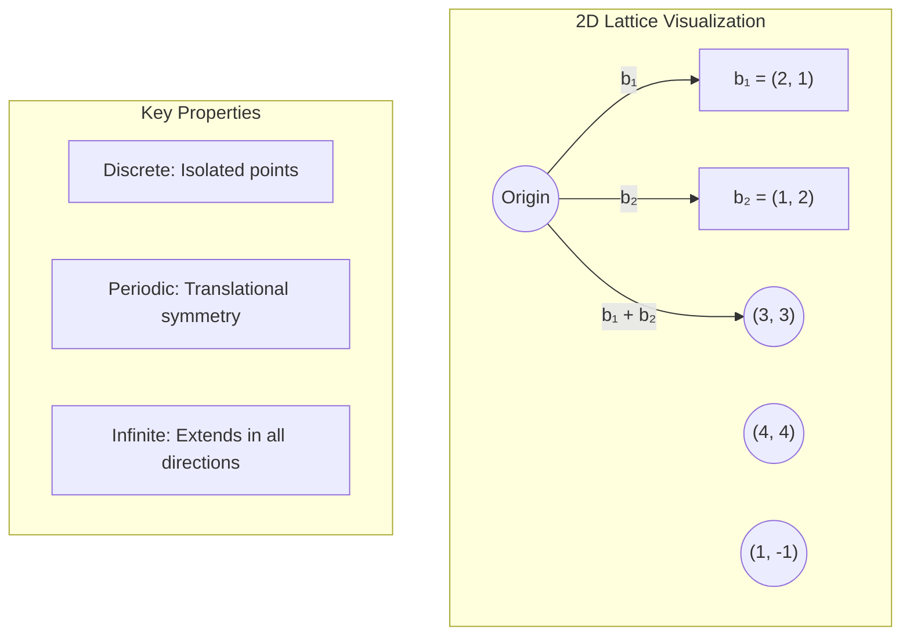
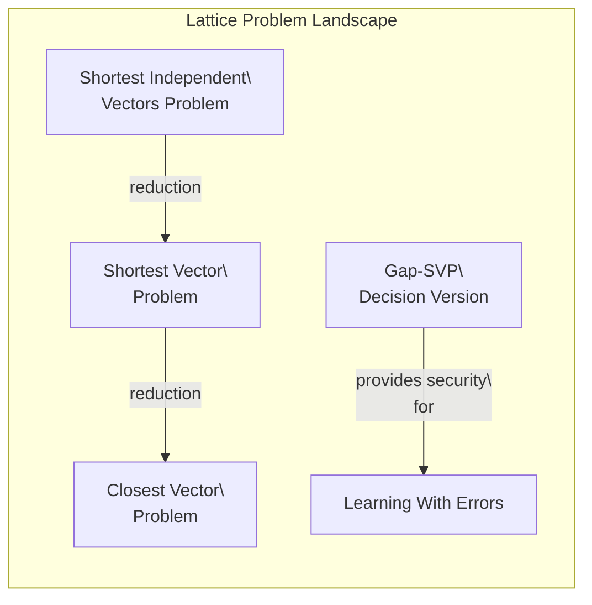
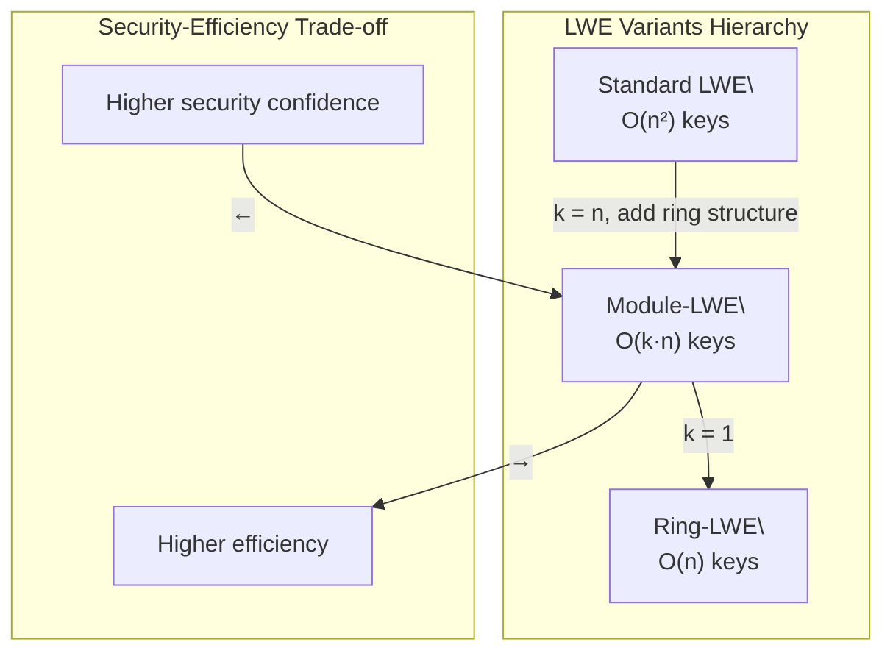
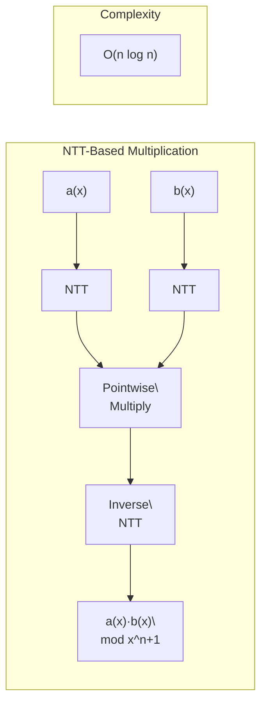

<LLMOnly
  data={`
type: deep-dive
difficulty: advanced
keyTakeaways:
  - Master the mathematical foundations of lattices and their computational problems (SVP, CVP, LWE)
  - Understand worst-case to average-case reductions and their cryptographic significance
  - Learn how Ring-LWE and Module-LWE enable efficient lattice-based cryptosystems
  - Comprehend the internal workings of ML-KEM (Kyber) and ML-DSA (Dilithium)
  - Analyze security proofs and parameter selection for lattice-based schemes
prerequisites: Linear algebra, probability theory, abstract algebra fundamentals, Part 1 of this series
targetAudience: Cryptography engineers, security researchers, and mathematically-inclined developers
`}
/>

<Callout variant="info" title="The Lattice Foundation" icon="grid-3x3">
  Lattice-based cryptography represents the most mature and widely deployed
  approach to post-quantum security. NIST's primary standardized algorithms,
  ML-KEM (FIPS 203) and ML-DSA (FIPS 204), are both built on the mathematical
  hardness of lattice problems, specifically the Module Learning With Errors
  (MLWE) problem.
</Callout>

In <EmbedBlog slug="quantum-threat-foundations" placeholder="Part 1" /> of this series, we established the quantum threat to classical cryptography: Shor's algorithm breaks RSA and ECC in polynomial time, while Grover's algorithm halves security margins for symmetric schemes. We identified that post-quantum security requires problems fundamentally different from factoring and discrete logarithms: problems without the periodic structure that quantum algorithms exploit.

Lattice problems provide exactly this. Unlike the algebraic structures underlying RSA (the multiplicative group modulo $n$) or ECC (elliptic curve point groups), lattices are geometric objects where the relevant hard problems, finding short vectors or solving noisy linear equations, have no known efficient quantum algorithms.

This article provides an exhaustive mathematical treatment of lattice-based cryptography, from the foundational geometry through the modern constructions standardized by NIST.

## The Geometry of Lattices

### Definition and Basic Properties

A **lattice** $\mathcal{L}$ is a discrete additive subgroup of $\mathbb{R}^n$. Equivalently, given a set of linearly independent vectors $\mathbf{B} = \{\mathbf{b}_1, \ldots, \mathbf{b}_m\}$ where $m \leq n$, the lattice generated by $\mathbf{B}$ is:

$$
\mathcal{L}(\mathbf{B}) = \left\{ \sum_{i=1}^{m} z_i \mathbf{b}_i : z_i \in \mathbb{Z} \right\}
$$

The vectors $\{\mathbf{b}_1, \ldots, \mathbf{b}_m\}$ form a **basis** of the lattice. When $m = n$, we call the lattice **full-rank**.

**Key observations**:

1. **Non-unique basis**: Every lattice has infinitely many bases. For any unimodular matrix $\mathbf{U}$ (integer matrix with determinant $\pm 1$), $\mathbf{B}' = \mathbf{BU}$ generates the same lattice.

2. **Fundamental parallelepiped**: The region $\mathcal{P}(\mathbf{B}) = \{\sum_{i} x_i \mathbf{b}_i : 0 \leq x_i < 1\}$ tiles $\mathbb{R}^n$ and has volume equal to $|\det(\mathbf{B})|$.

3. **Determinant invariance**: While bases vary, the **lattice determinant** $\det(\mathcal{L}) = |\det(\mathbf{B})|$ is invariant across all bases.

### Successive Minima and the Shortest Vector

For a lattice $\mathcal{L} \subset \mathbb{R}^n$, the **$i$-th successive minimum** $\lambda_i(\mathcal{L})$ is the smallest radius of a ball centered at the origin containing $i$ linearly independent lattice vectors:

$$
\lambda_i(\mathcal{L}) = \min\{r : \dim(\text{span}(\mathcal{L} \cap \mathcal{B}(r))) \geq i\}
$$

where $\mathcal{B}(r)$ is the ball of radius $r$.

The **first successive minimum** $\lambda_1(\mathcal{L})$ is the length of the shortest non-zero vector:

$$
\lambda_1(\mathcal{L}) = \min_{\mathbf{v} \in \mathcal{L} \setminus \{0\}} \|\mathbf{v}\|
$$

**Minkowski's Theorem** provides a fundamental bound:

$$
\lambda_1(\mathcal{L}) \leq \sqrt{n} \cdot (\det(\mathcal{L}))^{1/n}
$$

This bound is tight up to constants for "random" lattices, but finding a vector achieving this bound is computationally hard.

### The Gram-Schmidt Orthogonalization

Given a basis $\mathbf{B} = (\mathbf{b}_1, \ldots, \mathbf{b}_n)$, the **Gram-Schmidt orthogonalization** (GSO) produces orthogonal vectors $\tilde{\mathbf{b}}_i$:

$$
\tilde{\mathbf{b}}_i = \mathbf{b}_i - \sum_{j=1}^{i-1} \mu_{i,j} \tilde{\mathbf{b}}_j \quad \text{where} \quad \mu_{i,j} = \frac{\langle \mathbf{b}_i, \tilde{\mathbf{b}}_j \rangle}{\|\tilde{\mathbf{b}}_j\|^2}
$$

The GSO vectors do not form a lattice basis (they typically have non-integer coefficients), but they characterize basis quality:

- **Good basis**: GSO vectors have similar lengths
- **Bad basis**: GSO lengths decay rapidly (last vectors much shorter)

The quality of a basis directly impacts the difficulty of lattice problems: a more orthogonal basis makes finding short vectors easier.

---

## Computational Lattice Problems

### The Shortest Vector Problem (SVP)

**Exact SVP**: Given a basis $\mathbf{B}$ for lattice $\mathcal{L}$, find a non-zero vector $\mathbf{v} \in \mathcal{L}$ with $\|\mathbf{v}\| = \lambda_1(\mathcal{L})$.

**Approximate SVP ($\gamma$-SVP)**: Find a non-zero vector $\mathbf{v} \in \mathcal{L}$ with $\|\mathbf{v}\| \leq \gamma(n) \cdot \lambda_1(\mathcal{L})$ for approximation factor $\gamma(n) \geq 1$.

| Approximation Factor $\gamma(n)$ | Known Complexity                    | Relevance       |
| :------------------------------- | :---------------------------------- | :-------------- |
| $\gamma = 1$ (exact)             | NP-hard under randomized reductions | Theoretical     |
| $\gamma = \text{poly}(n)$        | No known polynomial algorithm       | Cryptographic   |
| $\gamma = 2^{n^{1/2}}$           | Polynomial time (LLL)               | Insufficient    |
| $\gamma = 2^{O(n)}$              | Exponential time (enumeration)      | Attack baseline |

<Callout variant="warning" title="The Approximation Gap" icon="alert-triangle">
  Cryptographic security relies on the **gap** between what's achievable in
  polynomial time (exponential approximation factors) and what's needed to break
  schemes (polynomial approximation factors). This gap appears robust against
  quantum algorithms.
</Callout>

### The Closest Vector Problem (CVP)

**Exact CVP**: Given a basis $\mathbf{B}$ for lattice $\mathcal{L}$ and a target vector $\mathbf{t} \in \mathbb{R}^n$, find the lattice vector $\mathbf{v} \in \mathcal{L}$ closest to $\mathbf{t}$:

$$
\mathbf{v} = \arg\min_{\mathbf{u} \in \mathcal{L}} \|\mathbf{t} - \mathbf{u}\|
$$

CVP and SVP are intimately related:

1. **CVP is at least as hard as SVP**: There's an efficient reduction from SVP to CVP
2. **SVP is a special case**: SVP asks for the closest vector to the origin, excluding the origin itself
3. **Both are NP-hard**: Under appropriate reductions for exact and approximate versions

### The Shortest Independent Vectors Problem (SIVP)

**$\gamma$-SIVP**: Given a basis for an $n$-dimensional lattice $\mathcal{L}$, find $n$ linearly independent lattice vectors $\mathbf{v}_1, \ldots, \mathbf{v}_n$ such that:

$$
\max_i \|\mathbf{v}_i\| \leq \gamma(n) \cdot \lambda_n(\mathcal{L})
$$

SIVP is crucial for security reductions: Ajtai's and Regev's reductions connect average-case cryptographic problems to worst-case SIVP.

---

## The Learning With Errors Problem

The **Learning With Errors (LWE)** problem, introduced by Oded Regev in 2005, is the cryptographic foundation of modern lattice-based schemes. It provides a clean, algebraic formulation with provable connections to worst-case lattice problems.

### Problem Definition

Let $n, q \in \mathbb{N}$ where $q$ is a modulus (typically prime), and let $\chi$ be an error distribution over $\mathbb{Z}$ (typically discrete Gaussian).

**Search-LWE**: Given polynomially many samples of the form:

$$
(\mathbf{a}_i, b_i = \langle \mathbf{a}_i, \mathbf{s} \rangle + e_i \mod q)
$$

where $\mathbf{a}_i \leftarrow \mathbb{Z}_q^n$ uniformly random, $\mathbf{s} \in \mathbb{Z}_q^n$ is a fixed secret, and $e_i \leftarrow \chi$ is a "small" error, find $\mathbf{s}$.

**Decision-LWE**: Distinguish LWE samples $(\mathbf{a}_i, \langle \mathbf{a}_i, \mathbf{s} \rangle + e_i)$ from uniform random pairs $(\mathbf{a}_i, u_i)$ where $u_i \leftarrow \mathbb{Z}_q$ uniformly.

### Matrix Formulation

In matrix form, LWE becomes: given

$$
(\mathbf{A}, \mathbf{b} = \mathbf{A}\mathbf{s} + \mathbf{e} \mod q)
$$

where $\mathbf{A} \in \mathbb{Z}_q^{m \times n}$, $\mathbf{s} \in \mathbb{Z}_q^n$, $\mathbf{e} \in \chi^m$, find $\mathbf{s}$ or distinguish from random.

This is essentially a system of $m$ linear equations in $n$ unknowns, but each equation is **perturbed by noise**:

$$
\begin{cases}
a_{1,1}s_1 + a_{1,2}s_2 + \cdots + a_{1,n}s_n + e_1 \equiv b_1 \pmod{q} \\
a_{2,1}s_1 + a_{2,2}s_2 + \cdots + a_{2,n}s_n + e_2 \equiv b_2 \pmod{q} \\
\vdots \\
a_{m,1}s_1 + a_{m,2}s_2 + \cdots + a_{m,n}s_n + e_m \equiv b_m \pmod{q}
\end{cases}
$$

Without the error terms $e_i$, Gaussian elimination would solve this in polynomial time. The errors, though small, render the system information-theoretically soluble but computationally intractable.

<Callout variant="info" title="Why LWE is Hard" icon="lock">
  The noise $\mathbf{e}$ prevents algebraic attacks (Gaussian elimination
  fails). The "small noise hiding in large modular reductions" creates
  computational hardness that resists known quantum algorithms. No quantum
  Fourier transform technique extracts the periodic structure needed for a
  Shor-like attack.
</Callout>

### Regev's Security Reduction

**Theorem (Regev 2005)**: For appropriate parameter choices, solving LWE on average is at least as hard as solving $\gamma$-SIVP in the **worst case** for $\gamma = \tilde{O}(n \cdot q / \sigma)$, where $\sigma$ is the Gaussian width.

This is a **quantum reduction**: an efficient LWE algorithm implies an efficient quantum algorithm for approximate SIVP. Peikert later provided a classical reduction from GapSVP to LWE.

The reduction works by showing that an LWE oracle can be used to iteratively sample from discrete Gaussian distributions on lattices, which in turn solves SIVP.

**Implications**:

- If $\gamma$-SIVP is hard (no efficient quantum algorithm known), then LWE is hard
- Breaking any LWE-based cryptosystem with suitable parameters would break a fundamental lattice problem
- This is _worst-case_ hardness: even the hardest SIVP instances are no harder than LWE

### Parameter Trade-offs

LWE security depends on the interplay of:

| Parameter   | Symbol   | Effect on Security          | Effect on Efficiency          |
| :---------- | :------- | :-------------------------- | :---------------------------- |
| Dimension   | $n$      | ↑ Higher → harder           | ↓ Larger keys/operations      |
| Modulus     | $q$      | ↓ Larger → easier attacks   | ↑ Larger values, more bits    |
| Error width | $\sigma$ | ↑ Larger → harder           | ↓ Less margin for correctness |
| Samples     | $m$      | Initially ↑, then saturates | ↓ More computation            |

The **error-to-modulus ratio** $\sigma/q$ is critical:

- Too small → not enough noise, algebraic attacks succeed
- Too large → decryption fails (errors overwhelm signal)
- Sweet spot → cryptographic security with high probability correctness

---

## Structured Lattices: Ring-LWE and Module-LWE

Standard LWE requires $O(n^2)$ storage for the public matrix $\mathbf{A}$ and $O(n^2)$ operations for matrix-vector products. For practical cryptosystems, this is prohibitive.

**Structured variants** exploit algebraic structure to achieve efficiency while (hopefully) preserving security.

### Ring-LWE

Ring-LWE works over the **polynomial ring** $R_q = \mathbb{Z}_q[x]/(f(x))$ where $f(x)$ is typically $x^n + 1$ with $n$ a power of 2.

**Elements**: Polynomials of degree $< n$ with coefficients in $\mathbb{Z}_q$:

$$
a(x) = a_0 + a_1 x + a_2 x^2 + \cdots + a_{n-1} x^{n-1}
$$

**Operations**: Addition is coefficient-wise. Multiplication is polynomial multiplication modulo $f(x)$.

**Ring-LWE Problem**: Given samples $(a_i(x), b_i(x) = a_i(x) \cdot s(x) + e_i(x))$, find $s(x)$ or distinguish from random.

**Advantages**:

- **Compact keys**: Public key is a single ring element, not an $n \times n$ matrix
- **Fast operations**: Polynomial multiplication can be done in $O(n \log n)$ using the Number Theoretic Transform (NTT)

**Security Considerations**:

Ring-LWE's security reduces to worst-case problems on **ideal lattices**, a special class of lattices with additional algebraic structure. There's ongoing debate about whether this structure could be exploited by specialized attacks.

### Module-LWE: The Best of Both Worlds

Module-LWE generalizes Ring-LWE by working with vectors and matrices of ring elements.

**Setup**: Let $R_q = \mathbb{Z}_q[x]/(x^n + 1)$. A Module-LWE instance uses:

- A public matrix $\mathbf{A} \in R_q^{k \times \ell}$
- A secret vector $\mathbf{s} \in R_q^\ell$
- An error vector $\mathbf{e} \in R_q^k$ with small coefficients

**Relation to other LWE variants**:

| Variant    | Matrix Size     | Ring Dimension | Total Dimension        |
| :--------- | :-------------- | :------------- | :--------------------- |
| Plain LWE  | $m \times n$    | 1              | $mn$                   |
| Ring-LWE   | $1 \times 1$    | $n$            | $n$                    |
| Module-LWE | $k \times \ell$ | $n$            | $k \cdot \ell \cdot n$ |

Module-LWE with rank $k = \ell$ provides a tunable security-efficiency trade-off:

- $k = 1$: Equivalent to Ring-LWE (most efficient, potentially more structure to exploit)
- $k = n$: Approaches plain LWE (less efficient, fewer structural concerns)
- $k = 2, 3, 4$: Practical middle ground (used by Kyber/Dilithium)

<Callout
  variant="success"
  title="Why NIST Chose Module-LWE"
  icon="check-circle"
>
  Module-LWE offers a Goldilocks balance: efficient enough for practical
  deployment (keys in kilobytes, not megabytes), with security based on problems
  with less exploitable structure than Ring-LWE, yet still benefiting from
  algebraic efficiency gains.
</Callout>

---

## Worst-Case to Average-Case Reductions

The crown jewel of lattice-based cryptography is its security proofs: breaking a cryptographic scheme implies breaking a worst-case lattice problem.

### Ajtai's Breakthrough (1996)

Miklós Ajtai proved the first such reduction for the **Short Integer Solution (SIS)** problem.

**SIS Problem**: Given a random matrix $\mathbf{A} \in \mathbb{Z}_q^{n \times m}$, find a short non-zero vector $\mathbf{z} \in \mathbb{Z}^m$ such that:

$$
\mathbf{A}\mathbf{z} = \mathbf{0} \mod q \quad \text{with} \quad \|\mathbf{z}\| \leq \beta
$$

**Theorem (Ajtai 1996)**: Solving average-case SIS with $m = \text{poly}(n)$ columns implies solving worst-case $\gamma$-SIVP for $\gamma = \tilde{O}(\beta \sqrt{n})$.

This means:

- If any random $\mathbf{A}$ can be efficiently attacked, worst-case SIVP can be solved
- Security of SIS-based hash functions rests on foundational lattice hardness

### Regev's Reduction for LWE (2005)

Regev extended Ajtai's approach to LWE via a more intricate quantum reduction.

**High-level idea**:

1. Start with a $\gamma$-SIVP instance (a lattice where we want short independent vectors)
2. Use quantum sampling to generate points from the lattice's "smoothed" distribution
3. Transform these samples into LWE samples
4. Use the LWE oracle to recover information about the lattice
5. Iterate to find progressively shorter vectors, solving SIVP

**Key insight**: Discrete Gaussian distributions on lattices have beautiful mathematical properties. Sampling from them (which quantum computers can help with) provides information about short lattice vectors.

### Classical Reduction via Peikert

Peikert (2009) showed a **classical** reduction from GapSVP to LWE, removing the quantum requirement but with somewhat worse parameters.

**GapSVP$_\gamma$**: Given a basis, determine whether $\lambda_1 \leq 1$ or $\lambda_1 > \gamma$ (promised one holds).

**Theorem (Peikert 2009)**: For $q \geq 2\sqrt{n} \cdot \sigma$, solving decision LWE classically implies solving GapSVP$_{\tilde{O}(n \cdot q/\sigma)}$ classically.

### What the Reductions Mean

These reductions provide fundamentally different security guarantees than pre-quantum cryptography:

| Cryptosystem | Security Basis | Type of Hardness                    |
| :----------- | :------------- | :---------------------------------- |
| RSA          | Factoring      | Average-case only (random moduli)   |
| ECC          | ECDLP          | Average-case only (random curves)   |
| LWE-based    | SVP/SIVP       | Worst-case → average-case reduction |

If someone breaks an LWE-based scheme, they've solved a problem that the entire mathematical community believes is fundamentally hard. This is a qualitatively stronger security foundation.

---

## The Number Theoretic Transform

Efficient lattice cryptography relies on fast polynomial multiplication. The **Number Theoretic Transform (NTT)** is the modular arithmetic analog of the Fast Fourier Transform.

### From FFT to NTT

The FFT computes the Discrete Fourier Transform using complex roots of unity. The NTT uses roots of unity in a finite field $\mathbb{Z}_q$.

**Requirement**: $q$ must be a prime with $2n \mid (q - 1)$, ensuring primitive $2n$-th roots of unity exist in $\mathbb{Z}_q$.

For Kyber, $q = 3329 = 1 + 2^8 \cdot 13$, so primitive $256$-th roots of unity exist.

### NTT Definition

Let $\omega \in \mathbb{Z}_q$ be a primitive $n$-th root of unity ($\omega^n \equiv 1 \mod q$, but $\omega^k \not\equiv 1$ for $0 < k < n$).

The NTT of a polynomial $a(x) = \sum_{i=0}^{n-1} a_i x^i$ is:

$$
\text{NTT}(a)_j = \sum_{i=0}^{n-1} a_i \omega^{ij} \mod q
$$

The inverse NTT recovers the original coefficients:

$$
a_i = n^{-1} \sum_{j=0}^{n-1} \hat{a}_j \omega^{-ij} \mod q
$$

where $n^{-1}$ is the modular inverse of $n$.

### NTT-Based Polynomial Multiplication

To multiply polynomials $a(x) \cdot b(x) \mod (x^n + 1)$:

1. **Forward NTT**: Compute $\hat{a} = \text{NTT}(a)$ and $\hat{b} = \text{NTT}(b)$
2. **Pointwise multiplication**: $\hat{c}_i = \hat{a}_i \cdot \hat{b}_i \mod q$
3. **Inverse NTT**: $c = \text{NTT}^{-1}(\hat{c})$

**Complexity**:

- Naive polynomial multiplication: $O(n^2)$
- NTT-based multiplication: $O(n \log n)$

For $n = 256$ (Kyber's ring dimension), this is a 50x speedup.

### NTT Domain Representation

Kyber and Dilithium store polynomials in **NTT domain** whenever possible:

- Key generation produces NTT-domain keys
- Encryption/signing work in NTT domain
- Only convert back for operations requiring coefficient access

This optimization eliminates redundant NTT/inverse-NTT pairs.

---

## ML-KEM (CRYSTALS-Kyber): In-Depth

ML-KEM (Module-Lattice Key Encapsulation Mechanism), standardized as FIPS 203, is the primary post-quantum key encapsulation mechanism. We now examine its cryptographic construction in detail.

### The IND-CPA Encryption Scheme

At its core, ML-KEM builds on an IND-CPA (indistinguishable under chosen-plaintext attack) public-key encryption scheme.

#### Key Generation

1. Generate random matrix $\mathbf{A} \in R_q^{k \times k}$ (derived deterministically from a seed for compactness)
2. Sample secret $\mathbf{s} \in R_q^k$ and error $\mathbf{e} \in R_q^k$ with small coefficients
3. Compute $\mathbf{t} = \mathbf{A}\mathbf{s} + \mathbf{e} \in R_q^k$

**Public key**: $(\mathbf{A}, \mathbf{t})$ — in practice, $\mathbf{A}$ is a seed, $\mathbf{t}$ is explicit

**Secret key**: $\mathbf{s}$

#### Encryption

To encrypt message $m \in \{0, 1\}^{256}$:

1. Sample ephemeral secret $\mathbf{r} \in R_q^k$ and errors $\mathbf{e}_1 \in R_q^k$, $e_2 \in R_q$ with small coefficients
2. Compute:
   $$
   \mathbf{u} = \mathbf{A}^T \mathbf{r} + \mathbf{e}_1
   $$
   $$
   v = \mathbf{t}^T \mathbf{r} + e_2 + \lceil q/2 \rfloor \cdot m
   $$

**Ciphertext**: $(\mathbf{u}, v)$

The message $m$ is encoded by scaling: each bit becomes either $0$ or $\approx q/2$ in the ciphertext.

#### Decryption

To decrypt $(\mathbf{u}, v)$:

1. Compute $v - \mathbf{s}^T \mathbf{u}$
2. For each coefficient, check if it's closer to $0$ or $\lceil q/2 \rfloor$
3. Output corresponding bit

**Why it works**:

$$
v - \mathbf{s}^T \mathbf{u} = (\mathbf{t}^T \mathbf{r} + e_2 + \lceil q/2 \rfloor \cdot m) - \mathbf{s}^T (\mathbf{A}^T \mathbf{r} + \mathbf{e}_1)
$$

Substituting $\mathbf{t} = \mathbf{A}\mathbf{s} + \mathbf{e}$:

$$
= (\mathbf{s}^T \mathbf{A}^T + \mathbf{e}^T) \mathbf{r} + e_2 + \lceil q/2 \rfloor \cdot m - \mathbf{s}^T \mathbf{A}^T \mathbf{r} - \mathbf{s}^T \mathbf{e}_1
$$

$$
= \mathbf{e}^T \mathbf{r} + e_2 - \mathbf{s}^T \mathbf{e}_1 + \lceil q/2 \rfloor \cdot m
$$

The error terms $\mathbf{e}^T \mathbf{r} + e_2 - \mathbf{s}^T \mathbf{e}_1$ are small (bounded by parameters). The message term $\lceil q/2 \rfloor \cdot m$ dominates, allowing correct recovery.

### The Fujisaki-Okamoto Transform

The IND-CPA scheme above is vulnerable to chosen-ciphertext attacks. The **Fujisaki-Okamoto (FO) transform** upgrades it to IND-CCA2 security.

**Encapsulation**:

1. Generate random message $m \leftarrow \{0, 1\}^{256}$
2. Derive randomness $r = G(m, \text{pk})$ for encryption
3. Compute ciphertext $c = \text{Enc}_{\text{pk}}(m; r)$
4. Compute shared secret $K = H(m, c)$

**Decapsulation**:

1. Decrypt $m' = \text{Dec}_{\text{sk}}(c)$
2. **Re-encrypt** to get $c' = \text{Enc}_{\text{pk}}(m'; G(m', \text{pk}))$
3. **Verify**: If $c = c'$, return $K = H(m', c)$; otherwise return random

The re-encryption check is crucial: it defeats attacks that submit malformed ciphertexts to extract information about the secret key.

### ML-KEM Parameter Sets

| Parameter             | ML-KEM-512 | ML-KEM-768 | ML-KEM-1024 |
| :-------------------- | :--------- | :--------- | :---------- |
| NIST Level            | 1          | 3          | 5           |
| Module rank $k$       | 2          | 3          | 4           |
| Ring dimension $n$    | 256        | 256        | 256         |
| Modulus $q$           | 3329       | 3329       | 3329        |
| Public key (bytes)    | 800        | 1,184      | 1,568       |
| Ciphertext (bytes)    | 768        | 1,088      | 1,568       |
| Shared secret (bytes) | 32         | 32         | 32          |

<Callout variant="info" title="Parameter Selection Philosophy" icon="sliders">
  NIST security levels correspond to specific attack costs: Level 1 ≈ AES-128,
  Level 3 ≈ AES-192, Level 5 ≈ AES-256. The module rank $k$ increases with
  security level, scaling the underlying lattice dimension from $512$ to $768$
  to $1024$.
</Callout>

---

## ML-DSA (CRYSTALS-Dilithium): In-Depth

ML-DSA (Module-Lattice Digital Signature Algorithm), standardized as FIPS 204, provides post-quantum digital signatures. It uses a fundamentally different construction from ML-KEM.

### The Fiat-Shamir with Aborts Paradigm

Dilithium is based on the **Fiat-Shamir transform** applied to an identification scheme, with a crucial modification: **rejection sampling**.

**Basic Fiat-Shamir intuition**:

1. Prover commits to a random value
2. Verifier sends a challenge
3. Prover responds, proving knowledge without revealing secret
4. To sign, the "challenge" becomes a hash of the message

**The problem**: In lattice-based schemes, the response directly depends on the secret key. Repeated signatures could leak information.

**Solution**: Rejection sampling. The signer checks if the response would leak information; if so, they restart with fresh randomness.

### Dilithium Construction

#### Key Generation

1. Sample random matrix $\mathbf{A} \in R_q^{k \times \ell}$ (from a seed)
2. Sample secret vectors $\mathbf{s}_1 \in R_q^\ell$ and $\mathbf{s}_2 \in R_q^k$ with "small" coefficients
3. Compute $\mathbf{t} = \mathbf{A}\mathbf{s}_1 + \mathbf{s}_2$

**Public key**: $(\mathbf{A}, \mathbf{t})$ (or seed + $\mathbf{t}$)

**Secret key**: $(\mathbf{s}_1, \mathbf{s}_2)$

#### Signing

To sign message $M$:

1. Sample random "masking" polynomial $\mathbf{y} \leftarrow R_q^\ell$ with coefficients in $[-\gamma_1 + 1, \gamma_1]$
2. Compute $\mathbf{w} = \mathbf{A}\mathbf{y}$
3. Compute challenge $c = H(\text{HighBits}(\mathbf{w}), M)$ where $c$ is a polynomial with few non-zero coefficients
4. Compute response $\mathbf{z} = \mathbf{y} + c \cdot \mathbf{s}_1$
5. **Rejection check**: If $\mathbf{z}$ has any coefficient $\geq \gamma_1 - \beta$ or if $\text{LowBits}(\mathbf{A}\mathbf{z} - c\mathbf{t})$ is too large, **restart from step 1**
6. Output signature $(\mathbf{z}, c, \text{hint})$

**Signature**: $\sigma = (\mathbf{z}, c, h)$ where $h$ is a "hint" for efficient verification

#### Verification

To verify $(M, \sigma)$ with public key $(\mathbf{A}, \mathbf{t})$:

1. Recover $\mathbf{w}' = \mathbf{A}\mathbf{z} - c\mathbf{t}$ (approximately, using hint $h$)
2. Check $c \stackrel{?}{=} H(\text{HighBits}(\mathbf{w}', h), M)$
3. Check that $\mathbf{z}$ has coefficients in the expected range

### The Rejection Sampling Analysis

The rejection step ensures that the distribution of $\mathbf{z}$ is **statistically independent** of the secret $\mathbf{s}_1$.

Without rejection, $\mathbf{z} = \mathbf{y} + c \cdot \mathbf{s}_1$ correlates with $\mathbf{s}_1$. After many signatures, an adversary could extract $\mathbf{s}_1$.

With rejection sampling: only $\mathbf{z}$ values that could have come from many different secrets are output. The distribution is "masked" by the large random value $\mathbf{y}$.

**Expected number of attempts**: Approximately $e \approx 2.7$ rejections per signature. This is the cost of provable security.

### ML-DSA Parameter Sets

| Parameter          | ML-DSA-44 | ML-DSA-65 | ML-DSA-87 |
| :----------------- | :-------- | :-------- | :-------- |
| NIST Level         | 2         | 3         | 5         |
| Matrix dimensions  | 4 × 4     | 6 × 5     | 8 × 7     |
| Public key (bytes) | 1,312     | 1,952     | 2,592     |
| Signature (bytes)  | 2,420     | 3,293     | 4,595     |
| Ring dimension     | 256       | 256       | 256       |
| Modulus $q$        | 8,380,417 | 8,380,417 | 8,380,417 |

Note the larger modulus ($q \approx 2^{23}$) compared to Kyber ($q = 3329$). This reflects the different algebraic requirements of signatures vs. encryption.

---

## Lattice Basis Reduction Algorithms

Understanding the attacker's tools is essential for security analysis. Lattice reduction algorithms attempt to find short vectors and are the primary attack vector against lattice cryptography.

### The LLL Algorithm

The Lenstra-Lenstra-Lovász (LLL) algorithm (1982) is the first polynomial-time lattice reduction algorithm.

**Definition**: A basis $\mathbf{B} = (\mathbf{b}_1, \ldots, \mathbf{b}_n)$ is **LLL-reduced** with parameter $\delta \in (1/4, 1)$ if:

1. **Size condition**: $|\mu_{i,j}| \leq 1/2$ for all $i > j$
2. **Lovász condition**: $\delta \|\tilde{\mathbf{b}}_{i-1}\|^2 \leq \|\tilde{\mathbf{b}}_i\|^2 + \mu_{i,i-1}^2 \|\tilde{\mathbf{b}}_{i-1}\|^2$

**Output guarantee**: The shortest vector in an LLL-reduced basis satisfies:

$$
\|\mathbf{b}_1\| \leq 2^{(n-1)/2} \cdot \lambda_1(\mathcal{L})
$$

This is an **exponential approximation** to SVP: good for low dimensions, useless for high dimensions.

**Complexity**: $O(n^5 \log^3 B)$ where $B$ is a bound on input basis norms. Polynomial in dimension.

### The BKZ Algorithm

Block Korkine-Zolotarev (BKZ) improves on LLL by solving SVP in projected sublattices of block size $\beta$.

**Algorithm outline**:

1. Apply LLL to get an initial reduced basis
2. For each block of $\beta$ consecutive vectors, solve (approximate) SVP in the projected sublattice
3. Insert the found short vector, re-reduce, and repeat
4. Continue until no improvement

**Output quality**: With block size $\beta$, BKZ finds a vector with:

$$
\|\mathbf{b}_1\| \lesssim \gamma_\beta^{n/\beta} \cdot (\det \mathcal{L})^{1/n}
$$

where $\gamma_\beta \approx \beta / (2\pi e)$ is the Hermite factor.

**Example security implications**:

| Block Size $\beta$ | Approximate Factor | Time Complexity | Security Impact       |
| :----------------- | :----------------- | :-------------- | :-------------------- |
| 2                  | Exponential        | Polynomial      | None                  |
| 20                 | $\approx 1.01^n$   | Hours-days      | Low dimensions broken |
| 50                 | $\approx 1.005^n$  | Months-years    | Medium security       |
| 300+               | $\approx 1.001^n$  | Infeasible      | Target for PQC        |

<Callout variant="warning" title="The Core Estimate" icon="calculator">
  Security analysis for NIST PQC uses the "Core-SVP" model: the cost to break a scheme is estimated as $2^{0.292\beta}$ operations for BKZ with block size $\beta$ needed to recover short vectors. Parameters are chosen so this cost exceeds $2^{128}$ (Level 1) or $2^{256}$ (Level 5).
</Callout>

### Known Attack Strategies

**Primal attack**: Construct a lattice where the LWE secret/error is a short vector. Use BKZ to find it.

**Dual attack**: Construct a short vector in the dual lattice, use it to distinguish LWE from random.

**Hybrid attack**: Guess part of the secret (reduces dimension), use lattice reduction on the rest.

All known attacks are exponential in the lattice dimension. No quantum algorithm provides more than polynomial speedup for lattice problems.

---

## Security Analysis and Parameter Selection

### Security Estimation

The security of ML-KEM and ML-DSA parameters is estimated via:

1. **Core-SVP model**: Estimate BKZ block size $\beta$ needed
2. **Gate count**: Translate to classical/quantum gate operations
3. **Comparison to AES**: Match to corresponding NIST security levels

**Current estimates** (approximate classical/quantum bit security):

| Scheme      | Classical Security | Quantum Security |
| :---------- | :----------------- | :--------------- |
| ML-KEM-512  | 118 bits           | ~107 bits        |
| ML-KEM-768  | 183 bits           | ~164 bits        |
| ML-KEM-1024 | 256 bits           | ~230 bits        |
| ML-DSA-44   | 128 bits           | ~115 bits        |
| ML-DSA-65   | 192 bits           | ~172 bits        |
| ML-DSA-87   | 256 bits           | ~230 bits        |

These estimates assume the best known algorithms. A breakthrough in lattice reduction could change the picture.

### Conservative vs. Aggressive Parameters

**Conservative approach** (recommended):

- Use ML-KEM-768/1024 and ML-DSA-65/87 for systems requiring decades of security
- Accounts for potential algorithmic advances
- Larger keys/signatures, but manageable

**Aggressive approach** (performance-critical systems):

- ML-KEM-512 and ML-DSA-44 for current security needs
- May require algorithm agility for future updates
- Smaller overhead

### Side-Channel Considerations

Lattice schemes have specific side-channel vulnerabilities:

1. **Timing attacks**: NTT operations, rejection sampling timing can leak information
2. **Power analysis**: Polynomial operations have distinguishable power traces
3. **Fault attacks**: Corrupting intermediate values can reveal secrets

**Mitigations**:

- Constant-time implementations (no secret-dependent branches)
- Masking: split sensitive values into random shares
- Careful randomness generation

NIST standards include guidance on side-channel resistant implementation.

---

## The Falcon Signature Scheme

While ML-DSA is NIST's primary lattice-based signature, **Falcon** offers an alternative with smaller signatures.

### NTRU Lattices

Falcon builds on NTRU-type lattices:

$$
\mathcal{L} = \{(\mathbf{g}, \mathbf{f}) \in R^2 : \mathbf{g} = h \cdot \mathbf{f} \mod q\}
$$

where $h$ is a public polynomial and $(f, g)$ is a secret key with short coefficients.

### GPV Framework

Falcon implements the Gentry-Peikert-Vaikuntanathan (GPV) hash-and-sign paradigm:

1. Hash the message to a target point $\mathbf{t}$
2. Use a "trapdoor" (the secret key) to sample a short preimage $\mathbf{s}$ with $A\mathbf{s} = \mathbf{t}$

The trapdoor enables Gaussian sampling from the lattice solution space.

### Fast Fourier Sampling

Falcon's efficiency comes from its sampling algorithm:

1. Represent the lattice basis in FFT form
2. Sample Gaussian values using tree-structured computation
3. Convert back to get signature polynomials

This achieves $O(n \log n)$ signature generation with minimal signature size.

### Comparison with ML-DSA

| Property                  | ML-DSA-65 | Falcon-512 |
| :------------------------ | :-------- | :--------- |
| NIST Level                | 3         | 1          |
| Public key (bytes)        | 1,952     | 897        |
| Signature (bytes)         | 3,293     | 666        |
| Sign speed                | Very fast | Fast       |
| Verify speed              | Very fast | Fast       |
| Implementation complexity | Lower     | Higher     |

Falcon's smaller signatures come at the cost of more complex implementation, particularly the Gaussian sampler which must avoid side channels.

---

## Conclusion and Series Overview

In this second part, we've provided a comprehensive treatment of lattice-based cryptography:

- **Lattice geometry**: Bases, successive minima, Gram-Schmidt, and the structure of lattice problems
- **Computational problems**: SVP, CVP, SIVP, and their approximation variants
- **Learning With Errors**: The algebraic foundation with worst-case security reductions
- **Structured lattices**: Ring-LWE and Module-LWE for practical efficiency
- **NIST standards**: Deep dives into ML-KEM (Kyber) and ML-DSA (Dilithium) constructions
- **Security analysis**: Lattice reduction, parameter selection, and attack cost estimation

### Coming in Part 3: Alternative Mathematical Frameworks

The final part of this series explores non-lattice approaches to post-quantum cryptography:

- **Hash-based signatures** (SLH-DSA/SPHINCS+): Security from Merkle trees and hash functions only
- **Code-based cryptography** (Classic McEliece): Goppa codes and syndrome decoding
- **Isogeny-based cryptography**: Supersingular elliptic curves and the SIKE mathematical attack
- **Multivariate cryptography**: System of polynomial equations and the MQ problem

<Callout variant="success" title="Key Takeaway" icon="lightbulb">
  Lattice-based cryptography achieves the gold standard of cryptographic
  security proofs: breaking practical schemes implies solving problems that
  mathematicians have studied for decades with no efficient algorithms found.
  The Module-LWE foundation of ML-KEM and ML-DSA combines theoretical soundness
  with practical efficiency, which is why these are NIST's primary standardized
  algorithms.
</Callout>

---

## References and Further Reading

### Foundational Papers

- Regev, O. (2005). "On Lattices, Learning with Errors, Random Linear Codes, and Cryptography" — The LWE paper
- Ajtai, M. (1996). "Generating Hard Instances of Lattice Problems" — First worst-case to average-case reduction
- Lyubashevsky, V., Peikert, C., Regev, O. (2010). "On Ideal Lattices and Learning with Errors over Rings" — Ring-LWE
- Peikert, C. (2009). "Public-Key Cryptosystems from the Worst-Case Shortest Vector Problem" — Classical LWE reduction

### NIST Standards and Reports

- FIPS 203 (2024). "Module-Lattice-Based Key-Encapsulation Mechanism Standard" (ML-KEM)
- FIPS 204 (2024). "Module-Lattice-Based Digital Signature Standard" (ML-DSA)
- NIST IR 8413 (2022). "Status Report on the Third Round of the NIST Post-Quantum Cryptography Standardization Process"
- NIST IR 8545 (2024). "Status Report on the Fourth Round"

### Surveys and Textbooks

- Micciancio, D. & Regev, O. (2008). "Lattice-based Cryptography" — Comprehensive survey
- Peikert, C. (2016). "A Decade of Lattice Cryptography" — Modern developments
- Galbraith, S.D. (2012). "Mathematics of Public Key Cryptography" — Textbook with lattice chapters

### Implementation Resources

- CRYSTALS-Kyber specification: [pq-crystals.org/kyber](https://pq-crystals.org/kyber)
- CRYSTALS-Dilithium specification: [pq-crystals.org/dilithium](https://pq-crystals.org/dilithium)
- Falcon specification: [falcon-sign.info](https://falcon-sign.info)

---

## Appendix: Mathematical Reference

### Key Inequalities

**Minkowski's bound** on shortest vector:

$$
\lambda_1(\mathcal{L}) \leq \sqrt{n} \cdot (\det \mathcal{L})^{1/n}
$$

**Hermite's constant** (asymptotic):

$$
\gamma_n \approx \frac{n}{2\pi e} \quad \text{(as } n \to \infty \text{)}
$$

**LWE noise bound** for correctness (simplified):

$$
\|e\|_\infty < \frac{q}{4} \implies \text{decryption succeeds with high probability}
$$

### Polynomial Ring Arithmetic

For $R_q = \mathbb{Z}_q[x]/(x^n + 1)$:

- **Addition**: Coefficient-wise mod $q$
- **Multiplication**: Polynomial product mod $x^n + 1$ and mod $q$
- **Reduction by $x^n + 1$**: Since $x^n \equiv -1$, terms $x^{n+k}$ become $-x^k$

### Discrete Gaussian Distribution

The discrete Gaussian over $\mathbb{Z}$ with width $\sigma$:

$$
D_{\mathbb{Z}, \sigma}(x) \propto e^{-\pi x^2 / \sigma^2}
$$

Samples concentrate near zero with standard deviation $\approx \sigma / \sqrt{2\pi}$.

### Complexity Summary

| Operation                         | Complexity               | Used In             |
| :-------------------------------- | :----------------------- | :------------------ |
| Matrix-vector multiply (standard) | $O(n^2)$                 | Plain LWE           |
| NTT-based polynomial multiply     | $O(n \log n)$            | Ring/Module-LWE     |
| LLL reduction                     | $O(n^5 \log^3 B)$        | Attack foundation   |
| BKZ with block size $\beta$       | $\approx 2^{0.292\beta}$ | Security estimation |
