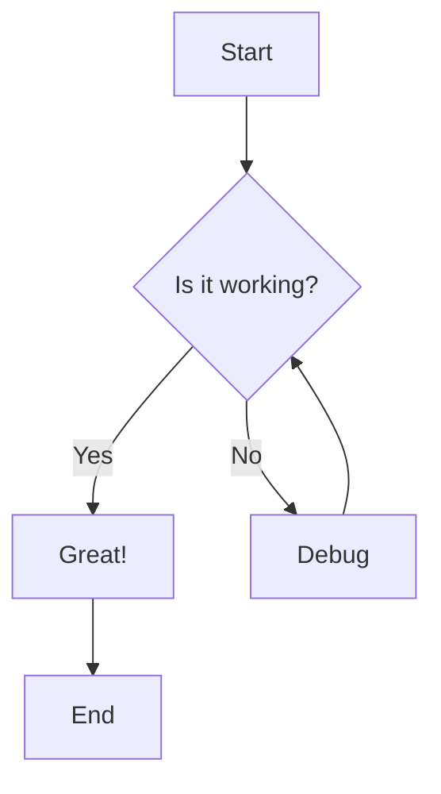
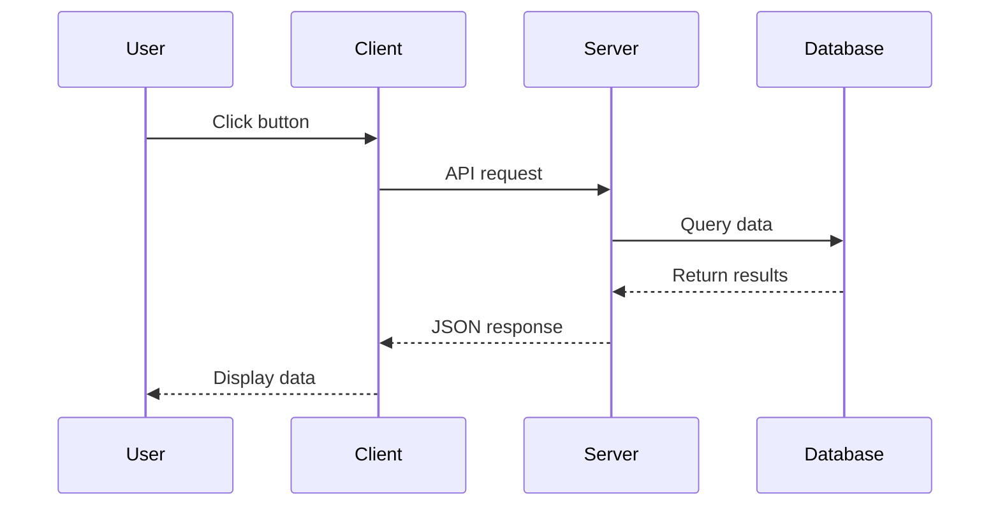
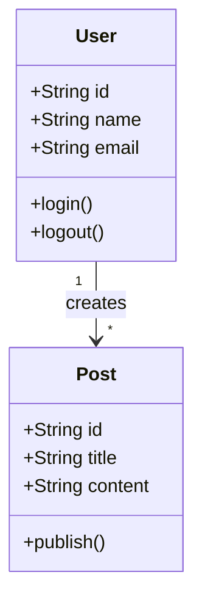

This blog post demonstrates every MDX component and feature available. Use it as a reference and to verify all components render correctly.

## Typography

### Headings

# Heading 1
## Heading 2
### Heading 3
#### Heading 4
##### Heading 5
###### Heading 6

#### **Bold** and *Italic* in heading

### Text Formatting

This is a regular paragraph with **bold text**, *italic text*, and ***bold italic text***. You can also use ~~strikethrough~~ text.

Here's some `inline code` within a paragraph.

### Links

- [Internal link](/blog)
- [External link](https://github.com)
- [Link with title](https://example.com "Example Title")

### Blockquotes

> This is a simple blockquote. It can contain multiple lines of text.

> This is a nested blockquote.
>
> > With a second level.
> >
> > > And a third level.

---

## Lists

### Unordered Lists

- First item
- Second item
  - Nested item 1
  - Nested item 2
    - Deep nested item
- Third item

### Ordered Lists

1. First item
2. Second item
   1. Nested item 1
   2. Nested item 2
3. Third item

### Task Lists

- [x] Completed task
- [x] Another completed task
- [ ] Incomplete task
- [ ] Another incomplete task

---

## Tables

| Feature | Supported | Notes |
|---------|:---------:|-------|
| Markdown | ✅ | Full support |
| MDX | ✅ | With custom components |
| Syntax Highlighting | ✅ | Via Shiki |
| Math | ✅ | Via KaTeX |

| Left Aligned | Center Aligned | Right Aligned |
|:-------------|:--------------:|--------------:|
| Left | Center | Right |
| Text | Text | Text |

---

## Code Blocks

### Basic Code Block

```javascript
function hello() {
  console.log("Hello, World!");
}
```

### Code Block with Filename

```typescript filename=example.ts
interface User {
  id: string;
  name: string;
  email: string;
}

const user: User = {
  id: "1",
  name: "John Doe",
  email: "john@example.com",
};
```

### Code Block with Line Numbers

```python filename=fibonacci.py
def fibonacci(n: int) -> int:
    if n <= 1:
        return n
    return fibonacci(n - 1) + fibonacci(n - 2)

# Calculate first 10 Fibonacci numbers
for i in range(10):
    print(f"F({i}) = {fibonacci(i)}")
```

### Code Block with Highlighted Lines

```typescript filename=highlighted.ts
const config = {
  name: "app",
  version: "1.0.0",
  debug: true, // [!code highlight]
  features: {
    auth: true, // [!code highlight]
    api: true, // [!code highlight]
  },
};
```

### Code Block with Focus

```typescript filename=focus.ts
function processData(data: unknown[]) {
  // Validate input
  if (!Array.isArray(data)) {
    throw new Error("Invalid input");
  }

  // Process each item // [!code focus:4]
  return data.map((item) => {
    return transform(item);
  });
}
```

### Code Block with Diff

```typescript filename=diff.ts
function greet(name: string) {
  console.log("Hello, " + name); // [!code --]
  console.log(`Hello, ${name}!`); // [!code ++]
}
```

### Code Block with Error/Warning Highlights

```typescript filename=errors.ts
const value = null;
value.toString(); // [!code error]

const num = "123";
const result = num * 2; // [!code warning]
```

### Code Block without Line Numbers

```json no-line-numbers
{
  "name": "example",
  "version": "1.0.0"
}
```

---

## Shell Commands

### Single Command

```shell
npm install @langchain/core
```

### Tabbed Commands

```shell tabs=npm,pnpm,bun
npm install @langchain/core @langchain/openai
---
pnpm add @langchain/core @langchain/openai
---
bun add @langchain/core @langchain/openai
```

---

## Callouts

<Callout variant="default" title="Default Callout" icon="info">
  This is a default callout. It provides neutral information to the reader.
</Callout>

<Callout variant="info" title="Information" icon="info">
  This is an info callout. Use it to provide helpful context or tips.

  It can contain **formatted text** and `inline code`.
</Callout>

<Callout variant="success" title="Success" icon="check-circle">
  This is a success callout. Great for confirming something worked!
</Callout>

<Callout variant="warning" title="Warning" icon="alert-triangle">
  This is a warning callout. Use it to caution users about potential issues.
</Callout>

<Callout variant="error" title="Error" icon="x-circle">
  This is an error callout. Use it to highlight critical problems or mistakes.
</Callout>

---

## Accordion

<Accordion type="single" collapsible>
  <AccordionItem value="item-1">
    <AccordionTrigger>What is MDX?</AccordionTrigger>
    <AccordionContent>
      MDX is a format that lets you seamlessly write JSX in your Markdown documents. You can import components and use them alongside your content.
    </AccordionContent>
  </AccordionItem>
  <AccordionItem value="item-2">
    <AccordionTrigger>How does syntax highlighting work?</AccordionTrigger>
    <AccordionContent>
      Syntax highlighting is powered by Shiki, which uses TextMate grammars for accurate tokenization. It supports many programming languages out of the box.
    </AccordionContent>
  </AccordionItem>
  <AccordionItem value="item-3">
    <AccordionTrigger>Can I use custom components?</AccordionTrigger>
    <AccordionContent>
      Yes! You can create custom React components and use them directly in your MDX files. This allows for interactive and dynamic content.
    </AccordionContent>
  </AccordionItem>
</Accordion>

---

## File Tree

<FileTree
  tree={[
    {
      type: "folder",
      name: "src",
      children: [
        {
          type: "folder",
          name: "app",
          children: [
            { type: "file", name: "layout.tsx" },
            { type: "file", name: "page.tsx" },
            {
              type: "folder",
              name: "blog",
              children: [
                { type: "file", name: "page.tsx" },
                {
                  type: "folder",
                  name: "[slug]",
                  children: [
                    { type: "file", name: "page.tsx" },
                  ],
                },
              ],
            },
          ],
        },
        {
          type: "folder",
          name: "components",
          children: [
            { type: "file", name: "button.tsx" },
            { type: "file", name: "card.tsx" },
            { type: "file", name: "input.tsx" },
          ],
        },
        {
          type: "folder",
          name: "lib",
          children: [
            { type: "file", name: "utils.ts" },
            { type: "file", name: "constants.ts" },
          ],
        },
      ],
    },
    {
      type: "folder",
      name: "content",
      children: [
        {
          type: "folder",
          name: "blogs",
          children: [
            { type: "file", name: "first-post.mdx" },
            { type: "file", name: "second-post.mdx" },
          ],
        },
      ],
    },
    { type: "file", name: "package.json" },
    { type: "file", name: "tsconfig.json" },
  ]}
  defaultOpen
/>

---

## Steps

<Steps>

### Install Dependencies

First, install the required packages:

```shell
npm install react next
```

### Create Configuration

Create a configuration file:

```typescript filename=config.ts
export const config = {
  name: "my-app",
};
```

### Run the Application

Start the development server:

```shell
npm run dev
```

</Steps>

---

## Steps with Step Component

<Steps>

<Step>Install Dependencies</Step>

First, install the required packages:

```shell
npm install react next
```

<Step>Create Configuration</Step>

Create a configuration file:

```typescript filename=config.ts
export const config = {
  name: "my-app",
};
```

<Step>Run the Application</Step>

</Steps>

---

## Tabs

<Tabs defaultValue="react">
  <TabsList>
    <TabsTrigger value="react">React</TabsTrigger>
    <TabsTrigger value="vue">Vue</TabsTrigger>
    <TabsTrigger value="svelte">Svelte</TabsTrigger>
  </TabsList>
  <TabsContent value="react">
    ```jsx
    function Button({ children }) {
      return <button className="btn">{children}</button>;
    }
    ```
  </TabsContent>
  <TabsContent value="vue">
    ```vue
    <template>
      <button class="btn">
        <slot />
      </button>
    </template>
    ```
  </TabsContent>
  <TabsContent value="svelte">
    ```svelte
    <button class="btn">
      <slot />
    </button>
    ```
  </TabsContent>
</Tabs>

---

## Keyboard Shortcuts

Use <Kbd>Cmd + K</Kbd> to open the command palette.

Common shortcuts:
- <Kbd>Cmd + S</Kbd> - Save file
- <Kbd>Cmd + Shift + P</Kbd> - Command palette
- <Kbd>Ctrl + Space</Kbd> - Trigger autocomplete
- <Kbd>Alt + Up</Kbd> / <Kbd>Alt + Down</Kbd> - Move line
- <Kbd>Cmd + Enter</Kbd> - Run code
- <Kbd>Escape</Kbd> - Close modal

---

## Mermaid Diagrams

### Flowchart



### Sequence Diagram



### Class Diagram



---

## GitHub Link

Check out these repositories:

<GithubLink owner="vercel" repo="next.js" />

<GithubLink owner="facebook" repo="react" />

<GithubLink owner="tailwindlabs" repo="tailwindcss" />

---

## Aspect Ratio

<AspectRatio ratio={16/9} className="bg-muted rounded-lg flex items-center justify-center">
  <p className="text-muted-foreground">16:9 Aspect Ratio Container</p>
</AspectRatio>

---

## Linked Card

<LinkedCard href="/blog">
  <h3>Blog Posts</h3>
  <p>View all blog posts</p>
</LinkedCard>

---

## Math (KaTeX)

Inline math: $E = mc^2$

Block math:

$$
\frac{-b \pm \sqrt{b^2 - 4ac}}{2a}
$$

More complex equations:

$$
\int_{-\infty}^{\infty} e^{-x^2} dx = \sqrt{\pi}
$$

$$
\sum_{n=1}^{\infty} \frac{1}{n^2} = \frac{\pi^2}{6}
$$

---

## Emoji Support

Thanks to remark-gemoji, you can use GitHub-style emoji shortcodes:

- :rocket: Launch
- :sparkles: New feature
- :bug: Bug fix
- :memo: Documentation
- :art: Style changes
- :fire: Remove code
- :white_check_mark: Tests
- :lock: Security

---

## Images

Standard markdown image:


---

## Horizontal Rules

Content above the rule.

---

Content below the rule.

***

Another rule style.

___

And another.

---

## Embed Blog

<EmbedBlog slug="rag-complete-guide" />

---

## Button Component

<Button>Default Button</Button>

<Button variant="outline">Outline Button</Button>

<Button variant="ghost">Ghost Button</Button>

---

## Conclusion

This kitchen sink demonstrates all available MDX components. If you can see this page rendered correctly, all components are working! :tada:
