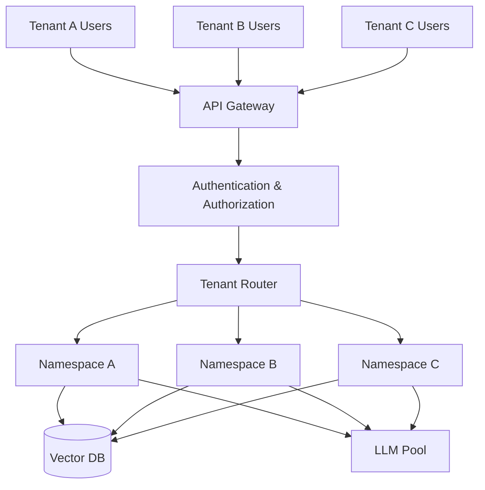
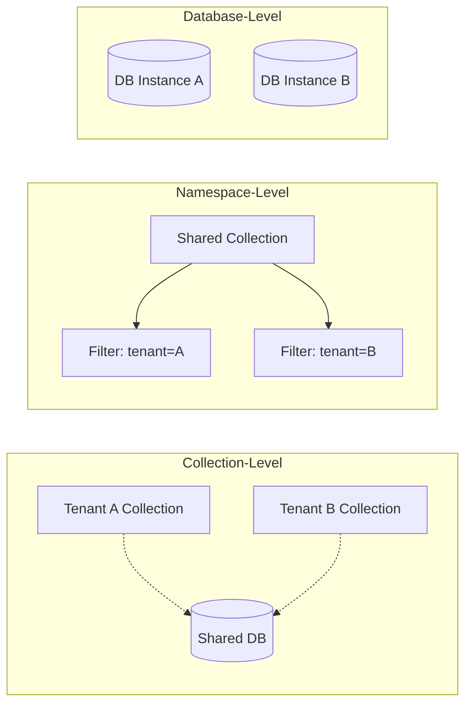
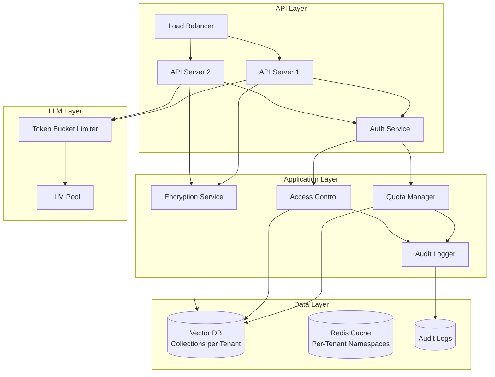

As RAG systems move into production at enterprise scale, you'll inevitably face the challenge of serving multiple tenants from a single infrastructure. Whether you're building a SaaS platform or managing internal business units, **multi-tenancy** introduces critical requirements around isolation, resource management, and data privacy.

In this guide, we'll explore production-ready patterns for building secure, scalable multi-tenant RAG systems that ensure each tenant's data remains isolated while optimizing resource utilization.

## Why Multi-Tenancy Matters

Multi-tenant RAG systems offer significant advantages over single-tenant deployments:

- **Cost Efficiency** - Share infrastructure and reduce operational overhead
- **Simplified Operations** - Single codebase and deployment pipeline
- **Resource Optimization** - Better utilization through workload pooling
- **Faster Time-to-Market** - Onboard new tenants without infrastructure provisioning

> The challenge isn't whether to go multi-tenant, but **how to do it securely** without compromising isolation or performance.



## Tenant Isolation Strategies

Choosing the right isolation strategy depends on your security requirements, scale, and budget constraints.

### Strategy 1: Collection-Level Isolation

The most common approach is isolating tenants at the collection/index level within a shared vector database:

```python filename=isolation/collection_based.py
from qdrant_client import QdrantClient
from qdrant_client.models import Distance, VectorParams

class TenantIsolatedRAG:
    """RAG system with collection-level tenant isolation."""

    def __init__(self, qdrant_url: str):
        self.client = QdrantClient(url=qdrant_url)

    def get_collection_name(self, tenant_id: str) -> str:
        """Generate tenant-specific collection name."""
        return f"tenant_{tenant_id}_documents"  # [!code highlight]

    def create_tenant_collection(  # [!code focus:15]
        self,
        tenant_id: str,
        vector_size: int = 384,
    ) -> None:
        """Create isolated collection for a tenant."""
        collection_name = self.get_collection_name(tenant_id)

        self.client.create_collection(
            collection_name=collection_name,
            vectors_config=VectorParams(
                size=vector_size,
                distance=Distance.COSINE,
            ),
        )

    def upsert_document(
        self,
        tenant_id: str,
        document_id: str,
        vector: list[float],
        payload: dict,
    ) -> None:
        """Store document in tenant-specific collection."""
        collection_name = self.get_collection_name(tenant_id)

        self.client.upsert(
            collection_name=collection_name,
            points=[{
                "id": document_id,
                "vector": vector,
                "payload": payload,
            }],
        )
```

<Callout
  variant="info"
  title="When to Use Collection-Level Isolation"
  icon="info"
>
  Perfect for most use cases where tenants have similar data volumes and query
  patterns. Provides strong logical isolation with minimal operational overhead.
</Callout>

| Aspect                 | Assessment                           |
| :--------------------- | :----------------------------------- |
| **Isolation Strength** | Strong logical isolation             |
| **Setup Complexity**   | Low - single database instance       |
| **Cost Efficiency**    | High - shared infrastructure         |
| **Per-Tenant Control** | Good - individual collection configs |

### Strategy 2: Namespace-Based Filtering

For scenarios where you need tighter collection sharing, use payload-based tenant filtering:

```python filename=isolation/namespace_filtering.py
from qdrant_client.models import Filter, FieldCondition, MatchValue

class NamespaceFilteredRAG:
    """RAG with namespace-based tenant filtering."""

    def search_with_tenant_filter(
        self,
        query_vector: list[float],
        tenant_id: str,
        limit: int = 10,
    ) -> list[dict]:
        """Search with mandatory tenant filter."""
        results = self.client.search(
            collection_name="shared_documents",
            query_vector=query_vector,
            query_filter=Filter(  # [!code highlight:7]
                must=[
                    FieldCondition(
                        key="tenant_id",
                        match=MatchValue(value=tenant_id),
                    ),
                ],
            ),
            limit=limit,
        )

        return results

    def upsert_with_tenant_metadata(  # [!code focus:10]
        self,
        tenant_id: str,
        document_id: str,
        vector: list[float],
        payload: dict,
    ) -> None:
        """Store document with tenant metadata."""
        # Always inject tenant_id into payload
        secured_payload = {**payload, "tenant_id": tenant_id}

        self.client.upsert(
            collection_name="shared_documents",
            points=[{
                "id": f"{tenant_id}:{document_id}",  # Prevent ID collisions
                "vector": vector,
                "payload": secured_payload,
            }],
        )
```

<Callout
  variant="warning"
  title="Filter Validation is Critical"
  icon="alert-triangle"
>
  Always validate that the tenant filter is applied before executing searches. A
  missing filter could leak data across tenants. Consider implementing
  middleware that automatically injects tenant context.
</Callout>

### Strategy 3: Database-Level Isolation

For maximum isolation, use separate database instances per tenant:

```python filename=isolation/database_level.py
from typing import Dict
from dataclasses import dataclass

@dataclass
class TenantDatabase:
    url: str
    api_key: str
    client: QdrantClient

class DatabaseIsolatedRAG:
    """RAG with database-level tenant isolation."""

    def __init__(self):
        self.tenant_dbs: Dict[str, TenantDatabase] = {}

    def provision_tenant_database(  # [!code highlight:10]
        self,
        tenant_id: str,
        db_url: str,
        api_key: str,
    ) -> None:
        """Provision dedicated database for tenant."""
        client = QdrantClient(url=db_url, api_key=api_key)

        self.tenant_dbs[tenant_id] = TenantDatabase(
            url=db_url,
            api_key=api_key,
            client=client,
        )

    def get_tenant_client(self, tenant_id: str) -> QdrantClient:
        """Get tenant-specific database client."""
        if tenant_id not in self.tenant_dbs:
            raise ValueError(f"Tenant {tenant_id} not provisioned")

        return self.tenant_dbs[tenant_id].client
```

### Isolation Strategy Comparison



| Strategy             | Isolation | Cost   | Complexity | Best For                                |
| :------------------- | :-------- | :----- | :--------- | :-------------------------------------- |
| **Collection-Level** | Strong    | Low    | Low        | Most SaaS applications                  |
| **Namespace-Level**  | Medium    | Lowest | Medium     | High tenant count, similar data         |
| **Database-Level**   | Maximum   | High   | High       | Regulated industries, large enterprises |

## Resource Quotas and Rate Limiting

Preventing noisy neighbors and ensuring fair resource distribution requires comprehensive quota management.

### Per-Tenant Resource Quotas

```python filename=quotas/resource_limits.py
from dataclasses import dataclass
from datetime import datetime, timedelta
from typing import Dict, Optional

@dataclass
class TenantQuota:
    """Resource quota configuration per tenant."""
    max_documents: int
    max_storage_mb: int
    max_queries_per_hour: int
    max_tokens_per_day: int
    max_concurrent_requests: int

@dataclass
class TenantUsage:
    """Current usage metrics."""
    documents: int = 0
    storage_mb: float = 0.0
    queries_this_hour: int = 0
    tokens_today: int = 0
    concurrent_requests: int = 0
    window_start: datetime = None

class QuotaManager:
    """Enforce tenant resource quotas."""

    def __init__(self):
        self.quotas: Dict[str, TenantQuota] = {}
        self.usage: Dict[str, TenantUsage] = {}

    def set_quota(self, tenant_id: str, quota: TenantQuota) -> None:
        """Configure quota for tenant."""
        self.quotas[tenant_id] = quota
        if tenant_id not in self.usage:
            self.usage[tenant_id] = TenantUsage(
                window_start=datetime.now()
            )

    def check_document_quota(  # [!code focus:15]
        self,
        tenant_id: str,
        new_documents: int = 1,
    ) -> tuple[bool, Optional[str]]:
        """Check if tenant can add more documents."""
        quota = self.quotas.get(tenant_id)
        usage = self.usage.get(tenant_id)

        if not quota or not usage:
            return False, "Tenant not configured"

        if usage.documents + new_documents > quota.max_documents:
            return False, f"Document quota exceeded ({quota.max_documents})"

        return True, None

    def check_query_quota(  # [!code highlight:20]
        self,
        tenant_id: str,
    ) -> tuple[bool, Optional[str]]:
        """Check if tenant can execute query."""
        quota = self.quotas.get(tenant_id)
        usage = self.usage.get(tenant_id)

        if not quota or not usage:
            return False, "Tenant not configured"

        # Reset hourly counter if window expired
        if datetime.now() - usage.window_start > timedelta(hours=1):
            usage.queries_this_hour = 0
            usage.window_start = datetime.now()

        if usage.queries_this_hour >= quota.max_queries_per_hour:
            return False, f"Query quota exceeded ({quota.max_queries_per_hour}/hour)"

        return True, None

    def record_query(self, tenant_id: str, tokens_used: int) -> None:
        """Record query execution."""
        usage = self.usage.get(tenant_id)
        if usage:
            usage.queries_this_hour += 1
            usage.tokens_today += tokens_used
```

### API Layer with Quota Enforcement

```python filename=api/quota_middleware.py
from fastapi import FastAPI, Request, HTTPException, status
from fastapi.responses import JSONResponse

app = FastAPI()
quota_manager = QuotaManager()

@app.middleware("http")
async def enforce_quotas(request: Request, call_next):  # [!code highlight:20]
    """Middleware to enforce tenant quotas."""
    # Extract tenant from auth context
    tenant_id = request.headers.get("X-Tenant-ID")

    if not tenant_id:
        return JSONResponse(
            status_code=status.HTTP_401_UNAUTHORIZED,
            content={"error": "Missing tenant ID"},
        )

    # Check query quota for search endpoints
    if request.url.path.startswith("/api/search"):
        allowed, reason = quota_manager.check_query_quota(tenant_id)
        if not allowed:
            return JSONResponse(
                status_code=status.HTTP_429_TOO_MANY_REQUESTS,
                content={"error": reason},
            )

    response = await call_next(request)
    return response

@app.post("/api/documents")
async def upload_document(
    request: Request,
    document: dict,
):
    """Upload document with quota check."""
    tenant_id = request.headers["X-Tenant-ID"]

    # Check document quota
    allowed, reason = quota_manager.check_document_quota(tenant_id)  # [!code highlight]
    if not allowed:
        raise HTTPException(
            status_code=status.HTTP_429_TOO_MANY_REQUESTS,
            detail=reason,
        )

    # Process upload...
    return {"status": "uploaded"}
```

<Callout variant="success" title="Quota Best Practices" icon="lightbulb">

- Set generous quotas initially and adjust based on usage patterns
- Provide clear error messages with current usage and limits
- Send proactive notifications as tenants approach limits
- Implement quota increase workflows for premium tiers

</Callout>

### Token-Based Rate Limiting

For LLM API calls, implement token-aware rate limiting:

```python filename=quotas/token_limiter.py
import asyncio
from collections import defaultdict
from datetime import datetime, timedelta

class TokenBucketLimiter:
    """Token bucket rate limiter for LLM calls."""

    def __init__(self):
        self.buckets = defaultdict(lambda: {
            "tokens": 0,
            "last_refill": datetime.now(),
        })

    async def acquire(  # [!code focus:25]
        self,
        tenant_id: str,
        tokens_needed: int,
        max_tokens: int = 100000,  # Per hour
        refill_rate: int = 27,     # Tokens per second (~100k/hour)
    ) -> bool:
        """Acquire tokens from bucket, waiting if necessary."""
        bucket = self.buckets[tenant_id]

        # Refill bucket based on time elapsed
        now = datetime.now()
        elapsed = (now - bucket["last_refill"]).total_seconds()
        refill = int(elapsed * refill_rate)

        bucket["tokens"] = min(bucket["tokens"] + refill, max_tokens)
        bucket["last_refill"] = now

        # Check if enough tokens available
        if bucket["tokens"] >= tokens_needed:
            bucket["tokens"] -= tokens_needed
            return True

        # Wait for refill
        wait_time = (tokens_needed - bucket["tokens"]) / refill_rate
        await asyncio.sleep(wait_time)

        bucket["tokens"] = 0
        return True
```

## Data Privacy and Security

Multi-tenancy amplifies data privacy concerns. Here are critical security patterns.

### Encryption at Rest

Encrypt tenant data with tenant-specific keys:

```python filename=security/encryption.py
from cryptography.fernet import Fernet
from typing import Dict
import json

class TenantEncryption:
    """Per-tenant encryption for sensitive data."""

    def __init__(self):
        self.tenant_keys: Dict[str, bytes] = {}

    def provision_tenant_key(self, tenant_id: str) -> str:
        """Generate and store encryption key for tenant."""
        key = Fernet.generate_key()
        self.tenant_keys[tenant_id] = key
        return key.decode()  # Return to tenant for secure storage

    def encrypt_payload(  # [!code highlight:10]
        self,
        tenant_id: str,
        payload: dict,
        sensitive_fields: list[str],
    ) -> dict:
        """Encrypt sensitive fields in payload."""
        if tenant_id not in self.tenant_keys:
            raise ValueError(f"No encryption key for tenant {tenant_id}")

        cipher = Fernet(self.tenant_keys[tenant_id])
        encrypted_payload = payload.copy()

        for field in sensitive_fields:
            if field in encrypted_payload:
                plaintext = json.dumps(encrypted_payload[field])
                encrypted = cipher.encrypt(plaintext.encode())
                encrypted_payload[field] = encrypted.decode()

        return encrypted_payload

    def decrypt_payload(  # [!code focus:10]
        self,
        tenant_id: str,
        payload: dict,
        sensitive_fields: list[str],
    ) -> dict:
        """Decrypt sensitive fields in payload."""
        if tenant_id not in self.tenant_keys:
            raise ValueError(f"No encryption key for tenant {tenant_id}")

        cipher = Fernet(self.tenant_keys[tenant_id])
        decrypted_payload = payload.copy()

        for field in sensitive_fields:
            if field in decrypted_payload:
                encrypted = decrypted_payload[field].encode()
                decrypted = cipher.decrypt(encrypted)
                decrypted_payload[field] = json.loads(decrypted.decode())

        return decrypted_payload
```

### Audit Logging

Comprehensive audit trails are essential for compliance:

```python filename=security/audit.py
from dataclasses import dataclass
from datetime import datetime
from enum import Enum
import json

class AuditAction(Enum):
    DOCUMENT_UPLOAD = "document_upload"
    DOCUMENT_DELETE = "document_delete"
    QUERY_EXECUTE = "query_execute"
    TENANT_ACCESS = "tenant_access"
    QUOTA_EXCEEDED = "quota_exceeded"

@dataclass
class AuditEvent:
    timestamp: datetime
    tenant_id: str
    action: AuditAction
    user_id: str
    resource_id: str
    metadata: dict
    ip_address: str

class AuditLogger:
    """Centralized audit logging for compliance."""

    def log_event(  # [!code highlight:15]
        self,
        tenant_id: str,
        action: AuditAction,
        user_id: str,
        resource_id: str,
        metadata: dict,
        ip_address: str,
    ) -> None:
        """Log security-relevant event."""
        event = AuditEvent(
            timestamp=datetime.now(),
            tenant_id=tenant_id,
            action=action,
            user_id=user_id,
            resource_id=resource_id,
            metadata=metadata,
            ip_address=ip_address,
        )

        # Write to secure, append-only log storage
        log_entry = json.dumps({
            "timestamp": event.timestamp.isoformat(),
            "tenant_id": event.tenant_id,
            "action": event.action.value,
            "user_id": event.user_id,
            "resource_id": event.resource_id,
            "metadata": event.metadata,
            "ip_address": event.ip_address,
        })

        # In production: write to secure logging service
        print(f"AUDIT: {log_entry}")
```

<Callout variant="error" title="Compliance Requirements" icon="shield-alert">

For GDPR, HIPAA, or SOC 2 compliance, ensure audit logs are:

- **Immutable** - Use append-only storage or blockchain
- **Encrypted** - Protect sensitive information in logs
- **Retained** - Follow regulatory retention periods
- **Accessible** - Support tenant data export requests

</Callout>

### Access Control and Authorization

Implement row-level security with attribute-based access control (ABAC):

```python filename=security/access_control.py
from enum import Enum
from typing import Set

class Permission(Enum):
    READ_DOCUMENTS = "read:documents"
    WRITE_DOCUMENTS = "write:documents"
    DELETE_DOCUMENTS = "delete:documents"
    MANAGE_USERS = "manage:users"
    VIEW_ANALYTICS = "view:analytics"

class Role(Enum):
    VIEWER = "viewer"
    EDITOR = "editor"
    ADMIN = "admin"

ROLE_PERMISSIONS = {
    Role.VIEWER: {Permission.READ_DOCUMENTS, Permission.VIEW_ANALYTICS},
    Role.EDITOR: {
        Permission.READ_DOCUMENTS,
        Permission.WRITE_DOCUMENTS,
        Permission.VIEW_ANALYTICS,
    },
    Role.ADMIN: {
        Permission.READ_DOCUMENTS,
        Permission.WRITE_DOCUMENTS,
        Permission.DELETE_DOCUMENTS,
        Permission.MANAGE_USERS,
        Permission.VIEW_ANALYTICS,
    },
}

class AccessControl:
    """ABAC implementation for multi-tenant RAG."""

    def check_permission(  # [!code highlight:15]
        self,
        tenant_id: str,
        user_id: str,
        resource_tenant_id: str,
        required_permission: Permission,
        user_role: Role,
    ) -> tuple[bool, str]:
        """Check if user has permission for action."""
        # Ensure cross-tenant access is blocked
        if tenant_id != resource_tenant_id:
            return False, "Cross-tenant access denied"

        # Check role permissions
        if required_permission not in ROLE_PERMISSIONS.get(user_role, set()):
            return False, f"Permission {required_permission.value} not granted"

        return True, "Access granted"
```

## Production Architecture

Here's a complete multi-tenant RAG architecture with all components:



### Complete Implementation

```python filename=multi_tenant_rag.py
from typing import Optional
from dataclasses import dataclass

@dataclass
class QueryRequest:
    tenant_id: str
    user_id: str
    query: str
    filters: Optional[dict] = None

class MultiTenantRAG:
    """Production multi-tenant RAG system."""

    def __init__(
        self,
        vector_store: TenantIsolatedRAG,
        quota_manager: QuotaManager,
        access_control: AccessControl,
        audit_logger: AuditLogger,
        encryption: TenantEncryption,
        token_limiter: TokenBucketLimiter,
    ):
        self.vector_store = vector_store
        self.quota_manager = quota_manager
        self.access_control = access_control
        self.audit_logger = audit_logger
        self.encryption = encryption
        self.token_limiter = token_limiter

    async def query(  # [!code focus:40]
        self,
        request: QueryRequest,
        user_role: Role,
        ip_address: str,
    ) -> dict:
        """Execute tenant-isolated query with all guards."""
        # 1. Check access control
        allowed, reason = self.access_control.check_permission(
            tenant_id=request.tenant_id,
            user_id=request.user_id,
            resource_tenant_id=request.tenant_id,
            required_permission=Permission.READ_DOCUMENTS,
            user_role=user_role,
        )

        if not allowed:
            self.audit_logger.log_event(
                tenant_id=request.tenant_id,
                action=AuditAction.TENANT_ACCESS,
                user_id=request.user_id,
                resource_id="query",
                metadata={"denied": reason},
                ip_address=ip_address,
            )
            raise PermissionError(reason)

        # 2. Check query quota
        quota_ok, quota_reason = self.quota_manager.check_query_quota(
            request.tenant_id
        )
        if not quota_ok:
            self.audit_logger.log_event(
                tenant_id=request.tenant_id,
                action=AuditAction.QUOTA_EXCEEDED,
                user_id=request.user_id,
                resource_id="query",
                metadata={"reason": quota_reason},
                ip_address=ip_address,
            )
            raise QuotaExceededError(quota_reason)

        # 3. Execute search with tenant isolation
        results = self.vector_store.search_with_tenant_filter(
            query_vector=embed_query(request.query),
            tenant_id=request.tenant_id,
            limit=10,
        )

        # 4. Decrypt sensitive fields
        decrypted_results = [
            self.encryption.decrypt_payload(
                tenant_id=request.tenant_id,
                payload=r.payload,
                sensitive_fields=["content", "metadata"],
            )
            for r in results
        ]

        # 5. Apply token limiting for LLM call
        estimated_tokens = estimate_tokens(request.query, decrypted_results)
        await self.token_limiter.acquire(
            tenant_id=request.tenant_id,
            tokens_needed=estimated_tokens,
        )

        # 6. Generate response
        response = await generate_response(request.query, decrypted_results)

        # 7. Audit log
        self.audit_logger.log_event(
            tenant_id=request.tenant_id,
            action=AuditAction.QUERY_EXECUTE,
            user_id=request.user_id,
            resource_id=request.query[:50],
            metadata={"tokens": estimated_tokens},
            ip_address=ip_address,
        )

        # 8. Record quota usage
        self.quota_manager.record_query(request.tenant_id, estimated_tokens)

        return {
            "answer": response,
            "sources": [r["id"] for r in decrypted_results],
        }
```

## Monitoring and Observability

Track per-tenant metrics for operational excellence:

| Metric                    | Purpose                    | Alert Threshold |
| :------------------------ | :------------------------- | :-------------- |
| **Queries per Tenant**    | Identify usage patterns    | > 95% of quota  |
| **Latency per Tenant**    | Detect performance issues  | P99 > 2s        |
| **Error Rate per Tenant** | Service quality monitoring | > 1%            |
| **Storage per Tenant**    | Capacity planning          | > 90% of quota  |
| **Cross-Tenant Leaks**    | Security monitoring        | > 0 incidents   |

<Callout
  variant="warning"
  title="Zero-Tolerance for Data Leaks"
  icon="shield-alert"
>
  Implement automated alerts for any cross-tenant data access attempts. These
  should trigger immediate investigation and incident response.
</Callout>

## Conclusion

Building a production multi-tenant RAG system requires careful attention to:

- **Tenant Isolation** - Choose the right strategy based on security and scale requirements
- **Resource Quotas** - Prevent noisy neighbors with comprehensive quota management
- **Data Privacy** - Implement encryption, audit logging, and access control
- **Monitoring** - Track per-tenant metrics and zero-tolerance leak detection

The patterns in this guide provide a foundation for secure, scalable multi-tenant RAG deployments that can grow from dozens to thousands of tenants while maintaining isolation guarantees.

---

_Need help implementing multi-tenant RAG for your organization? [Contact us](/contact) to learn how AstraQ can help you build secure, scalable AI systems._
