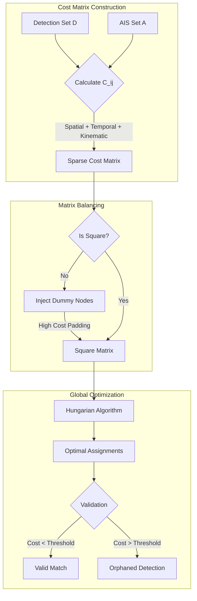
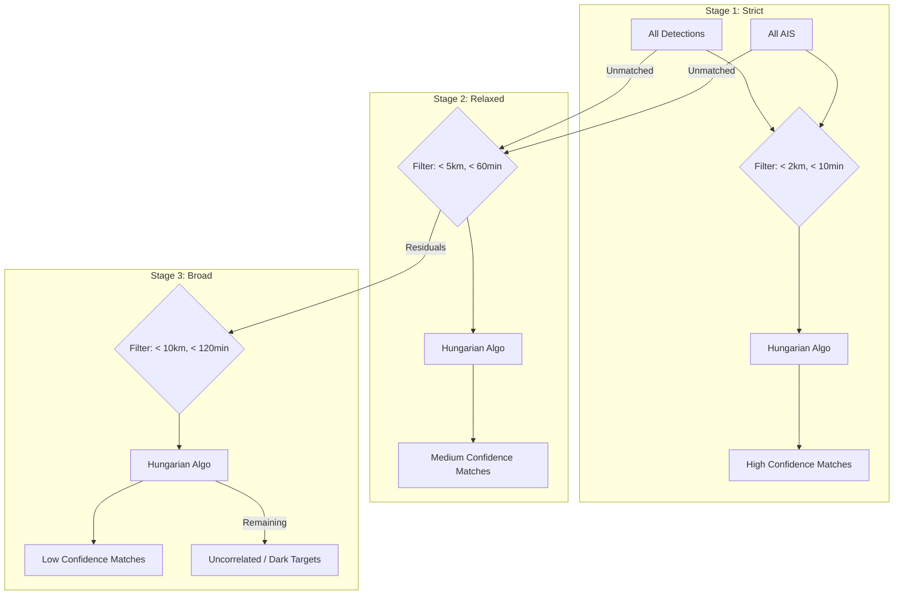

<LLMOnly
  data={`
type: deep-dive
difficulty: advanced
keyTakeaways:
  - Implement weighted bipartite matching for vessel-AIS correlation
  - Use Hungarian algorithm for optimal assignment problems
  - Apply cascaded matching strategy for confidence-based association
prerequisites: Graph theory, linear algebra, maritime AIS fundamentals
targetAudience: Data scientists working on sensor fusion and tracking systems
`}
/>

In the previous volume, we explored the "Seeing Eye": the complex neural architectures that allow machines to perceive vessels amidst the radiometric chaos of the ocean. Yet, perception is not knowledge. A bounding box on a satellite image is merely a spatial assertion: _"Something is here."_ It possesses geometry, but it lacks **identity**.

To transform a raw detection into actionable intelligence, we must answer the question: _"Who is this?"_

This is the challenge of **Correlation**. It is the digital act of weaving together two disparate threads of reality: the instantaneous, anonymous truth of the satellite image, and the continuous, self-reported narrative of the Automatic Identification System (AIS).

At AstraQ Cyber Defence, we view this not as a simple database join, but as a complex optimization problem rooted in graph theory and kinematics. This volume dissects the **Correlation Engine** of OS², detailing how we employ weighted bipartite matching and the Hungarian algorithm to bridge the identity gap.

## The Problem of Disparate Realities

Consider the operational reality. A Sentinel-1 satellite passes over the Strait of Malacca at `14:02:15 UTC`. It detects a vessel at coordinates $(\phi_{det}, \lambda_{det})$.

Meanwhile, the vessel's AIS transponder, subject to transmission slots, signal collisions, or deliberate "dark" intervals, might have last broadcast its position at `14:00:30 UTC`.

We are presented with a fundamental disconnect:

1.  **Spatial Disconnect:** The vessel has moved in the intervening 1 minute and 45 seconds.
2.  **Temporal Disconnect:** The datasets exist on different timelines.
3.  **Epistemic Disconnect:** The satellite detection is a "visual" truth (it is definitely there), while the AIS data is a "declared" truth (it claims to be there, but GPS can drift or be spoofed).

A naive approach would perform a "Nearest Neighbor" search, snapping the detection to the geographically closest AIS point. In the crowded shipping lanes of the world, this is catastrophic. A fishing trawler 500 meters away might be closer than the cargo ship 800 meters away, but if the cargo ship is moving at 20 knots and the trawler is stationary, the physics dictate that the cargo ship is the correct match.

To solve this, we formalize the problem as a **Weighted Bipartite Matching** challenge.

## The Mathematical Cost Function

We define two sets of nodes: $D$ (Detections) and $A$ (AIS Candidates). Our goal is to create a set of edges connecting $D$ to $A$ such that the total "Cost" of the system is minimized.

The "Cost" ($C_{ij}$) of associating Detection $i$ with AIS Candidate $j$ is a weighted sum of four physical and temporal discrepancies. The lower the cost, the higher the probability that they are the same vessel.

The governing equation for our cost matrix is:

$$
C_{ij} =
w_s \cdot d_{ij}
+ w_t \cdot f_j(\Delta t)
+ w_l \cdot \Delta L_{ij}
+ w_v \cdot \Delta \beta_{ij}
+ w_h \cdot \Delta h_{ij}
$$

Let us deconstruct the physics behind each term.

### Spatial Proximity

This is the foundational evidence. We calculate the **Haversine Distance** ($d_{ij}$) between the detection's coordinates and the AIS candidate's _estimated_ position at the time of image acquisition.

We eschew Euclidean geometry because the Earth is an oblate spheroid. At high latitudes, the distance represented by a degree of longitude shrinks. The Haversine formula ensures numerical stability and geodesic accuracy:

$$
d = 2R \cdot \arcsin\left(\sqrt{\sin^2\left(\frac{\Delta \phi}{2}\right) + \cos \phi_1 \cos \phi_2 \sin^2\left(\frac{\Delta \lambda}{2}\right)}\right)
$$

We assign a baseline weight $w_s = 1.0$ treating spatial separation as a linear penalty.

### Temporal Displacement

This term penalizes the uncertainty introduced by time. The older the AIS data, the less reliable the position estimate.

We employ two methods to estimate the vessel's position at the image time ($t_{img}$):

- **Interpolation:** If we have AIS points _before_ and _after_ $t_{img}$, we interpolate linearly. This is highly accurate.
- Projection (Dead Reckoning):\*\* If we only have past data, we project the position forward using the vessel's Speed Over Ground (SOG) and Course Over Ground (COG).

Projection is inherently risky. A vessel can turn. Thus, we apply a quadratic penalty to the time gap $\Delta t$, and we double the penalty multiplier ($f_j$) if we are forced to use Projection instead of Interpolation.

$$
\text{Cost}_{temporal} = w_t \cdot \left(\frac{\Delta t}{60}\right)^2 \cdot \begin{cases} 1.0 & \text{if Interpolation} \\ 2.0 & \text{if Projection} \end{cases}
$$

With $w_t = 10.0$, this ensures that a fresh AIS ping is valued significantly higher than a stale one, exponentially so as time passes.

#### Morphological Consistency (Length)

Vessel length provides a weak but valuable morphological constraint. Rather than enforcing a hard equality, which would be brittle given sensor noise and partial occlusion, we apply a **ratio-based penalty**.

Let $L_{det}$ be the SAR-derived vessel length and $L_{ais}$ the AIS-reported length. We penalize increasing divergence between the two, while tolerating small discrepancies:

- Near-equal lengths incur zero cost
- Moderate divergence incurs a linear penalty
- Extreme divergence incurs a sharply increasing cost

This term improves discrimination in dense traffic environments without excluding valid matches due to estimation uncertainty.

### Kinematic Coherence

Here, physics takes the helm. A vessel has a velocity vector. If an AIS candidate reports it is moving North ($0^\circ$), but the detection lies directly East ($90^\circ$) of the AIS position, the match becomes physically implausible without a significant maneuver.

We calculate the **Required Bearing**: the angle from the AIS point to the Detection point. We then compare this to the vessel's reported COG. The difference, $\Delta \beta$, represents the **Kinematic Violation**.

$$
\Delta \beta = \text{min\_angular\_diff}(\text{Bearing}_{AIS \to Det}, \text{COG}_{AIS})
$$

We assign a heavy weight $w_v = 20.0$. This high penalty reflects a hard physical constraint: kinematic inconsistency is a stronger indicator of a false match than a minor spatial error.

### Directional Consistency

Finally, if the AIS data includes **True Heading** (the direction the bow is pointing, which can differ from COG due to drift), we compare it against the vessel's reported Course Over Ground to detect directional inconsistency.

$$
\Delta h = \text{min\_angular\_diff}(\text{Heading}_{AIS}, \text{COG}_{AIS})
$$

We use a weight $w_h = 15.0$. Crucially, if heading data is missing (which is common), this term contributes **zero cost**. We design the system to degrade gracefully, rather than punishing vessels for incomplete data.

## The Optimization Engine: The Hungarian Algorithm

Once we have calculated the cost for every possible pair of detection and AIS candidate, we generate a **Cost Matrix**. Our goal is to find the assignment that minimizes the _global_ cost of the system.

A greedy algorithm (simply picking the lowest numbers first) fails here. It might pick a "pretty good" match for Vessel A that "steals" the _only_ possible match for Vessel B, leaving Vessel B unmatched.

We utilize the **Hungarian Algorithm** (Kuhn-Munkres algorithm), which solves the assignment problem in polynomial time ($O(n^3)$). It iteratively adjusts the matrix to find a set of independent zeros that represent the optimal pairing .

## The Problem of Asymmetry

In the real world, the matrices are rarely square. We might have 50 detections and 200 AIS candidates (high clutter). Or 50 detections and only 10 AIS candidates (dark ships).

The Hungarian algorithm requires a square matrix. We solve this by padding the matrix with **Dummy Nodes**

- **Dummy Rows:** Represent "False Alarms" or unidentifiable objects.
- **Dummy Columns:** Represent "Missed Detections" (vessels with AIS that the satellite didn't see).

We assign these dummy connections a very high cost threshold (e.g., $10^8$). This ensures that the algorithm only assigns a detection to a "Dummy" (i.e., leaves it unmatched) if _no_ real AIS candidate offers a plausible match below that cost threshold.

## The Cascaded Matching Strategy

Attempting to match every vessel in a single pass is risky. The noise from uncertain, low-quality matches can interfere with the obvious, high-quality ones.

To mimic human analytical reasoning, OS² employs a **Multi-Stage Cascaded Matching** strategy. We peel the onion in layers.

**Stage 1: High Confidence (The "Slam Dunks")**

- **Constraints:** Tight spatial radius (< 2 km), short time gap (< 10 mins).
- **Action:** We run the Hungarian algorithm on this subset. Matches found here are locked in as "High Confidence" .
- **Result:** The matched detections and AIS candidates are removed from the pool.

**Stage 2: Medium Confidence (The "Probables")**

- **Constraints:** Relaxed radius (< 5 km), longer time gap (< 1 hour).
- **Action:** We match the _residuals_ (the leftovers) from Stage 1.
- **Context:** This captures vessels where the AIS latency is higher, or where small position errors have crept in .

**Stage 3: Low Confidence (The "Possibles")**

- **Constraints:** Maximum radius (< 10 km), maximum time gap (< 2 hours).
- **Action:** A final sweep for difficult cases.
- **Context:** These matches are flagged for human analyst review. They represent high uncertainty but prevent us from discarding potential correlations completely .

This cascaded approach ensures that clear evidence is prioritized, while ambiguous cases are handled with appropriate caution.

It is important to note that the confidence scores assigned to matches are **stage-derived heuristics**, not probabilistic estimates. A "High Confidence" match reflects strong spatiotemporal and kinematic consistency under strict constraints, not a statistical posterior probability.

This distinction preserves interpretability for analysts and avoids overstating mathematical certainty in an inherently uncertain sensing environment.

## Conclusion: The Unified Picture

By the time the Correlation Engine completes its cycle, a process taking mere seconds even for dense scenes, the chaotic scatter of satellite detections has been organized into a structured intelligence picture.

We know which detections correspond to the _MV Ever Given_ and which correspond to anonymous fishing vessels. Crucially, the **unmatched detections**, those that survived all three stages of the cascade without finding a partner, are illuminated. These are the **Dark Vessels**. These are the targets that require immediate operational attention.

The Correlation Engine does not just connect data; it isolates anomalies by explaining away the known traffic.

However, there remains one final challenge. The AIS data we rely on is often fractured, full of gaps and silence. To make our correlation robust, we cannot simply accept these gaps. We must fill them. In the final volume of this series, we will explore **The Predictive Compass**: the physics-based interpolation engine that reconstructs the past and predicts the future of maritime movement.
