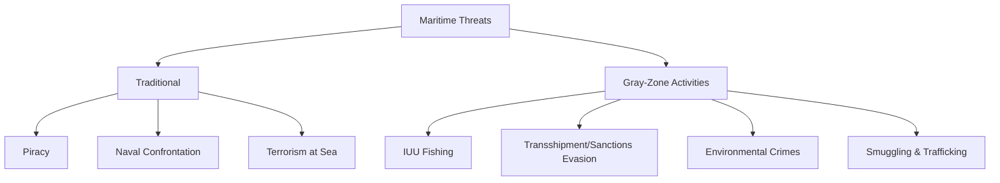
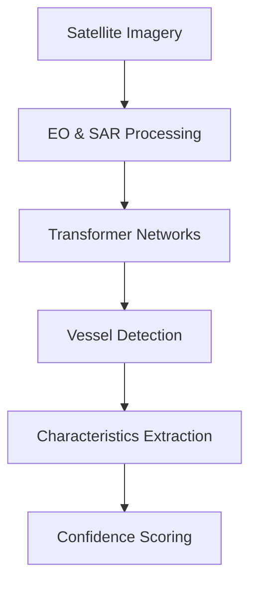
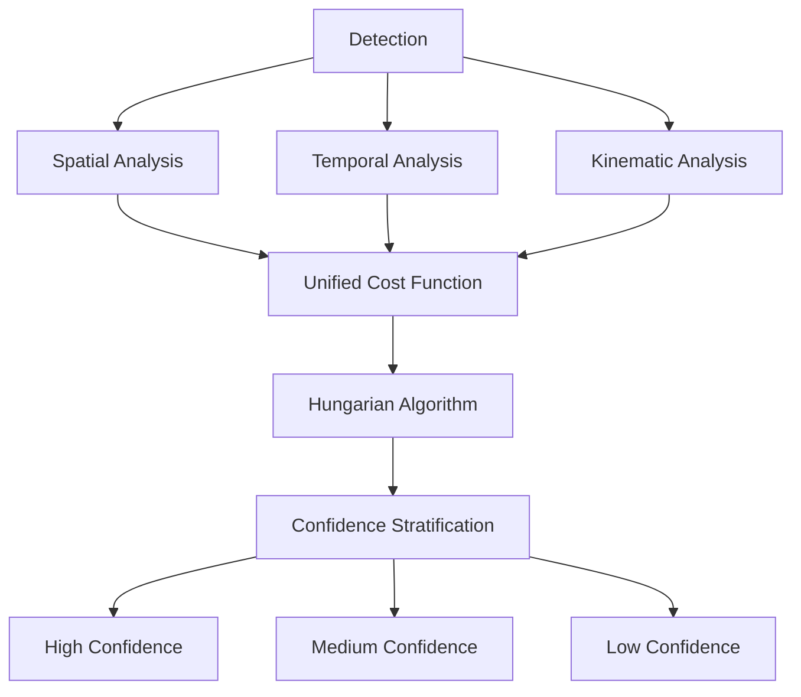
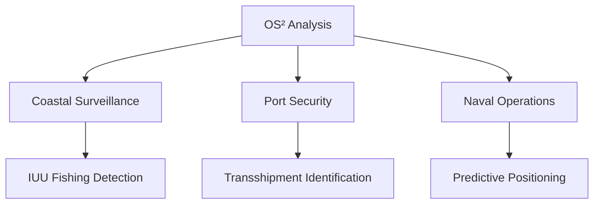

The sea covers seventy percent of Earth's surface, yet remains one of the least monitored domains. This opacity has long sheltered maritime activities governments can neither see nor regulate: illegal fishing, sanctions evasion, environmental crime, and gray-zone activities that exist in legal ambiguity.

The paradox of modern maritime security is profound: we possess satellites, GPS, and artificial intelligence, yet our understanding of oceanic activity remains fragmented and delayed. A vessel can disable its transponder and vanish from detection systems. Satellite imagery captures only snapshots, not continuous observation. Traditional radar watches coastlines but blinds beyond them. These pieces exist separately: different sensors, different timescales, different languages, lacking the coherence that would transform fragments into meaning.

This is where the strategic challenge emerges. The most consequential maritime threats arrive not as loud, kinetic events, but as patterns: behavioral deviations, inconsistencies, subtle signatures of intent. Detecting them requires not more data, but smarter reasoning about the data we already have.

At AstraQ Cyber Defence, we recognized this gap and built OS², a system that transforms fragmented maritime observations into coherent, actionable intelligence. Rather than asking "how can we collect more data?" we asked: "how can we extract more meaning from what we already possess?"

## The Shifting Maritime Threat Landscape

Traditional maritime threats persist: piracy, naval confrontation, terrorism at sea. But alongside these has emerged a far larger ecosystem of gray-zone activities exploiting ambiguity and operating at legal margins.

Illegal, unreported, and unregulated (IUU) fishing costs nations billions annually. A fishing vessel in a marine protected area looks identical to a legitimate boat: same radar signature, same signals, possibly the same flags. The difference lies in behavior and location, both requiring deep understanding of vessel patterns to discern.

Transshipment at sea, cargo transfer between vessels in international waters, obscures custody chains and enables sanctions evasion. From a distance, it appears as two vessels in proximity. Without behavioral analysis, the transfer goes undetected for weeks. Environmental crimes compound this: illegal fuel dumping, plastic discharge, illicit mining operations in protected zones. Each leaves traces: timing anomalies, behavioral deviations, inconsistencies between reported and actual conduct.

What binds these challenges together: they require understanding patterns over time, not snapshots. They demand recognizing when vessel movements deviate from expectations, distinguishing evasion from innocence. Traditional surveillance systems capture fragments. OS² connects them into coherence.

## Where Conventional Systems Struggle

Current maritime surveillance integrates radar, satellite imagery, and AIS into operating pictures. This works for large, obvious activities in high-traffic zones. It fails where it matters most: detecting subtle deviations, understanding patterns evolving slowly, correlating weak signals, and maintaining awareness in data-sparse regions.

Key limitations emerge:

**Fragmented temporal understanding.** Systems can show where a vessel is now versus an hour ago, but struggle to contextualize observations within historical patterns. A tanker deviating from declared route is alarming in context, invisible when viewed in isolation.

**Rigid rule-based logic.** Hard-coded rules ("alert if vessel enters zone X") become obsolete as threats adapt. Legitimate maritime activity is inherently variable, generating false positives that train operators to ignore alerts.

**Limited attribution.** When anomalies are detected, systems cannot easily answer why. Without causal context, analysts speculate rather than reason.

**Delayed analytical loops.** Hours separate detection from actionable insight: by then, vessels complete activities and move on.

## The Three Pillars of OS²

OS² integrates three complementary analytical capabilities, each addressing a distinct dimension of maritime awareness.

### Pillar 1: Seeing: Automated Vessel Detection

Detection requires understanding vessels within complex imagery. Electro-optical satellites capture visible light with excellent resolution but fail under cloud cover. Synthetic Aperture Radar penetrates weather and darkness but produces complex signals requiring sophisticated interpretation.

At AstraQ, we deploy transformer-based neural networks: Vision Transformers for SAR analysis, Swin Transformers for multispectral optical imagery. These architectures excel at hierarchical feature extraction, understanding pixels as edges, edges as shapes, shapes as vessels, across tremendous scale variance (small fishing boats to 300-meter container ships).

But detection alone is insufficient. We extract physical characteristics (length, width, speed, heading), assign confidence scores, and intelligently remove duplicate detections using distance-based filtering rather than traditional box-overlap methods. The result: a stream of detected vessels with location, dimensions, characteristics, and confidence, but still anonymous, lacking identity or context.

### Pillar 2: Connecting: Intelligent Correlation with AIS

Matching anonymous detections to vessel identities is the correlation problem, the single greatest analytical challenge in maritime awareness.

Naive spatial matching fails. Multiple vessels cluster in busy zones; temporal gaps between image acquisition and AIS transmission create position uncertainty. The vessel may have disabled AIS or spoofed its signal.

OS² reasons across three dimensions:

**Spatial:** Using the Haversine formula (standard great-circle distance), we compute geographic separation but gate search to plausible ranges only.

**Temporal:** When AIS positions bracket image time, we interpolate where the vessel should have been. When only past positions exist, we dead-reckon forward based on reported speed and course.

**Kinematic:** A northbound vessel cannot plausibly be south of its last known position. Heading should align reasonably with course. These physical constraints powerfully discriminate true matches from spurious ones.

We synthesize these into a unified cost function quantifying match plausibility. The Hungarian algorithm finds globally optimal one-to-one pairings minimizing total cost. We stratify by confidence: high-confidence matches warrant immediate action, medium-confidence require verification, low-confidence flag for human review.

### Pillar 3: Predicting: Trajectory Reconstruction

AIS transmits positions at irregular intervals. Between transmissions, vessel locations are unknown. Linear interpolation produces unrealistic sharp-angled paths violating hydrodynamic physics.

OS² uses cubic spline interpolation: smooth curves satisfying three continuity conditions (position, velocity, acceleration). This produces trajectories respecting ship physics. Speed uses quadratic interpolation capturing acceleration/deceleration. Course accounts for compass wraparound and models rudder response as smooth turning, not instantaneous heading change.

The result: complete trajectory reconstruction from 5-10 sparse points with RMSE as low as 0.0011 kilometers even with 60% data missing. This unlocks complete vessel histories, behavioral pattern analysis, and predictive positioning.

## Operational Scenarios: Where OS² Creates Value

**Coastal Surveillance:** A fishing vessel detected loitering repeatedly in marine protected zones exhibits signatures inconsistent with transit but consistent with fishing. OS² flags this through behavioral analysis, no explicit rules required, only coherent pattern observation.

**Port Security:** Vessels in proximity for extended periods with no declared interaction may be engaged in transshipment. Vessels with cargo declarations inconsistent with observed draft/speed profiles warrant investigation. Supply chain integrity becomes visible through behavioral coherence.

**Naval Operations:** Rather than reacting to where vessels are, commanders anticipate where they will be. Predicted trajectories enable proactive interception. Complete autonomy, no internet required, enables operations in denied environments.

## Why OS² Matters: Strategic Significance

The value extends beyond tactical effectiveness. OS² addresses a fundamental strategic asymmetry: for centuries, concealing maritime activity required only leaving detection systems behind. Satellites have begun reversing this. But detection without coherence generates raw data, not intelligence.

**Detection enables consequence.** Vessels once enjoyed oceanic concealment. Modern satellite constellations make detection probable. OS² converts detection into understanding, transforming observations into actionable awareness.

**Behavior change through deterrence.** Illegal operators depend on opacity. When discovery becomes probable, cost-benefit calculations shift fundamentally. Deterrent effects may exceed operational effects: preventing activity is more valuable than detecting it afterward.

**Institutional strengthening.** Nations enforcing maritime sovereignty require converting vague suspicion into structured intelligence: specific vessels, locations, behavioral deviations. This makes enforcement defensible and actionable.

**Adaptive threat response.** As adversaries develop countermeasures, rules-based systems become obsolete. OS² relies on behavioral coherence. As long as vessels obey physics and patterns emerge from legitimate operations, behavioral analysis retains power. The system adapts as threats evolve.

## Digital Sovereignty and National Resilience

At AstraQ, digital sovereignty is foundational. Maritime security cannot be outsourced. Nations requiring external intelligence services or proprietary foreign analytics lose strategic independence.

OS² operates on publicly available data: Sentinel imagery (freely accessible), standard AIS protocols. It requires no proprietary sources or foreign dependencies. Nations deploying OS² achieve strategically independent maritime awareness, maintaining control of their own domains.

This is not merely technical: it is strategic. A nation unable to independently analyze its maritime domain is a nation unable to independently control it.

## Understanding Limits and Ensuring Accountability

OS² is powerful but bounded:

- **Detects patterns; does not determine intent.** Loitering in protected zones may indicate illegal fishing, legitimate research, or mechanical problems. Systems identify deviations; humans evaluate context.

- **Works with available data; cannot penetrate sophisticated denial.** Spoofed transponders, selective AIS disablement, false manifests remain partially opaque. The system improves odds; does not guarantee transparency.

- **Operates as decision-support, not autonomous enforcement.** Appropriate use: informing analyst and commander judgment. Inappropriate use: autonomous enforcement without human review. Systems should inform decisions, not replace decision-makers.

Transparency is core: every detection, correlation, and trajectory includes confidence scoring and uncertainty quantification. Analysts understand not just conclusions but supporting evidence, enabling calibrated confidence and human override when contextual knowledge conflicts with system assessment.

## Conclusion: Maritime Security Transformed

Maritime domain awareness stands at an inflection point. Historically, operators accepted oceanic opacity as immutable constraint. Satellite constellation maturation, deep learning advancement, and sophisticated analytical frameworks like OS² are reversing fundamental asymmetries.

This represents more than incremental efficiency improvement. It constitutes a shift in what becomes knowable about maritime activity, transforming fragmented observations into continuous intelligence, converting blind spots into monitored domains, enabling anticipation where reaction once dominated.

The ocean's vastness no longer guarantees concealment. Satellite persistence no longer permits evasion. The era of comprehensive maritime domain awareness has arrived, reshaping strategic landscapes for security professionals, commercial operators, and governance bodies adapting to operating in unprecedented transparency, where vessel movements, once shrouded in oceanic expanse, become computationally observable, analytically tractable, and operationally actionable.

At AstraQ Cyber Defence, we are honored to be building the systems enabling this transformation, advancing not just maritime security, but the principle of digital sovereignty for nations worldwide. The future of maritime security is intelligent, coherent, and genuinely independent.
