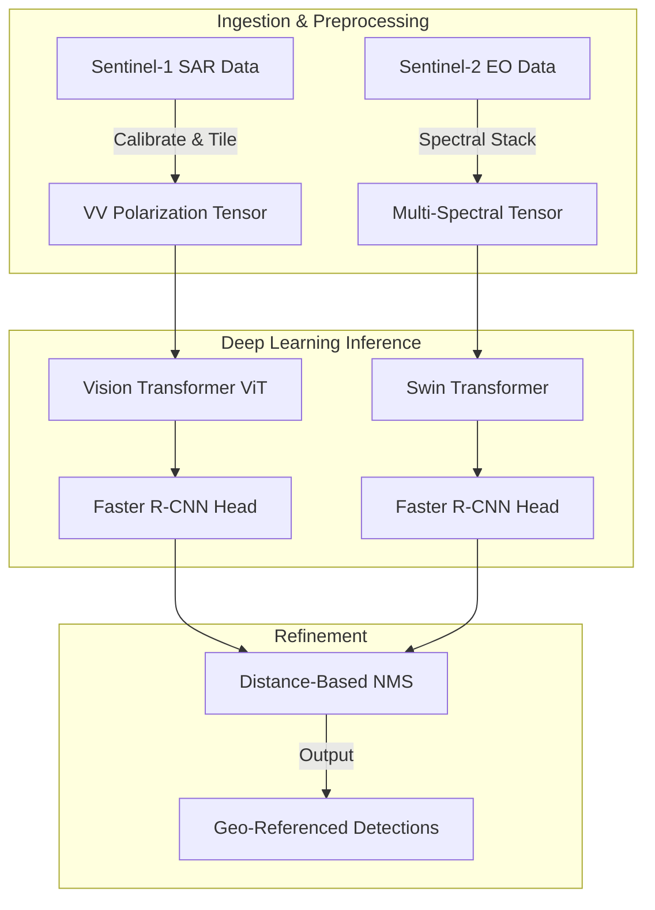
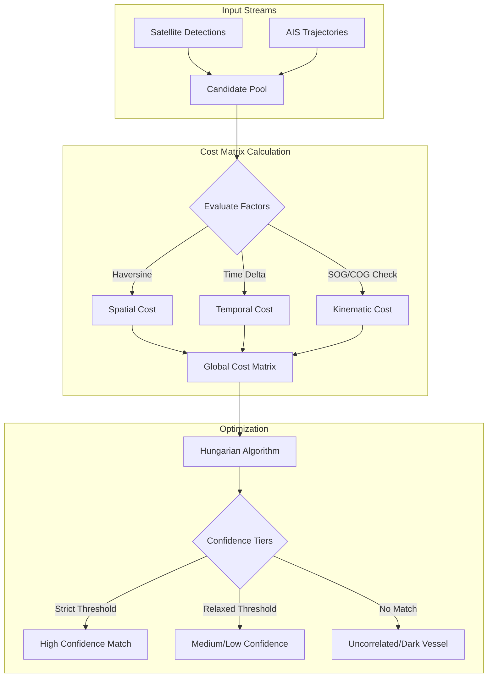
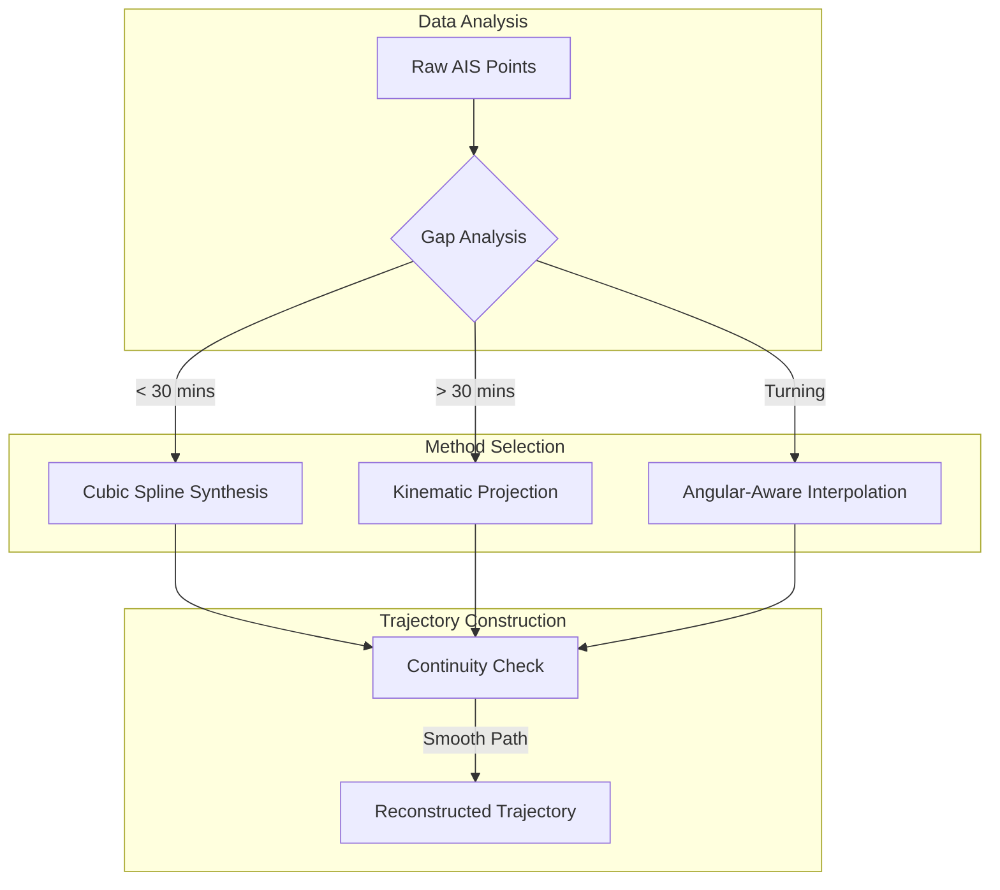

<LLMOnly
  data={`
type: deep-dive
difficulty: intermediate
keyTakeaways:
  - Understand OS² maritime domain awareness architecture
  - Learn multi-modal detection with SAR and EO imagery
  - Explore correlation algorithms for vessel identification
prerequisites: Basic understanding of geospatial data and computer vision
targetAudience: Maritime security professionals and geospatial analysts
`}
/>

The terrestrial world is a solved cartographic problem; we live in an age of ubiquity where every street corner is digitized and indexed. Yet, the maritime domain, covering seventy percent of our planet, remains an expanse of profound opacity. For centuries, naval operators and sovereign states have accepted this blindness as an immutable constraint, a chaotic commons where threats materialize from the fog and vanish just as quickly.

However, we stand at a technological inflection point. The question is no longer _how_ we monitor the oceans, but _how much_ fidelity we can extract from the electromagnetic spectrum. At AstraQ Cyber Defence, we have engineered **OS²**, a system that does not merely scan the waves but attempts to _comprehend_ them. This is an overview of our tripartite architecture: a synergy of deep learning detection, stochastic correlation, and physics-based interpolation that transforms fragmented data into a coherent narrative of the seas.

## The Surveillance Paradox

The fundamental challenge of Maritime Domain Awareness (MDA) is the asymmetry between the vastness of the operational theater and the scarcity of observation resources. Current monitoring is fragmented. We rely on manual observation constrained by human endurance, periodic satellite snapshots that capture only frozen moments in time, and the Automatic Identification System (AIS): a digital handshake that is easily silenced by those wishing to remain unseen.

These limitations create dangerous "blind spots": regions of uncertainty where illicit transshipments, unauthorized incursions, and ecological violations occur with impunity. To illuminate these dark zones, we must move beyond simple observation to **algorithmic omniscience**.

### Pillar I: The Seeing Eye (Multi-Modal Detection)

The first step in demystifying the ocean is **Vessel Detection**. This is not a trivial task of edge detection; it is the computational challenge of distinguishing a vessel's radiometric signature from the chaotic noise of ocean clutter, whitecaps, and atmospheric attenuation.

Our architecture eschews the fragility of single-sensor reliance. We employ a **dual-sensor framework**:

1. **Synthetic Aperture Radar (SAR):** Utilizing Sentinel-1 imagery, we pierce through cloud cover and darkness. By processing the backscatter intensity, specifically the Vertical-Vertical (VV) polarization, we can detect the hard, metallic returns of vessels against the soft scattering of the sea surface.
2. **Electro-Optical (EO):** When meteorological conditions permit, we leverage Sentinel-2's multispectral capabilities. This allows for high-resolution characterization, extracting not just the presence of a ship, but its length, width, and heading.

We utilize **Vision Transformers (ViT)** and **Swin Transformers** rather than standard Convolutional Neural Networks (CNNs). Why? Because convolution is local, but the context of the sea is global. Transformers allow the model to understand long-range dependencies within an image, distinguishing a vessel from a wave pattern by understanding the texture of the entire ocean scene.

### Pillar II: The Connecting Thread (Correlation)

Detecting a vessel gives us a location: a geometry in space. But a coordinate without an identity is merely a dot on a map. To bestow identity upon these anonymous detections, we must bridge the gap between the optical observation and the digital AIS broadcast.

This is the **Correlation Engine**. It solves a complex **Bipartite Matching Problem**. Consider the difficulty: a satellite image captures a vessel at 14:00 UTC. The nearest AIS ping from that vessel might be from 13:45 UTC or 14:15 UTC. The vessel has moved. The satellite detection has a margin of error. The AIS GPS has drift.

Our system does not simply snap the detection to the nearest AIS point. It calculates a multi-dimensional **Cost Matrix**. We evaluate the plausibility of a match based on:

- **Spatial Proximity:** The Haversine distance between the points.
- **Temporal Displacement:** Penalizing matches where the time gap renders the position uncertain.
- **Kinematic Coherence:** Does the vessel's velocity vector align with the detection? A ship moving North cannot be the same vessel detected South of its last known position.

We utilize the **Hungarian Algorithm** to optimize these assignments globally, ensuring the most mathematically probable configuration of identities is established.

### Pillar III: The Predictive Compass (Interpolation)

The final component addresses the silence between the signals. AIS data is sparse; a vessel might transmit every few seconds, or go silent for hours. To understand the vessel's journey, we must reconstruct the path it traveled during those silences.

Linear interpolation, drawing a straight line between two points, is an insult to physics. Ships have mass; they have inertia; they must contend with drag and turning radii. They do not pivot instantly or travel on rails.

Our **Interpolation Engine** treats the vessel as a physical object. We employ **Cubic Spline Synthesis** to model the trajectory. By enforcing continuity in position, velocity, and acceleration, we generate a curved path that minimizes the "bending energy," simulating the actual hydrodynamics of a hull moving through water. This allows us to predict where a vessel _was_ and where it _will be_, turning sparse data into a continuous narrative.

## Digital Sovereignty and National Resilience

At AstraQ, digital sovereignty is foundational. Maritime security cannot be outsourced. Nations requiring external intelligence services or proprietary foreign analytics lose strategic independence.

OS² operates on publicly available data: Sentinel imagery (freely accessible), standard AIS protocols. It requires no proprietary sources or foreign dependencies.

This is not merely technical, it is strategic. A nation unable to independently analyze its maritime domain is a nation unable to independently control it.

## Understanding Limits and Ensuring Accountability

OS² is powerful but bounded:

- **Detects patterns; does not determine intent.** Loitering in protected zones may indicate illegal fishing, legitimate research, or mechanical problems. Systems identify deviations; humans evaluate context.

- **Works with available data; cannot penetrate sophisticated denial.** Spoofed transponders, selective AIS disablement, false manifests remain partially opaque. The system improves odds; does not guarantee transparency.

- **Operates as decision-support, not autonomous enforcement.** Appropriate use: informing analyst and commander judgment. Inappropriate use: autonomous enforcement without human review. Systems should inform decisions, not replace decision-makers.

Transparency is core: every detection, correlation, and trajectory includes confidence scoring and uncertainty quantification. Analysts understand not just conclusions but supporting evidence, enabling calibrated confidence and human override when contextual knowledge conflicts with system assessment.

## Transforming Maritime Security

Maritime domain awareness stands at an inflection point. Historically, operators accepted oceanic opacity as immutable constraint. Satellite constellation maturation, deep learning advancement, and sophisticated analytical frameworks like OS² are reversing fundamental asymmetries.

This represents more than incremental efficiency improvement. It constitutes a shift in what becomes knowable about maritime activity: transforming fragmented observations into continuous intelligence, converting blind spots into monitored domains, enabling anticipation where reaction once dominated.

The ocean's vastness no longer guarantees concealment. Satellite persistence no longer permits evasion. The era of comprehensive maritime domain awareness has arrived, reshaping strategic landscapes for security professionals, commercial operators, and governance bodies adapting to operating in unprecedented transparency: where vessel movements, once shrouded in oceanic expanse, become computationally observable, analytically tractable, and operationally actionable.

By integrating these three pillars, OS² transforms the ocean from a chaotic expanse into a structured database. We move from reactive observation to proactive intelligence. The synergy of these systems ensures that even if a vessel darkens its transponder, or if the clouds roll in, the continuity of tracking remains unbroken.

This framework represents more than an incremental improvement; it is a fundamental shift in what becomes knowable about oceanic activities. The era of comprehensive maritime domain awareness has arrived, reshaping the strategic landscape for security professionals who must now adapt to an environment of unprecedented transparency.
