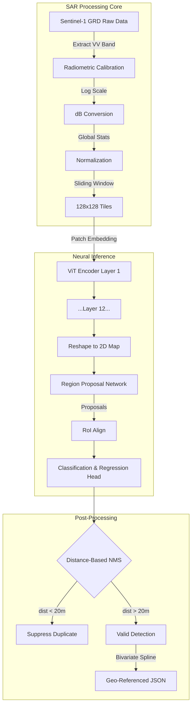
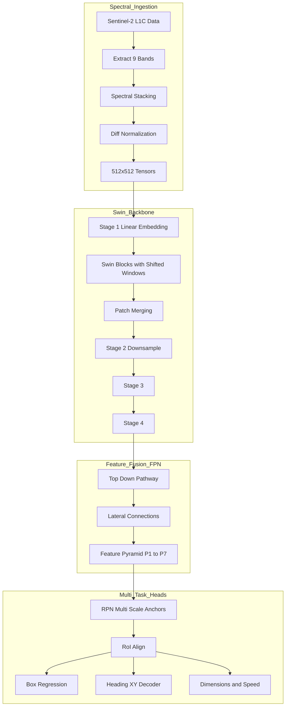

<LLMOnly
  data={`
type: deep-dive
difficulty: advanced
keyTakeaways:
  - Implement Vision Transformer (ViT) for SAR vessel detection
  - Build Swin Transformer with Feature Pyramid Networks for EO imagery
  - Apply distance-based NMS and multi-scale anchor strategies
prerequisites: Deep learning, computer vision, satellite imagery fundamentals
targetAudience: ML engineers working on remote sensing and maritime surveillance
`}
/>

The ocean is not a void; it is a canvas of chaotic entropy. To the unassisted human eye, it is a monotonous expanse of blue, broken only by the transient white of capping waves. But to the sensors orbiting hundreds of kilometers above the lithosphere, the ocean is a dynamic theater of radiometric noise, atmospheric attenuation, and spectral interference. The fundamental challenge of **Maritime Domain Awareness (MDA)** is not merely observation: it is _discrimination_. It is the computational imperative to distinguish the structured, geometric signature of a vessel from the stochastic, organic texture of the sea.

In the first installment of this series, we introduced the high-level architecture of **OS²**, AstraQ's solution to the maritime surveillance paradox. Today, we descend into the mathematical and architectural depths of its first pillar: **Vessel Detection**.

This is not a task that can be solved by a single modality. The maritime environment is fickle; it hides behind clouds, it darkens at night, and it dazzles under the specular reflection of the sun. To pierce this veil, our solution employs a **dual-sensor strategy**, synthesizing the all-weather persistence of **Synthetic Aperture Radar (SAR)** with the high-fidelity characterization of **Electro-Optical (EO)** multispectral imagery.

This treatise will bifurcate the analysis: first, examining the physics and processing of radar returns through the lens of Sentinel-1, and second, exploring the spectral richness of Sentinel-2 through hierarchical transformer architectures.

## Part I: The Piercing Gaze - Synthetic Aperture Radar (SAR)

### The Physics of Radar Backscatter

To understand why we use SAR, one must appreciate the limitations of light. Optical sensors are passive; they rely on reflected solar energy. When the sun sets or the stratus clouds thicken, optical sensors are blinded. SAR, conversely, is an active sensor. It illuminates the Earth with microwave pulses and records the echo.

In the context of maritime detection, we are interested in **backscatter**: the portion of the radar energy reflected directly back to the sensor. The ocean surface acts largely as a specular reflector; most of the radar energy glances off the water and travels away from the sensor, resulting in a dark image (low backscatter). However, wind-driven waves create roughness, causing Bragg scattering which manifests as noise, or "sea clutter."

Vessels, constructed of hard, metallic angles, behave as **corner reflectors**. When a radar pulse strikes the superstructure of a ship, it bounces off the deck, hits the bridge, and returns strongly to the source. This "double-bounce" mechanism creates a bright, high-intensity signal against the darker oceanic background.

However, SAR imagery is plagued by **speckle noise**: a granular interference pattern caused by the coherent nature of the radar waves interfering constructively and destructively Detecting a vessel in SAR is not simply finding a bright spot; it is statistically differentiating a structural anomaly from the multiplicative noise of the sea state.

### The Sentinel-1 Pipeline: From Raw Signal to Tensor

Our pipeline ingests **Sentinel-1 Ground Range Detected (GRD)** products. These files are not images in the traditional sense; they are radiometric measurements. To make them digestible for a neural network, they must undergo a rigorous transformation.

#### Radiometric Calibration

- Extract the VV (Vertical-Vertical) polarization band and convert linear amplitude values to decibel scale using logarithmic compression, which mitigates the extreme dynamic range of radar returns (from faint ocean signals to bright vessel reflections) that would otherwise cause gradient explosion in neural networks.
- We extract the **VV (Vertical-Vertical) polarization** band, which is generally more sensitive to ship structures.
- This transformation brings the faint signals of the ocean and the bright signals of the vessels into a unified numerical range.

#### Statistical Normalization

- Neural networks crave inputs with zero mean and unit variance. SAR data, even in decibels, does not naturally conform to this distribution.
- Apply global statistical normalization ($\mu_{global} = 0.0025$, $\sigma_{global} = 0.0053$) derived from maritime datasets to achieve zero mean and unit variance, with outlier clipping to the range $[-0.002, 0.02]$ to remove radar artifacts and land-based interference.

#### Tiling and Georeferencing

- Processing a full satellite swath (which can be hundreds of kilometers wide) in a single pass is computationally intractable. We employ a sliding window approach.
- Partition the satellite swath into $128 \times 128$ pixel tiles with 115-pixel stride overlap to ensure complete vessel capture across tile boundaries, then use Bivariate Spline Interpolation on Ground Control Point grids from SAFE metadata to precisely map pixels back to WGS84 coordinates.
- Crucially, we must retain the geospatial context. We utilize **Bivariate Spline Interpolation** on the Ground Control Point (GCP) grids provided in the SAFE metadata. This allows us to map any pixel $(x, y)$ in a $128 \times 128$ tile back to its precise WGS84 Latitude and Longitude.

### The Architecture: Vision Transformer (ViT) Backbone

For feature extraction, we abandon the local receptive fields of Convolutional Neural Networks (CNNs) in favor of the global context modeling of the **Vision Transformer (ViT)**. In a maritime scene, the "context" of the water texture is just as important as the object itself. A CNN looking at a small patch of rough water might mistake a wave for a boat. A Transformer, attending to the entire $128 \times 128$ tile, understands that the wave is part of a larger pattern, while the vessel is a distinct anomaly.

#### Patch Embedding

The input image $I \in \mathbb{R}^{128 \times 128}$ is sliced into non-overlapping patches of size $4 \times 4$. This yields a sequence of $32 \times 32 = 1024$ patches. Each patch is flattened into a vector and projected into a higher-dimensional embedding space (768 dimensions) via a learned linear transformation $E$.

To retain spatial information (since Transformers are permutation invariant), we add learnable positional embeddings $E_{pos}$:

$$
z_0 = [x_{patch}^1 E; x_{patch}^2 E; ...; x_{patch}^{1024} E] + E_{pos}
$$

#### Multi-Head Self-Attention (MHSA)

The core of the ViT is the self-attention mechanism, which computes the relationship between every patch and every other patch. This allows the model to "attend" to distant features simultaneously.

$$
Attention(Q, K, V) = \text{softmax}\left(\frac{QK^T}{\sqrt{d_k}}\right)V
$$

Here, $Q$ (Query), $K$ (Key), and $V$ (Value) are matrices derived from the input embeddings. The term $\sqrt{d_k}$ acts as a scaling factor to prevent vanishing gradients in the _softmax_ function.Our architecture employs 12 attention heads, allowing the model to capture different types of relationships (e.g., one head might focus on texture, another on geometric edges).

The output passes through a Feed-Forward Network (FFN) with GELU activation, introducing the necessary non-linearity to model complex radar signatures.After 12 layers of this processing, the sequence is reshaped back into a 2D feature map $F \in \mathbb{R}^{32 \times 32 \times 768}$, ready for the detection head.

#### The Detection Head: Faster R-CNN

We attach a `Faster R-CNN` detection head to the ViT backbone. This two-stage detector is renowned for its accuracy, a non-negotiable requirement for security applications.

**Region Proposal Network (RPN)**
The RPN slides over the feature map, evaluating "anchor boxes" of varying aspect ratios (0.5, 1.0, 2.0). It outputs two things for each anchor:

1.  **Objectness Score:** The probability that the anchor contains a foreground object (vessel).
2.  **Box Deltas:** The coordinate adjustments $(dx, dy, dw, dh)$ needed to fit the anchor to the ground truth.

The loss function for the RPN is a composite of classification and regression losses:

$$
\mathcal{L}^{RPN} = \mathcal{L}_{cls} + \lambda \mathcal{L}_{reg}
$$

The regression loss employs **Smooth L1 Loss**, which is robust to outliers: a critical feature when dealing with the noisy variance of SAR data.

**Distance-Based Non-Maximum Suppression (NMS)**
Standard NMS uses Intersection-over-Union (IoU) to eliminate duplicate detections. If two boxes overlap significantly, the one with the lower score is discarded. However, this fails in maritime scenarios. Ships are often long and thin. If a ship is oriented diagonally, a standard bounding box might be large and mostly empty. A second, overlapping detection might have a low IoU but essentially describe the same vessel.

We implement **Distance-Based NMS**. Instead of area overlap, we look at the Euclidean distance between the centers of the bounding boxes:

$$
d_{ij} = \sqrt{(x_i - x_j)^2 + (y_i - y_j)^2}
$$

If $d_{ij} < t_{dist}$ (set to 20 meters for Sentinel-1), we suppress the lower-confidence box. This aligns with physical reality: two distinct vessels cannot occupy the same coordinate space within a 20-meter radius.

## Part II: The Spectral Analyst - Electro-Optical (EO) Detection

While SAR provides the "where," Sentinel-2 EO imagery provides the "what." Optical data offers intuitive visual confirmation and, crucially, spectral depth. A vessel is not just a shape; it is a material composition: steel, paint, rust, sitting atop water. Sentinel-2's multispectral instrument (MSI) allows us to exploit these spectral contrasts.

### The Multispectral Advantage

Sentinel-2 captures light across 13 spectral bands. For our **OS²** solution, we extract nine specific bands tailored for maritime discrimination:

- **Visible (RGB - B02, B03, B04):** For standard visual features and hull coloration.
- **Red-Edge (B05, B06, B07):** Capturing the transition from red to near-infrared. These bands are sensitive to vegetation (algae on hulls) and subtle material differences.
- **Near-Infrared (B08):** Provides extreme contrast between water (which absorbs NIR) and land or floating objects (which reflect it).
- **Shortwave Infrared (SWIR - B11, B12):** These bands penetrate atmospheric haze better than visible light and are sensitive to moisture content, aiding in distinguishing metal from water.

We perform **differential normalization**. The RGB bands, which have similar dynamic ranges, are normalized with one set of constants ($\sigma_{RGB}=3000$), while the other bands, which often have higher reflectance values, use a different scaling factor ($\sigma_{other}=8160$). This preserves the relative spectral signatures that the model relies on for classification.

### The Architecture: Swin Transformer

For EO detection, we face a scale problem. A small fishing boat might be 10 meters long (1 pixel), while a container ship might be 300 meters (30 pixels). A standard Vision Transformer (ViT) processes the image at a single scale. Instead, we utilize the **Swin Transformer (Shifted Window Transformer)**, a hierarchical architecture designed to create multi-scale feature pyramids.

**Shifted Window Attention** The Swin Transformer improves upon ViT efficiency by computing self-attention only within local windows (e.g., $7\times7$ patches), rather than globally. This reduces computational complexity from quadratic to linear with respect to image size.

To allow information to propagate between windows, the architecture shifts the window partitioning by$(M/2,M/2)$ pixels in alternating layers.

- **Layer $l$:** Regular window partitioning.
- **Layer $l+1$:** Shifted window partitioning.

This mechanism, mathematically represented as **SW-MSA** (Shifted Window Multi-Head Self Attention), enables the network to build a global understanding of the image step-by-step, capturing fine details of small boats in the early layers and the large-scale context of the ocean in the deeper layers.

**Hierarchical Downsampling** The Swin Transformer is structured in stages. After each stage, a "Patch Merging" layer concatenates features from $2\times2$ neighboring patches and applies a linear projection. This reduces the spatial resolution by half while doubling the channel depth.

- **Stage 1:** 128×128 resolution (Fine details).
- **Stage 2:** 64×64 resolution.
- **Stage 3:** 32×32 resolution.
- **Stage 4:** 16×16 resolution (Semantic context) .

This produces a hierarchy of feature maps ${C1,C3,C5,C7}$ similar to a ConvNet, which is essential for the next component: the Feature Pyramid Network.

### Feature Pyramid Network (FPN) and Multi-Scale Detection

To detect vessels of all sizes simultaneously, we employ a **Feature Pyramid Network (FPN)**. The FPN takes the hierarchical features from the Swin Transformer and fuses them via a top-down pathway with lateral connections.

Mathematically, a higher-level feature map P5 is upsampled (resized larger) and added element-wise to the lower-level map C3 (after a 1×1 convolution to match channels).

$$P3=Conv_{1 \times 1}(C3)+Upsample(P5)$$

This creates a pyramid of features ${P1,P3,P5,P7}$ where every level is semantically strong _and_ spatially resolute.

We attach a separate Faster R-CNN head to each level of this pyramid, with **anchor sizes tailored to the level**:

- **P1 (High Res):** Uses small anchors ($32$ pixels). Optimized for dinghies and small craft.
- **P7 (Low Res):** Uses massive anchors ($256$ pixels). Optimized for supertankers.

This **scale-adaptive detection** strategy ensures that a supertanker doesn't overwhelm the detector looking for a fishing boat, and a fishing boat isn't lost in the receptive field of a detector looking for a carrier.

### Beyond Detection: Attribute Extraction

In the EO domain, we do not stop at bounding boxes. We extract intelligence. We replace the standard classification head with a **Multi-Task Decoder**.

Using **Adaptive Average Pooling** to distill the feature map of a detected vessel into a fixed vector, we feed this representation into parallel regression heads:

1.  **Length & Width:** Predicted using **Smooth L1 Loss** against scaled targets ($meters/100$).
2.  **Speed (SOG):** Inferred from wake patterns. A longer, more turbulent wake correlates with higher speed.
3.  **Heading:** This is a circular variable ($0\degree=360\degree$). Standard regression fails here (predicting $359 \degree$ when the truth is $1 \degree$ results in a huge error, though they are close). We solve this by regressing the heading into Cartesian components:

$$
    x=cos(\theta_{ENU} \cdot \frac{\pi}{180})
$$

$$
    y=sin(\theta_{ENU} \cdot \frac{\pi}{180})
$$

    This decomposition allows the network to learn orientation without the discontinuity of the angular wraparound.

### Conclusion: The Synthesis of Sight

The **OS²** detection architecture is a testament to the power of specialized intelligence. We do not force a single model to carry the burden of the entire electromagnetic spectrum. Instead, we deploy an ensemble of masters: the Vision Transformer for the noisy, abstract world of radar, and the Swin Transformer for the detailed, multi-scaled world of optics.

By anchoring our deep learning models in the physical realities of the domain, using distance-based suppression for maritime geometries, cartesian decomposition for angular headings, and decibel calibration for radar reflectivity, we achieve a robustness that purely data-driven approaches cannot match.

Yet, a detection is merely a snapshot in time. A ship detected at $14:00$ is a ghost by $14:05$. To transform these static coordinates into a living, breathing understanding of maritime flow, we must connect the dots. In the next installment, we will explore the **Correlation Engine**, the mathematical weaver that binds these isolated detections to their digital identities.
