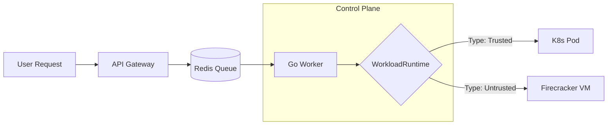

<LLMOnly
  data={`
type: guide
difficulty: intermediate
keyTakeaways:
  - Design polymorphic workload runtime interfaces in Go
  - Build Redis-backed event loops for task orchestration
  - Implement auto-close lifecycle management with heartbeats
prerequisites: Go programming, Kubernetes basics, Redis fundamentals
targetAudience: Platform engineers building AI agent infrastructure
`}
/>

In the era of AI agents and on-demand data processing, static infrastructure doesn't cut it. You might need to spin up a secure sandbox for a user's code one second, and a heavy data aggregation job the next. Standard Kubernetes Deployments are great for long-running services, but they struggle with the dynamic, ephemeral nature of these "per-request" workloads.

In this guide, we'll build a **Polymorphic Workload Orchestrator** in Go. This control plane will allow us to dynamically spawn, manage, and scale down isolated execution environments, whether they are standard Kubernetes Pods or secure MicroVMs, using a unified interface.

## The Problem: "One Size Fits None"

Imagine you're building a platform that needs to handle two distinct types of tasks:

1.  **Trusted Internal Tasks:** Data aggregation, report generation. Fast startup is key; isolation is less critical.
2.  **Untrusted User Code:** AI agents executing Python scripts. Security and hard isolation are non-negotiable.

Hardcoding `kubectl apply` commands for every new feature creates a maintenance nightmare. We need an abstraction layer.

## The Solution: A Go Control Plane

<Callout variant="info" title="Architecture Overview" icon="info">
  We will build a "Control Plane" service in Go that consumes tasks from a Redis
  queue and provisions infrastructure accordingly.
</Callout>

### The Architecture



## Implementation Guide

<Steps>

<Step>Defining the Interface</Step>

The core of our polymorphic design is the `WorkloadRuntime` interface. This allows our application logic to remain agnostic to the underlying infrastructure.

```go
package runtime

import "context"

// Spec defines the requirements for the workload
type Spec struct {
    Image       string
    Env         map[string]string
    Resources   ResourceRequests
    Type        WorkloadType // "trusted" or "untrusted"
}

// WorkloadRuntime abstracts the infrastructure provider
type WorkloadRuntime interface {
    // Provision spawns the infrastructure
    Provision(ctx context.Context, id string, spec Spec) error

    // Status checks if the workload is ready
    Status(ctx context.Context, id string) (Status, error)

    // Teardown cleans up resources (auto-close logic)
    Teardown(ctx context.Context, id string) error
}
```

By coding to this interface, we can simply swap implementations based on the `Spec.Type`.

<Step>The Kubernetes Implementation</Step>

For our "Trusted" workloads, we'll implement this interface using `client-go` to manage Kubernetes Pods directly. This is faster and more lightweight than full Deployments for ephemeral tasks.

```go
package kubernetes

import (
    "context"
    corev1 "k8s.io/api/core/v1"
    metav1 "k8s.io/apimachinery/pkg/apis/meta/v1"
    "k8s.io/client-go/kubernetes"
)

type K8sRuntime struct {
    clientset *kubernetes.Clientset
    namespace string
}

func (k *K8sRuntime) Provision(ctx context.Context, id string, spec runtime.Spec) error {
    pod := &corev1.Pod{
        ObjectMeta: metav1.ObjectMeta{
            Name: "job-" + id,
            Labels: map[string]string{
                "managed-by": "orchestrator",
                "job-id":     id,
            },
        },
        Spec: corev1.PodSpec{
            RestartPolicy: corev1.RestartPolicyNever,
            Containers: []corev1.Container{
                {
                    Name:    "main",
                    Image:   spec.Image,
                    Env:     toK8sEnv(spec.Env),
                },
            },
        },
    }

    _, err := k.clientset.CoreV1().Pods(k.namespace).Create(
        ctx,
        pod,
        metav1.CreateOptions{},
    )
    return err
}
```

<Step>The Event Loop (Redis)</Step>

To handle scale and backpressure, we don't spawn pods directly from the HTTP handler. We use an asynchronous event loop with Redis.

**The Producer (API Layer):**
Instead of `kubectl apply`, we push a JSON payload to Redis.

```go
task := Task{
    ID:   "req-123",
    Type: "trusted", // or "untrusted"
    Cmd:  "./process-data",
}
redisClient.LPush(ctx, "workload_queue", json.Marshal(task))
```

**The Consumer (Control Plane):**
The worker reads from Redis and selects the right runtime.

```go
func (w *Worker) Start(ctx context.Context) {
    for {
        // Blocking pop from Redis
        result, _ := w.redis.BRPop(ctx, 0, "workload_queue").Result()

        var task Task
        json.Unmarshal([]byte(result[1]), &task)

        // POLYMORPHISM IN ACTION
        var runtime WorkloadRuntime
        if task.Type == "untrusted" {
             // In Part 2: runtime = NewFirecrackerRuntime()
             log.Printf("Using Secure Sandbox for %s", task.ID)
        } else {
             runtime = w.k8sRuntime
        }

        go w.handleTask(ctx, runtime, task)
    }
}
```

<Step>Auto-Close and Lifecycle</Step>

One of the biggest challenges with ephemeral workloads is "zombie" resources. We can implement a "Lease" pattern using Redis Keys with TTL (Time To Live).

1.  **Heartbeat:** The running Pod sends a heartbeat to Redis every 10s.
    `SET session:req-123:heartbeat OK EX 30`
2.  **Reaper:** A control plane goroutine checks for expired keys.
3.  **Teardown:** If the key expires, call `runtime.Teardown(id)`.

```go
func (w *Worker) ReapZombies(ctx context.Context) {
    ticker := time.NewTicker(30 * time.Second)
    for range ticker.C {
        // Logic to find active jobs without heartbeats
        // call runtime.Teardown()
    }
}
```

</Steps>

## Deploying the Control Plane

To make this work in a real cluster, our Go orchestrator needs permission to spawn Pods. Here are the manifests:

### 1. RBAC Permissions

The worker needs a `ServiceAccount` bound to a `Role` that can `create`, `get`, and `delete` pods.

```yaml filename=manifests/rbac.yaml
apiVersion: v1
kind: ServiceAccount
metadata:
  name: workload-orchestrator
  namespace: default
---
apiVersion: rbac.authorization.k8s.io/v1
kind: Role
metadata:
  name: pod-manager
  namespace: default
rules:
  - apiGroups: [""]
    resources: ["pods"]
    verbs: ["create", "get", "list", "delete"]
---
apiVersion: rbac.authorization.k8s.io/v1
kind: RoleBinding
metadata:
  name: orchestrator-binding
  namespace: default
subjects:
  - kind: ServiceAccount
    name: workload-orchestrator
    namespace: default
roleRef:
  kind: Role
  name: pod-manager
  apiGroup: rbac.authorization.k8s.io
```

### 2. The Deployment

Deploy the Go binary. Ensure it has the `REDIS_URL` environment variable.

```yaml filename=manifests/deployment.yaml
apiVersion: apps/v1
kind: Deployment
metadata:
  name: orchestrator
  namespace: default
spec:
  replicas: 1
  selector:
    matchLabels:
      app: orchestrator
  template:
    metadata:
      labels:
        app: orchestrator
    spec:
      serviceAccountName: workload-orchestrator
      containers:
        - name: manager
          image: astraq/orchestrator:v1
          env:
            - name: REDIS_URL
              value: "redis://redis-service:6379"
```

### 3. Testing It Out

Detailed commands to deploy and verify:

```shell
# 1. Apply RBAC and Deployment
kubectl apply -f manifests/rbac.yaml
kubectl apply -f manifests/deployment.yaml

# 2. Tail the logs to see the worker starting
kubectl logs -f -l app=orchestrator

# 3. Trigger a workload manually via Redis (for testing)
# We assume you have a redis pod running at 'redis-service'
kubectl run redis-client --image=redis --restart=Never -- redis-cli -h redis-service \
  LPUSH workload_queue '{"id":"test-1", "type":"trusted", "image":"alpine", "cmd":["echo", "hello"]}'
```

## Conclusion and What's Next

We've built a robust foundation. Our Application Layer is decoupled from the Infrastructure Layer via the `WorkloadRuntime` interface. We can currently spawn generic Kubernetes Pods for trusted tasks.

But what about those _untrusted_ AI agents? Running `rm -rf /` in a container is still dangerous.

In <EmbedBlog slug="secure-microvm-runtime" placeholder="Part 2" />, we will implement the `FirecrackerRuntime` struct. We'll show how to use the exact same interface to spin up micro-VMs that offer hardware-level isolation for hostile workloads, without changing a single line of our API code.
