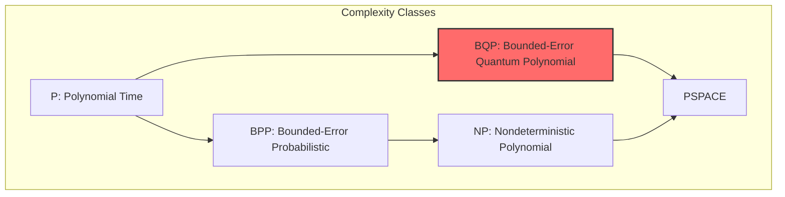
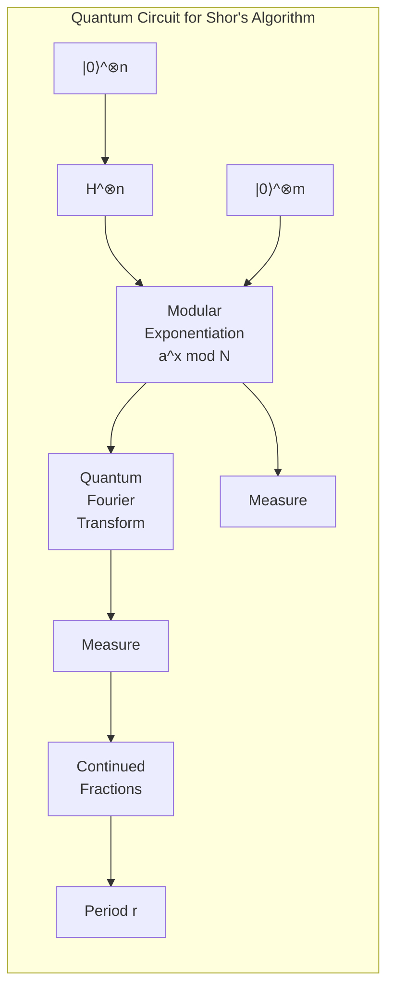
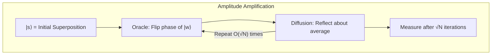
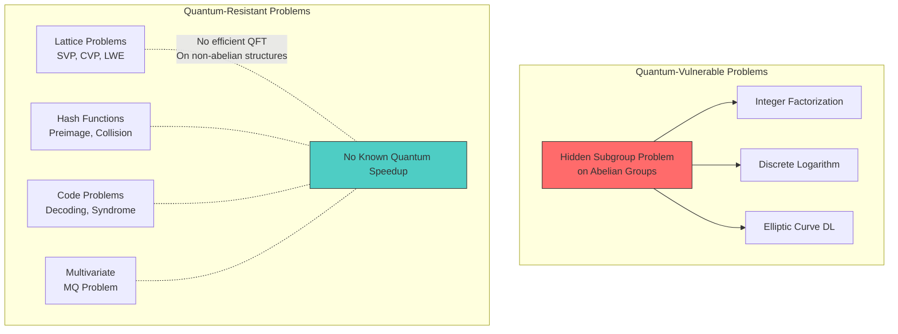
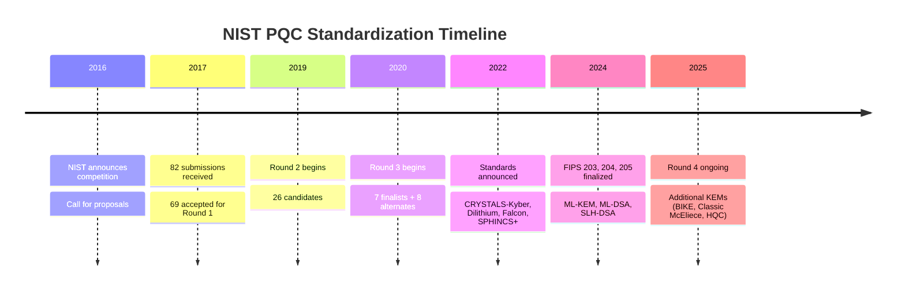
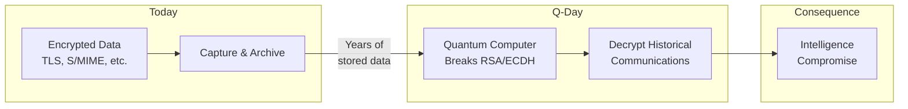

<LLMOnly
  data={`
type: deep-dive
difficulty: advanced
keyTakeaways:
  - Understand the mathematical basis of Shor's algorithm and its threat to RSA/ECC
  - Learn how Grover's algorithm affects symmetric cryptography
  - Grasp the complexity-theoretic foundations of post-quantum security
  - Comprehend the NIST PQC standardization process and timeline
  - Analyze the Q-Day threat model and migration considerations
prerequisites: Abstract algebra, number theory fundamentals, basic quantum mechanics concepts
targetAudience: Cryptography engineers, security researchers, and mathematically-inclined developers
`}
/>

<Callout
  variant="warning"
  title="The Cryptographic Countdown"
  icon="shield-alert"
>
  The emergence of cryptographically relevant quantum computers (CRQCs) poses an
  existential threat to RSA, ECDSA, and Diffie-Hellman—the cryptographic
  foundations of internet security. Organizations must begin migration to
  post-quantum algorithms **now**, as encrypted data harvested today can be
  decrypted once quantum computers mature ("harvest now, decrypt later").
</Callout>

The year is 2026, and we stand at a pivotal moment in cryptographic history. The algorithms that have secured our digital infrastructure for decades—RSA, elliptic curve cryptography (ECC), and Diffie-Hellman key exchange—face an unprecedented threat from quantum computing. This isn't speculative science fiction: NIST has already finalized three post-quantum cryptographic standards (FIPS 203, 204, 205), Google has demonstrated 105-qubit quantum processors, and nation-states are actively stockpiling encrypted communications for future decryption.

This three-part series provides an exhaustive mathematical treatment of post-quantum cryptography (PQC). In Part 1, we establish the threat model by examining Shor's and Grover's algorithms, exploring the complexity-theoretic foundations of cryptographic security, and understanding why certain mathematical problems remain hard even for quantum computers.

## The Quantum Computing Threat Model

### Classical vs. Quantum Computation

Before diving into cryptographic implications, we must understand what makes quantum computers fundamentally different from classical machines.

Classical computers operate on **bits**—binary values that are definitively 0 or 1. Quantum computers operate on **qubits**, which exist in a superposition of states until measured:

$$
|\psi\rangle = \alpha|0\rangle + \beta|1\rangle
$$

where $\alpha$ and $\beta$ are complex probability amplitudes satisfying $|\alpha|^2 + |\beta|^2 = 1$. This superposition, combined with **entanglement** (correlations between qubits that have no classical analog) and **interference** (constructive and destructive combination of quantum amplitudes), enables quantum algorithms to solve certain problems exponentially faster than any known classical algorithm.

```mermaid
graph LR
    subgraph "Classical Bit"
        C0[State: 0 OR 1]
    end

    subgraph "Quantum Qubit"
        Q0[Superposition: α|0⟩ + β|1⟩]
        Q1[Measurement collapses to 0 or 1]
        Q0 --> Q1
    end

    subgraph "n-Qubit Register"
        QR[2ⁿ simultaneous states]
    end
```

For $n$ qubits, the quantum state exists in a $2^n$-dimensional Hilbert space:

$$
|\psi\rangle = \sum_{x \in \{0,1\}^n} \alpha_x |x\rangle
$$

This exponential state space is what gives quantum computers their power—but only for problems with the right mathematical structure to exploit it.

### The Complexity Landscape

Cryptographic security rests on **computational hardness assumptions**—the belief that certain mathematical problems cannot be solved efficiently. We categorize problems by complexity classes:

| Class   | Definition                                 | Classical Example              | Quantum Status    |
| :------ | :----------------------------------------- | :----------------------------- | :---------------- |
| **P**   | Solvable in polynomial time                | Sorting, matrix multiplication | Unchanged         |
| **NP**  | Verifiable in polynomial time              | SAT, graph coloring            | Largely unchanged |
| **BPP** | Probabilistic poly-time with bounded error | Primality testing              | Contained in BQP  |
| **BQP** | Quantum poly-time with bounded error       | Integer factorization          | The quantum class |

The critical insight: **BQP ⊄ P** (we believe). Quantum computers can efficiently solve problems in BQP that classical computers (limited to P or BPP) cannot. The question for cryptography is: which hard problems remain hard for quantum computers?



<Callout variant="info" title="The Quantum Advantage" icon="zap">
  Quantum computers don't make everything faster. They provide exponential
  speedups only for problems with specific mathematical structure—particularly
  those involving **periodicity detection** (exploited by Shor's algorithm) and
  **unstructured search** (exploited by Grover's algorithm).
</Callout>

---

## Shor's Algorithm: Breaking RSA and ECC

Peter Shor's 1994 algorithm represents the most significant theoretical threat to modern cryptography. It provides polynomial-time quantum algorithms for:

1. **Integer Factorization**: Given $N = pq$, find primes $p$ and $q$
2. **Discrete Logarithm**: Given $g^x \mod p$, find $x$
3. **Elliptic Curve Discrete Logarithm**: Given $[k]P$, find $k$

These are precisely the hard problems underlying RSA, Diffie-Hellman, and ECDSA.

### The Mathematics of Shor's Algorithm

Shor's algorithm exploits a deep connection between factorization and **period finding**. The key insight: if we can find the period $r$ of the function $f(x) = a^x \mod N$ for random $a$ coprime to $N$, we can factor $N$ efficiently.

#### Step 1: Reduction to Period Finding

For a random $a$ with $\gcd(a, N) = 1$, the sequence $a^1, a^2, a^3, \ldots \mod N$ is periodic. Let $r$ be the smallest positive integer such that $a^r \equiv 1 \mod N$. This $r$ is called the **order** of $a$ modulo $N$.

**Theorem**: If $r$ is even and $a^{r/2} \not\equiv -1 \mod N$, then:

$$
\gcd(a^{r/2} - 1, N) \quad \text{or} \quad \gcd(a^{r/2} + 1, N)
$$

is a non-trivial factor of $N$.

**Proof Sketch**:

- We have $a^r \equiv 1 \mod N$
- Thus $(a^{r/2})^2 \equiv 1 \mod N$
- So $(a^{r/2} - 1)(a^{r/2} + 1) \equiv 0 \mod N$
- If $a^{r/2} \not\equiv \pm 1 \mod N$, neither factor is divisible by $N$
- Therefore $\gcd(a^{r/2} \pm 1, N)$ gives a proper divisor

This works with probability $\geq 1/2$ for random $a$, so we repeat with different choices until we succeed.

#### Step 2: Quantum Period Finding

Classical period finding requires $O(\sqrt{r})$ time at best. Shor's quantum algorithm finds $r$ in polynomial time using the **Quantum Fourier Transform (QFT)**.

The algorithm proceeds as follows:

1. **Initialize superposition**: Create equal superposition over all possible exponents
   $$|0\rangle|0\rangle \xrightarrow{H^{\otimes n}} \frac{1}{\sqrt{2^n}} \sum_{x=0}^{2^n-1} |x\rangle|0\rangle$$

2. **Compute modular exponentiation**: Apply the unitary that computes $f(x) = a^x \mod N$
   $$\frac{1}{\sqrt{2^n}} \sum_{x=0}^{2^n-1} |x\rangle|a^x \mod N\rangle$$

3. **Measure the second register**: Collapses to some value $s = a^{x_0} \mod N$, leaving the first register in superposition over all $x$ with $a^x \equiv s$
   $$\frac{1}{\sqrt{M}} \sum_{j=0}^{M-1} |x_0 + jr\rangle$$
   where $M \approx 2^n/r$ is the number of valid $x$ values.

4. **Apply Quantum Fourier Transform**: The QFT converts periodicity in the computational basis to peaks in the frequency basis
   $$\text{QFT}: |x_0 + jr\rangle \mapsto \frac{1}{\sqrt{2^n}} \sum_{k=0}^{2^n-1} e^{2\pi i k(x_0 + jr)/2^n} |k\rangle$$

5. **Measure to find period**: The resulting state has peaks at values $k \approx c \cdot 2^n/r$ for integer $c$. Using continued fractions, we recover $r$.



#### Complexity Analysis

| Operation                 | Quantum Complexity         | Classical Equivalent            |
| :------------------------ | :------------------------- | :------------------------------ |
| Modular exponentiation    | $O(n^2 \log n)$ gates      | $O(n^3)$                        |
| Quantum Fourier Transform | $O(n^2)$ gates             | $O(n 2^n)$ FFT                  |
| Continued fractions       | $O(n^3)$ classical         | $O(n^3)$                        |
| **Total**                 | **$O(n^3)$ quantum gates** | **$O(\exp(\sqrt[3]{n}))$ GNFS** |

For a 2048-bit RSA modulus, Shor's algorithm requires roughly $4000$ logical qubits and $10^9$ quantum gates—compared to the classical General Number Field Sieve requiring $2^{112}$ operations.

### Experimental Realizations

Shor's algorithm has been demonstrated experimentally, though only for trivially small numbers:

- **2001 (Vandersypen et al.)**: Factored 15 = 3 × 5 using 7-qubit NMR quantum computer
- **2012 (Lucero et al.)**: Factored 15 using superconducting qubits
- **2019 (various)**: Factored 21 = 3 × 7 using different quantum platforms
- **2023 (IBM)**: Demonstrated components of Shor's algorithm on 127-qubit processor

<Callout variant="warning" title="The Qubit Gap" icon="alert-triangle">
  Current quantum computers have ~1000 noisy physical qubits. Breaking RSA-2048
  requires roughly **20 million** physical qubits with error correction. The gap
  is enormous, but progress is exponential—qubit counts are doubling every 1-2
  years.
</Callout>

### Implications for Elliptic Curve Cryptography

Shor's algorithm also breaks elliptic curve cryptography by solving the **Elliptic Curve Discrete Logarithm Problem (ECDLP)**.

Given an elliptic curve $E$ over a finite field $\mathbb{F}_p$, a base point $G$, and a public key $Q = [k]G$ (scalar multiplication), find the private key $k$.

The quantum algorithm works analogously:

1. Use quantum superposition to evaluate the group operation $[x]G + [y]Q$ for all $(x, y)$
2. Find the period of this two-dimensional function
3. The period reveals the discrete logarithm $k$

For a 256-bit elliptic curve (equivalent to 128-bit classical security), Shor's algorithm requires approximately:

$$
\text{Logical qubits} \approx 2560 \quad ; \quad \text{Quantum gates} \approx 10^{10}
$$

This is actually _easier_ than factoring RSA-2048, because elliptic curve key sizes are smaller for equivalent classical security.

---

## Grover's Algorithm: Threatening Symmetric Cryptography

While Shor's algorithm provides exponential speedups, Grover's 1996 algorithm offers a more modest—but still significant—quadratic speedup for unstructured search problems.

### The Unstructured Search Problem

Given a function $f: \{0, 1\}^n \to \{0, 1\}$ that outputs 1 for exactly one input (the "marked" element), find that input.

- **Classical complexity**: $O(2^n)$ function evaluations (check each possibility)
- **Grover's algorithm**: $O(2^{n/2})$ quantum evaluations

For cryptography, this means:

- **AES-128**: Classically 2^128 security → Quantumly 2^64 security
- **AES-256**: Classically 2^256 security → Quantumly 2^128 security

### Mathematical Framework

Grover's algorithm uses **amplitude amplification** to increase the probability of measuring the marked state.

#### Initial Setup

Start with uniform superposition:

$$
|s\rangle = \frac{1}{\sqrt{N}} \sum_{x=0}^{N-1} |x\rangle = \sqrt{\frac{N-1}{N}}|s'\rangle + \frac{1}{\sqrt{N}}|w\rangle
$$

where $|w\rangle$ is the target state and $|s'\rangle$ is the uniform superposition over non-target states.

#### The Grover Iterate

The algorithm applies two reflection operators repeatedly:

1. **Oracle reflection** $O_w$: Flip the phase of the target state
   $$O_w|x\rangle = \begin{cases} -|x\rangle & \text{if } x = w \\ |x\rangle & \text{otherwise} \end{cases}$$

2. **Diffusion operator** $D$: Reflect about the average amplitude
   $$D = 2|s\rangle\langle s| - I$$

The Grover iterate $G = DO_w$ rotates the state vector toward $|w\rangle$ in the two-dimensional subspace spanned by $\{|s'\rangle, |w\rangle\}$.

#### Geometric Interpretation

Let $\theta$ be defined by $\sin\theta = 1/\sqrt{N}$. Each Grover iterate rotates by $2\theta$:

$$
G^k|s\rangle = \cos((2k+1)\theta)|s'\rangle + \sin((2k+1)\theta)|w\rangle
$$

Maximum probability occurs at $k \approx \frac{\pi}{4}\sqrt{N}$ iterations, where:

$$
\sin((2k+1)\theta) \approx 1
$$



### Impact on Symmetric Cryptography

The Grover speedup has direct implications for symmetric key sizes:

| Algorithm           | Bits | Classical Security | Quantum Security | Mitigation  |
| :------------------ | :--- | :----------------- | :--------------- | :---------- |
| AES-128             | 128  | 2^128              | 2^64             | Use AES-256 |
| AES-192             | 192  | 2^192              | 2^96             | Adequate    |
| AES-256             | 256  | 2^256              | 2^128            | Recommended |
| SHA-256 (preimage)  | 256  | 2^256              | 2^128            | Use SHA-512 |
| SHA-256 (collision) | 128  | 2^128              | 2^85             | Use SHA-512 |

<Callout
  variant="success"
  title="Symmetric Crypto Survives"
  icon="check-circle"
>
  Unlike public-key cryptography, symmetric algorithms require only **doubling
  key sizes** to maintain security against quantum attacks. AES-256 and SHA-512
  provide adequate post-quantum security for most applications.
</Callout>

### Practical Limitations of Grover's Algorithm

Several factors make the Grover threat less immediate than Shor's:

1. **Depth requirements**: Grover needs $O(\sqrt{N})$ sequential oracle queries, making parallelization infeasible
2. **Error accumulation**: Each iteration introduces errors; for $2^{64}$ iterations (breaking AES-128), fault tolerance requirements are extreme

3. **No super-Grover speedups**: Provably, no quantum algorithm can search faster than $O(\sqrt{N})$

---

## Why Current Cryptography Fails

Let's synthesize why the specific hard problems underlying modern cryptography are vulnerable to quantum attacks.

### RSA: Integer Factorization

**Hard Problem**: Given $N = pq$ for large primes $p, q$, find $p$ and $q$.

**Classical Hardness**: The best classical algorithm (General Number Field Sieve) runs in sub-exponential time:

$$
L_N[1/3, (64/9)^{1/3}] = \exp\left(((\ln N)^{1/3})(\ln \ln N)^{2/3} \cdot 1.923\right)
$$

For RSA-2048, this is approximately $2^{112}$ operations.

**Quantum Vulnerability**: Shor's algorithm finds factors in $O((\log N)^3)$ time—a polynomial—by exploiting the hidden periodic structure in modular exponentiation.

### Diffie-Hellman: Discrete Logarithm

**Hard Problem**: Given $g$ (generator), $p$ (prime), and $g^x \mod p$, find $x$.

**Classical Hardness**: Also sub-exponential via Number Field Sieve variants.

**Quantum Vulnerability**: Shor's period-finding algorithm directly solves discrete log in polynomial time.

### ECDSA/ECDH: Elliptic Curve Discrete Log

**Hard Problem**: Given curve $E$, point $G$, and $Q = [k]G$, find $k$.

**Classical Hardness**: Best attacks (Pollard-rho) run in $O(\sqrt{n})$ where $n$ is the group order—fully exponential.

**Quantum Vulnerability**: Shor's algorithm adapts to elliptic curves, providing polynomial-time solution.

### The Common Thread: Hidden Subgroups

All these problems are instances of the **Hidden Subgroup Problem (HSP)**:

> Given a function $f$ that is constant on cosets of a hidden subgroup $H$ of a group $G$, and distinct on different cosets, find $H$.

For abelian groups (like $\mathbb{Z}_N$ or elliptic curve groups), the quantum Fourier transform efficiently solves HSP. This is the deep mathematical reason why Shor's algorithm works.



---

## Post-Quantum Hardness Assumptions

The foundation of post-quantum cryptography rests on problems that appear hard for both classical and quantum computers. We briefly introduce the main families (detailed in Parts 2 and 3).

### Lattice Problems

A **lattice** is a discrete additive subgroup of $\mathbb{R}^n$, defined by a basis $\mathbf{B} = \{\mathbf{b}_1, \ldots, \mathbf{b}_n\}$:

$$
\mathcal{L}(\mathbf{B}) = \left\{ \sum_{i=1}^{n} z_i \mathbf{b}_i : z_i \in \mathbb{Z} \right\}
$$

**Key Hard Problems**:

1. **Shortest Vector Problem (SVP)**: Find the shortest non-zero vector in the lattice
2. **Closest Vector Problem (CVP)**: Given a target point, find the closest lattice point
3. **Learning With Errors (LWE)**: Distinguish $(\mathbf{A}, \mathbf{A}\mathbf{s} + \mathbf{e})$ from random, where $\mathbf{e}$ is small error

The best known quantum algorithms for these problems (using quantum walks and amplitude estimation) provide at most polynomial speedups—nowhere near the exponential speedups of Shor against factoring.

$$
\text{Quantum LWE: } 2^{\Omega(n)} \quad \text{vs} \quad \text{Quantum RSA: } O((\log n)^3)
$$

### Hash Function Preimages

Given $h = H(m)$ for a cryptographic hash, finding $m$ is an unstructured search problem. Grover provides only quadratic speedup:

$$
O(2^{n/2}) \text{ quantum vs } O(2^n) \text{ classical}
$$

This is why hash-based signatures (SPHINCS+/SLH-DSA) are quantum-resistant.

### Error-Correcting Code Problems

**Syndrome Decoding**: Given a parity-check matrix $\mathbf{H}$ and syndrome $\mathbf{s} = \mathbf{H}\mathbf{e}$, find the low-weight error vector $\mathbf{e}$.

No efficient quantum algorithm is known. The McEliece cryptosystem (1978) has resisted 45+ years of cryptanalysis.

### Multivariate Polynomial Equations

**MQ Problem**: Given a system of quadratic polynomials over a finite field, find a common root.

This is NP-complete classically, and no known quantum algorithm provides super-polynomial speedup.

---

## The NIST Post-Quantum Cryptography Standardization

### Historical Timeline

The National Institute of Standards and Technology (NIST) has led the most comprehensive cryptographic standardization effort since AES.



### Standardized Algorithms (FIPS 203, 204, 205)

| Standard     | Algorithm | Original Name      | Type              | Hard Problem   |
| :----------- | :-------- | :----------------- | :---------------- | :------------- |
| **FIPS 203** | ML-KEM    | CRYSTALS-Kyber     | Key Encapsulation | Module-LWE     |
| **FIPS 204** | ML-DSA    | CRYSTALS-Dilithium | Digital Signature | Module-LWE     |
| **FIPS 205** | SLH-DSA   | SPHINCS+           | Digital Signature | Hash functions |

<Callout variant="info" title="NIST Recommendation" icon="book-open">
  NIST recommends **ML-KEM** for key encapsulation and **ML-DSA** as the primary
  digital signature algorithm. **SLH-DSA** is recommended when long-term
  security is paramount, as it relies only on hash function security (no
  algebraic assumptions).
</Callout>

### Security Levels

NIST defines five security levels corresponding to the effort required to break the scheme:

| Level | Target Security | Classical Equivalent     | Example Scheme |
| :---- | :-------------- | :----------------------- | :------------- |
| **1** | ≥ 2^128         | AES-128 block search     | ML-KEM-512     |
| **2** | ≥ 2^192         | SHA-384 collision search | —              |
| **3** | ≥ 2^192         | AES-192 block search     | ML-KEM-768     |
| **4** | ≥ 2^256         | SHA-512 collision search | —              |
| **5** | ≥ 2^256         | AES-256 block search     | ML-KEM-1024    |

These levels account for both classical and quantum attacks, with Grover's algorithm setting the quantum security floor.

### NIST IR 8413 and IR 8545: Status Reports

NIST's technical reports provide detailed security analysis:

**NIST IR 8413 (Third Round)**:

- Analyzed cryptographic strength of all candidates
- Discussed implementation considerations
- Evaluated resistance to side-channel attacks

**NIST IR 8545 (Fourth Round)**:

- Continued evaluation of BIKE, Classic McEliece, HQC
- Focus on code-based alternatives to lattice-based KEM
- Addresses desire for algorithm diversity

---

## The Q-Day Threat Model

"Q-Day" refers to the point when cryptographically relevant quantum computers (CRQCs) can break RSA-2048 or equivalent. The threat exists in multiple dimensions:

### Harvest Now, Decrypt Later (HNDL)

Adversaries with long-term strategic interests are collecting encrypted communications today for future decryption:

1. **Intercept**: Capture TLS traffic, VPN sessions, encrypted emails
2. **Store**: Archive petabytes of encrypted data
3. **Wait**: Until quantum computers can break the session keys
4. **Decrypt**: Access all historical communications

For data with long secrecy requirements (state secrets, medical records, competitive intelligence), this threat is **already active**.



### Migration Timeline Estimates

The cryptographic community debates when CRQCs will emerge:

| Prediction   | Source         | Q-Day Estimate |
| :----------- | :------------- | :------------- |
| Conservative | Most academics | 2040-2050      |
| Moderate     | NIST, NSA      | 2030-2035      |
| Aggressive   | Some industry  | Before 2030    |

<Callout variant="error" title="The Migration Problem" icon="x-circle">
  Large organizations need **5-15 years** to complete cryptographic migrations.
  If Q-Day arrives in 2035, migrations should have started in 2020-2025. The
  window is closing.
</Callout>

### NIST SP 800-208 and Migration Guidance

NIST Special Publication 800-208 provides guidance on hash-based signatures for firmware and software integrity. Key recommendations:

1. **Prioritize high-value, long-lived data** for earliest migration
2. **Implement cryptographic agility** in new systems
3. **Use hybrid schemes** (classical + PQC) during transition
4. **Plan for algorithm replacement** as standards mature

---

## Mathematical Prerequisites for Parts 2 and 3

Before diving into specific PQC families, readers should be comfortable with these mathematical foundations.

### Abstract Algebra Essentials

**Groups**: A set $G$ with operation $\cdot$ satisfying:

- Closure: $a \cdot b \in G$
- Associativity: $(a \cdot b) \cdot c = a \cdot (b \cdot c)$
- Identity: $\exists e$ such that $e \cdot a = a \cdot e = a$
- Inverse: $\forall a$, $\exists a^{-1}$ such that $a \cdot a^{-1} = e$

**Rings**: A set with two operations (addition, multiplication) where addition forms an abelian group and multiplication is associative and distributes over addition.

**Fields**: A ring where non-zero elements form a multiplicative group. Examples: $\mathbb{Q}$, $\mathbb{R}$, $\mathbb{F}_p$ (integers mod prime $p$).

**Polynomial Rings**: $R[x]$ consists of polynomials with coefficients from ring $R$. The quotient ring $R[x]/(f(x))$ is crucial for lattice-based cryptography.

### Linear Algebra over Finite Fields

For lattice-based cryptography, we work with matrices over rings:

$$
\mathbf{A} \in \mathbb{Z}_q^{n \times m}, \quad \mathbf{s} \in \mathbb{Z}_q^m, \quad \mathbf{e} \in \chi^n
$$

where $\chi$ is a discrete error distribution (often Gaussian).

Key operations:

- Matrix-vector multiplication: $\mathbf{A}\mathbf{s}$
- Modular reduction: $(\mathbf{A}\mathbf{s} + \mathbf{e}) \mod q$

### Probability and Distinguishing Advantage

Cryptographic security is often defined via **distinguishing games**:

$$
\text{Adv} = |Pr[\mathcal{A}(D_0) = 1] - Pr[\mathcal{A}(D_1) = 1]|
$$

A problem is hard if all efficient adversaries $\mathcal{A}$ have negligible advantage (e.g., $< 2^{-128}$).

For LWE: distinguish $(\mathbf{A}, \mathbf{A}\mathbf{s} + \mathbf{e})$ from $(\mathbf{A}, \mathbf{u})$ where $\mathbf{u}$ is uniform random.

---

## Conclusion and Series Overview

In this first part, we've established the quantum computing threat to modern cryptography:

- **Shor's algorithm** breaks RSA, Diffie-Hellman, and ECC in polynomial time by solving the Hidden Subgroup Problem
- **Grover's algorithm** provides quadratic speedups against symmetric cryptography, requiring doubled key sizes
- **NIST has standardized** three post-quantum algorithms (ML-KEM, ML-DSA, SLH-DSA) with more under evaluation
- **Migration must begin now** due to the "harvest now, decrypt later" threat

### Coming in Part 2: Lattice-Based Cryptography

We'll dive deep into the mathematical foundations of lattice-based cryptography:

- The geometry of lattices and shortest vector problems
- The Learning With Errors (LWE) problem and its variants
- Worst-case to average-case reductions
- How ML-KEM (Kyber) and ML-DSA (Dilithium) work at the mathematical level
- Implementation considerations and side-channel resistance

### Coming in Part 3: Alternative Mathematical Frameworks

We'll explore non-lattice approaches to post-quantum security:

- **Hash-based signatures** (SPHINCS+/SLH-DSA): Security from Merkle trees
- **Code-based cryptography** (McEliece): Goppa codes and syndrome decoding
- **Isogeny-based cryptography**: Supersingular elliptic curves (and the SIKE break)
- **Multivariate cryptography**: MQ-hard problems

<Callout variant="success" title="Key Takeaway" icon="lightbulb">
  Post-quantum cryptography isn't about quantum computers being "faster"—it's
  about exploiting different mathematical structures. Problems with hidden
  periodicity (factoring, discrete log) fall to quantum algorithms, while
  problems without such structure (lattices, codes, hashes) remain hard.
  Understanding *why* certain problems resist quantum speedups is essential for
  trusting PQC algorithms.
</Callout>

---

## References and Further Reading

### Primary Sources

- Shor, P. (1994). "Polynomial-Time Algorithms for Prime Factorization and Discrete Logarithms on a Quantum Computer"
- Grover, L. (1996). "A Fast Quantum Mechanical Algorithm for Database Search"
- NIST IR 8105 (2016). "Report on Post-Quantum Cryptography"
- NIST IR 8413 (2022). "Status Report on the Third Round of the NIST PQC Standardization Process"
- NIST IR 8545 (2024). "Status Report on the Fourth Round"
- FIPS 203, 204, 205 (2024). ML-KEM, ML-DSA, SLH-DSA Standards

### Surveys and Educational Resources

- Bernstein, D.J. & Lange, T. (2017). "Post-Quantum Cryptography" — Encyclopedic survey
- Regev, O. (2005). "On Lattices, Learning with Errors, Random Linear Codes, and Cryptography"
- Micciancio, D. & Regev, O. (2008). "Lattice-based Cryptography" — Foundational survey
- Bavdekar et al. (2022). "Post Quantum Cryptography: Techniques, Challenges, Standardization, and Directions"

### Experimental Quantum Computing

- Vandersypen et al. (2001). "Experimental Realization of Shor's Quantum Factoring Algorithm"
- Willsch et al. (2023). "Large-Scale Simulation of Shor's Quantum Factoring Algorithm" (arXiv:2308.05047)

---

## Appendix: Security Parameter Reference

For practitioners implementing PQC, here are the recommended parameter sets:

### ML-KEM (FIPS 203) Parameters

| Parameter Set | Security Level | Public Key (bytes) | Ciphertext (bytes) | Shared Secret (bytes) |
| :------------ | :------------- | :----------------- | :----------------- | :-------------------- |
| ML-KEM-512    | 1              | 800                | 768                | 32                    |
| ML-KEM-768    | 3              | 1,184              | 1,088              | 32                    |
| ML-KEM-1024   | 5              | 1,568              | 1,568              | 32                    |

### ML-DSA (FIPS 204) Parameters

| Parameter Set | Security Level | Public Key (bytes) | Signature (bytes) |
| :------------ | :------------- | :----------------- | :---------------- |
| ML-DSA-44     | 2              | 1,312              | 2,420             |
| ML-DSA-65     | 3              | 1,952              | 3,293             |
| ML-DSA-87     | 5              | 2,592              | 4,595             |

### SLH-DSA (FIPS 205) Parameters

| Parameter Set | Security Level | Public Key (bytes) | Signature (bytes) |
| :------------ | :------------- | :----------------- | :---------------- |
| SLH-DSA-128s  | 1              | 32                 | 7,856             |
| SLH-DSA-128f  | 1              | 32                 | 17,088            |
| SLH-DSA-256s  | 5              | 64                 | 29,792            |
| SLH-DSA-256f  | 5              | 64                 | 49,856            |

The "s" variants optimize for signature size; "f" variants optimize for signing speed.
