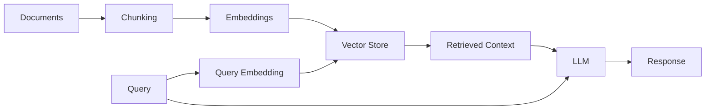
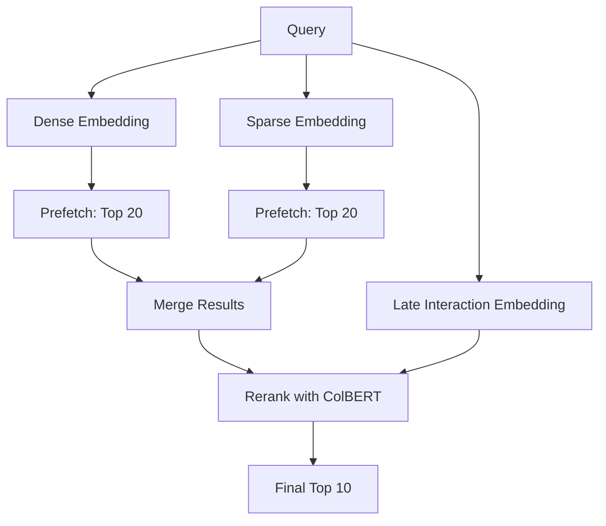

<LLMOnly
  data={`
type: guide
difficulty: intermediate
keyTakeaways:
  - Build a production-ready RAG system with Python, Qdrant, and FastEmbed
  - Implement hybrid search combining dense, sparse, and late interaction embeddings
  - Configure multi-vector collections for optimal retrieval quality
prerequisites: Python programming, basic understanding of embeddings and vector databases
targetAudience: Backend engineers and AI developers building document search systems
`}
/>

Retrieval-Augmented Generation (RAG) has become the go-to architecture for building AI applications that need access to private or up-to-date information. In this comprehensive guide, we'll explore everything you need to know about building production-ready RAG systems using Python, Qdrant, and FastEmbed.

## What is RAG?

RAG combines the power of **large language models** with **external knowledge retrieval** to generate more accurate and contextual responses. Instead of relying solely on the model's training data, RAG systems can access real-time information from your documents, databases, or APIs.

> RAG enables LLMs to access knowledge beyond their training data, making them significantly more useful for enterprise applications.

The key insight is simple: rather than fine-tuning a model on your data (expensive and inflexible), you retrieve relevant context at query time and include it in the prompt.

## Core Architecture

A typical RAG system consists of three main components:

1. **Document Processing Pipeline** - Ingests and chunks your documents
2. **Vector Store** - Stores embeddings for semantic search
3. **Generation Pipeline** - Combines retrieved context with LLM generation



## Setting Up Your Environment

<Steps>

<Step>Install Dependencies</Step>

First, create a new Python project with [uv](https://docs.astral.sh/uv/):

```shell
uv init rag-system && cd rag-system
```

Install the required packages:

```shell
uv add qdrant-client fastembed openai python-dotenv
```

<Step>Configure Environment Variables</Step>

Create a `.env` file with your API keys:

```text filename=.env
OPENAI_API_KEY=sk-...
QDRANT_URL=http://localhost:6333
# Or for Qdrant Cloud:
# QDRANT_URL=https://your-cluster.qdrant.io
# QDRANT_API_KEY=...
```

<Step>Start Qdrant</Step>

Run Qdrant locally using Docker:

```shell
docker run -p 6333:6333 -p 6334:6334 qdrant/qdrant
```

</Steps>

## Document Processing

The quality of your RAG system depends heavily on how you process documents. Here's a production-ready chunking strategy:

```python filename=chunker.py
from typing import TypedDict


class Chunk(TypedDict):
    content: str
    metadata: dict


def chunk_document(
    content: str,
    chunk_size: int = 1000,
    chunk_overlap: int = 200,
) -> list[Chunk]:
    """Split document into overlapping chunks."""
    chunks: list[Chunk] = []
    start = 0

    while start < len(content):
        end = start + chunk_size
        chunk_text = content[start:end]

        chunks.append({
            "content": chunk_text,
            "metadata": {
                "chunk_index": len(chunks),
                "start_char": start,
                "end_char": end,
            },
        })

        start += chunk_size - chunk_overlap

    # Add total chunks to metadata
    for chunk in chunks:
        chunk["metadata"]["total_chunks"] = len(chunks)

    return chunks
```

<Callout variant="info" title="Chunk Size Matters" icon="info">
  Smaller chunks (500-1000 tokens) provide more precise retrieval but may lose
  context. Larger chunks (1500-2000 tokens) preserve more context but may
  include irrelevant information. Experiment to find the right balance for your
  use case.
</Callout>

### Handling Different File Types

Your system needs to handle various document formats:

<FileTree
  tree={[
    {
      type: "folder",
      name: "documents",
      children: [
        {
          type: "folder",
          name: "pdfs",
          children: [
            { type: "file", name: "annual-report.pdf" },
            { type: "file", name: "whitepaper.pdf" },
          ],
        },
        {
          type: "folder",
          name: "markdown",
          children: [
            { type: "file", name: "docs.md" },
            { type: "file", name: "readme.md" },
          ],
        },
        {
          type: "folder",
          name: "code",
          children: [
            { type: "file", name: "examples.py" },
            { type: "file", name: "utils.py" },
          ],
        },
      ],
    },
  ]}
  defaultOpen
/>

## Embedding Generation with FastEmbed

FastEmbed is a lightweight Python library that supports multiple embedding types. We'll use it for **dense**, **sparse**, and **late interaction** embeddings:

```python filename=embeddings.py
from fastembed import (
    TextEmbedding,
    SparseTextEmbedding,
    LateInteractionTextEmbedding,
)

# Initialize embedding models
dense_model = TextEmbedding("sentence-transformers/all-MiniLM-L6-v2")
sparse_model = SparseTextEmbedding("Qdrant/bm25")  # [!code highlight]
late_interaction_model = LateInteractionTextEmbedding("colbert-ir/colbertv2.0")  # [!code highlight]


def generate_embeddings(documents: list[str]) -> dict:
    """Generate all three types of embeddings for documents."""
    return {
        "dense": list(dense_model.embed(documents)),
        "sparse": list(sparse_model.embed(documents)),
        "late_interaction": list(late_interaction_model.embed(documents)),
    }


def generate_query_embeddings(query: str) -> dict:
    """Generate embeddings for a query."""
    return {
        "dense": next(dense_model.query_embed(query)),
        "sparse": next(sparse_model.query_embed(query)),
        "late_interaction": next(late_interaction_model.query_embed(query)),
    }
```

### Understanding the Three Embedding Types

| Type                 | Model            | Purpose                          |
| -------------------- | ---------------- | -------------------------------- |
| **Dense**            | all-MiniLM-L6-v2 | Captures semantic meaning        |
| **Sparse**           | BM25             | Keyword matching, term frequency |
| **Late Interaction** | ColBERT v2       | Contextual reranking             |

<Callout variant="warning" title="First Run Downloads" icon="alert-triangle">
  The first time you run the embedding code, FastEmbed will download the model
  weights. This may take a few minutes depending on your connection.
</Callout>

## Vector Store with Qdrant

Qdrant is a vector database that natively supports hybrid search with multiple vector types. Here's how to set up your collection:

```python filename=vector_store.py
from qdrant_client import QdrantClient
from qdrant_client.models import (
    Distance,
    VectorParams,
    SparseVectorParams,
    MultiVectorConfig,
    MultiVectorComparator,
    HnswConfigDiff,
    Modifier,
)

client = QdrantClient(url="http://localhost:6333")

# Create collection with multi-vector support
client.create_collection(
    collection_name="rag-documents",
    vectors_config={
        "dense": VectorParams(
            size=384,  # all-MiniLM-L6-v2 dimension
            distance=Distance.COSINE,
        ),
        "late_interaction": VectorParams(  # [!code focus:8]
            size=128,  # ColBERT v2 dimension
            distance=Distance.COSINE,
            multivector_config=MultiVectorConfig(
                comparator=MultiVectorComparator.MAX_SIM,
            ),
            hnsw_config=HnswConfigDiff(m=0),  # Disable HNSW for reranking
        ),
    },
    sparse_vectors_config={
        "sparse": SparseVectorParams(
            modifier=Modifier.IDF,
        ),
    },
)
```

<Callout variant="info" title="Why Disable HNSW for ColBERT?" icon="info">
  We set `m=0` for the late interaction vectors because they're used for
  reranking, not initial retrieval. This saves memory and indexing time.
</Callout>

### Upserting Documents

```python filename=upsert.py
from qdrant_client.models import PointStruct

def upsert_documents(
    documents: list[str],
    embeddings: dict,
) -> None:
    """Insert documents with their embeddings into Qdrant."""
    points = []

    for idx, doc in enumerate(documents):
        point = PointStruct(
            id=idx,
            vector={
                "dense": embeddings["dense"][idx],
                "sparse": embeddings["sparse"][idx].as_object(),
                "late_interaction": embeddings["late_interaction"][idx],
            },
            payload={"document": doc},
        )
        points.append(point)

    client.upsert(
        collection_name="rag-documents",
        points=points,
    )
```

## Hybrid Search Implementation

The real power of this setup is hybrid search-combining dense semantic search with sparse keyword matching, then reranking with ColBERT:

```python filename=search.py
from qdrant_client.models import Prefetch, SparseVector


def hybrid_search(
    query: str,
    limit: int = 10,
    prefetch_limit: int = 20,
) -> list[dict]:
    """Perform hybrid search with reranking."""
    # Generate query embeddings
    query_embeddings = generate_query_embeddings(query)

    # Set up prefetch for hybrid search
    prefetch = [
        Prefetch(  # [!code focus:10]
            query=query_embeddings["dense"],
            using="dense",
            limit=prefetch_limit,
        ),
        Prefetch(
            query=SparseVector(**query_embeddings["sparse"].as_object()),
            using="sparse",
            limit=prefetch_limit,
        ),
    ]

    # Execute hybrid search with ColBERT reranking
    results = client.query_points(
        collection_name="rag-documents",
        prefetch=prefetch,
        query=query_embeddings["late_interaction"],  # [!code highlight]
        using="late_interaction",  # [!code highlight]
        with_payload=True,
        limit=limit,
    )

    return [
        {
            "id": point.id,
            "score": point.score,
            "document": point.payload["document"],
        }
        for point in results.points
    ]
```

### How Hybrid Search Works



| Strategy        | Pros                    | Cons                   |
| --------------- | ----------------------- | ---------------------- |
| Dense Only      | Understands meaning     | May miss exact matches |
| Sparse Only     | Precise keyword matches | Misses synonyms        |
| Hybrid          | Best of both            | More compute           |
| Hybrid + Rerank | Most accurate           | Most compute           |

## Generation Pipeline

The final step is generating responses with the retrieved context:

```python filename=generate.py
from openai import OpenAI
from dotenv import load_dotenv

load_dotenv()

openai_client = OpenAI()

SYSTEM_PROMPT = """You are a helpful assistant that answers questions based on the provided context.
If the context doesn't contain relevant information, say so honestly.

Context:
{context}"""


def generate_response(query: str, context: list[str]) -> str:
    """Generate a response using retrieved context."""
    formatted_context = "\n\n---\n\n".join(context)

    response = openai_client.chat.completions.create(
        model="gpt-4o",
        messages=[
            {
                "role": "system",
                "content": SYSTEM_PROMPT.format(context=formatted_context),
            },
            {"role": "user", "content": query},
        ],
        temperature=0.7,
    )

    return response.choices[0].message.content
```

<Callout variant="success" title="Pro Tip" icon="lightbulb">
  Always include instructions for the LLM to indicate when it doesn't have
  enough context to answer. This prevents hallucinations and builds user trust.
</Callout>

## Putting It All Together

Here's the complete RAG pipeline:

```python filename=rag.py
def rag_query(query: str) -> str:
    """Complete RAG pipeline: search and generate."""
    # 1. Hybrid search with reranking
    results = hybrid_search(query, limit=5)

    # 2. Extract document content
    context = [r["document"] for r in results]

    # 3. Generate response
    response = generate_response(query, context)

    return response


# Example usage
if __name__ == "__main__":
    query = "How does RAG improve LLM accuracy?"
    answer = rag_query(query)
    print(answer)
```

## Advanced Techniques

### Query Expansion

Improve recall by expanding the original query:

<Accordion type="single" collapsible>
  <AccordionItem value="query-expansion">
    <AccordionTrigger>How Query Expansion Works</AccordionTrigger>
    <AccordionContent>
      Query expansion generates multiple variations of the user's query to
      capture different phrasings and increase the chances of finding relevant
      documents. This technique is especially useful when users may phrase
      questions differently than the source documents.
    </AccordionContent>
  </AccordionItem>
</Accordion>

### Metadata Filtering

Filter results based on document metadata:

```python filename=filtered_search.py
from qdrant_client.models import Filter, FieldCondition, MatchValue

def filtered_search(
    query: str,
    category: str,
    limit: int = 10,
) -> list[dict]:
    """Search with metadata filtering."""
    query_embeddings = generate_query_embeddings(query)

    results = client.query_points(
        collection_name="rag-documents",
        query=query_embeddings["dense"],
        using="dense",
        query_filter=Filter(  # [!code highlight:6]
            must=[
                FieldCondition(
                    key="category",
                    match=MatchValue(value=category),
                ),
            ],
        ),
        with_payload=True,
        limit=limit,
    )

    return results.points
```

## Production Considerations

<Callout variant="error" title="Critical Security Note" icon="shield-alert">
  Never expose your API keys in client-side code. Always proxy requests through
  your backend and implement proper rate limiting.
</Callout>

### Monitoring and Observability

Track these key metrics for your RAG system:

| Metric                | Description                                                     |
| :-------------------- | :-------------------------------------------------------------- |
| **Retrieval Quality** | Are you finding relevant documents? Measured by MRR or NDCG.    |
| **Latency**           | P50, P95, P99 response times for both retrieval and generation. |
| **Cost**              | API usage (tokens) and embedding generation/storage costs.      |
| **User Satisfaction** | Thumbs up/down on responses or explicit user feedback.          |

### Error Handling

Implement comprehensive error handling:

```python filename=error_handling.py
import logging
from dataclasses import dataclass

logger = logging.getLogger(__name__)


@dataclass
class RAGError(Exception):
    message: str
    code: str
    retriable: bool = False


def safe_generate(query: str, context: list[str]) -> str:
    """Generate with error handling and retry."""
    try:
        return generate_response(query, context)
    except RAGError as e:
        if e.retriable:
            logger.warning("Retrying failed generation", extra={"error": str(e)})
            return generate_response(query, context)

        logger.error("Generation failed", extra={"error": str(e), "query": query})
        raise RAGError(
            message="Failed to generate response",
            code="GENERATION_FAILED",
            retriable=False,
        )
```

## Conclusion

Building a production-ready RAG system requires careful attention to:

- **Document processing** - Chunk size, overlap, and metadata
- **Embedding quality** - Using multiple embedding types (dense, sparse, late interaction)
- **Retrieval strategy** - Hybrid search with reranking
- **Generation quality** - Prompt engineering and guardrails
- **Observability** - Monitoring and error handling

With Qdrant and FastEmbed, you get a powerful, self-hosted solution that combines the best of semantic search and keyword matching with state-of-the-art reranking.

---

_For advanced techniques like multi-hop reasoning, query restructuring, and agentic RAG, see our <EmbedBlog slug="multi-hop-rag-agents" placeholder="Advanced RAG Agents Guide" />._

_Have questions about implementing RAG in your organization? [Contact us](/contact) to learn how AstraQ can help._
