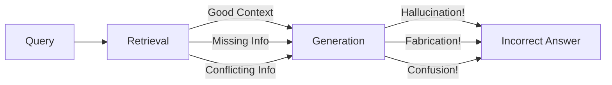
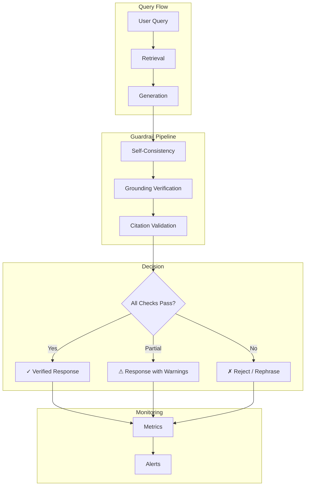

<LLMOnly
  data={`
type: deep-dive
difficulty: advanced
keyTakeaways:
  - Detect and prevent hallucinations with self-consistency checks
  - Implement retrieval grounding verification for factual accuracy
  - Build citation enforcement and validation systems
prerequisites: RAG fundamentals, LLM API usage, Python
targetAudience: AI engineers building reliable enterprise RAG applications
`}
/>

You've built a <EmbedBlog slug="production-ready-rag-guide" placeholder="production-ready RAG system" />, added <EmbedBlog slug="multi-hop-rag-agents" placeholder="agentic reasoning" />, and <EmbedBlog slug="evaluating-rag-with-ragas" placeholder="measured its performance" />. But there's a problem lurking beneath the surface: **hallucinations**.

Your RAG system retrieves relevant context, but the LLM still makes things up. It confidently cites documents that don't exist, invents statistics, and occasionally contradicts the very context you provided. In enterprise settings, these hallucinations aren't just embarrassing—they're dangerous.

## The Hallucination Problem

Hallucinations in RAG systems occur even with perfect retrieval because LLMs are fundamentally **pattern completion machines**, not knowledge retrieval systems. They'll fill gaps with plausible-sounding fabrications.



### Types of RAG Hallucinations

| Type                         | Description                     | Example                                             |
| :--------------------------- | :------------------------------ | :-------------------------------------------------- |
| **Intrinsic**                | Contradicts retrieved context   | Context says "384 dims", answer says "768 dims"     |
| **Extrinsic**                | Adds information not in context | Invents a feature the product doesn't have          |
| **Citation Fabrication**     | References non-existent sources | "According to Document 7..." (doesn't exist)        |
| **Confidence Hallucination** | Presents uncertainty as fact    | "This is definitely true" when context is ambiguous |

<Callout variant="warning" title="The 10% Problem" icon="alert-triangle">
  Studies show that even state-of-the-art RAG systems hallucinate 10-20% of the
  time. For enterprise applications, that's unacceptable. Every response needs
  verification.
</Callout>

## Self-Consistency Checks

Self-consistency exploits a key insight: **correct answers are consistent across multiple reasoning paths**, while hallucinations tend to vary. By sampling multiple responses and checking for agreement, we can detect unreliable outputs.

### Basic Self-Consistency

```python filename=guardrails/self_consistency.py
from openai import OpenAI
from collections import Counter
from dataclasses import dataclass

client = OpenAI()

@dataclass
class ConsistencyResult:
    answer: str
    confidence: float
    all_answers: list[str]
    is_consistent: bool

def check_self_consistency(
    query: str,
    context: list[str],
    num_samples: int = 5,
    temperature: float = 0.7,
    consistency_threshold: float = 0.6,
) -> ConsistencyResult:
    """Generate multiple answers and check for consistency."""
    formatted_context = "\n\n---\n\n".join(context)

    system_prompt = f"""Answer the question based ONLY on the provided context.
If the context doesn't contain the answer, say "I don't have enough information."

Context:
{formatted_context}"""

    answers = []
    for _ in range(num_samples):  # [!code highlight:10]
        response = client.chat.completions.create(
            model="gpt-4o",
            messages=[
                {"role": "system", "content": system_prompt},
                {"role": "user", "content": query},
            ],
            temperature=temperature,
        )
        answers.append(response.choices[0].message.content.strip())

    # Find the most common answer
    answer_counts = Counter(answers)
    most_common, count = answer_counts.most_common(1)[0]
    confidence = count / num_samples

    return ConsistencyResult(
        answer=most_common,
        confidence=confidence,
        all_answers=answers,
        is_consistent=confidence >= consistency_threshold,
    )
```

### Semantic Consistency (For Free-Form Answers)

Exact string matching doesn't work for varied phrasings. Use embedding similarity:

```python filename=guardrails/semantic_consistency.py
from fastembed import TextEmbedding
import numpy as np

embedder = TextEmbedding("sentence-transformers/all-MiniLM-L6-v2")

def semantic_consistency_check(
    answers: list[str],
    similarity_threshold: float = 0.85,
) -> tuple[bool, float]:
    """Check if answers are semantically consistent."""
    embeddings = list(embedder.embed(answers))
    embeddings = np.array(embeddings)

    # Compute pairwise cosine similarities
    similarities = []
    for i in range(len(embeddings)):
        for j in range(i + 1, len(embeddings)):
            sim = np.dot(embeddings[i], embeddings[j]) / (
                np.linalg.norm(embeddings[i]) * np.linalg.norm(embeddings[j])
            )
            similarities.append(sim)

    avg_similarity = np.mean(similarities) if similarities else 1.0
    is_consistent = avg_similarity >= similarity_threshold

    return is_consistent, avg_similarity

def enhanced_self_consistency(  # [!code focus:20]
    query: str,
    context: list[str],
    num_samples: int = 5,
) -> ConsistencyResult:
    """Self-consistency with semantic similarity."""
    # Generate samples (same as before)
    answers = generate_samples(query, context, num_samples)

    # Check semantic consistency
    is_consistent, similarity = semantic_consistency_check(answers)

    if not is_consistent:
        # Answers diverge - likely hallucination
        return ConsistencyResult(
            answer="I cannot provide a reliable answer - multiple reasoning paths led to different conclusions.",
            confidence=similarity,
            all_answers=answers,
            is_consistent=False,
        )

    # Return the longest answer (usually most complete)
    return ConsistencyResult(
        answer=max(answers, key=len),
        confidence=similarity,
        all_answers=answers,
        is_consistent=True,
    )
```

<Callout variant="info" title="When to Use Self-Consistency" icon="info">

Self-consistency works best for:

- **Factual questions** with definitive answers
- **Numerical or categorical** responses
- **High-stakes queries** where accuracy is critical

It's less effective for creative or open-ended questions where variation is expected.

</Callout>

## Retrieval Grounding Verification

The most powerful guardrail: **verify that every claim in the response is grounded in the retrieved context**. This is the same principle behind RAGAS faithfulness, but applied in real-time.

### Claim Extraction and Verification

```python filename=guardrails/grounding.py
from openai import OpenAI
from dataclasses import dataclass
from enum import Enum

client = OpenAI()

class GroundingStatus(Enum):
    SUPPORTED = "supported"
    UNSUPPORTED = "unsupported"
    CONTRADICTED = "contradicted"

@dataclass
class Claim:
    text: str
    status: GroundingStatus
    supporting_context: str | None = None

@dataclass
class GroundingResult:
    original_response: str
    claims: list[Claim]
    grounding_score: float
    has_hallucinations: bool

CLAIM_EXTRACTION_PROMPT = """Extract all factual claims from the following response.
Return each claim on a new line, prefixed with "- ".
Focus on verifiable statements, not opinions or hedged language.

Response: {response}

Claims:"""

VERIFICATION_PROMPT = """Determine if the following claim is supported by the context.

Context:
{context}

Claim: {claim}

Respond with exactly one of:
- SUPPORTED: The claim is directly supported by the context
- UNSUPPORTED: The claim cannot be verified from the context
- CONTRADICTED: The claim contradicts information in the context

Then briefly explain your reasoning.

Response:"""

def extract_claims(response: str) -> list[str]:  # [!code highlight:15]
    """Extract factual claims from a response."""
    result = client.chat.completions.create(
        model="gpt-4o-mini",
        messages=[
            {"role": "user", "content": CLAIM_EXTRACTION_PROMPT.format(response=response)},
        ],
        temperature=0,
    )

    claims = []
    for line in result.choices[0].message.content.strip().split("\n"):
        if line.startswith("- "):
            claims.append(line[2:].strip())

    return claims

def verify_claim(claim: str, context: list[str]) -> Claim:  # [!code focus:25]
    """Verify a single claim against context."""
    formatted_context = "\n\n---\n\n".join(context)

    result = client.chat.completions.create(
        model="gpt-4o-mini",
        messages=[
            {"role": "user", "content": VERIFICATION_PROMPT.format(
                context=formatted_context,
                claim=claim,
            )},
        ],
        temperature=0,
    )

    response_text = result.choices[0].message.content.strip()

    if response_text.startswith("SUPPORTED"):
        status = GroundingStatus.SUPPORTED
    elif response_text.startswith("CONTRADICTED"):
        status = GroundingStatus.CONTRADICTED
    else:
        status = GroundingStatus.UNSUPPORTED

    return Claim(
        text=claim,
        status=status,
        supporting_context=response_text,
    )

def verify_grounding(
    response: str,
    context: list[str],
) -> GroundingResult:
    """Verify all claims in a response are grounded."""
    claims = extract_claims(response)
    verified_claims = [verify_claim(claim, context) for claim in claims]

    supported = sum(1 for c in verified_claims if c.status == GroundingStatus.SUPPORTED)
    grounding_score = supported / len(verified_claims) if verified_claims else 1.0

    has_hallucinations = any(
        c.status in (GroundingStatus.UNSUPPORTED, GroundingStatus.CONTRADICTED)
        for c in verified_claims
    )

    return GroundingResult(
        original_response=response,
        claims=verified_claims,
        grounding_score=grounding_score,
        has_hallucinations=has_hallucinations,
    )
```

### Real-Time Grounding with Streaming

For production systems, verify grounding without blocking the user:

```python filename=guardrails/streaming_grounding.py
import asyncio
from typing import AsyncGenerator

async def stream_with_verification(
    query: str,
    context: list[str],
) -> AsyncGenerator[dict, None]:
    """Stream response while verifying grounding in parallel."""

    # Start response generation
    response_chunks = []

    async for chunk in generate_streaming_response(query, context):
        response_chunks.append(chunk)
        yield {"type": "content", "data": chunk}

    full_response = "".join(response_chunks)

    # Verify grounding in background
    yield {"type": "status", "data": "Verifying response..."}

    grounding_result = await asyncio.get_event_loop().run_in_executor(
        None,
        lambda: verify_grounding(full_response, context),
    )

    if grounding_result.has_hallucinations:  # [!code highlight:15]
        # Flag problematic claims
        problematic = [
            c for c in grounding_result.claims
            if c.status != GroundingStatus.SUPPORTED
        ]

        yield {
            "type": "warning",
            "data": {
                "message": "Some claims could not be verified",
                "unverified_claims": [c.text for c in problematic],
                "grounding_score": grounding_result.grounding_score,
            },
        }
    else:
        yield {
            "type": "verified",
            "data": {"grounding_score": grounding_result.grounding_score},
        }
```

## Citation Enforcement

Force the LLM to cite its sources, then validate those citations actually exist and support the claims.

### Structured Citation Format

```python filename=guardrails/citations.py
from pydantic import BaseModel
from openai import OpenAI
import json

client = OpenAI()

class Citation(BaseModel):
    claim: str
    source_index: int  # Index into context array
    quote: str  # Exact quote from source

class CitedResponse(BaseModel):
    answer: str
    citations: list[Citation]

CITATION_PROMPT = """Answer the question based on the provided context.
For EVERY factual claim, cite the source using [N] notation where N is the context index (1-indexed).
After your answer, provide a JSON citations block.

Context:
{context}

Question: {question}

Format your response as:
<answer>
Your answer with [1], [2] citations inline...
</answer>

<citations>
[
  {{"claim": "specific claim text", "source_index": 1, "quote": "exact quote from source"}},
  ...
]
</citations>"""

def generate_with_citations(
    query: str,
    context: list[str],
) -> CitedResponse:
    """Generate response with mandatory citations."""
    # Number the context for citation
    numbered_context = "\n\n".join(
        f"[{i+1}] {ctx}" for i, ctx in enumerate(context)
    )

    response = client.chat.completions.create(
        model="gpt-4o",
        messages=[
            {"role": "user", "content": CITATION_PROMPT.format(
                context=numbered_context,
                question=query,
            )},
        ],
        temperature=0,
    )

    content = response.choices[0].message.content

    # Parse answer and citations
    answer = extract_between(content, "<answer>", "</answer>")
    citations_json = extract_between(content, "<citations>", "</citations>")

    try:
        citations_data = json.loads(citations_json)
        citations = [Citation(**c) for c in citations_data]
    except (json.JSONDecodeError, ValueError):
        citations = []

    return CitedResponse(answer=answer, citations=citations)
```

### Citation Validation

```python filename=guardrails/citation_validation.py
from dataclasses import dataclass
from difflib import SequenceMatcher

@dataclass
class CitationValidation:
    citation: Citation
    is_valid: bool
    source_exists: bool
    quote_found: bool
    quote_similarity: float
    error: str | None = None

def validate_citation(
    citation: Citation,
    context: list[str],
    quote_similarity_threshold: float = 0.8,
) -> CitationValidation:
    """Validate that a citation is accurate."""
    # Check source exists
    if citation.source_index < 1 or citation.source_index > len(context):
        return CitationValidation(
            citation=citation,
            is_valid=False,
            source_exists=False,
            quote_found=False,
            quote_similarity=0.0,
            error=f"Source [{citation.source_index}] does not exist",
        )

    source_text = context[citation.source_index - 1]

    # Check quote exists in source (fuzzy match)
    similarity = SequenceMatcher(
        None,
        citation.quote.lower(),
        source_text.lower(),
    ).find_longest_match().size / len(citation.quote)

    # Try substring match first
    quote_found = citation.quote.lower() in source_text.lower()

    if not quote_found:
        # Check for high similarity (paraphrased quote)
        quote_found = similarity >= quote_similarity_threshold

    return CitationValidation(  # [!code highlight:10]
        citation=citation,
        is_valid=quote_found,
        source_exists=True,
        quote_found=quote_found,
        quote_similarity=similarity,
        error=None if quote_found else "Quote not found in cited source",
    )

def validate_all_citations(
    response: CitedResponse,
    context: list[str],
) -> tuple[list[CitationValidation], float]:
    """Validate all citations in a response."""
    validations = [
        validate_citation(c, context)
        for c in response.citations
    ]

    valid_count = sum(1 for v in validations if v.is_valid)
    accuracy = valid_count / len(validations) if validations else 1.0

    return validations, accuracy
```

<Callout variant="success" title="Citation Best Practices" icon="lightbulb">

- **Require citations** for all factual claims, not just some
- **Validate quote accuracy** - LLMs often paraphrase or misquote
- **Show citations to users** - transparency builds trust
- **Track citation accuracy** as a key metric

</Callout>

## Unified Guardrail Pipeline

Combine all guardrails into a production-ready pipeline:

```python filename=guardrails/pipeline.py
from dataclasses import dataclass
from enum import Enum
from typing import Optional

class ResponseStatus(Enum):
    VERIFIED = "verified"
    LOW_CONFIDENCE = "low_confidence"
    UNVERIFIABLE = "unverifiable"
    REJECTED = "rejected"

@dataclass
class GuardrailResult:
    status: ResponseStatus
    response: str
    confidence: float
    grounding_score: float
    citation_accuracy: float
    warnings: list[str]
    metadata: dict

class RAGGuardrails:
    """Unified guardrail pipeline for RAG systems."""

    def __init__(
        self,
        consistency_samples: int = 3,
        consistency_threshold: float = 0.6,
        grounding_threshold: float = 0.8,
        citation_threshold: float = 0.9,
    ):
        self.consistency_samples = consistency_samples
        self.consistency_threshold = consistency_threshold
        self.grounding_threshold = grounding_threshold
        self.citation_threshold = citation_threshold

    def __call__(  # [!code focus:50]
        self,
        query: str,
        context: list[str],
        skip_consistency: bool = False,
    ) -> GuardrailResult:
        """Run full guardrail pipeline."""
        warnings = []

        # Step 1: Generate response with citations
        cited_response = generate_with_citations(query, context)

        # Step 2: Self-consistency check (optional, expensive)
        if not skip_consistency:
            consistency = enhanced_self_consistency(
                query, context, self.consistency_samples
            )

            if not consistency.is_consistent:
                return GuardrailResult(
                    status=ResponseStatus.LOW_CONFIDENCE,
                    response=consistency.answer,
                    confidence=consistency.confidence,
                    grounding_score=0.0,
                    citation_accuracy=0.0,
                    warnings=["Multiple reasoning paths led to different answers"],
                    metadata={"all_answers": consistency.all_answers},
                )
        else:
            consistency = None

        # Step 3: Grounding verification
        grounding = verify_grounding(cited_response.answer, context)

        if grounding.grounding_score < self.grounding_threshold:
            ungrounded = [
                c.text for c in grounding.claims
                if c.status != GroundingStatus.SUPPORTED
            ]
            warnings.append(f"Unverified claims: {ungrounded}")

        # Step 4: Citation validation
        validations, citation_accuracy = validate_all_citations(
            cited_response, context
        )

        invalid_citations = [
            v.citation.claim for v in validations if not v.is_valid
        ]
        if invalid_citations:
            warnings.append(f"Invalid citations for: {invalid_citations}")

        # Determine final status
        if grounding.grounding_score >= self.grounding_threshold and \
           citation_accuracy >= self.citation_threshold:
            status = ResponseStatus.VERIFIED
        elif grounding.grounding_score >= 0.5:
            status = ResponseStatus.LOW_CONFIDENCE
        else:
            status = ResponseStatus.UNVERIFIABLE

        return GuardrailResult(
            status=status,
            response=cited_response.answer,
            confidence=consistency.confidence if consistency else 1.0,
            grounding_score=grounding.grounding_score,
            citation_accuracy=citation_accuracy,
            warnings=warnings,
            metadata={
                "claims": [c.__dict__ for c in grounding.claims],
                "citations": [c.__dict__ for c in cited_response.citations],
            },
        )
```

### Using the Pipeline

```python filename=example.py
from guardrails.pipeline import RAGGuardrails, ResponseStatus

guardrails = RAGGuardrails(
    consistency_samples=3,
    grounding_threshold=0.8,
)

# Query your RAG system
context = retrieve_context(query)
result = guardrails(query, context)

if result.status == ResponseStatus.VERIFIED:
    # High confidence - show response
    return {"answer": result.response, "verified": True}

elif result.status == ResponseStatus.LOW_CONFIDENCE:
    # Show with warning
    return {
        "answer": result.response,
        "verified": False,
        "warning": "This response may contain unverified information",
    }

else:
    # Reject response
    return {
        "answer": "I cannot provide a reliable answer to this question.",
        "reason": result.warnings,
    }
```

## Prompt-Level Guardrails

Sometimes the best guardrail is prevention. Design prompts that resist hallucination:

### Anti-Hallucination Prompt Patterns

```python filename=prompts/anti_hallucination.py
STRICT_GROUNDING_PROMPT = """You are a precise research assistant. Answer ONLY using information from the provided context.

CRITICAL RULES:
1. If the context doesn't contain the answer, say "The provided documents don't contain this information."
2. NEVER infer, extrapolate, or use prior knowledge
3. If information is ambiguous, acknowledge the ambiguity
4. When uncertain, express uncertainty explicitly
5. Cite sources using [N] notation for EVERY claim

Context:
{context}

Question: {question}

Remember: It's better to say "I don't know" than to make up an answer."""

UNCERTAINTY_PROMPT = """Based on the context, answer the question.

For each statement in your answer, rate your confidence:
- [HIGH] Information explicitly stated in context
- [MEDIUM] Reasonable inference from context
- [LOW] Uncertain or partially supported

Context:
{context}

Question: {question}"""  # [!code highlight]

CHAIN_OF_THOUGHT_GROUNDING = """Answer the question using the provided context.

Before giving your final answer, think through:
1. What specific parts of the context are relevant?
2. Do I have enough information to fully answer?
3. Am I making any assumptions beyond the context?
4. Are there any conflicting pieces of information?

Context:
{context}

Question: {question}

Reasoning:
[Your step-by-step analysis]

Final Answer:
[Your answer, citing sources]"""
```

<Callout variant="info" title="Prompt Engineering Tips" icon="sliders">

| Technique                        | Effect                          | When to Use           |
| :------------------------------- | :------------------------------ | :-------------------- |
| **Explicit refusal instruction** | LLM admits uncertainty          | Always                |
| **Confidence labels**            | Exposes uncertainty             | User-facing responses |
| **Chain-of-thought**             | Catches reasoning errors        | Complex queries       |
| **Negative examples**            | Prevents specific failure modes | Domain-specific       |

</Callout>

## Monitoring Guardrail Performance

Track guardrail effectiveness over time:

```python filename=monitoring/guardrail_metrics.py
from dataclasses import dataclass, field
from datetime import datetime
from typing import Dict, List

@dataclass
class GuardrailMetrics:
    total_queries: int = 0
    verified_responses: int = 0
    low_confidence_responses: int = 0
    rejected_responses: int = 0

    avg_grounding_score: float = 0.0
    avg_citation_accuracy: float = 0.0
    avg_consistency_score: float = 0.0

    hallucination_types: Dict[str, int] = field(default_factory=dict)

class GuardrailMonitor:
    """Monitor guardrail performance."""

    def __init__(self):
        self.metrics = GuardrailMetrics()
        self.history: List[dict] = []

    def record(self, result: GuardrailResult, query: str) -> None:  # [!code highlight:20]
        """Record a guardrail result."""
        self.metrics.total_queries += 1

        if result.status == ResponseStatus.VERIFIED:
            self.metrics.verified_responses += 1
        elif result.status == ResponseStatus.LOW_CONFIDENCE:
            self.metrics.low_confidence_responses += 1
        else:
            self.metrics.rejected_responses += 1

        # Running averages
        n = self.metrics.total_queries
        self.metrics.avg_grounding_score = (
            (self.metrics.avg_grounding_score * (n - 1) + result.grounding_score) / n
        )
        self.metrics.avg_citation_accuracy = (
            (self.metrics.avg_citation_accuracy * (n - 1) + result.citation_accuracy) / n
        )

        # Store for analysis
        self.history.append({
            "timestamp": datetime.now().isoformat(),
            "query": query,
            "status": result.status.value,
            "grounding_score": result.grounding_score,
            "warnings": result.warnings,
        })

    def get_hallucination_rate(self) -> float:
        """Calculate overall hallucination rate."""
        if self.metrics.total_queries == 0:
            return 0.0

        unverified = (
            self.metrics.low_confidence_responses +
            self.metrics.rejected_responses
        )
        return unverified / self.metrics.total_queries

    def get_dashboard_data(self) -> dict:
        """Get data for monitoring dashboard."""
        return {
            "total_queries": self.metrics.total_queries,
            "verification_rate": self.metrics.verified_responses / max(self.metrics.total_queries, 1),
            "hallucination_rate": self.get_hallucination_rate(),
            "avg_grounding_score": self.metrics.avg_grounding_score,
            "avg_citation_accuracy": self.metrics.avg_citation_accuracy,
        }
```

### Key Metrics to Track

| Metric                  | Target | Alert Threshold |
| :---------------------- | :----- | :-------------- |
| **Verification Rate**   | > 85%  | < 70%           |
| **Avg Grounding Score** | > 0.90 | < 0.80          |
| **Citation Accuracy**   | > 0.95 | < 0.85          |
| **Rejection Rate**      | < 5%   | > 15%           |

## Production Architecture



## Conclusion

Preventing hallucinations in RAG systems requires a defense-in-depth approach:

1. **Self-Consistency** - Sample multiple responses and check agreement
2. **Grounding Verification** - Validate every claim against context
3. **Citation Enforcement** - Force explicit source attribution
4. **Prompt Engineering** - Design prompts that resist fabrication
5. **Monitoring** - Track hallucination rates and alert on degradation

No single technique eliminates hallucinations entirely, but layered guardrails can reduce them to acceptable levels for enterprise deployment.

---

_Building a high-stakes RAG application? [Contact us](/contact) to learn how AstraQ can help you implement production-grade guardrails._
