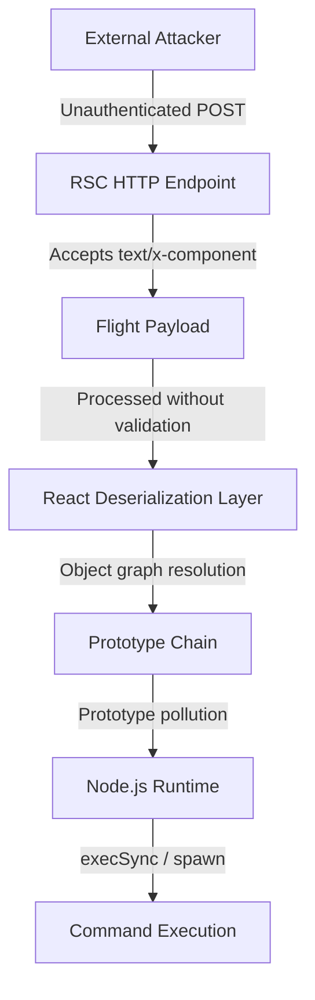

<LLMOnly
  data={`
type: deep-dive
difficulty: advanced
keyTakeaways:
  - Understand React2Shell RCE vulnerability in React Server Components
  - Detect exploitation through Falco rules and WAF signatures
  - Implement immediate patching and runtime hardening mitigations
prerequisites: React/Next.js development, security fundamentals, Node.js internals
targetAudience: React developers, security engineers, and DevOps teams
`}
/>

<Callout variant="error" title="Critical Security Alert" icon="shield-alert">
  React2Shell (CVE-2025-55182) is a **CVSS 10.0** remote code execution
  vulnerability affecting React Server Components. Nation-state actors are
  actively exploiting this. **Update to React 19.1.2+ immediately.**
</Callout>

React2Shell is a critical remote code execution (RCE) vulnerability discovered in React Server Components that enables attackers to execute arbitrary server-side JavaScript through carefully crafted Flight protocol payloads. This vulnerability affects the core deserialization mechanism used by modern React frameworks, requiring only a single unauthenticated POST request to compromise vulnerable servers.

The severity of this vulnerability cannot be overstated. With a CVSS score of 10.0, React2Shell represents the highest level of threat, offering attackers a direct path from client-side payload injection to complete server compromise without authentication or special configuration requirements.

## Impact and Security Implications

React Server Components are now a **default architectural component** in modern React frameworks. This makes React2Shell especially dangerous:

- No authentication required
- Default framework configurations are vulnerable
- Exploitation requires only one request
- Impacts production Next.js deployments at scale

Because RSC endpoints are often exposed internally without additional controls, traditional defenses such as authentication middleware or API gateways may not apply.

## Technical Root Cause

React Server Components rely on the **Flight protocol**, a custom serialization format used to stream component trees from server to client.

During deserialization, the server resolves _cross-references_ marked with `$` identifiers.
The vulnerability arises because **these references are not sufficiently validated**.

### Core Issue

- Untrusted Flight payloads are deserialized directly
- Property paths are resolved dynamically
- Prototype chain access is not restricted

This enables **prototype pollution**, allowing attackers to inject properties like:

`__proto__ constructor constructor.constructor`

Once polluted, attackers can reach native Node.js objects and invoke arbitrary functions.

## Exploit Mechanics

The exploit relies on chaining JavaScript language features rather than exploiting a traditional memory bug.

### High-Level Steps

1. Craft a malicious Flight payload
2. Inject prototype-polluting references
3. Reach `Function` or `child_process`
4. Execute arbitrary system commands

### Simplified Vulnerable Pattern

```js
function deserializeFlightPayload(chunks) {
  const resolved = {};

  for (const chunk of chunks) {
    if (chunk.startsWith("$")) {
      const ref = chunk.slice(1);
      resolved[ref] = resolveReference(ref); // no validation
    }
  }

  return resolved;
}
```

An attacker can abuse this by resolving references like:

`$__proto__.constructor.constructor`

## Attack Flow



## Detection and Indicators of Compromise

Security teams should monitor their React Server Component endpoints for the following suspicious patterns and indicators:

### Payload Indicators

- Chunk references containing `$` followed by `__proto__` or `constructor`
- Base64-encoded blobs exceeding 1KB targeting `/rsc` or `/_rsc` endpoints
- Repeated requests with `Content-Type: text/x-component` from unexpected sources
- Unusual recursive property access patterns in Flight protocol data

### Runtime Indicators

- Unexpected `child_process` imports in Node.js application logs
- Sudden spawning of shell processes from Node.js worker threads
- Anomalous network connections originating from Node.js processes
- Unauthorized file system access or modifications

### Sysdig Falco Detection Rules

Sysdig has released specialized Falco rules designed to detect React2Shell exploitation attempts in real-time. These rules monitor Node.js process behavior and network activity patterns associated with the vulnerability:

```yaml
# Sysdig Falco rule for React2Shell detection

- rule: React2Shell Exploitation Attempt
  desc: Detects potential React2Shell exploitation
  condition: >
    (proc.name = "node") and
    (proc.cmdline contains "child_process") and
    (fd.name contains "/rsc" or fd.name contains "/_rsc")
  output: >
    Possible React2Shell exploit detected
    (user=%user.name process=%proc.name cmdline=%proc.cmdline)
  priority: CRITICAL

# Additional rule for prototype pollution detection

- rule: React2Shell Prototype Pollution
  desc: Detects prototype pollution patterns in RSC requests
  condition: >
    (evt.type = "read" or evt.type = "write") and
    (fd.name contains "/rsc") and
    (evt.buffer contains "__proto__" or evt.buffer contains "constructor.constructor")
  output: >
    React2Shell prototype pollution attempt detected
    (user=%user.name file=%fd.name content=%evt.buffer)
  priority: CRITICAL
```

### Cloudflare WAF Signatures

Cloudflare has deployed WAF signatures specifically designed to identify and block React2Shell exploitation patterns. These signatures analyze request bodies and headers for malicious Flight protocol payloads:

```json
// Cloudflare WAF Managed Rule for React2Shell
// Rule ID: Cloudflare-React2Shell-001

// Primary detection rule
{
  "id": "react2shell_primary",
  "expression": "(http.request.uri.path contains \"/rsc\" or http.request.uri.path contains \"/_rsc\") and (http.request.body.raw contains \"__proto__\" or http.request.body.raw contains \"constructor.constructor\" or http.request.body.raw contains \"child_process\")",
  "action": "block",
  "description": "Block React2Shell exploitation attempts via prototype pollution"
}

// Secondary detection for encoded payloads
{
  "id": "react2shell_encoded",
  "expression": "(http.request.uri.path contains \"/rsc\") and (http.request.headers[\"content-type\"][0] eq \"text/x-component\") and (http.request.body.size > 1024) and (http.request.body.raw contains \"$\")",
  "action": "challenge",
  "description": "Challenge suspicious large RSC payloads with Flight protocol markers"
}
```

## Mitigation steps

### 1. Patch Immediately

Update to React 19.1.2 or later, which includes critical payload validation fixes.

```bash
# Update React dependencies
npm install react@latest react-dom@latest

# For Next.js applications
npm install next@latest

# Verify versions
npm list react react-dom next

```

### 2. Implement Network Filtering

Block unauthenticated requests to RSC endpoints at the network perimeter.

```nginx
# Nginx configuration example
location ~ ^/(rsc|_rsc) {
    if ($http_content_type = "text/x-component") {
        return 403;
    }

    # Require authentication
    auth_request /auth;

    proxy_pass http://backend;
}
```

### 3. Runtime Hardening

Restrict dangerous Node.js capabilities using security profiles.

```js
// Disable dynamic eval in Node.js
// Add to your application startup
process.env.NODE_OPTIONS = "--disallow-code-generation-from-strings";

// Implement seccomp profile for child_process restrictions
const seccomp = require("seccomp");

seccomp.init(seccomp.SCMP_ACT_ALLOW);
seccomp.rule_add(seccomp.SCMP_ACT_KILL, seccomp.SYS_execve);
seccomp.load();
```

### 4. Deploy WAF Rules

```json
// Cloudflare WAF custom rule
{
  "expression": "(http.request.uri.path contains \"/rsc\" or http.request.uri.path contains \"/_rsc\") and (http.request.body.raw contains \"__proto__\" or http.request.body.raw contains \"constructor.constructor\")",
  "action": "block",
  "description": "Block React2Shell exploitation attempts"
}
```

### Implement Input Validation

Add server-side validation for Flight protocol payloads.

```js
// Server-side validation middleware
function validateFlightPayload(payload) {
  const dangerousPatterns = [
    "__proto__",
    "constructor",
    "prototype",
    "child_process",
    "execSync",
    "spawn",
  ];

  const payloadStr = JSON.stringify(payload);

  for (const pattern of dangerousPatterns) {
    if (payloadStr.includes(pattern)) {
      throw new Error("Malicious payload detected");
    }
  }

  return true;
}

// Apply to RSC endpoints
app.post("/rsc", (req, res) => {
  try {
    validateFlightPayload(req.body);
    // Process valid payload
  } catch (error) {
    res.status(400).json({ error: "Invalid payload" });
  }
});
```

### Documented Attack Campaigns

- **Nation-State Actors:** China-nexus threat groups targeted nuclear infrastructure and energy sector organizations using React2Shell exploits within hours of disclosure
- **Cybercrime Operations:** Criminal actors deployed Cobalt Strike beacons through compromised React applications, establishing persistent access for ransomware deployment
- **Supply Chain Attacks:** Attackers targeted popular SaaS platforms built on Next.js to gain access to downstream customer environments

### Post-Exploitation Techniques

Once initial access is achieved through React2Shell, attackers have deployed sophisticated persistence mechanisms:

- **MeshAgent RMM:** Remote monitoring and management tools for persistent access
- **Cloudflare Tunnel C2:** Command and control infrastructure leveraging legitimate services
- **Rootkit Bind Mounts:** Kernel-level persistence mechanisms
- **SSH Key Injection:** Modification of authorized_keys files for backdoor access
-

## Conclusion

React2Shell (CVE-2025-55182) represents one of the most critical vulnerabilities discovered in modern web application frameworks. The combination of a CVSS 10.0 severity score, active exploitation in the wild, and the widespread adoption of React Server Components creates an urgent security situation that demands immediate attention from development and security teams worldwide.

The vulnerability demonstrates how protocol-level deserialization flaws can chain into complete server compromise, bypassing traditional security controls and enabling sophisticated post-exploitation activities. The lesson is clear: even well-architected frameworks require rigorous security validation, particularly when handling untrusted input in serialization protocols.

Organizations must prioritize immediate patching, implement defense-in-depth controls, and maintain vigilant monitoring for exploitation attempts. The rapid weaponization of this vulnerability by both nation-state actors and cybercriminals underscores the critical importance of proactive security measures and rapid response capabilities.
