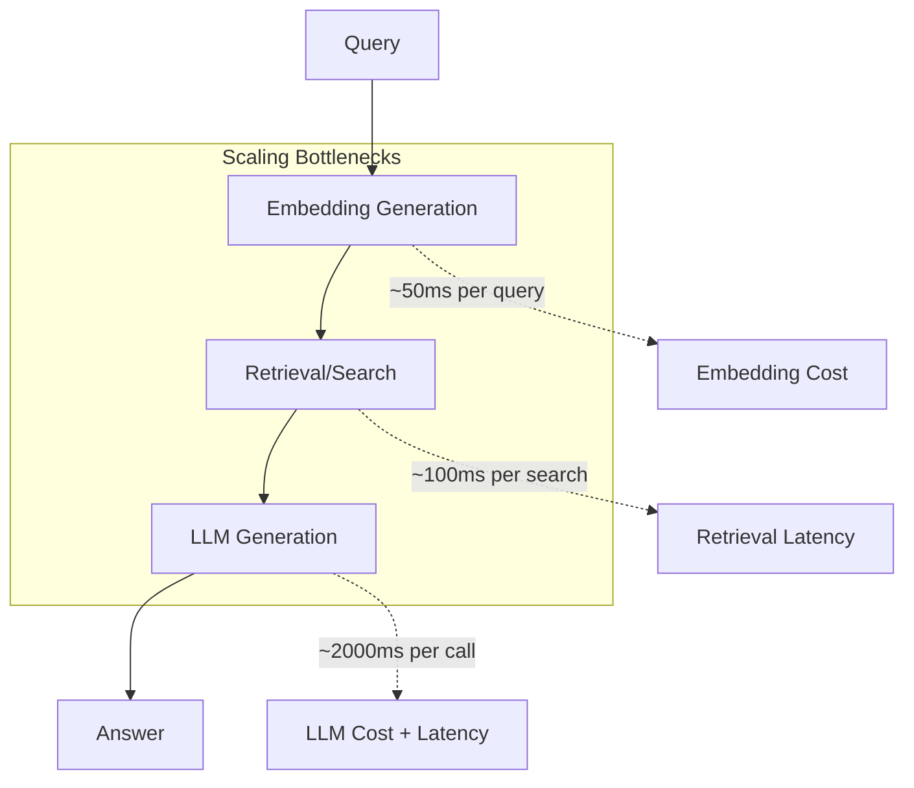
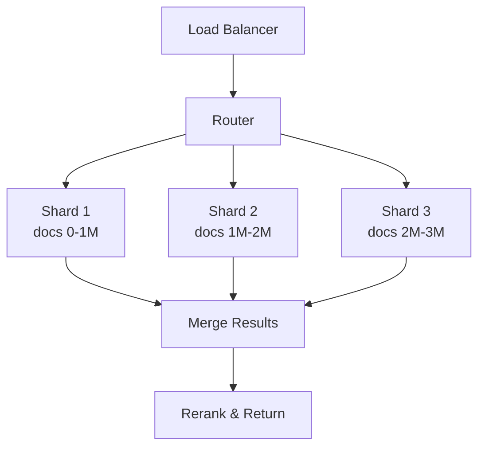
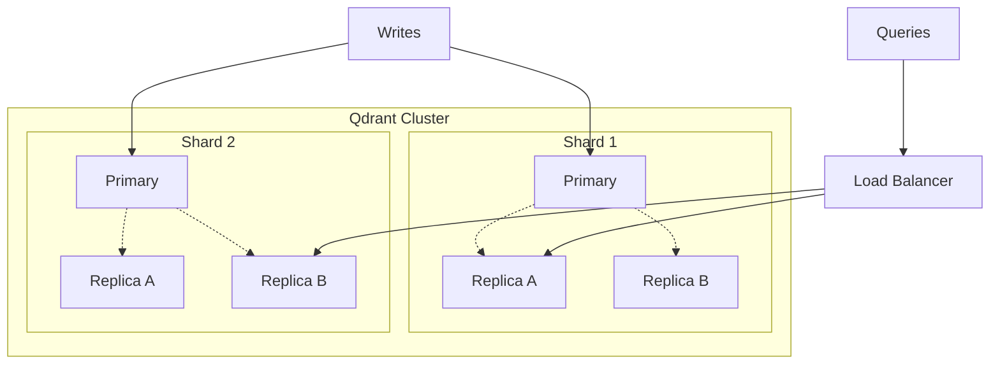
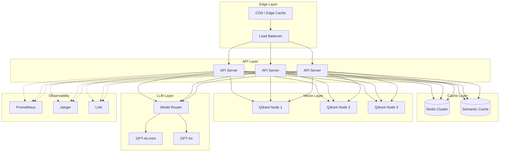

<LLMOnly
  data={`
type: deep-dive
difficulty: advanced
keyTakeaways:
  - Implement multi-layer caching for RAG systems (embedding, semantic, context)
  - Scale vector databases with sharding and replication strategies
  - Optimize HNSW indexing and quantization for performance
prerequisites: RAG fundamentals, distributed systems concepts, Python
targetAudience: Infrastructure engineers scaling AI applications to millions of queries
`}
/>

In our previous guides, we built a <EmbedBlog slug="production-ready-rag-guide" placeholder="production-ready RAG system" />, added <EmbedBlog slug="multi-hop-rag-agents" placeholder="multi-hop reasoning" />, implemented <EmbedBlog slug="evaluating-rag-with-ragas" placeholder="evaluation with RAGAS" />, and designed <EmbedBlog slug="multi-tenant-rag-isolation" placeholder="multi-tenant isolation" />. Now it's time to tackle the challenge that keeps engineering teams up at night: **scaling**.

When your RAG system goes from handling hundreds to millions of queries, everything changes. Latencies creep up, costs spiral, and what worked at prototype scale becomes a bottleneck at production scale.

## The Scaling Challenge

Most RAG systems hit scaling walls in three places:



| Component      | Latency | Cost Driver      | Scaling Challenge               |
| :------------- | :------ | :--------------- | :------------------------------ |
| **Embedding**  | ~50ms   | API calls / GPU  | Repeated computation            |
| **Retrieval**  | ~100ms  | Vector DB size   | Index size, network hops        |
| **Generation** | ~2000ms | Tokens processed | Context window, API rate limits |

> The fastest query is the one you don't have to make. Caching is your first line of defense.

## Caching Strategies

Caching in RAG systems is more nuanced than traditional web caching because:

- Queries are semantically similar but textually different
- Context windows vary per query
- Answers must remain accurate as source data changes

### Layer 1: Embedding Cache

The simplest and highest-ROI cache. Embeddings for the same text are deterministic, so caching is straightforward:

```python filename=cache/embedding_cache.py
import hashlib
from typing import Optional
import redis
import json
import numpy as np

class EmbeddingCache:
    """Cache embeddings to avoid redundant computation."""

    def __init__(self, redis_url: str = "redis://localhost:6379"):
        self.redis = redis.from_url(redis_url)
        self.ttl = 60 * 60 * 24 * 7  # 7 days

    def _cache_key(self, text: str, model: str) -> str:
        """Generate cache key from text and model."""
        content = f"{model}:{text}"
        return f"emb:{hashlib.sha256(content.encode()).hexdigest()}"

    def get(self, text: str, model: str) -> Optional[list[float]]:  # [!code highlight:8]
        """Retrieve cached embedding."""
        key = self._cache_key(text, model)
        cached = self.redis.get(key)

        if cached:
            return json.loads(cached)
        return None

    def set(self, text: str, model: str, embedding: list[float]) -> None:
        """Cache an embedding."""
        key = self._cache_key(text, model)
        self.redis.setex(key, self.ttl, json.dumps(embedding))

    def get_or_compute(  # [!code focus:15]
        self,
        text: str,
        model: str,
        compute_fn: callable,
    ) -> list[float]:
        """Get from cache or compute and cache."""
        cached = self.get(text, model)
        if cached:
            return cached

        embedding = compute_fn(text)
        self.set(text, model, embedding)
        return embedding
```

<Callout variant="success" title="Cache Hit Rates" icon="zap">
  In production, embedding caches typically achieve 40-60% hit rates for
  document embeddings and 15-25% for query embeddings. Even modest hit rates
  save significant compute.
</Callout>

### Layer 2: Semantic Query Cache

Here's where RAG caching gets interesting. Users asking "What is hybrid search?" and "Explain hybrid search to me" should hit the same cache entry. We use **semantic similarity** for cache lookups:

```python filename=cache/semantic_cache.py
from qdrant_client import QdrantClient
from qdrant_client.models import Distance, VectorParams, PointStruct
import hashlib
import json
from typing import Optional
from dataclasses import dataclass

@dataclass
class CachedResponse:
    query: str
    answer: str
    contexts: list[str]
    created_at: float

class SemanticCache:
    """Semantic similarity-based query cache."""

    def __init__(
        self,
        qdrant_url: str,
        similarity_threshold: float = 0.95,  # [!code highlight]
    ):
        self.client = QdrantClient(url=qdrant_url)
        self.collection = "semantic_cache"
        self.threshold = similarity_threshold
        self._ensure_collection()

    def _ensure_collection(self):
        """Create cache collection if not exists."""
        collections = self.client.get_collections().collections
        if not any(c.name == self.collection for c in collections):
            self.client.create_collection(
                collection_name=self.collection,
                vectors_config=VectorParams(
                    size=384,  # MiniLM dimension
                    distance=Distance.COSINE,
                ),
            )

    def lookup(  # [!code focus:20]
        self,
        query_embedding: list[float],
    ) -> Optional[CachedResponse]:
        """Find semantically similar cached query."""
        results = self.client.search(
            collection_name=self.collection,
            query_vector=query_embedding,
            limit=1,
            score_threshold=self.threshold,
        )

        if results:
            payload = results[0].payload
            return CachedResponse(
                query=payload["query"],
                answer=payload["answer"],
                contexts=payload["contexts"],
                created_at=payload["created_at"],
            )
        return None

    def store(
        self,
        query: str,
        query_embedding: list[float],
        answer: str,
        contexts: list[str],
    ) -> None:
        """Store query-response pair in cache."""
        import time

        point_id = hashlib.md5(query.encode()).hexdigest()

        self.client.upsert(
            collection_name=self.collection,
            points=[
                PointStruct(
                    id=point_id,
                    vector=query_embedding,
                    payload={
                        "query": query,
                        "answer": answer,
                        "contexts": contexts,
                        "created_at": time.time(),
                    },
                )
            ],
        )
```

<Callout variant="warning" title="Threshold Tuning" icon="alert-triangle">
  The similarity threshold is critical. Too low (0.85) and you'll serve stale
  answers to different questions. Too high (0.99) and you'll rarely hit the
  cache. Start at 0.95 and adjust based on your domain.
</Callout>

### Layer 3: Context Cache

When multiple queries need similar context, cache the retrieved documents:

```python filename=cache/context_cache.py
from typing import Optional
import redis
import json
import hashlib

class ContextCache:
    """Cache retrieval results for similar queries."""

    def __init__(self, redis_url: str):
        self.redis = redis.from_url(redis_url)
        self.ttl = 60 * 60  # 1 hour (shorter TTL for dynamic content)

    def _context_key(self, query_hash: str, filters: dict) -> str:
        """Generate cache key from query and filters."""
        filter_hash = hashlib.md5(
            json.dumps(filters, sort_keys=True).encode()
        ).hexdigest()[:8]
        return f"ctx:{query_hash}:{filter_hash}"

    def get_contexts(  # [!code highlight:10]
        self,
        query_embedding: list[float],
        filters: Optional[dict] = None,
    ) -> Optional[list[dict]]:
        """Retrieve cached contexts."""
        # Quantize embedding for cache key
        query_hash = self._embedding_hash(query_embedding)
        key = self._context_key(query_hash, filters or {})

        cached = self.redis.get(key)
        return json.loads(cached) if cached else None

    def _embedding_hash(self, embedding: list[float], precision: int = 2) -> str:
        """Create hash from embedding with reduced precision for fuzzy matching."""
        # Round to reduce precision and increase cache hits
        rounded = [round(x, precision) for x in embedding[:32]]  # Use first 32 dims
        return hashlib.md5(str(rounded).encode()).hexdigest()[:16]

    def store_contexts(
        self,
        query_embedding: list[float],
        contexts: list[dict],
        filters: Optional[dict] = None,
    ) -> None:
        """Cache retrieval results."""
        query_hash = self._embedding_hash(query_embedding)
        key = self._context_key(query_hash, filters or {})
        self.redis.setex(key, self.ttl, json.dumps(contexts))
```

### Unified Cache Layer

Combine all caching layers into a single, transparent interface:

```python filename=cache/unified.py
from dataclasses import dataclass
from typing import Optional
import time

@dataclass
class CacheStats:
    embedding_hits: int = 0
    embedding_misses: int = 0
    semantic_hits: int = 0
    semantic_misses: int = 0
    context_hits: int = 0
    context_misses: int = 0

class UnifiedRAGCache:
    """Unified caching layer for RAG systems."""

    def __init__(
        self,
        embedding_cache: EmbeddingCache,
        semantic_cache: SemanticCache,
        context_cache: ContextCache,
    ):
        self.embedding = embedding_cache
        self.semantic = semantic_cache
        self.context = context_cache
        self.stats = CacheStats()

    def query_with_cache(  # [!code focus:35]
        self,
        query: str,
        embed_fn: callable,
        retrieve_fn: callable,
        generate_fn: callable,
        filters: Optional[dict] = None,
    ) -> tuple[str, list[str], dict]:
        """Execute RAG query with multi-layer caching."""
        cache_info = {"layers_hit": []}

        # Layer 1: Get or compute query embedding
        query_embedding = self.embedding.get_or_compute(
            text=query,
            model="all-MiniLM-L6-v2",
            compute_fn=embed_fn,
        )

        # Layer 2: Check semantic cache for full response
        cached_response = self.semantic.lookup(query_embedding)
        if cached_response:
            self.stats.semantic_hits += 1
            cache_info["layers_hit"].append("semantic")
            return cached_response.answer, cached_response.contexts, cache_info

        self.stats.semantic_misses += 1

        # Layer 3: Check context cache
        contexts = self.context.get_contexts(query_embedding, filters)
        if contexts:
            self.stats.context_hits += 1
            cache_info["layers_hit"].append("context")
        else:
            self.stats.context_misses += 1
            contexts = retrieve_fn(query_embedding, filters)
            self.context.store_contexts(query_embedding, contexts, filters)

        # Generate response (no caching at LLM layer for freshness)
        answer = generate_fn(query, contexts)

        # Store in semantic cache for future queries
        self.semantic.store(
            query=query,
            query_embedding=query_embedding,
            answer=answer,
            contexts=[c["content"] for c in contexts],
        )

        return answer, contexts, cache_info

    def get_stats(self) -> dict:  # [!code highlight:10]
        """Return cache statistics."""
        total_embedding = self.stats.embedding_hits + self.stats.embedding_misses
        total_semantic = self.stats.semantic_hits + self.stats.semantic_misses

        return {
            "embedding_hit_rate": self.stats.embedding_hits / max(total_embedding, 1),
            "semantic_hit_rate": self.stats.semantic_hits / max(total_semantic, 1),
            "estimated_cost_savings": self._estimate_savings(),
        }
```

### Cache Invalidation Strategies

The hardest problem in computer science, now for RAG:

```python filename=cache/invalidation.py
from enum import Enum
from datetime import datetime, timedelta

class InvalidationStrategy(Enum):
    TTL = "ttl"                    # Time-based expiration
    VERSION = "version"            # Invalidate on source update
    HYBRID = "hybrid"              # TTL + version

class CacheInvalidator:
    """Manage cache invalidation for RAG systems."""

    def __init__(self, cache: UnifiedRAGCache):
        self.cache = cache
        self.source_versions: dict[str, str] = {}

    def on_document_update(self, document_id: str) -> None:  # [!code highlight:10]
        """Invalidate caches when source documents change."""
        # 1. Clear context cache entries containing this document
        self._invalidate_context_by_document(document_id)

        # 2. Mark semantic cache entries as stale
        self._mark_semantic_stale(document_id)

        # 3. Update source version
        self.source_versions[document_id] = datetime.now().isoformat()

    def on_collection_rebuild(self, collection_name: str) -> None:
        """Full cache invalidation on index rebuild."""
        # Nuclear option: clear all caches for this collection
        self.cache.semantic.client.delete_collection(
            collection_name=f"semantic_cache_{collection_name}"
        )
        self.cache.context.redis.flushdb()

    def scheduled_cleanup(self, max_age_hours: int = 24) -> int:  # [!code focus:15]
        """Remove stale entries older than max_age."""
        cutoff = datetime.now() - timedelta(hours=max_age_hours)
        removed = 0

        # Scan semantic cache for old entries
        # (In production, use scroll API for large caches)
        results = self.cache.semantic.client.scroll(
            collection_name="semantic_cache",
            limit=1000,
        )

        for point in results[0]:
            if point.payload.get("created_at", 0) < cutoff.timestamp():
                self.cache.semantic.client.delete(
                    collection_name="semantic_cache",
                    points_selector=[point.id],
                )
                removed += 1

        return removed
```

<Callout variant="info" title="Invalidation Best Practices" icon="info">

For most RAG systems, a hybrid approach works best:

- **Short TTL** (1-4 hours) for frequently changing content
- **Version-based invalidation** for critical document updates
- **Scheduled cleanup** to prevent unbounded cache growth

</Callout>

---

## Horizontal Scaling with Sharding

When your vector database outgrows a single node, sharding distributes the load:



### Sharding Strategies

| Strategy         | How It Works                  | Best For                     |
| :--------------- | :---------------------------- | :--------------------------- |
| **Hash-based**   | Hash document ID to shard     | Uniform distribution         |
| **Range-based**  | Partition by ID range         | Sequential access patterns   |
| **Tenant-based** | One shard per tenant          | Multi-tenant isolation       |
| **Semantic**     | Cluster similar docs together | Reducing cross-shard queries |

### Implementing Hash-Based Sharding

```python filename=scaling/sharding.py
from qdrant_client import QdrantClient
from typing import List
import hashlib

class ShardedVectorStore:
    """Distribute vectors across multiple Qdrant instances."""

    def __init__(self, shard_urls: list[str]):
        self.shards = [QdrantClient(url=url) for url in shard_urls]
        self.num_shards = len(self.shards)

    def _get_shard(self, document_id: str) -> tuple[int, QdrantClient]:  # [!code highlight:5]
        """Determine which shard owns a document."""
        hash_value = int(hashlib.md5(document_id.encode()).hexdigest(), 16)
        shard_idx = hash_value % self.num_shards
        return shard_idx, self.shards[shard_idx]

    def upsert(
        self,
        collection_name: str,
        document_id: str,
        vector: list[float],
        payload: dict,
    ) -> None:
        """Insert document into appropriate shard."""
        shard_idx, client = self._get_shard(document_id)

        client.upsert(
            collection_name=collection_name,
            points=[{
                "id": document_id,
                "vector": vector,
                "payload": {**payload, "_shard": shard_idx},
            }],
        )

    async def search_all_shards(  # [!code focus:25]
        self,
        collection_name: str,
        query_vector: list[float],
        limit: int = 10,
    ) -> list[dict]:
        """Search all shards and merge results."""
        import asyncio

        async def search_shard(client: QdrantClient) -> list:
            # Run sync client in thread pool
            return await asyncio.get_event_loop().run_in_executor(
                None,
                lambda: client.search(
                    collection_name=collection_name,
                    query_vector=query_vector,
                    limit=limit,
                ),
            )

        # Query all shards in parallel
        tasks = [search_shard(client) for client in self.shards]
        all_results = await asyncio.gather(*tasks)

        # Merge and re-rank
        merged = []
        for shard_results in all_results:
            merged.extend(shard_results)

        # Sort by score (descending) and take top K
        merged.sort(key=lambda x: x.score, reverse=True)
        return merged[:limit]
```

### Qdrant Native Sharding

For simpler setups, use Qdrant's built-in distributed mode:

```python filename=scaling/qdrant_distributed.py
from qdrant_client import QdrantClient
from qdrant_client.models import (
    Distance,
    VectorParams,
    ShardingMethod,
    CreateCollection,
)

def create_distributed_collection(
    client: QdrantClient,
    collection_name: str,
    shard_number: int = 6,
    replication_factor: int = 2,
) -> None:
    """Create collection with automatic sharding."""
    client.create_collection(
        collection_name=collection_name,
        vectors_config=VectorParams(
            size=384,
            distance=Distance.COSINE,
        ),
        shard_number=shard_number,  # [!code highlight:2]
        replication_factor=replication_factor,
        sharding_method=ShardingMethod.AUTO,
    )
```

<Callout variant="success" title="Qdrant Cluster Mode" icon="server">
  Qdrant's distributed mode handles shard placement, rebalancing, and query
  routing automatically. For most use cases, this is simpler than manual
  sharding.
</Callout>

---

## Replication for High Availability

Replication ensures your RAG system survives node failures:



### Configuring Replication

```python filename=scaling/replication.py
from qdrant_client import QdrantClient
from qdrant_client.models import (
    VectorParams,
    Distance,
    WriteConsistency,
    ReadConsistency,
)

class ReplicatedVectorStore:
    """Vector store with replication for high availability."""

    def __init__(self, cluster_url: str):
        self.client = QdrantClient(url=cluster_url, prefer_grpc=True)

    def create_replicated_collection(
        self,
        collection_name: str,
        replication_factor: int = 3,  # [!code highlight]
    ) -> None:
        """Create collection with replicas."""
        self.client.create_collection(
            collection_name=collection_name,
            vectors_config=VectorParams(
                size=384,
                distance=Distance.COSINE,
            ),
            replication_factor=replication_factor,
            write_consistency_factor=2,  # Quorum writes
        )

    def upsert_with_consistency(  # [!code focus:15]
        self,
        collection_name: str,
        points: list,
        consistency: WriteConsistency = WriteConsistency.MAJORITY,
    ) -> None:
        """Write with configurable consistency level."""
        self.client.upsert(
            collection_name=collection_name,
            points=points,
            wait=True,
            ordering=consistency,
        )

    def search_with_consistency(
        self,
        collection_name: str,
        query_vector: list[float],
        consistency: ReadConsistency = ReadConsistency.QUORUM,
    ) -> list:
        """Read with configurable consistency."""
        return self.client.search(
            collection_name=collection_name,
            query_vector=query_vector,
            consistency=consistency,
        )
```

### Consistency Trade-offs

| Level      | Behavior                   | Latency | Use Case                |
| :--------- | :------------------------- | :------ | :---------------------- |
| **ALL**    | Read/write to all replicas | Highest | Financial, healthcare   |
| **QUORUM** | Majority of replicas       | Medium  | Most production systems |
| **ONE**    | Single replica             | Lowest  | Analytics, non-critical |

---

## Performance Optimization

### HNSW Index Tuning

The HNSW algorithm has parameters that trade memory/build-time for search quality:

```python filename=scaling/hnsw_tuning.py
from qdrant_client.models import HnswConfigDiff

# Default config (good starting point)
default_hnsw = HnswConfigDiff(
    m=16,              # Connections per node (memory vs quality)
    ef_construct=100,  # Build-time effort (build speed vs quality)
)

# High-recall config (slower, more accurate)
high_recall_hnsw = HnswConfigDiff(  # [!code highlight:4]
    m=32,              # More connections = better recall
    ef_construct=200,  # More effort during build
    full_scan_threshold=10000,  # Below this, do exact search
)

# Low-latency config (faster, slightly lower recall)
low_latency_hnsw = HnswConfigDiff(
    m=8,               # Fewer connections = faster
    ef_construct=50,   # Faster builds
    max_indexing_threads=4,  # Limit CPU usage
)

# Update existing collection
def tune_collection_hnsw(
    client: QdrantClient,
    collection_name: str,
    config: HnswConfigDiff,
) -> None:
    """Update HNSW parameters for a collection."""
    client.update_collection(
        collection_name=collection_name,
        hnsw_config=config,
    )
```

<Callout variant="info" title="HNSW Parameter Guide" icon="sliders">

| Parameter         | Effect of Increasing               | Recommended Range |
| :---------------- | :--------------------------------- | :---------------- |
| **m**             | Better recall, more memory         | 8-64              |
| **ef_construct**  | Better index quality, slower build | 50-400            |
| **ef** (at query) | Better recall, slower search       | 32-256            |

</Callout>

### Quantization for Memory Efficiency

Reduce memory usage by 4-8x with scalar quantization:

```python filename=scaling/quantization.py
from qdrant_client.models import (
    ScalarQuantization,
    ScalarQuantizationConfig,
    ScalarType,
    QuantizationSearchParams,
)

def enable_quantization(
    client: QdrantClient,
    collection_name: str,
) -> None:
    """Enable scalar quantization for memory efficiency."""
    client.update_collection(
        collection_name=collection_name,
        quantization_config=ScalarQuantization(  # [!code highlight:6]
            scalar=ScalarQuantizationConfig(
                type=ScalarType.INT8,
                quantile=0.99,  # Clip outliers
                always_ram=True,  # Keep quantized vectors in RAM
            ),
        ),
    )

def search_with_quantization(
    client: QdrantClient,
    collection_name: str,
    query_vector: list[float],
    limit: int = 10,
) -> list:
    """Search with quantization-aware parameters."""
    return client.search(
        collection_name=collection_name,
        query_vector=query_vector,
        limit=limit,
        search_params=QuantizationSearchParams(  # [!code highlight:4]
            ignore=False,  # Use quantized vectors
            rescore=True,  # Rescore with original vectors
            oversampling=2.0,  # Fetch 2x candidates before rescoring
        ),
    )
```

### Batch Processing

Process documents and queries in batches for throughput:

```python filename=scaling/batching.py
import asyncio
from typing import List, TypeVar
from itertools import islice

T = TypeVar("T")

def batch_iterator(iterable: list[T], batch_size: int):
    """Yield batches from an iterable."""
    iterator = iter(iterable)
    while batch := list(islice(iterator, batch_size)):
        yield batch

class BatchProcessor:
    """Efficient batch processing for RAG operations."""

    def __init__(self, batch_size: int = 100):
        self.batch_size = batch_size

    async def batch_embed(  # [!code focus:15]
        self,
        texts: list[str],
        embed_fn: callable,
    ) -> list[list[float]]:
        """Embed texts in parallel batches."""
        embeddings = []

        for batch in batch_iterator(texts, self.batch_size):
            # Process batch (many embedding APIs support batching)
            batch_embeddings = await asyncio.get_event_loop().run_in_executor(
                None,
                lambda b=batch: list(embed_fn.embed(b)),
            )
            embeddings.extend(batch_embeddings)

        return embeddings

    async def batch_upsert(
        self,
        client: QdrantClient,
        collection_name: str,
        points: list,
    ) -> None:
        """Upsert points in batches."""
        for batch in batch_iterator(points, self.batch_size):
            await asyncio.get_event_loop().run_in_executor(
                None,
                lambda b=batch: client.upsert(
                    collection_name=collection_name,
                    points=b,
                    wait=False,  # [!code highlight]
                ),
            )
```

---

## LLM Cost Optimization

LLM calls are often the biggest cost driver. Optimize aggressively:

### Context Window Management

```python filename=scaling/context_optimization.py
from typing import List

class ContextOptimizer:
    """Optimize context sent to LLM to reduce token usage."""

    def __init__(self, max_tokens: int = 4000):
        self.max_tokens = max_tokens

    def truncate_contexts(  # [!code highlight:15]
        self,
        contexts: list[str],
        query: str,
        token_counter: callable,
    ) -> list[str]:
        """Truncate contexts to fit within token budget."""
        query_tokens = token_counter(query)
        available = self.max_tokens - query_tokens - 500  # Reserve for response

        selected = []
        used_tokens = 0

        for ctx in contexts:
            ctx_tokens = token_counter(ctx)
            if used_tokens + ctx_tokens <= available:
                selected.append(ctx)
                used_tokens += ctx_tokens
            else:
                # Truncate last context to fit
                remaining = available - used_tokens
                if remaining > 100:  # Only include if meaningful
                    truncated = self._truncate_to_tokens(ctx, remaining, token_counter)
                    selected.append(truncated)
                break

        return selected

    def deduplicate_contexts(
        self,
        contexts: list[str],
        similarity_threshold: float = 0.9,
    ) -> list[str]:
        """Remove near-duplicate contexts."""
        from sentence_transformers import util

        unique = []
        for ctx in contexts:
            is_duplicate = False
            for existing in unique:
                # Quick length check first
                if abs(len(ctx) - len(existing)) / max(len(ctx), len(existing)) < 0.2:
                    # More expensive similarity check
                    if self._text_similarity(ctx, existing) > similarity_threshold:
                        is_duplicate = True
                        break

            if not is_duplicate:
                unique.append(ctx)

        return unique
```

### Model Tiering

Use cheaper models when possible:

```python filename=scaling/model_tiering.py
from enum import Enum
from dataclasses import dataclass

class QueryComplexity(Enum):
    SIMPLE = "simple"      # Factual lookup
    MODERATE = "moderate"  # Some reasoning
    COMPLEX = "complex"    # Multi-hop, analysis

@dataclass
class ModelConfig:
    name: str
    cost_per_1k_tokens: float
    max_tokens: int

MODELS = {
    QueryComplexity.SIMPLE: ModelConfig("gpt-4o-mini", 0.00015, 4096),  # [!code highlight:3]
    QueryComplexity.MODERATE: ModelConfig("gpt-4o-mini", 0.00015, 8192),
    QueryComplexity.COMPLEX: ModelConfig("gpt-4o", 0.005, 16384),
}

class ModelRouter:
    """Route queries to appropriate model based on complexity."""

    def classify_complexity(self, query: str, contexts: list[str]) -> QueryComplexity:
        """Estimate query complexity."""
        # Simple heuristics (in production, use a classifier)
        query_lower = query.lower()

        if any(word in query_lower for word in ["compare", "analyze", "explain why"]):
            return QueryComplexity.COMPLEX

        if len(contexts) > 3 or len(query.split()) > 20:
            return QueryComplexity.MODERATE

        return QueryComplexity.SIMPLE

    def get_model(self, query: str, contexts: list[str]) -> ModelConfig:  # [!code highlight:4]
        """Select optimal model for query."""
        complexity = self.classify_complexity(query, contexts)
        return MODELS[complexity]
```

---

## Monitoring and Observability

You can't optimize what you don't measure:

```python filename=scaling/monitoring.py
from dataclasses import dataclass, field
from datetime import datetime
from typing import Dict, List
import time

@dataclass
class QueryMetrics:
    query_id: str
    timestamp: datetime
    embedding_latency_ms: float
    retrieval_latency_ms: float
    generation_latency_ms: float
    total_latency_ms: float
    cache_hits: List[str]
    tokens_used: int
    model: str
    shard_count: int

class RAGMonitor:
    """Collect and analyze RAG system metrics."""

    def __init__(self):
        self.metrics: List[QueryMetrics] = []

    def record_query(self, metrics: QueryMetrics) -> None:  # [!code highlight:5]
        """Record metrics for a query."""
        self.metrics.append(metrics)
        # In production: send to Prometheus, Datadog, etc.
        self._emit_metrics(metrics)

    def _emit_metrics(self, m: QueryMetrics) -> None:
        """Emit metrics to observability backend."""
        print(f"[METRICS] query={m.query_id} "
              f"total={m.total_latency_ms:.0f}ms "
              f"embed={m.embedding_latency_ms:.0f}ms "
              f"retrieve={m.retrieval_latency_ms:.0f}ms "
              f"generate={m.generation_latency_ms:.0f}ms "
              f"cache={','.join(m.cache_hits) or 'none'} "
              f"tokens={m.tokens_used}")

    def get_p99_latency(self, component: str = "total") -> float:
        """Calculate P99 latency for a component."""
        latencies = [
            getattr(m, f"{component}_latency_ms")
            for m in self.metrics
        ]
        latencies.sort()
        p99_idx = int(len(latencies) * 0.99)
        return latencies[p99_idx] if latencies else 0

    def get_cache_hit_rate(self) -> Dict[str, float]:  # [!code focus:10]
        """Calculate cache hit rates by layer."""
        hits = {"semantic": 0, "context": 0, "embedding": 0}
        total = len(self.metrics)

        for m in self.metrics:
            for layer in m.cache_hits:
                hits[layer] = hits.get(layer, 0) + 1

        return {k: v / max(total, 1) for k, v in hits.items()}
```

### Key Metrics Dashboard

| Metric                  | Target   | Alert Threshold |
| :---------------------- | :------- | :-------------- |
| **P50 Total Latency**   | < 500ms  | > 1000ms        |
| **P99 Total Latency**   | < 2000ms | > 5000ms        |
| **Semantic Cache Hit**  | > 20%    | < 10%           |
| **Embedding Cache Hit** | > 50%    | < 30%           |
| **Error Rate**          | < 0.1%   | > 1%            |
| **Tokens per Query**    | < 2000   | > 4000          |

---

## Production Architecture

Here's the complete scaled architecture:



---

## Conclusion

Scaling RAG systems requires a multi-layered approach:

1. **Caching** - Semantic, context, and embedding caches reduce compute by 40-70%
2. **Sharding** - Distribute data across nodes for horizontal scale
3. **Replication** - Ensure high availability with quorum reads/writes
4. **Index Tuning** - Optimize HNSW parameters for your latency/recall trade-off
5. **Quantization** - Reduce memory 4-8x with minimal quality loss
6. **Model Tiering** - Use cheaper models for simple queries
7. **Monitoring** - Measure everything to identify bottlenecks

With these techniques, you can scale from prototype to millions of queries while keeping costs under control.

---

_Need help scaling your RAG system? [Contact us](/contact) to learn how AstraQ can help you handle enterprise workloads._
