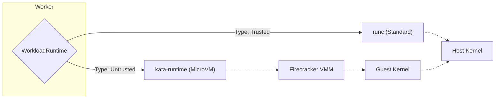

<LLMOnly
  data={`
type: deep-dive
difficulty: advanced
keyTakeaways:
  - Deploy Kata Containers with Firecracker runtime for hardware isolation
  - Configure RuntimeClasses for transparent VM provisioning
  - Understand the security benefits of MicroVMs over containers
prerequisites: Polymorphic workload orchestrator (Part 1), Kubernetes, security concepts
targetAudience: Security engineers hardening AI agent execution environments
`}
/>

In <EmbedResource resourceType="blog" slug="polymorphic-workload-orchestrator" />, we built a scalable control plane using Go and Redis. We successfully decoupled our application logic from the infrastructure using the `WorkloadRuntime` interface.

However, we left off with a critical security gap: we were still running untrusted user code in standard Kubernetes Pods. In this post, we'll fix that by implementing a **Secure Runtime** using MicroVMs.

## The Threat: Why Containers Aren't Enough

Standard Docker containers share the host Linux kernel. A malicious user with root access inside a container can potentially exploit kernel vulnerabilities to escape the sandbox and access other users' data.

For "Untrusted" workloads (like arbitrary code execution agents), we need **hardware virtualization**.

## The Solution: Kata Containers & Firecracker

It's important to understand the role of each component:

- **Firecracker** is the **Hypervisor** (VMM). It's the engine that actually creates and runs the microVM. It's incredibly fast but speaks a low-level API.
- **Kata Containers** is the **Kubernetes Shim**. It acts as a bridge. It speaks the language of Kubernetes (CRI) on one side and manages the Firecracker process on the other.

We don't need to throw away Kubernetes to get VM security. [Kata Containers](https://katacontainers.io/) allows us to use Firecracker as a backend for our Pods.

To our Go control plane, they look like Pods. To the kernel, they are isolated VMs.

<Callout variant="info" title="Why not spawn Firecracker VMs directly?" icon="info">

We certainly could, but then we'd have to reinvent the wheel. By using Kubernetes as a "dumb scheduler," we get:

1. **Bin Packing:** K8s automatically finds nodes with free CPU/RAM.
2. **Networking (CNI):** K8s handles IP assignment and routing for us.
3. **Lifecycle Management:** Kubelet automatically monitors process health.

This approach lets us focus on the _orchestration logic_ rather than rebuilding basic infrastructure plumbing.

</Callout>

### Updating the Architecture

We don't need to change our Redis loop or our Go worker logic. We just need a new implementation of `Provision`.



## Kubernetes Configuration

First, we need to register the Kata runtime class in our cluster.

```yaml filename=manifests/runtime-class.yaml
apiVersion: node.k8s.io/v1
kind: RuntimeClass
metadata:
  name: kata-fc
handler: kata-fc
overhead:
  podFixed:
    memory: "120Mi"
    cpu: "250m"
```

## The Firecracker Runtime Implementation

Now we create the `FirecrackerRuntime` in Go. It's almost identical to our generic `K8sRuntime`, but with one key difference: it requests the `kata-fc` RuntimeClass.

```go
package kubernetes

import (
    "context"
    corev1 "k8s.io/api/core/v1"
    metav1 "k8s.io/apimachinery/pkg/apis/meta/v1"
    "k8s.io/client-go/kubernetes"
)

type FirecrackerRuntime struct {
    clientset *kubernetes.Clientset
    namespace string
}

// Ensure it satisfies the interface
var _ runtime.WorkloadRuntime = &FirecrackerRuntime{}

func (f *FirecrackerRuntime) Provision(ctx context.Context, id string, spec runtime.Spec) error {
    runtimeClassName := "kata-fc" // The magic switch

    pod := &corev1.Pod{
        ObjectMeta: metav1.ObjectMeta{
            Name: "secure-job-" + id,
            Labels: map[string]string{
                "managed-by": "orchestrator",
                "security":   "high",
                "job-id":     id,
            },
        },
        Spec: corev1.PodSpec{
            RuntimeClassName: &runtimeClassName, // [!code highlight]
            RestartPolicy:    corev1.RestartPolicyNever,
            Containers: []corev1.Container{
                {
                    Name:    "main",
                    Image:   spec.Image, // e.g., "my-agent-sandbox:latest"
                    Env:     toK8sEnv(spec.Env),
                    // Hard resource limits are critical for VMs
                    Resources: corev1.ResourceRequirements{
                         Limits: corev1.ResourceList{
                             corev1.ResourceCPU:    resource.MustParse("1"),
                             corev1.ResourceMemory: resource.MustParse("512Mi"),
                         },
                    },
                },
            },
        },
    }

    _, err := f.clientset.CoreV1().Pods(f.namespace).Create(
        ctx,
        pod,
        metav1.CreateOptions{},
    )
    return err
}
```

## Wiring It Up

Back in our worker's event loop, we can finally uncomment the logic we hinted at in Part 1.

```go
func (w *Worker) Start(ctx context.Context) {
    // Initialize both runtimes
    stdRuntime := &kubernetes.K8sRuntime{clientset: w.kube}
    vmRuntime := &kubernetes.FirecrackerRuntime{clientset: w.kube}

    for {
        // ... get task from Redis ...

        var runtime WorkloadRuntime

        if task.Type == "untrusted" {
             runtime = vmRuntime
             log.Printf("🔒 Spawning Secure MicroVM for %s", task.ID)
        } else {
             runtime = stdRuntime
             log.Printf("🚀 Spawning Standard Pod for %s", task.ID)
        }

        go w.handleTask(ctx, runtime, task)
    }
}
```

## Why This Matters

By using **Runtime Classes**, we've kept our application logic clean. We aren't managing FIRECRACKER sockets or TAP devices heavily in our Go code; we're offloading that complexity to Kubernetes and Kata.

Our Go Orchestrator remains a high-level control plane.

## Conclusion

We now have a system that is:

1.  **Polymorphic:** Handles different workload types.
2.  **Scalable:** Managed via Redis queues.
3.  **Secure:** Uses hardware virtualization for untrusted agents.

In <EmbedResource resourceType="blog" slug="secure-agent-networking" placeholder="Part 3" />, we'll look at **Networking**. How do we let these agents talk to the internet (or specific internal APIs) without letting them scan our internal VPC?
