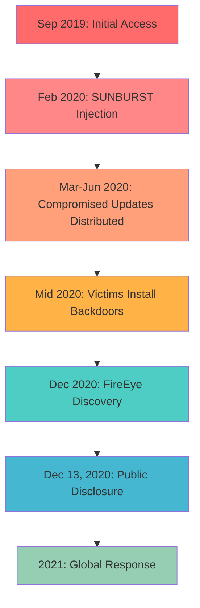
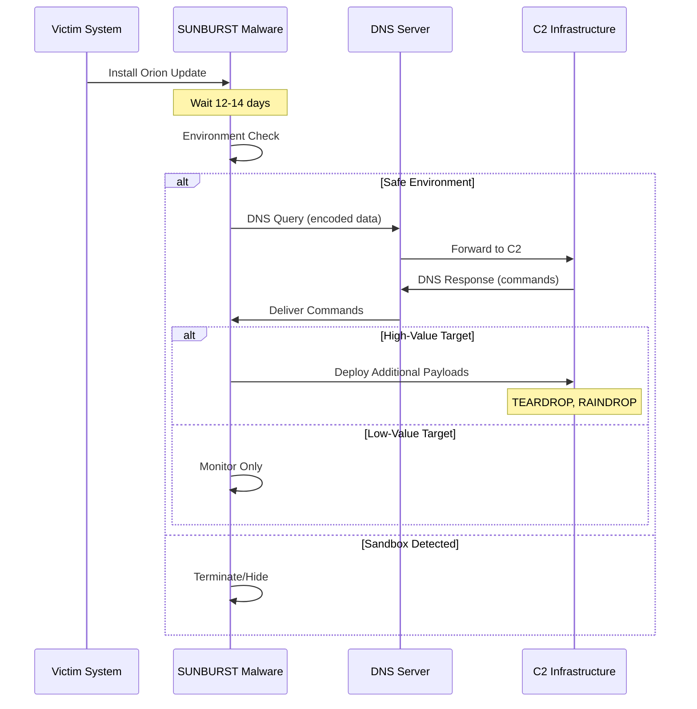
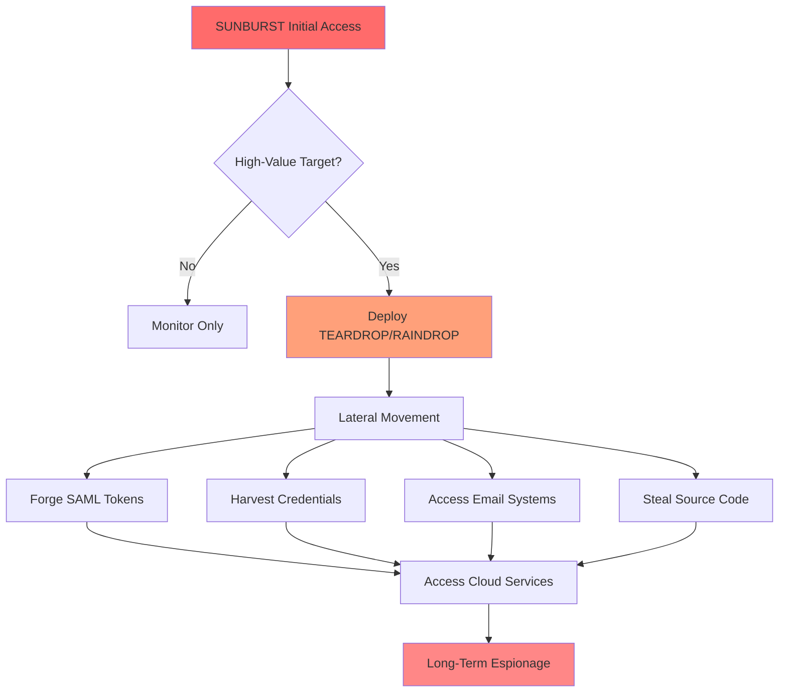

<LLMOnly
  data={`
type: deep-dive
difficulty: intermediate
keyTakeaways:
  - Understand how supply chain attacks compromise trusted software update mechanisms
  - Learn the technical details of SUNBURST malware and its evasion techniques
  - Recognize the importance of behavioral detection over signature-based security
  - Implement build pipeline security and software bill of materials (SBOM)
prerequisites: Basic understanding of cybersecurity concepts, software development lifecycle, and network security
targetAudience: Security professionals, DevOps engineers, software developers, and IT decision makers responsible for supply chain security
`}
/>

<Callout
  variant="error"
  title="Critical Security Breach"
  icon="shield-alert"
>
  The SolarWinds hack represents one of the **most sophisticated cyber-espionage operations in history**. This nation-state attack compromised 18,000+ organizations by infiltrating a trusted software vendor's build pipeline, demonstrating that **supply chain security is now the weakest link** in modern cybersecurity.
</Callout>

The **SolarWinds hack**, uncovered in December 2020, fundamentally changed our understanding of cybersecurity threats. By compromising a trusted software update mechanism, attackers infiltrated **U.S. government agencies and Fortune 500 companies** without triggering immediate alarms.

Rather than exploiting a single vulnerability, this was a **strategic, multi-stage supply chain compromise**, widely attributed to the **nation-state threat actor APT29 (Cozy Bear)**, believed to be associated with Russian intelligence services.

## Why the SolarWinds Attack Was Different

The SolarWinds attack represented a paradigm shift in cyber warfare tactics:

- **Targeted trust**, not perimeter defenses
- Embedded **malware inside digitally signed software**
- Remained undetected for **approximately 9 months**
- Affected **18,000+ organizations** indirectly
- Demonstrated that compromising one vendor can open thousands of doors

Unlike traditional attacks that exploit technical vulnerabilities, this operation exploited the **human and organizational trust** placed in software vendors and their update mechanisms.

## Attack Timeline

The SolarWinds operation unfolded over more than a year of patient, methodical infiltration:

| Date | Event |
| :- | :- |
| **September 2019** | Attackers gain initial access to SolarWinds internal systems |
| **February 2020** | Malicious code (SUNBURST) inserted into Orion source code |
| **March–June 2020** | Compromised updates digitally signed and distributed to customers |
| **Mid 2020** | Victims unknowingly install backdoored Orion updates |
| **December 2020** | FireEye detects breach via stolen red-team tools |
| **December 13, 2020** | SolarWinds publicly discloses compromise |
| **2021** | Global incident response and supply chain security reforms |




## Technical Deep Dive: How the Hack Worked

### 1. Initial Compromise of SolarWinds

Attackers likely gained access to SolarWinds' internal network through multiple potential vectors:

- **Stolen credentials** - Compromised employee accounts
- **VPN weaknesses** - Exploited remote access vulnerabilities
- **Weak internal security controls** - Insufficient network segmentation

<Callout variant="warning" title="Sophisticated Evasion Tactics" icon="alert-triangle">
Once inside, attackers **avoided detection** by:

- Using **legitimate admin tools** (living off the land)
- Operating **only during business hours** to blend with normal activity
- Maintaining **low network noise** to avoid triggering alerts
- Mimicking normal developer and IT operations
</Callout>

### 2. Build System Manipulation (The Supply Chain Kill Shot)

Instead of attacking customers directly, the attackers executed a highly sophisticated supply chain compromise:

**Attack Strategy:**
- Identified SolarWinds' **Orion software build pipeline**
- Inserted malicious C# code into a critical DLL component:
  - `SolarWinds.Orion.Core.BusinessLayer.dll`

This malware was later named **SUNBURST** (also known as Solorigate by Microsoft).

<Callout variant="error" title="Critical Trust Exploitation" icon="shield-x">
**The compromised update was digitally signed by SolarWinds**, making it appear completely legitimate to all security software and giving it elevated trust on victim systems.
</Callout>

```csharp filename=SolarWinds.Orion.Core.BusinessLayer.dll
// Simplified representation of SUNBURST injection point
public class OrionImprovementBusinessLayer
{
    public void RefreshInternal() 
    {
        // Legitimate Orion code...
        
        // SUNBURST backdoor injection // [!code ++]
        SolarWindsBackdoor.Initialize(); // [!code ++]
        
        // More legitimate code...
    }
}
```

### 3. SUNBURST Malware Capabilities

SUNBURST was a **stealthy, memory-resident backdoor** designed to evade detection:

**Key Features:**

<Steps>

<Step>Delayed Execution</Step>

The malware waited **12-14 days** after installation before activating, allowing administrators to assume the update was safe.

<Step>Environment Checks</Step>

Before executing, SUNBURST verified it was not running in:
- Sandboxes or virtual machines
- Security researcher environments
- Systems with specific security tools installed

<Step>DNS-Based Command and Control</Step>

Communication occurred through seemingly innocent DNS queries to:
```
*.avsvmcloud[.]com
```

<Step>Victim Fingerprinting</Step>

The malware collected system information to determine if the target was worth further exploitation.

<Step>Selective Payload Delivery</Step>

Only **high-value targets** received additional malware stages—the vast majority of infected systems were simply monitored.

</Steps>



### 4. Command and Control (C2) Communication

SUNBURST's C2 mechanism was designed to blend in with normal network traffic:

**Communication Method:**
- **DNS queries** encoded with victim data and system information
- **HTTP traffic** over legitimate-looking connections
- **Subdomain encoding** to exfiltrate data through DNS requests

Example DNS-based C2 communication:

```shell
# Normal DNS query (legitimate)
nslookup www.google.com

# SUNBURST C2 query (malicious but looks normal)
nslookup a1b2c3d4e5f6.avsvmcloud.com
```

The attackers could selectively respond to DNS queries to:
- Activate the malware
- Issue commands
- Determine which victims warranted further exploitation

<Callout variant="info" title="Targeted Approach" icon="target">
Only **high-value targets** such as government agencies and major corporations were escalated for deeper penetration. Most infected systems were simply cataloged and monitored.
</Callout>

### 5. Post-Exploitation Techniques

For selected high-value victims, attackers deployed additional tools and techniques:

**Additional Malware Families:**
- **TEARDROP** - Memory-only dropper that loads malicious payloads
- **RAINDROP** - Loader that executes additional malicious code

**Lateral Movement Techniques:**
- **SAML token forgery** - Forged authentication tokens to access cloud services
- **Credential harvesting** - Stole passwords and authentication credentials
- **Email access** - Compromised Microsoft 365 and other email systems
- **Source code theft** - Accessed proprietary intellectual property

**Operational Security:**
- **Avoided destructive actions** - Pure espionage, no data destruction
- **Limited footprint** - Minimized actions to reduce detection risk
- **Patient reconnaissance** - Spent months mapping networks before acting




## Impacted Organizations

The SolarWinds attack affected a staggering array of government agencies and private sector organizations:

**U.S. Government Agencies:**
- U.S. Treasury Department
- Department of Homeland Security
- Department of State
- Department of Energy
- National Nuclear Security Administration
- Department of Defense

**Major Technology Companies:**
- Microsoft
- Cisco
- Intel
- FireEye (the security company that discovered the breach)
- VMware
- Numerous Fortune 500 companies

**Other Sectors:**
- Telecommunications providers
- Energy companies
- Critical infrastructure operators
- Government contractors


## Why Detection Failed

Traditional security controls were ineffective against this sophisticated operation:

<Accordion type="single" collapsible>
  <AccordionItem value="item-1">
    <AccordionTrigger>Trusted and Digitally Signed Software</AccordionTrigger>
    <AccordionContent>
      The malicious update was **signed with SolarWinds' legitimate digital certificate**, making it indistinguishable from genuine software. Security tools explicitly trusted signed updates from known vendors.
    </AccordionContent>
  </AccordionItem>
  <AccordionItem value="item-2">
    <AccordionTrigger>Use of Legitimate System Processes</AccordionTrigger>
    <AccordionContent>
      SUNBURST used **legitimate Windows processes and system tools** (living off the land) rather than introducing obviously malicious executables. This made it blend in with normal system activity.
    </AccordionContent>
  </AccordionItem>
  <AccordionItem value="item-3">
    <AccordionTrigger>No Known Exploit or Malware Signature</AccordionTrigger>
    <AccordionContent>
      The attack was **completely novel**—no existing signature or behavioral pattern existed for detection. Antivirus and endpoint detection systems had nothing to compare against.
    </AccordionContent>
  </AccordionItem>
  <AccordionItem value="item-4">
    <AccordionTrigger>Mimicked Normal Orion Behavior</AccordionTrigger>
    <AccordionContent>
      SUNBURST's network activity **looked like normal Orion monitoring traffic**. DNS queries and HTTP requests appeared identical to legitimate software telemetry.
    </AccordionContent>
  </AccordionItem>
  <AccordionItem value="item-5">
    <AccordionTrigger>Delayed Activation and Patient Operation</AccordionTrigger>
    <AccordionContent>
      The **12-14 day delay** before activation meant incident response teams missed the correlation between the update and suspicious activity. Attackers operated **only during business hours** to avoid anomaly detection systems.
    </AccordionContent>
  </AccordionItem>
</Accordion>


## Long-Term Industry Impact

The SolarWinds attack triggered sweeping changes in cybersecurity policy and practice:

### Government Response

**Executive Order 14028 (U.S. - May 2021):**
- Mandated **Zero Trust architecture** for federal agencies
- Required **Software Bill of Materials (SBOM)** for government software
- Established **security baselines** for critical software
- Created **Cyber Safety Review Board** to investigate major incidents

### Industry Standards

**SBOM (Software Bill of Materials) Adoption:**
- Provides **transparency** into software components and dependencies
- Enables **rapid vulnerability assessment** when new threats emerge
- Facilitates **supply chain risk management**

```json filename=example-sbom.json
{
  "bomFormat": "CycloneDX",
  "specVersion": "1.4",
  "components": [
    {
      "type": "library",
      "name": "SolarWinds.Orion.Core.BusinessLayer",
      "version": "2020.2.1",
      "hashes": [
        {
          "alg": "SHA-256",
          "content": "d0d626deb3f..."
        }
      ]
    }
  ]
}
```

### Corporate Security Practices

**Increased Vendor Risk Assessments:**
- Security questionnaires now include **build pipeline security**
- Third-party audits of vendor **source code and CI/CD processes**
- Contractual requirements for **incident notification**

**Shift Toward Software Supply Chain Security:**
- Investment in **build pipeline security tools**
- Adoption of **container signing and verification**
- Implementation of **software composition analysis (SCA)**


## Conclusion

The SolarWinds hack redefined modern cyber warfare by demonstrating that **compromising a single trusted vendor can open thousands of doors**—silently and efficiently.

**This attack was not about ransomware or chaos.**  
It was about **patience, precision, and strategic espionage.**


Organizations must fundamentally rethink their security posture, moving from perimeter defense to:
- **Continuous verification** of all systems and software
- **Behavioral monitoring** that can detect novel attack techniques
- **Supply chain transparency** through SBOM and vendor assessments
- **Assume breach** mentality with focus on rapid detection and response

The lessons from SolarWinds will shape cybersecurity strategy for decades to come.
