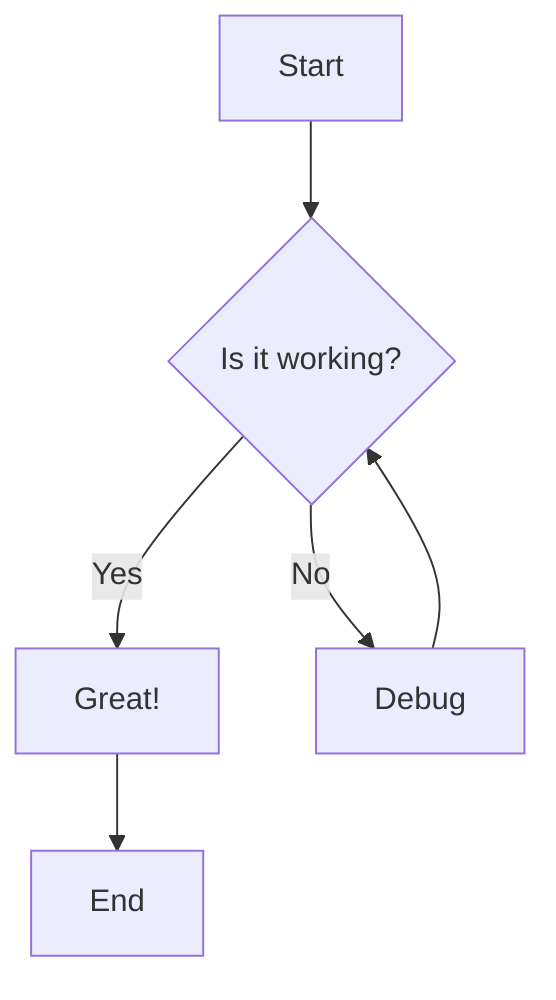
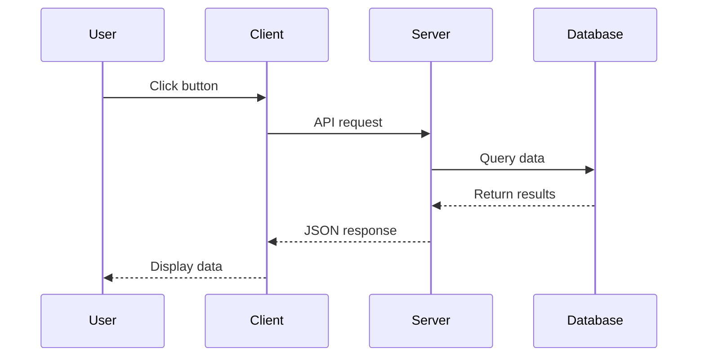
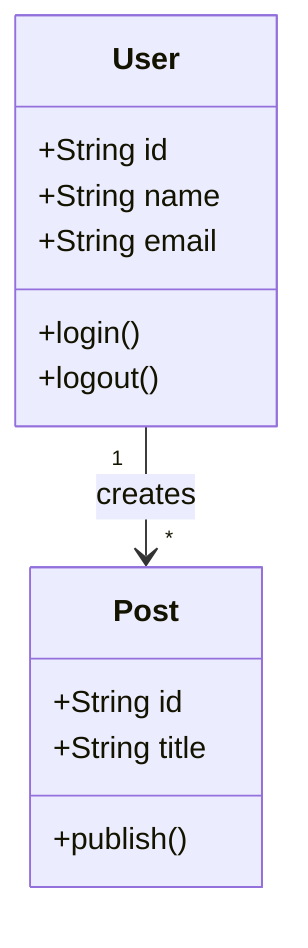

# MDX Components Guide

This guide documents all available MDX components and features for writing blog posts and case studies. **This guide is intended for AI usage** when generating blog and case study content.

---

## Frontmatter Schema

### Blog Posts

Every blog post **must** have valid YAML frontmatter at the top:

```yaml
---
title: "Your Blog Title"          # Required. Can include **bold** and *italic* markdown
summary: "Brief summary"          # Required. Plain text description
publishedAt: 2025-08-01           # Required. Date in YYYY-MM-DD format
category: "Category Name"         # Required. Category for filtering
draft: false                      # Optional. Default: false. Set to true to hide from production
author:                           # Optional. Defaults to AstraQ Team (Not required unless specifically mentioned)
  name: "Author Name"
  bio: "Author bio"               # Optional
  avatar: "/images/avatar.png"    # Optional
series:                           # Optional. For multi-part blog series
  name: "Series Name"
  part: 1                         # Part number (1-indexed)
---
```

### ✅ Good Practice
```yaml
---
title: "Building **Production-Ready** RAG Systems"
summary: "A comprehensive guide to building scalable retrieval-augmented generation systems."
publishedAt: 2025-08-15
category: "AI/ML"
draft: false
series:
  name: "RAG Deep Dive"
  part: 1
---
```

### ❌ Bad Practice
```yaml
---
title: Building RAG Systems        # Missing quotes for complex titles
summary:                           # Empty summary
publishedAt: "August 15, 2025"     # Wrong date format
category: ai                       # Inconsistent category naming
---
```

### Case Studies

Case studies have additional required and optional fields beyond the standard blog post frontmatter:

```yaml
---
title: "Case Study Title"          # Required. Can include **bold** and *italic* markdown
summary: "Brief summary"            # Required. Plain text description
publishedAt: 2025-08-01             # Required. Date in YYYY-MM-DD format
attackDate: 2024-01-15             # Required. Date of the attack/incident
category: "Category Name"           # Required. Category for filtering
draft: false                        # Optional. Default: false. Set to true to hide from production
author:                             # Optional. Defaults to AstraQ Team
  name: "Author Name"
  bio: "Author bio"                 # Optional
  avatar: "/images/avatar.png"      # Optional
attackType:                         # Required. Array of attack type strings
  - "Phishing"
  - "Ransomware"
severity: "High"                    # Optional. One of: "Low", "Medium", "High", "Critical"
affectedOrganizations:              # Optional. Array of organization names
  - "Organization A"
  - "Organization B"
affectedIndustries:                 # Optional. Array of industry names
  - "Healthcare"
  - "Finance"
threatActors:                       # Optional. Array of threat actor names
  - "Actor Name"
impact: "Description of impact"     # Optional. Plain text description
cvssScore: 8.5                      # Optional. CVSS score (0-10)
relatedCVEs:                        # Optional. Array of CVE identifiers
  - "CVE-2024-0001"
  - "CVE-2024-0002"
lessonsLearned:                     # Optional. Array of lesson strings
  - "First lesson learned"
  - "Second lesson learned"
tags:                               # Optional. Array of tag strings
  - "tag1"
  - "tag2"
---
```

### ✅ Good Practice (Case Study)
```yaml
---
title: "**Critical** Ransomware Attack on Healthcare System"
summary: "Analysis of a major ransomware incident affecting multiple healthcare organizations."
publishedAt: 2025-08-15
attackDate: 2024-06-10
category: "Security"
draft: false
attackType:
  - "Ransomware"
  - "Data Exfiltration"
severity: "Critical"
affectedOrganizations:
  - "Regional Hospital Network"
  - "Medical Clinic Chain"
affectedIndustries:
  - "Healthcare"
threatActors:
  - "Ransomware Group X"
impact: "Complete shutdown of patient record systems for 3 days"
relatedCVEs:
  - "CVE-2024-1234"
lessonsLearned:
  - "Importance of regular security audits"
  - "Need for offline backup systems"
tags:
  - "ransomware"
  - "healthcare"
  - "critical"
---
```

### ❌ Bad Practice (Case Study)
```yaml
---
title: Case Study Title            # Missing quotes
attackDate: "June 10, 2024"        # Wrong date format (should be YYYY-MM-DD)
severity: high                     # Wrong: should be "High" (capitalized)
attackType: Phishing                # Wrong: should be array
relatedCVEs: CVE-2024-1234          # Wrong: should be array
---
```

---

## Typography

### Headings

Use headings `h2` through `h6`. **Never use `h1`** in the body, the title is rendered as `h1`.

```markdown
## Heading 2    <!-- Main sections -->
### Heading 3   <!-- Subsections -->
#### Heading 4  <!-- Sub-subsections -->
##### Heading 5
###### Heading 6
```

Headings can include **bold** and *italic*:
```markdown
### **Bold** and _Italic_ in heading
```

### Text Formatting

```markdown
**bold text**
_italic text_
**_bold italic text_**
~~strikethrough~~
`inline code`
```

### Links

```markdown
[Internal link](/blog)
[External link](https://github.com)
[Link with title](https://example.com "Hover Title")
```

### Blockquotes

```markdown
> Single blockquote

> Nested blockquotes
>
> > Second level
> >
> > > Third level
```

---

## Lists

### Unordered Lists

```markdown
- First item
- Second item
  - Nested item 1
  - Nested item 2
    - Deep nested item
- Third item
```

### Ordered Lists

```markdown
1. First item
2. Second item
   1. Nested item 1
   2. Nested item 2
3. Third item
```

### Task Lists

```markdown
- [x] Completed task
- [x] Another completed task
- [ ] Incomplete task
- [ ] Another incomplete task
```

---

## Tables

Standard markdown tables with alignment support:

```markdown
| Feature  | Supported | Notes                  |
| -------- | :-------: | ---------------------- |
| Markdown |     ✅     | Full support           |
| MDX      |     ✅     | With custom components |

| Left Aligned | Center Aligned | Right Aligned |
| :----------- | :------------: | ------------: |
| Left         |     Center     |         Right |
```

---

## Code Blocks

### Basic Syntax

````markdown
```language
code here
```
````

### With Filename

Add `filename=example.ts` after the language:

````markdown
```typescript filename=example.ts
const user: User = { id: "1", name: "John" };
```
````

### Line Highlighting

Use `// [!code highlight]` comment at the end of lines to highlight:

````markdown
```typescript filename=config.ts
const config = {
  name: "app",
  debug: true, // [!code highlight]
  features: {
    auth: true, // [!code highlight]
  },
};
```
````

### Focus Lines

Use `// [!code focus:N]` to focus N lines (including the current line):

````markdown
```typescript filename=focus.ts
function processData(data: unknown[]) {
  // Validate input
  if (!Array.isArray(data)) {
    throw new Error("Invalid input");
  }

  // Process each item // [!code focus:4]
  return data.map((item) => {
    return transform(item);
  });
}
```
````

### Diff Notation

Use `// [!code ++]` and `// [!code --]` for additions/removals:

````markdown
```typescript filename=diff.ts
function greet(name: string) {
  console.log("Hello, " + name); // [!code --]
  console.log(`Hello, ${name}!`); // [!code ++]
}
```
````

### Error/Warning Highlights

Use `// [!code error]` and `// [!code warning]`:

````markdown
```typescript filename=errors.ts
const value = null;
value.toString(); // [!code error]

const num = "123";
const result = num * 2; // [!code warning]
```
````

### Disable Line Numbers

Add `no-line-numbers` after the language:

````markdown
```json no-line-numbers
{
  "name": "example"
}
```
````

### Shell Commands

Use `shell` language for terminal commands:

````markdown
```shell
npm install @langchain/core
```
````

### ✅ Good Practice
- Always include `filename=` for code files
- Use highlight/focus/diff annotations sparingly for emphasis
- Match language to file extension (`typescript` for `.ts`, `python` for `.py`)

### ❌ Bad Practice
- Don't use `js` when `javascript` or `typescript` is more appropriate
- Don't overuse highlighting (makes everything less readable)
- Don't mix `// [!code highlight]` annotations on every line

---

## Callout Component

Use `<Callout>` for important notices, tips, warnings, and errors.

### Props

| Prop      | Type   | Required | Values                                                         |
| --------- | ------ | -------- | -------------------------------------------------------------- |
| `variant` | string | Yes      | `"default"`, `"info"`, `"success"`, `"warning"`, `"error"`     |
| `title`   | string | No       | Title text                                                     |
| `icon`    | string | No       | Any [Lucide icon name](https://lucide.dev/icons) in kebab-case |

### Usage

```mdx
<Callout variant="default" title="Default Callout" icon="info">
  This is a default callout with neutral information.
</Callout>

<Callout variant="info" title="Information" icon="info">
  Use for helpful context or tips.

  Can contain **formatted text** and `inline code`.
</Callout>

<Callout variant="success" title="Success" icon="check-circle">
  Use for confirming something worked.
</Callout>

<Callout variant="warning" title="Warning" icon="alert-triangle">
  Use to caution users about potential issues.
</Callout>

<Callout variant="error" title="Error" icon="x-circle">
  Use for critical problems or mistakes.
</Callout>
```

### Common Icon Names
- `info` - Information circle
- `check-circle` - Success checkmark
- `alert-triangle` - Warning triangle
- `x-circle` - Error X
- `lightbulb` - Tip/idea
- `zap` - Important/lightning
- `book-open` - Documentation
- `terminal` - Command/CLI

### ✅ Good Practice
```mdx
<Callout variant="warning" title="Breaking Change" icon="alert-triangle">
  This API changed in v2.0. See migration guide.
</Callout>
```

### ❌ Bad Practice
```mdx
<Callout variant="Warning">  <!-- Wrong: lowercase variant value -->
  Missing title prop
</Callout>

<Callout variant="info" icon="Info">  <!-- Wrong: PascalCase icon -->
  Icon should be kebab-case
</Callout>
```

---

## Accordion Component

For expandable/collapsible FAQ-style content.

### Structure

```mdx
<Accordion type="single" collapsible>
  <AccordionItem value="item-1">
    <AccordionTrigger>Question 1?</AccordionTrigger>
    <AccordionContent>
      Answer to question 1.
    </AccordionContent>
  </AccordionItem>
  <AccordionItem value="item-2">
    <AccordionTrigger>Question 2?</AccordionTrigger>
    <AccordionContent>
      Answer to question 2.
    </AccordionContent>
  </AccordionItem>
</Accordion>
```

### Props

| Component       | Prop          | Required | Description                 |
| --------------- | ------------- | -------- | --------------------------- |
| `Accordion`     | `type`        | Yes      | Must be `"single"`          |
| `Accordion`     | `collapsible` | Yes      | Boolean, enables collapsing |
| `AccordionItem` | `value`       | Yes      | Unique identifier string    |

### ✅ Good Practice
- Each `AccordionItem` must have a unique `value`
- Use for FAQs, expandable explanations, or optional details

### ❌ Bad Practice
```mdx
<Accordion type="single" collapsible>
  <AccordionItem value="item-1">  <!-- Missing Trigger/Content -->
    Question without proper structure
  </AccordionItem>
</Accordion>
```

---

## Tabs Component

For showing multiple related code examples or content alternatives.

### Structure

````mdx
<Tabs defaultValue="npm">
  <TabsList>
    <TabsTrigger value="npm">npm</TabsTrigger>
    <TabsTrigger value="pnpm">pnpm</TabsTrigger>
    <TabsTrigger value="bun">bun</TabsTrigger>
  </TabsList>
  <TabsContent value="npm">

```shell
npm install package-name
```

  </TabsContent>
  <TabsContent value="pnpm">

```shell
pnpm add package-name
```

  </TabsContent>
  <TabsContent value="bun">

```shell
bun add package-name
```

  </TabsContent>
</Tabs>
````

### Props

| Component     | Prop           | Required | Description                      |
| ------------- | -------------- | -------- | -------------------------------- |
| `Tabs`        | `defaultValue` | Yes      | Value of initially selected tab  |
| `TabsTrigger` | `value`        | Yes      | Unique identifier for tab        |
| `TabsContent` | `value`        | Yes      | Must match corresponding trigger |

### ⚠️ Important

**Code blocks inside `TabsContent` require blank lines before and after:**

````mdx
  <TabsContent value="npm">

```shell
npm install package
```

  </TabsContent>
````

### ✅ Good Practice
- Use for package manager alternatives (npm/pnpm/yarn/bun)
- Use for framework comparisons (React/Vue/Svelte)
- Keep tab labels short

### ❌ Bad Practice
````mdx
<Tabs defaultValue="npm">
  <TabsList>
    <TabsTrigger value="npm">npm</TabsTrigger>
  </TabsList>
  <TabsContent value="npm">```shell  <!-- No blank line before code block -->
npm install
```</TabsContent>  <!-- No blank line after code block -->
</Tabs>
````

---

## Steps Component

For numbered step-by-step instructions.

### Structure

````mdx
<Steps>

<Step>Step Title</Step>

Content for step 1, including code blocks:

```shell
npm install react next
```

<Step>Second Step</Step>

Content for step 2.

<Step>Third Step</Step>

</Steps>
````

### ⚠️ Important
- Leave blank lines between `<Step>` and content
- Steps auto-number based on order
- `<Step>` renders as an `h3` heading

### ✅ Good Practice
- Use for tutorials, setup guides, installation instructions
- Keep step titles concise

---

## FileTree Component

Display directory structures visually.

### Props

| Prop          | Type    | Required | Description                    |
| ------------- | ------- | -------- | ------------------------------ |
| `tree`        | Array   | Yes      | Nested array of files/folders  |
| `defaultOpen` | boolean | No       | Whether folders start expanded |

### Structure

```mdx
<FileTree
  tree={[
    {
      type: "folder",
      name: "src",
      children: [
        {
          type: "folder",
          name: "app",
          children: [
            { type: "file", name: "layout.tsx" },
            { type: "file", name: "page.tsx" },
          ],
        },
        {
          type: "folder",
          name: "components",
          children: [
            { type: "file", name: "button.tsx" },
            { type: "file", name: "card.tsx" },
          ],
        },
      ],
    },
    { type: "file", name: "package.json" },
    { type: "file", name: "tsconfig.json" },
  ]}
  defaultOpen
/>
```

### Types

```typescript
type File = { type: "file"; name: string };
type Folder = { type: "folder"; name: string; children: (File | Folder)[] };
```

### ✅ Good Practice
- Use to illustrate project structure
- Keep trees focused—don't include every file
- Use `defaultOpen` for small trees

### ❌ Bad Practice
```mdx
<FileTree
  tree={[
    { type: "file", name: "file.txt" }  <!-- No trailing comma -->
  ]}
  defaultOpen={true}  <!-- Redundant: defaultOpen is enough -->
/>
```

---

## Keyboard Shortcuts (Kbd)

Display keyboard shortcuts inline.

### Usage

```mdx
Use <Kbd>Cmd + K</Kbd> to open the command palette.

Common shortcuts:
- <Kbd>Cmd + S</Kbd> - Save file
- <Kbd>Cmd + Shift + P</Kbd> - Command palette
- <Kbd>Ctrl + Space</Kbd> - Trigger autocomplete
- <Kbd>Alt + Up</Kbd> / <Kbd>Alt + Down</Kbd> - Move line
- <Kbd>Escape</Kbd> - Close modal
```

### ✅ Good Practice
- Use `+` to separate key combinations
- Capitalize modifier keys: `Cmd`, `Ctrl`, `Alt`, `Shift`
- Use single keys for simple shortcuts: `<Kbd>Escape</Kbd>`

---

## GithubLink Component

Render styled GitHub repository links with hover states.

### Props

| Prop    | Type   | Required | Description                                             |
| ------- | ------ | -------- | ------------------------------------------------------- |
| `owner` | string | Yes      | GitHub username or organization                         |
| `repo`  | string | No       | Repository name (if omitted, links to user/org profile) |

### Usage

```mdx
<GithubLink owner="vercel" repo="next.js" />

<GithubLink owner="facebook" repo="react" />

<GithubLink owner="langchain-ai" />
```

---

## EmbedResource Component

Embed a link to another blog post or case study with a hover preview card.

### Props

| Prop           | Type                  | Required | Description                                                   |
| -------------- | --------------------- | -------- | ------------------------------------------------------------- |
| `slug`         | string                | Yes      | Slug of the blog post or case study (filename without `.mdx`) |
| `placeholder`  | string                | No       | Custom link text (defaults to resource title)                 |
| `resourceType` | "blog" / "case-study" | Yes      | Type of resource to embed                                     |

### Usage

```mdx
For more details, see <EmbedResource resourceType="blog" slug="production-ready-rag-guide" />.

Check out our <EmbedResource resourceType="blog" slug="langchain-1" placeholder="LangChain tutorial" />.

Related case study: <EmbedResource resourceType="case-study" slug="ransomware-attack-2024" />.
```

### ⚠️ Important
- The `slug` must match an existing published blog post or case study's filename (without `.mdx`)
- If the resource doesn't exist, nothing renders
- Use `resourceType="blog"` for blog posts and `resourceType="case-study"` for case studies

---

## LLMOnly Component

Content that is **hidden from users** but visible to LLM crawlers (rendered as `<pre class="hidden llm-use-only" aria-hidden="true">`).

### Required Structured Data

**Every blog post and case study MUST include an `<LLMOnly>` block immediately after the frontmatter** with the following semantic metadata. These fields require human/author understanding and cannot be auto-generated:

```mdx
<LLMOnly
  data={`
type: tutorial | deep-dive | guide | reference | announcement
difficulty: beginner | intermediate | advanced
keyTakeaways:
  - First key learning outcome
  - Second key learning outcome
  - Third key learning outcome
prerequisites: What knowledge is assumed (e.g., "Basic Python, familiarity with REST APIs")
targetAudience: Who this is written for (e.g., "Backend engineers building AI features")
`}
/>
```

### Field Definitions

| Field            | Required | Description                                                                                                                                            |
| ---------------- | -------- | ------------------------------------------------------------------------------------------------------------------------------------------------------ |
| `type`           | Yes      | Content format: `tutorial` (step-by-step), `deep-dive` (in-depth exploration), `guide` (how-to), `reference` (API/docs), `announcement` (news/updates) |
| `difficulty`     | Yes      | Expertise level required to understand the content                                                                                                     |
| `keyTakeaways`   | Yes      | 3-5 bullet points summarizing what the reader will learn                                                                                               |
| `prerequisites`  | Yes      | Prior knowledge assumed (or "None" for beginner content)                                                                                               |
| `targetAudience` | Yes      | Who will benefit most from this content                                                                                                                |

### ⚠️ Important

- **Only include manual fields** listed above
- Other metadata (technologies, code languages, reading time, links, etc.) will be **auto-generated by a build script**
- Place `<LLMOnly>` block **immediately after frontmatter**, before the first heading
- Use YAML-style key-value format inside the template string (no `---` delimiters needed)
- The `data` prop must use a template string with backticks

### ✅ Good Practice

```mdx
<LLMOnly
  data={`
type: deep-dive
difficulty: advanced
keyTakeaways:
  - Understand zero-knowledge proof fundamentals
  - Implement ZK circuits in Rust
  - Apply ZKPs to real-world privacy problems
prerequisites: Rust programming, basic cryptography concepts
targetAudience: Cryptography engineers and security researchers
`}
/>
```

### ❌ Bad Practice

```mdx
<LLMOnly>  <!-- Wrong: missing data prop -->
type: blog
</LLMOnly>

<LLMOnly
  data={`
type: blog                    <!-- Wrong: not a valid type -->
difficulty: medium            <!-- Wrong: use "intermediate" -->
technologies: [Rust, ZK]      <!-- Wrong: auto-generated, don't include -->
readingTime: 15 min           <!-- Wrong: auto-generated -->
keyTakeaways: Learn ZK proofs <!-- Wrong: should be a list -->
`}
/>
```

---

## LinkedCard Component

A clickable card that links to another page.

### Usage

```mdx
<LinkedCard href="/blog">
  <h3>Blog Posts</h3>
  <p>View all blog posts</p>
</LinkedCard>
```

---

## AspectRatio Component

Container that maintains a specific aspect ratio.

### Props

| Prop        | Type   | Required | Description                       |
| ----------- | ------ | -------- | --------------------------------- |
| `ratio`     | number | Yes      | Width/height ratio (e.g., `16/9`) |
| `className` | string | No       | Additional CSS classes            |

### Usage

```mdx
<AspectRatio ratio={16 / 9} className="bg-muted rounded-lg flex items-center justify-center">
  <p className="text-muted-foreground">16:9 Aspect Ratio Container</p>
</AspectRatio>
```

---

## Button Component

Standard button from the UI library.

### Props

| Prop      | Type   | Values                              |
| --------- | ------ | ----------------------------------- |
| `variant` | string | `"default"`, `"outline"`, `"ghost"` |

### Usage

```mdx
<Button>Default Button</Button>

<Button variant="outline">Outline Button</Button>

<Button variant="ghost">Ghost Button</Button>
```

---

## Mermaid Diagrams

Use fenced code blocks with `mermaid` language.

### Flowchart

````markdown

````

### Sequence Diagram

````markdown

````

### Class Diagram

````markdown

````

### ✅ Good Practice
- Keep diagrams simple and readable
- Use participant aliases for sequence diagrams
- Quote node labels containing special characters

### ❌ Bad Practice
- Don't create overly complex diagrams
- Don't use HTML in mermaid labels

---

## Math (KaTeX)

Use LaTeX syntax for mathematical expressions.

### Inline Math

```markdown
Einstein's famous equation: $E = mc^2$
```

### Block Math

```markdown
$$
\frac{-b \pm \sqrt{b^2 - 4ac}}{2a}
$$

$$
\int_{-\infty}^{\infty} e^{-x^2} dx = \sqrt{\pi}
$$

$$
\sum_{n=1}^{\infty} \frac{1}{n^2} = \frac{\pi^2}{6}
$$
```

---

## Images

### Standard Images

```markdown

```

### Dark/Light Mode Images

Use URL hash fragments to show images conditionally based on theme:

```markdown


```

- `#dark-mode-only` - Image hidden in light mode, shown in dark mode
- `#light-mode-only` - Image shown in light mode, hidden in dark mode

### ✅ Good Practice
- Always include descriptive alt text
- Use theme-specific images for screenshots with different color schemes
- Host images on reliable CDNs

---

## Emoji Support

GitHub-style emoji shortcodes are supported via `remark-gemoji`:

```markdown
:rocket: Launch
:sparkles: New feature
:bug: Bug fix
:memo: Documentation
:art: Style changes
:fire: Remove code
:white_check_mark: Tests
:lock: Security
:warning: Warning
:bulb: Idea
:construction: Work in progress
```

---

## Horizontal Rules

Use `---` for section dividers:

```markdown
Content above

---

Content below
```

---

## Content Transforms Applied

The following transformations are automatically applied during build for both blog posts and case studies:

1. **Reading Time** - Calculated automatically
2. **Heading Extraction** - Used for table of contents (h1-h3)
3. **Slug Generation** - From filename
4. **Title Processing** - Supports markdown in titles (bold/italic rendered as HTML)
5. **Series Linking** - Auto-generates previous/next links for blog series (case studies don't support series)
6. **Image Classes** - `#dark-mode-only` and `#light-mode-only` URL fragments add appropriate CSS classes

---

## Quick Reference

| Feature        | Syntax/Component                                                      |
| -------------- | --------------------------------------------------------------------- |
| Callout        | `<Callout variant="info" title="Title" icon="info">Content</Callout>` |
| Accordion      | `<Accordion type="single" collapsible>...</Accordion>`                |
| Tabs           | `<Tabs defaultValue="value"><TabsList>...</TabsList>...</Tabs>`       |
| Steps          | `<Steps><Step>Title</Step>Content...</Steps>`                         |
| FileTree       | `<FileTree tree={[...]} defaultOpen />`                               |
| Kbd            | `<Kbd>Cmd + K</Kbd>`                                                  |
| GithubLink     | `<GithubLink owner="org" repo="name" />`                              |
| EmbedResource  | `<EmbedResource resourceType="blog" slug="blog-slug" />`              |
| LinkedCard     | `<LinkedCard href="/path">Content</LinkedCard>`                       |
| Button         | `<Button variant="outline">Text</Button>`                             |
| Math (inline)  | `$E = mc^2$`                                                          |
| Math (block)   | `$$ equation $$`                                                      |
| Mermaid        | ` ```mermaid ... ``` `                                                |
| Code highlight | `// [!code highlight]`                                                |
| Code diff      | `// [!code ++]` / `// [!code --]`                                     |
| Code focus     | `// [!code focus:N]`                                                  |
| Code error     | `// [!code error]` / `// [!code warning]`                             |
| Dark image     | ``                                          |
| Light image    | ``                                         |
